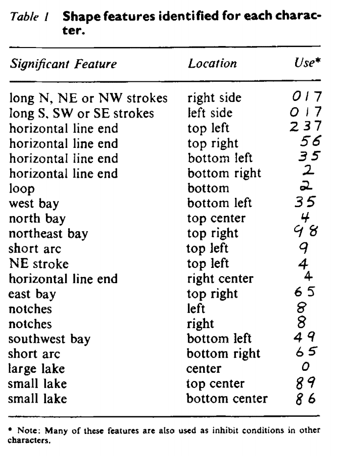

> Inserting information into a computer from handwritten documents - such as inventory lists, sales slips and scientific laboratory data - has always been one of the slowest steps in automatic information processing. The usual method has been to convert the handwritten data into computer "language" by typing it on a coding machine or punching it on cards. Eventually, machines that can interpret handwriting directly will shorten the time it takes to process information, and will help man take fuller advantage of the electronic speed of computing systems.
>
> _~ Excerpt from ["The IBM Pavilion" booklet](https://www.worldsfairphotos.com/nywf64/booklets/ibm-nywf64-booklet.pdf), available at the 1964 World's fair in New York._

A classic example of a problem that has traditionally been easy for humans, but difficult for computers, is handwritten digit recognition. Because of the many variations in human handwriting, early attempts to "read" handwritten digits into a computer were very limited. 

{ width=70% }

It therefore seemed almost "magical" when, at the 1964 World's Fair in New York, IBM unveiled an amazing computer system that *read handwritten dates* off a small card. Visitors to the "This Date in History" exhibit would write down a date on a card and feed it into the machine. 

.](../images/1-ibm-1964-worlds-fair-enter-date-on-card.png){ width=30% }

Then, the computer converted the handwritten date into digital form, look up the date in a database of New York Times headlines, and show a headline from that day on an overhead display. Watch the first minute of [this video](https://www.youtube.com/watch?v=6EGllGYiFa8&t=1s) to see a demonstration!

<iframe width="640" height="385" src="https://www.youtube.com/embed/6EGllGYiFa8" title="YouTube video player" frameborder="0" allow="accelerometer; autoplay; clipboard-write; encrypted-media; gyroscope; picture-in-picture" allowfullscreen></iframe>

The results were also printed on a card that you could keep as a souvenir.

.](../images/1-ibm-1964-worlds-fair-ibm-punch-card-memento-1024x466.jpg){ width=80% }

.](../images/1-ibm-sample-card.jpeg){ width=80% }

And on the back of the card, visitors could read some details about the character recognition system:

.](../images/1-ibm-back.png){ width=80% }

How was this achieved? This astounding result grew out of the work of E. C. Greanias, a researcher at IBM Thomas J. Watson Research Center in New York. In a January 1963 article in the IBM Journal of Research and Development titled "The Recognition of andwritten Numerals by Contour Analysis," he explains.

The scanner would attempt to recognize certain _features_ in various parts of the image: strokes (straight lines), line ends, lakes (round interior areas such as in 0, 6, or 9), bays (concave areas)

{ width=40% }

{ width=50% }

### References

* "IBM and the 1964 World's Fair", Dag Spicer, April 2014, Computer History Museum. [URL](https://computerhistory.org/blog/ibm-and-1964-worlds-fair/)