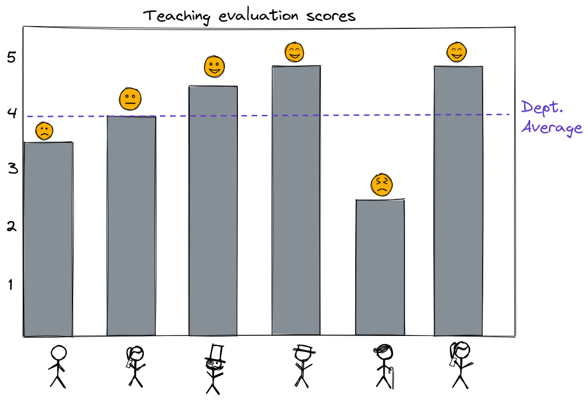
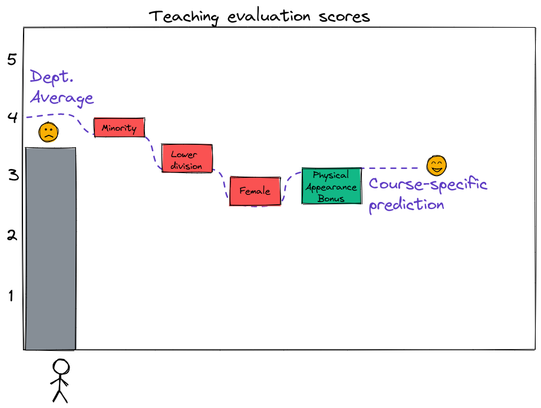

Last week, we considered a very simple machine learning model: a model that outputs the sample mean of the target variable in the training data set. This "prediction by mean" model is widely used as a baseline for comparison. When we train a machine learning model for regression, we check whether its performance is better or worth than "prediction by mean". If the machine learning model is better than the model that always predicts the sample mean (even if its performance is not very good overall), then it may have *some* value.

(For a machine learning classification model, we use "prediction by mode" in a similar way. Does a model do better than a very simple model that just outputs the most common label for all samples? If so, then it may have some value.)

## Problem setup

Let's set up a problem:

You are the head of an academic department head at a large U.S. university. At the end of every semester, students complete faculty evaluations for their instructors that semester. Faculty evaluations are used to give feedback to instructors and help them improve, but they are also used in part to determine who wins teaching awards, who gets promoted, and who gets other "rewards". 

One year, members of the department complain to the department head: 

> Everyone in the department is compared to the same average teaching evaluation score, and instructors who earn above-average scores are considered to have done well, while instructors who earn below-average scores are considered to have done poorly. 

> { width=60% }

> But it is well known that student evaluations of faculty are affected by many factors unrelated to their teaching quality. For example, students may rate instructors differently based on their personal characteristics - gender, race, age, physical attractiveness - or based on the characteristics of the course itself - whether it was a lab or a lecture, large class or small class, upper division or lower division. So, it is unfair to compare every evaluation to the same department average!

As a department head who is also a machine learning expert, you understand that you are essentially using "prediction by mean" to "predict" an expected course evaluation score for each instructor, then judging whether they exceeded that expected score or not. 

You wonder if you can use a data-driven approach to somehow improve the situation. After all, you know that machine learning can exacerbate bias, but can also correct an existing bias, if used carefully. You think: Maybe instead of comparing all instructors to the same average baseline score, you can use data from previous semesters to train a machine learning model to "predict" a baseline score for each course, based on non-teaching characteristics. Then, an instructor will be considered to have done well if they score higher than the model prediction.

For example, consider the instructor who had a 3.5 teaching score, which is below the department average (4). If the model says that for an instructor who is 

* of minority ethnicity, 
* teaching a lower-division course, 
* female, 
* and more attractive than usual, 

the predicted teaching score is 3, then perhaps we might conclude that this instructor with a 3.5 score actually earned *higher* than expected evaluation scores.

{ width=60% }

\newpage

## "Beauty in the Classroom" study

In the article "Beauty in the Classroom: Professors' Pulchritude and Putative Pedagogical Productivity" ([PDF](https://www.nber.org/system/files/working_papers/w9853/w9853.pdf)), authors Daniel Hamermesh and Amy M. Parker suggest (based on a data set of teaching evaluation scores collected at UT Austin) that student evaluation scores can partially be predicted by features unrelated to teaching, such as the physical attractiveness of the instructor. 

Of course, we wouldn't necessarily expect a prediction based on those features to be a very accurate prediction of the actual score, since a large part of the teaching score depends on the quality of instruction, which is *not* available as input to the model. But, our goal is not really to predict what the teaching score will be - it's to find a more appropriate *baseline* against which to evaluate instructors' actual scores.

---

## Questions

Answer the following questions with reference to the paper "Beauty in the Classroom: Professors' Pulchritude and Putative Pedagogical Productivity" ([PDF](https://www.nber.org/system/files/working_papers/w9853/w9853.pdf)), by Daniel Hamermesh and Amy M. Parker.

1. Identify key details about the data set used in the paper. How many universities are represented in the data? How many courses? How many instructors? Over how long a time period was the data collected? (See page 2 and 3 of the paper.)
2. As part of their analysis, the authors attached a "beauty" score to each course evaluation. What procedure did they use to get a "beauty" score for each instructor? (See page 3.)
3. Do you think the dataset described in this paper could be used to train a machine learning model to actually predict instructors' evaluation scores?
4. Do you think the dataset described in this paper could be used to train a machine learning model to generate individual *baseline* scores against which to evaluate instructors' actual teaching scores? How would you judge whether the model predictions are useful or not?
5. [Here](https://www.openintro.org/stat/data/evals.csv) is a version of the data described in this paper. Suppose you would train a machine learning model on this dataset. What would be the features used as input? What would be the target variable? The data dictionary for this file is given below.

variable         | description
---------------- | -----------
`score`          | average professor evaluation score: (1) very unsatisfactory - (5) excellent.
`rank`           | rank of professor: teaching, tenure track, tenured.
`ethnicity`      | ethnicity of professor: not minority, minority.
`gender`         | gender of professor: female, male.
`language`       | language of school where professor received education: english or non-english.
`age`            | age of professor.
`cls_perc_eval`  | percent of students in class who completed evaluation.
`cls_did_eval`   | number of students in class who completed evaluation.
`cls_students`   | total number of students in class.
`cls_level`      | class level: lower, upper.
`cls_profs`      | number of professors teaching sections in course in sample: single, multiple.
`cls_credits`    | number of credits of class: one credit (lab, PE, etc.), multi credit.
`bty_f1lower`    | beauty rating of professor from lower level female: (1) lowest - (10) highest.
`bty_f1upper`    | beauty rating of professor from upper level female: (1) lowest - (10) highest.
`bty_f2upper`    | beauty rating of professor from second upper level female: (1) lowest - (10) highest.
`bty_m1lower`    | beauty rating of professor from lower level male: (1) lowest - (10) highest.
`bty_m1upper`    | beauty rating of professor from upper level male: (1) lowest - (10) highest.
`bty_m2upper`    | beauty rating of professor from second upper level male: (1) lowest - (10) highest.
`bty_avg`        | average beauty rating of professor.
`pic_outfit`     | outfit of professor in picture: not formal, formal.
`pic_color`      | color of professor's picture: color, black & white.

Source: Introductory Statistics with Randomization and Simulation.
