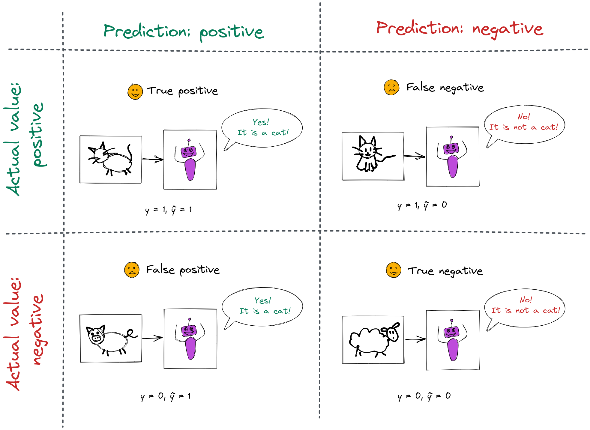
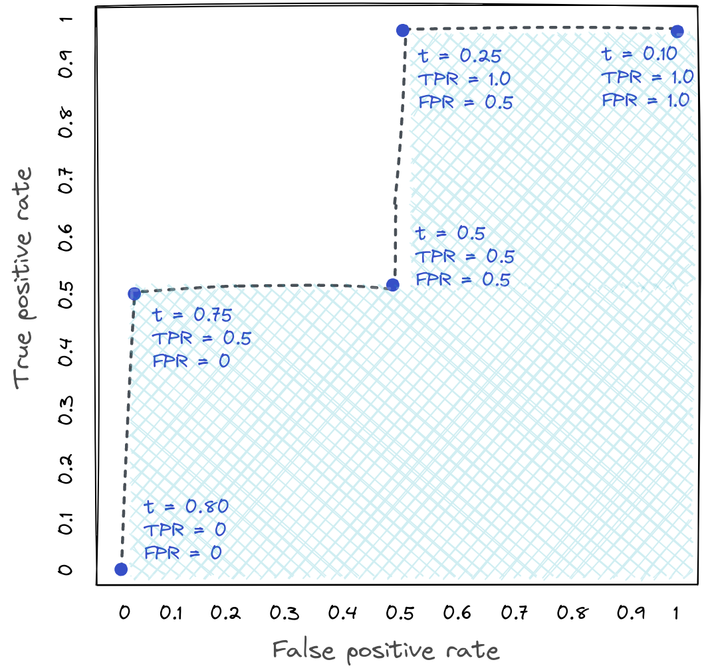
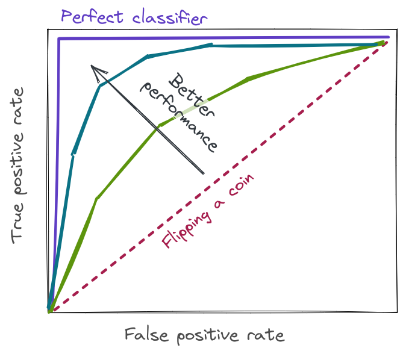
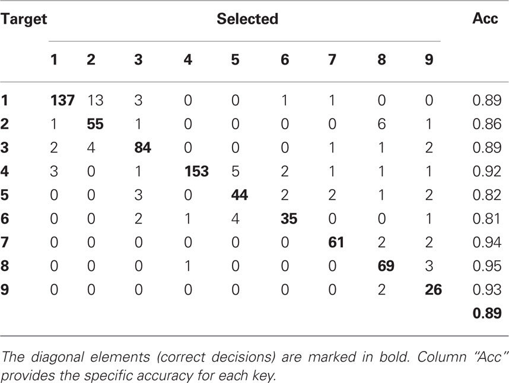

Suppose we have a series of data points $\{(\mathbf{x_1},y_1),(\mathbf{x_2},y_2),\ldots,(\mathbf{x_n},y_n)\}$
and there is some (unknown) relationship between $\mathbf{x_i}$ and $y_i$. Furthermore, the target variable $y$ is constrained to be either a $0$ or $1$: a $1$ label is considered a *positive* label, and a $0$ label is considered a *negative* label. 

We also have a black box \emph{model} that, given some input $\mathbf{x_i}$, will produce as its output an estimate of $y_i$, denoted $\hat{y_i}$. This model is called a \emph{binary classifier}.

The question we will consider in these notes - without knowing any details of the classifier model - is *how can we evaluate the performance of the classifier*?

### Possible outcomes

Consider a classifier model that is trained to identify cat photographs. Its output is $\hat{y} = 1$ if it thinks the photograph is of a cat, and $\hat{y} = 0$ otherwise. 

For each prediction the classifier makes, there are four possible outcomes:

* **True positive**: $y=1, \hat{y}=1$. This is a *correct* prediction.
* **False positive**: $y=0, \hat{y} = 1$. This is called *Type 1* error. (Also known as a *false alarm*.)
* **False negative**: $y=1, \hat{y} = 0$. This is called *Type 2* error. (Also known as a *missed detection*.)
* **True negative**: $y=0, \hat{y}=0$. This is a *correct* prediction.

{ width=65% }

\newpage

The number of *true positive* (TP) outcomes, *true negative* (TN) outcomes, false positive (FP) outcomes, and false negative (FN) outcomes, are often presented together in a **confusion matrix**:

Actual $\downarrow$ Pred. $\rightarrow$  1   0  
-------------------------------------- --- ---
1                                      TP  FN
0                                      FP  TN

We may also define two more quantities, each of which is computed as the sum of a row in the confusion matrix:

* The number of actual positive values (when $y = 1$) **P** = TP+FN, is the sum of the $1$ row.
* The number of actual negative values (when $y = 0$) **N** = FP+TN is the sum of the $0$ row.

The **total population**, P + N, is the total number of samples.

### Metrics related to error

The most basic classifier performance metric is **accuracy**, defined as 

$$ \frac{TP + TN}{TP + FP + TN + FN} = \frac{TP + TN}{P + N}$$

i.e., the portion of samples classified correctly. 

However, accuracy is not always a useful metric. For example, imagine you are training a model to classify credit card transactions as fraudulent ($1$) or not fraudulent ($0$), but only 1% of transactions are fraudulent. A very basic classifier that *always* outputs $0$ will have 99% accuracy! It is clear that accuracy is not a very useful metric here.

For a data set with highly imbalanced classes ($P >> N$ or $P << N$), **balanced accuracy** is often a more appropriate metric:

$$ \frac{1}{2} \left( \frac{TP}{P} + \frac{TN}{N} \right) $$

Balanced accuracy gives the proportion of correct predictions in each class, averaged across classes.

In addition to the overall accuracy, a number of other metrics are used in various contexts. These are defined in terms of the four basic numbers described above: TP, FN, FP, TN.

* **True Positive Rate** (TPR) also called *recall* or *sensitivity*:

$$ TPR = \frac{TP}{P} = \frac{TP}{TP + FN} = P(\hat{y}=1 | y = 1)$$

* **True Negative Rate** (TNR) also called *specificity*:

$$ TNR = \frac{TN}{N} = \frac{TN}{FP + TN} = P(\hat{y}=0 | y = 0)$$

* **Positive Predictive Value** (PPV) also called *precision*:

$$ PPV = \frac{TP}{TP + FP} = P(y=1 | \hat{y} = 1)$$

* **Negative Predictive Value** (NPV):

$$ NPV = \frac{TN}{TN + FN} = P(y=0 | \hat{y} = 0)$$

* **False Positive Rate** (FPR):

$$ FPR = \frac{FP}{N} = \frac{FP}{FP+TN} = 1 - TNR = P(\hat{y}=1 | y = 0)$$

* **False Discovery Rate** (FDR):

$$ FDR = \frac{FP}{FP+TP} = 1 - PPV = P(y = 0 | \hat{y} = 1)$$

* **False Negative Rate** (FNR):

$$ FNR = \frac{FN}{FN+TP}  = 1 - TPR = P(\hat{y}=0 | y = 1)$$

* **False Omission Rate** (FOR):

$$ FOR = \frac{FN}{FN+TN}  = 1 - TPR = P(y=1 | \hat{y} = 0)$$

These metrics are illustrated in the following table:

{width=60%}

Another metric, known as F1 score, combines precision ($\frac{TP}{TP + FP}$) and recall ($\frac{TP}{TP + FN}$) in one metric:

$$F_1 =  2  \left( \frac{ \textrm{precision} \times  \textrm{recall}}{\textrm{precision} + \textrm{recall}} \right)$$

The most appropriate choice of metric for evaluating a classifier depends on the context - for example, whether there is class imbalance, and what the relative cost of each type of error is.

### Tradeoff between FPR and TPR using thresholds

It is trivial to build a classifier with no Type 1 error (no false positives) - if the classifier predicts a negative value for all samples, it will not produce any false positives. However, it also won't produce any true positives! (Similarly, it is trivial to build a classifier with no Type 2 error, by predicting a positive value for all samples. This model will have no false negatives, but also no true negatives.)

We can often adjust the tradeoff between the FPR and TPR. Many classifiers are actually **soft decision** classifiers, which means that their output is a probability, $P(y=1|\mathbf{x})$. 

(This is in contrast to **hard decision** classifiers, whose output is a label, e.g. $0$ or $1$.) 

We get a "hard" label from a "soft" classifier by setting a threshold $t$, so that:

$$
  \hat{y} = 
  \begin{cases}
    1, & P(y=1|\mathbf{x}) \geq t \\
    0, & P(y=1|\mathbf{x}) < t
  \end{cases}
$$

By tuning this **threshold** we can adjust the tradeoff between FPR and TPR. 

For example, consider our cat photo classifier from earlier, but suppose it is a soft decision classifier:

{width=100%}

The performance of this classifier depends on where we set the threshold $t$ for a positive prediction:

* If we set the threshold at 50%, this classifier has one TP, one TN, one FP, and one FN on the data shown. ($TPR = 0.5, FPR = 0.5$.)
* What if the cost of missing a "true" cat is high, but the cost of accidentally classifying a non-cat as a cat is low? Then we might set the threshold at 25%. The classifier then has two TPs, one TN, and one FP. ($TPR = 1, FPR = 0.5$.)
* What if the cost of missing a "true" cat is low, but the cost of accidentally classifying a non-cat as a cat is high? Then we might set the threshold at 75%. The classifier then has one TP, two TNs, and one FN. ($TPR = 0.5, FPR = 0$.)

\newpage

The label applied by the classifier depends on where we set the threshold, the error metrics above also depend on where we set the threshold. But, it's useful to be able to evaluate the classifier performance in general, instead of for a specific threshold. We do this by plotting the TPR vs. FPR for every possible threshold, like in this plot:

{width=50%}

This plot is know as the **ROC curve** (receiver operating characteristic). The shaded area underneath the ROC curve is known as the **AUC** (area under the curve), and it is a classification-threshold-invariant way of evaluating the classifier performance.

A random classifier that doesn't use any information about the problem will have an AUC of 0.5. A perfect classifier will have an AUC of 1. A typical machine learning model will have an AUC somewhere between the two, with a number closer to 1 being a better score.

{width=50%}

### Multi-class classifier performance metrics

So far, we have only discussed a binary classifier. For a multi-class classifier, the output variable is no longer restricted to $0$ or $1$; instead, we have $y \in {1,2,\cdots,K}$ where $K$ is the number of classes.

The same performance metrics apply to a multi-class classifier, with some minor modifications:

* The **accuracy** is the number of correct labels, divided by number of samples
* The **balanced accuracy** is a direct extension of two-class version: compute the per-class accuracy, and average across classes.
* For other metrics, we can use pairwise comparisons between one class and all others, to compute a per-class version of the metric.
* A **soft-decision classifier** will produce a vector of probabilities, one for each class.

The error of a multi-class classifier can also be visualized using a confusion matrix, for example:

{ width=50% }

### Fairness metrics

In addition to evaluating the **error** of a classifier, we are also often concerned with the **fairness** of a classifier. 

Suppose samples come from two groups: $a$ and $b$. What does it mean for a classifier to treat both groups *fairly*? There are a number of different types of fairness, and like the error metrics described above, we are often stuck in a situation where we must sacrifice on one fairness measure to improve another.

*  **Fairness through unawareness** is not a measure of fairness, but describes a situation in which features related to group membership are not used in classification. (This doesn't necessarily mean that the classifier produces fair outcomes! For example, if the classifier is trained on data that reflects an underlying bias in society, the classifier will be biased even if it is not trained on features related to group membership.)

* **Causal discrimination** says that two samples that are identical w.r.t all features except group membership, should have same classification.

* **Group fairness** (also called *statistical parity*) says that for groups $a$ and $b$, the classifier should have equal probability of positive classification:

$$P(\hat{y}=1 | G = a) = P(\hat{y}=1 | G = b)$$

* **Conditional statistical parity** is a related metric, but now we are also controlling for factor $F$:

$$P(\hat{y}=1 | G = a, F=f) = P(\hat{y}=1 | G = b, F=f)$$

* **Balance for positive/negative class** is similar to *group fairness*, but it is for classifiers that produce soft output. It applies to every probability $S$ produced by the classifier. This says that the expected value of probability assigned by the classifier should be the same for both groups -
 * For **positive class balance** 

$$E(S|y=1, G=a) = E(S|y=1, G=b)$$

 * For **negative class balance**

$$E(S|y=0, G=a) = E(S|y=0, G=b)$$

* **Predictive parity** (also called *outcome test*) says that the groups should have equal PPV, i.e. the prediction should carry similar meaning (w.r.t. probability of positive outcome) for both groups:

$$P(y = 1 | \hat{y} = 1, G = a) = P(y = 1 | \hat{y} = 1, G = b)  $$

* Predictive parity also implies equal FDR: 

$$P(y = 0 | \hat{y} = 1, G = a) = P(y = 0 | \hat{y} = 1, G = b)  $$

* **Calibration** (also called *test fairness*, *matching conditional frequencies*) is similar to *predictive parity*, but it is for classifiers that produce soft output. It applies to every probability $S$ produced by the classifier:

$$P(y = 1 | S = s, G = a) = P(y = 1 | S = s, G = b) $$

* **Well-calibration** extends this definition to add that the probability of positive outcome should actually be $s$:

$$P(y = 1 | S = s, G = a) = P(y = 1 | S = s, G = b) = s$$

* **False positive error rate balance** (also called *predictive equality*) says that groups should have equal FPR: 

$$P(\hat{y} = 1 | y = 0, G = a) = P(\hat{y} = 1 | y = 0, G = b)$$

* False positive error rate balance also implies equal TNR: 

$$P(\hat{y} = 0 | y = 0, G = a) = P(\hat{y} = 0 | y = 0, G = b)$$

* **False negative error rate balance** (also called *equal opportunity*) says that groups should have have equal FNR. This is equivalent to group fairness **only** if the prevalence of positive result is the same among both groups:

$$P(\hat{y} = 0 | y = 1, G = a) = P(\hat{y} = 0 | y = 1, G = b)$$

* False negative error rate balance also implies equal TPR: 

$$P(\hat{y} = 1 | y = 1, G = a) = P(\hat{y} = 1 | y = 1, G = b)$$

* **Equalized odds** (also called *disparate mistreatment*) says that both groups should have equal TPR *and* FPR:

$$P(\hat{y} = 0 | y = i, G = a) = P(\hat{y} = 0 | y = i, G = b), i \in 0,1$$

* Note that if the prevalence of the (actual) positive result is *different* between groups, then it is not possible to satisfy FP and FN error rate balance *and* predictive parity at the same time!

* **Conditional use accuracy equality** says that the groups have equal PPV *and* NPV:

$$P(y = 1 | \hat{y} = 1, G = a) = P(y = 1 | \hat{y} = 1, G = b)$$

$$P(y = 0 | \hat{y} = 0, G = a) = P(y = 0 | \hat{y} = 0, G = b)$$

* **Overall accuracy equality** says that the groups have equal overall accuracy

$$P(\hat{y} = y | G = a) = P((\hat{y} = y | G = b)$$

* **Treatment equality** says that the groups have equal ratio of FN to FP, $\frac{FN}{FP}$

## Questions

(You can check your answers to the first four questions [here](https://developers.google.com/machine-learning/crash-course/classification/check-your-understanding-accuracy-precision-recall).)

1. In which of the following scenarios does the accuracy value suggest that the ML model is doing a good job?

  * In the game of roulette, a ball is dropped on a spinning wheel and eventually lands in one of 38 slots. Using visual features (the spin of the ball, the position of the wheel when the ball was dropped, the height of the ball over the wheel), an ML model can predict the slot that the ball will land in with an accuracy of 4%.
  * A deadly, but curable, medical condition afflicts .01% of the population. An ML model uses symptoms as features and predicts this affliction with an accuracy of 99.99%.
  * An expensive robotic chicken crosses a very busy road a thousand times per day. An ML model evaluates traffic patterns and predicts when this chicken can safely cross the street with an accuracy of 99.99%.

2. Consider a classification model that separates email into two categories: "spam" or "not spam." If you raise the classification threshold, what will happen to precision?

  * Probably increase
  * Probably decrease

3. Consider a classification model that separates email into two categories: "spam" or "not spam." If you raise the classification threshold, what will happen to recall?

  * Always stay constant
  * Either decrease, or stay the same
  * Always increase

4. Consider two models—A and B—that each evaluate the same dataset. Which one of the following statements is true?

  * If model A has better recall than model B, then model A is better.
  * If Model A has better precision than model B, then model A is better.
  * If model A has better precision and better recall than model B, then model A is probably better.

5. Read the ProPublica article, [Machine Bias](https://www.propublica.org/article/machine-bias-risk-assessments-in-criminal-sentencing). Based on their description, what type of fairness is violated by the COMPAS recidivism risk prediction algorithm? (Choose one of the fairness measures described above.) 