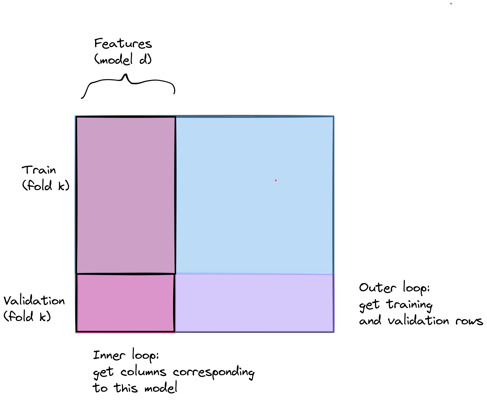
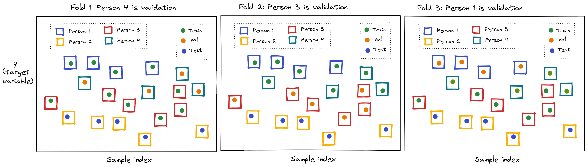
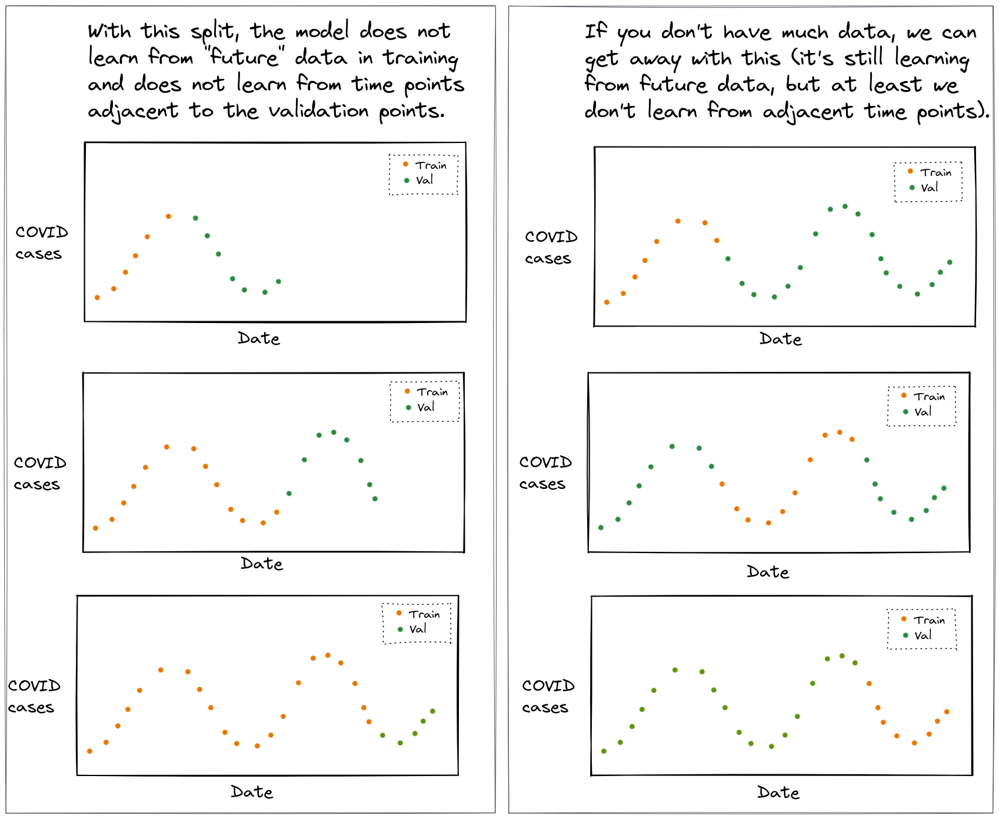

In lecture, we discussed *why* we need a validation set for model selection, and we saw the K-fold CV algorithm written out in pseudocode. In these notes, we will focus on the *code* - how to write a K-fold CV loop for model selection, what each part of the loop does, and how to choose the right way to split the data into training and validation sets.

First, we'll go through each part of a model selection loop in detail. Then, we'll see how the same loop is used with four different "splitters" from `scikit-learn`:

* `KFold`
* `GroupKFold`
* `StratifiedKFold`
* `TimeSeriesSplit`

All four have the same interface, so the structure of the model selection code is the same for all of them. The difference is *which* samples end up together in the validation set.

Throughout these notes, we'll use randomly generated "dummy" data and a basic `LinearRegression` model, since we want to focus on the structure of the code and not on any particular data or model. The same structure applies to any data and any model.

{ width=65% }

\newpage

## The K-fold CV algorithm

Recall the K-fold CV algorithm:

**Outer loop** over folds: for $i=1$ to $K$

* Get training and validation sets for fold $i$
* **Inner loop** over candidate models: For $p=1$ to $p_{max}$,
  * **Fit**: $\hat{w}_{p,i} = \text{fit}_p(X_{tr_i}, y_{tr_i})$
  * **Predict**: $\hat{y}_{v_i,p} = \text{pred}(X_{v_i}, \hat{w}_{p,i})$
  * **Score**: $S_{p,i} = \text{score}(y_{v_i}, \hat{y}_{v_i,p})$

Then, find the average score across $K$ folds for each model, select the model with the best average score, re-fit it on the entire training set, and evaluate it on the test set.

Notice that there are *two* indices here: $i$, the fold, and $p$, the model. Every score $S_{p,i}$ belongs to one model *and* one fold. Keeping track of both of these is most of the "work" in writing the code.

## Dummy data

We'll generate some random data, with 100 samples and 5 features:

```python
n_samples = 100
n_features = 5

X = np.random.normal(size=(n_samples, n_features))
y = np.random.normal(size=n_samples)
```

The first thing we do is split off a test set:

```python
X_train, X_test, y_train, y_test = train_test_split(X, y, test_size=0.3, random_state=0)
```

From here until the very end, we will only use `X_train` and `y_train`. The test set is not passed to the K-fold CV at all - using the test set for model selection is a form of data leakage.

\newpage

## The parts of a model selection loop

### The candidate models

For our dummy example, the candidate models will all be linear regressions, but each one uses a different subset of the features (columns of `X`). We'll describe each candidate model by a list of column indices:

```python
feature_sets = [[0], [0, 1], [0, 1, 2], [1, 3], [0, 1, 2, 3, 4]]
n_models = len(feature_sets)
```

so the first candidate model uses only column `0`, the second uses columns `0` and `1`, and so on. The same idea applies to many model selection problems - for example, a polynomial model of order $d$ uses the first $d$ columns of a matrix of polynomial features.

(If instead we were tuning a hyperparameter, like a regularization strength, the list of candidate models would be a list of hyperparameter values. The rest of the loop would be the same, except that we would change the model in each iteration instead of the columns.)

### The splitter object

Next, we create a splitter object, which knows how to divide data into folds:

```python
nfold = 5
kf = KFold(n_splits=nfold, shuffle=True, random_state=0)
```

Creating this object doesn't split anything yet - it just stores the settings (number of folds, whether to shuffle, and the random seed for the shuffle, so that we get the same folds every time we run the code).

### What `split` returns

The splitter object has a `split` method. We pass it the training data, and it gives us one item per fold. Each item is a *tuple of two arrays of indices*: the indices of the samples in the training part of this fold, and the indices of the samples in the validation part of this fold.

```python
for idx in kf.split(X_train):
  print(type(idx), len(idx), idx[0].shape, idx[1].shape)
```

```
<class 'tuple'> 2 (56,) (14,)
<class 'tuple'> 2 (56,) (14,)
<class 'tuple'> 2 (56,) (14,)
<class 'tuple'> 2 (56,) (14,)
<class 'tuple'> 2 (56,) (14,)
```

There are 70 samples in `X_train`, so in each of the 5 folds, 56 are used for training and 14 for validation. Every sample is in the validation part of exactly one fold.

A few important things to note:

* `split` returns *indices* (positions), not the data itself. We use the indices to select rows of the data - `X_train[idx_tr]`. (If the data is in a `pandas` data frame, we must use `X_train.iloc[idx_tr]`, because the indices are positions, not index labels. These are not necessarily the same - for example, after a call to `train_test_split` shuffles the rows.)
* The indices are positions *in the array we passed to `split`* - here, positions in `X_train`, not in the original `X`. So we use them to select rows from `X_train` and `y_train`.
* `split` doesn't return a list - it returns a *generator*, which produces the folds one at a time as we iterate over it. So we can't do `kf.split(X_train)[0]`. (If we want only the first fold, for example to inspect it, we can use `next(kf.split(X_train))`.)

### What `enumerate` gives us

To fill in the score $S_{p,i}$ we need to know which fold we are on. The `split` method gives us the indices for each fold, but not the fold *number*. That's what `enumerate` is for: `enumerate` wraps any iterable, and in each iteration gives us a tuple of (counter, item), where the counter starts from 0.

```python
for isplit, idx in enumerate(kf.split(X_train)):
  idx_tr, idx_val = idx
  print(isplit, idx_tr[:5], idx_val[:5])
```

```
0 [0 1 2 3 4] [ 7 22 26 27 28]
1 [0 1 5 6 7] [ 2  3  4 11 33]
2 [1 2 3 4 5] [ 0 10 14 18 19]
3 [0 1 2 3 4] [ 5  8 13 15 16]
4 [0 2 3 4 5] [ 1  6  9 12 21]
```

(we're printing only the first 5 indices of each.)

So in each iteration:

* `isplit` is the fold number: 0, 1, ..., `nfold-1`. We'll use it to decide where to save the score for this fold.
* `idx` is the tuple returned by `split` for this fold, which we "unpack" into `idx_tr` and `idx_val`.

We can also unpack the tuple directly in the `for` statement, which is equivalent:

```python
for isplit, (idx_tr, idx_val) in enumerate(kf.split(X_train)):
  ...
```

We use `enumerate` the same way in the inner loop over candidate models:

```python
for pidx, cols in enumerate(feature_sets):
  ...
```

Here, `pidx` is the *model index* (0, 1, ..., `n_models-1`), and `cols` is the *model itself* - the list of columns for this candidate model, e.g. `[1, 3]`.

It's important to keep these two separate! We use `cols` to *build* the model (select its columns), and we use `pidx` to decide where to *save* its score. We can't use `cols` as a position in an array, and in general, the "value" describing a model is not the same as its position in the list. (Even if the candidate models are numbers - for example, a list of polynomial orders `[1, 2, 3, 5, 10]` - the model with order `5` is in position `3`, not position `5`.)

\newpage

### The array of results

Before *either* loop, we create an array of zeros to hold the validation score of every model in every fold:

```python
mse_val = np.zeros((n_models, nfold))
```

The array has one row per candidate model and one column per fold, so `mse_val[pidx, isplit]` is the validation score of model `pidx` in fold `isplit` - that is, $S_{p,i}$. Inside the loops, we fill in one entry at a time:

```python
    mse_val[pidx, isplit] = metrics.mean_squared_error(y_val_fold, y_hat)
```

This is why we need both indices: `pidx` tells us the row, and `isplit` tells us the column.

Some things to note about this array:

* It must be created *before* the loops. If we create it inside the outer loop, it will be "reset" to zeros in every fold, and at the end only the last fold's scores will be saved.
* Its shape tells us exactly what the loops compute. After the loops, there should be no zeros left in it - every model was scored in every fold. (If you see zeros, something went wrong with the indices.)
* After the loops, it is easy to work with: `mse_val.mean(axis=1)` is the mean validation score of each model (averaging across folds - across columns), `mse_val.std(axis=1)` is the standard deviation of each model's score across folds (which we need for the one-SE rule), and `mse_val[:, isplit]` is the scores of all models in one fold.

If we want to save more than one metric (e.g. MSE and R2), we create one array of zeros per metric.

### Pre-processing inside the loop over folds

Any pre-processing step that uses statistics of the data - for example, standardizing with `StandardScaler` (which uses the mean and standard deviation of each column), or filling in missing values with the mean or median - should be considered part of model training. So, it must be fitted using *only* the training part of the fold, and then applied to both the training part and the validation part:

```python
for isplit, (idx_tr, idx_val) in enumerate(kf.split(X_train)):

  # fit the scaler on the training part of this fold only
  scaler = StandardScaler().fit(X_train[idx_tr])
  X_tr_fold  = scaler.transform(X_train[idx_tr])
  X_val_fold = scaler.transform(X_train[idx_val])
```

Why does it go here, inside the loop over folds?

* It can't go *before* the loop (e.g. fitting the scaler on all of `X_train`), because then the validation samples in each fold would have contributed to the mean and standard deviation used to transform the training samples. The model would have "seen" some information about the validation data - this is a form of data leakage.
* It doesn't need to go *inside* the loop over models, because the result doesn't depend on which model we are fitting. `StandardScaler` standardizes each column separately, so we can scale *all* the columns once per fold, and then select the columns we need for each model. (If we placed it in the inner loop, we'd get the same result, but we'd repeat the same computation `n_models` times in every fold.)

On the other hand, a pre-processing step that does *not* use statistics of the data - for example, computing $x^2$ or $x_1 \times x_2$ from the features, or a log transform - gives the same result for a sample no matter which other samples are in the training set. A step like that can be done once, before the loops.

### Selecting rows and columns

In the loops, we are always selecting a subset of the data:

* In the **outer** loop (over folds), we select *rows*: the training and validation samples for this fold. This happens once per fold - `nfold` times in total.
* In the **inner** loop (over models), we select *columns*: the features used by this model. This happens once per model, per fold - `n_models` $\times$ `nfold` times in total.

```python
  # select the rows for this fold (outer loop)
  X_tr_fold  = scaler.transform(X_train[idx_tr])
  X_val_fold = scaler.transform(X_train[idx_val])
  y_tr_fold  = y_train[idx_tr]
  y_val_fold = y_train[idx_val]

  for pidx, cols in enumerate(feature_sets):

    # select the columns for this model (inner loop)
    X_tr_model  = X_tr_fold[:, cols]
    X_val_model = X_val_fold[:, cols]
```

Because the column selection happens so many times, we want it to be just that - a selection. Anything that can be computed once (outside the loops, or once per fold) should be computed there, so that the inner loop only has to select columns from a matrix that already exists, fit, predict, and score. For example, if the candidate models used different sets of transformed features, we would compute *all* of the transformed features once before the loops, in one big matrix, and then in each iteration of the inner loop just select the rows and columns we need.

{width=40%}

If the candidate models are "nested" (each one uses the first $p$ columns), the column selection is `X_tr_fold[:, :p]`. With a `pandas` data frame, select columns by name (`X_tr_fold[col_names]`) or by position (`X_tr_fold.iloc[:, cols]`).

\newpage

### Putting it all together

```python
# create a k-fold object
nfold = 5
kf = KFold(n_splits=nfold, shuffle=True, random_state=0)

# candidate models: each one is a list of columns
feature_sets = [[0], [0, 1], [0, 1, 2], [1, 3], [0, 1, 2, 3, 4]]
n_models = len(feature_sets)

# array to hold the validation MSE for each model, in each fold
mse_val = np.zeros((n_models, nfold))

# outer loop: over folds
for isplit, (idx_tr, idx_val) in enumerate(kf.split(X_train)):

  # fit the scaler on the training part of this fold only
  scaler = StandardScaler().fit(X_train[idx_tr])

  # select the rows for this fold
  X_tr_fold  = scaler.transform(X_train[idx_tr])
  X_val_fold = scaler.transform(X_train[idx_val])
  y_tr_fold  = y_train[idx_tr]
  y_val_fold = y_train[idx_val]

  # inner loop: over models
  for pidx, cols in enumerate(feature_sets):

    # select the columns for this model
    X_tr_model  = X_tr_fold[:, cols]
    X_val_model = X_val_fold[:, cols]

    # fit model on training data
    reg = LinearRegression().fit(X_tr_model, y_tr_fold)

    # measure MSE on validation data
    y_hat = reg.predict(X_val_model)
    mse_val[pidx, isplit] = metrics.mean_squared_error(y_val_fold, y_hat)
```

### After the loop

First, we average across folds and find the *index* of the best model:

```python
idx_best = np.argmin(mse_val.mean(axis=1))
```

`np.argmin` returns a position in the array - a model index, like `pidx` - so we use it to look up the model itself in the list of candidate models:

```python
cols_best = feature_sets[idx_best]
```

(For a "higher is better" metric like R2, use `np.argmax` instead. To use the one-SE rule instead, we would also use `mse_val.std(axis=1)`.)

Then, we re-fit the selected model on the *entire* training set. The pre-processing is part of the model, so we re-fit the scaler on the entire training set, too:

```python
scaler = StandardScaler().fit(X_train)
X_train_best = scaler.transform(X_train)[:, cols_best]
reg_best = LinearRegression().fit(X_train_best, y_train)
```

Finally, we evaluate it on the test set, using the scaler that was fitted on the training set:

```python
X_test_best = scaler.transform(X_test)[:, cols_best]
mse_test = metrics.mean_squared_error(y_test, reg_best.predict(X_test_best))
```

\newpage

## Choosing a splitter

Now that we've seen all the parts of the loop, we'll see how the *same* loop is used with four different splitters. For each one, we'll look at what it does on a tiny "dataset" with 12 samples, where the value of each sample is equal to its index:

```python
X_tiny = np.arange(12).reshape(-1,1)
strata_tiny = np.array([0, 0, 0, 0, 0, 0, 0, 0, 0, 1, 1, 1])
groups_tiny = np.array([0, 0, 0, 1, 1, 1, 2, 2, 2, 3, 3, 3])
```

Here, `strata_tiny` is a categorical variable with a minority category (only three samples have the value `1`), and `groups_tiny` says which "group" each sample belongs to. We'll use `strata_tiny` and `groups_tiny` with some of the splitters below.

Then, we'll see the dummy model selection loop for each splitter. In every case, the only things that change are the splitter object and the arguments passed to `split` (and, in some cases, how we split off the test set).

To choose a splitter, think about the task that the model will be asked to do in "production," and choose a split that makes the validation task mimic it. Otherwise, the validation task may be much easier than the "real" task, and the validation score will be overly optimistic.

\newpage

## `KFold`

### When to use it

`KFold` is the "default" choice, when there is no special structure in the data: the samples are independent of one another, and the model will be asked to make predictions for new samples that are like the samples in the training set.

### How it works

`KFold` divides the samples into $K$ consecutive chunks of (approximately) equal size, and uses each chunk once as the validation set. Without shuffling, the chunks are taken in order:

```python
kf = KFold(n_splits=3)
for isplit, (idx_tr, idx_val) in enumerate(kf.split(X_tiny)):
  print(f"Fold {isplit}: train {idx_tr}, val {idx_val}")
```

```
Fold 0: train [ 4  5  6  7  8  9 10 11], val [0 1 2 3]
Fold 1: train [ 0  1  2  3  8  9 10 11], val [4 5 6 7]
Fold 2: train [0 1 2 3 4 5 6 7], val [ 8  9 10 11]
```

This is a problem if the data happens to be sorted in some way (for example, by the target variable), because then the training and validation sets would not be similar to one another. So, we will almost always use `shuffle=True` with `KFold`:

```python
kf = KFold(n_splits=3, shuffle=True, random_state=0)
for isplit, (idx_tr, idx_val) in enumerate(kf.split(X_tiny)):
  print(f"Fold {isplit}: train {idx_tr}, val {idx_val}")
```

```
Fold 0: train [0 1 2 3 5 7 8 9], val [ 4  6 10 11]
Fold 1: train [ 0  3  4  5  6  9 10 11], val [1 2 7 8]
Fold 2: train [ 1  2  4  6  7  8 10 11], val [0 3 5 9]
```

### Dummy example

This is the loop we already wrote above:

```python
X = np.random.normal(size=(n_samples, n_features))
y = np.random.normal(size=n_samples)
X_train, X_test, y_train, y_test = train_test_split(X, y, test_size=0.3, random_state=0)

nfold = 5
kf = KFold(n_splits=nfold, shuffle=True, random_state=0)

feature_sets = [[0], [0, 1], [0, 1, 2], [1, 3], [0, 1, 2, 3, 4]]
n_models = len(feature_sets)

mse_val = np.zeros((n_models, nfold))

for isplit, (idx_tr, idx_val) in enumerate(kf.split(X_train)):

  scaler = StandardScaler().fit(X_train[idx_tr])
  X_tr_fold  = scaler.transform(X_train[idx_tr])
  X_val_fold = scaler.transform(X_train[idx_val])
  y_tr_fold  = y_train[idx_tr]
  y_val_fold = y_train[idx_val]

  for pidx, cols in enumerate(feature_sets):

    reg = LinearRegression().fit(X_tr_fold[:, cols], y_tr_fold)
    y_hat = reg.predict(X_val_fold[:, cols])
    mse_val[pidx, isplit] = metrics.mean_squared_error(y_val_fold, y_hat)
```

`KFold.split` only needs `X`. (It will also accept `y` and `groups`, but it ignores them.)

\newpage

## `GroupKFold`

### When to use it

Use `GroupKFold` when the samples are *not* independent, because several samples come from the same "group" (for example, several samples from the same individual), *and* the model will be asked to make predictions for new groups that it has not seen in training.

Samples from the same group are usually more similar to one another than to samples from other groups. If samples from the same group are in both the training set and the validation set, the model can do well on validation just by "recognizing" the group - this is data leakage. The validation task (predict a new sample from a group you have already seen) is easier than the "real" task (predict for a group you have never seen), so the validation score will be overly optimistic, and it may lead us to select a model that "memorizes" groups.

{ width=74% }

(If, on the other hand, the model *will* be asked to make predictions about new samples from the same groups that it was trained on, then a regular shuffled `KFold` is OK, since it mimics the "real" task.)

### How it works

`GroupKFold` needs one more piece of information: a `groups` array with the same length as the data, which says which group each sample belongs to. Every sample from a given group will be placed in the same fold, so a group is always *either* in the training set *or* the validation set, never both.

```python
gkf = GroupKFold(n_splits=4)
for isplit, (idx_tr, idx_val) in enumerate(gkf.split(X_tiny, groups=groups_tiny)):
  print(f"Fold {isplit}: train {idx_tr}, val {idx_val}, val groups {np.unique(groups_tiny[idx_val])}")
```

```
Fold 0: train [0 1 2 3 4 5 6 7 8], val [ 9 10 11], val groups [3]
Fold 1: train [ 0  1  2  3  4  5  9 10 11], val [6 7 8], val groups [2]
Fold 2: train [ 0  1  2  6  7  8  9 10 11], val [3 4 5], val groups [1]
Fold 3: train [ 3  4  5  6  7  8  9 10 11], val [0 1 2], val groups [0]
```

A few things to note:

* The number of folds can't be more than the number of groups.
* Because entire groups are assigned to folds, the folds may not be exactly equal in size (if the groups are not equal in size). `GroupKFold` tries to make the folds as balanced as it can.
* By default, `GroupKFold` does not shuffle - it assigns groups to folds deterministically. (Recent versions of `scikit-learn` also accept `shuffle=True` and `random_state`.)
* The *test* split must also respect the groups! Use `GroupShuffleSplit` instead of `train_test_split` to split off the test set, otherwise the same group may be in both the training and test set, and the final evaluation will be overly optimistic, too.

\newpage

### Dummy example

Now, the dummy data also has a `groups` array. Here, there are 20 groups with 5 samples each:

```python
X = np.random.normal(size=(n_samples, n_features))
y = np.random.normal(size=n_samples)
groups = np.repeat(np.arange(20), 5)
```

To split off the test set, we use `GroupShuffleSplit`. This is also a splitter, so it returns indices - with `n_splits=1`, there is only one split, and we use `next` to get it:

```python
gss = GroupShuffleSplit(n_splits=1, test_size=0.3, random_state=0)
idx_train, idx_test = next(gss.split(X, y, groups))

X_train, y_train, groups_train = X[idx_train], y[idx_train], groups[idx_train]
X_test,  y_test                = X[idx_test],  y[idx_test]
```

Note that we also keep the `groups` array for the training data, since we will pass it to the K-fold CV. Then, the loop is the same as before, except for the splitter object and the arguments to `split`:

```python
nfold = 5
gkf = GroupKFold(n_splits=nfold)

feature_sets = [[0], [0, 1], [0, 1, 2], [1, 3], [0, 1, 2, 3, 4]]
n_models = len(feature_sets)

mse_val = np.zeros((n_models, nfold))

for isplit, (idx_tr, idx_val) in enumerate(gkf.split(X_train, y_train, groups_train)):

  scaler = StandardScaler().fit(X_train[idx_tr])
  X_tr_fold  = scaler.transform(X_train[idx_tr])
  X_val_fold = scaler.transform(X_train[idx_val])
  y_tr_fold  = y_train[idx_tr]
  y_val_fold = y_train[idx_val]

  for pidx, cols in enumerate(feature_sets):

    reg = LinearRegression().fit(X_tr_fold[:, cols], y_tr_fold)
    y_hat = reg.predict(X_val_fold[:, cols])
    mse_val[pidx, isplit] = metrics.mean_squared_error(y_val_fold, y_hat)
```

`GroupKFold.split` takes `X`, `y`, and `groups` (in that order). Since the indices it returns are positions in `X_train`, we must pass `groups_train` (not `groups`) so that the positions line up.

\newpage

## `StratifiedKFold`

### When to use it

Use `StratifiedKFold` when there is some category in the data that has a *minority* - a value that only a small fraction of the samples have - and you want to make sure that the minority is distributed evenly across the folds, so that every fold has (approximately) the same proportion of each category as the overall data.

For example, suppose one feature is a categorical variable, and only 10% of the samples are in one of its categories. With a random split, especially when the dataset is small, some validation folds may get very few (or zero!) samples from this minority category, and others may get many more than their "share." Then:

* in a fold where the minority is missing from the validation set, we learn nothing about how well each model does for that part of the data,
* in a fold where the minority is missing from the training set, the model never gets to learn from that part of the data,
* and the validation scores will vary a lot from fold to fold, just because of which samples happened to land in which fold - so the average score is a noisier basis for choosing a model.

Note how this is different from `GroupKFold`: with `GroupKFold`, we keep all of the samples from a group *together*, in the same fold. With `StratifiedKFold`, we *spread* the samples from each category *evenly* across all the folds.

Also note that stratification doesn't change *which* task the model is evaluated on (unlike `GroupKFold` and `TimeSeriesSplit`) - it just makes the folds more similar to one another and to the overall data.

### How it works

`StratifiedKFold.split` takes a second argument (in the position where the other splitters accept `y`): an array with the same length as the data, which says which category each sample belongs to. We'll call this array `strata`. `StratifiedKFold` then assigns the samples of each category to the folds separately, so that each category is spread out evenly across the folds.

The `strata` array does not have to be the target variable - it can be any categorical variable in the data, e.g. one of the features. Whatever we pass in that position is the variable that the split will be stratified by. (It must be categorical - each value is treated as a separate category.)

In our tiny dataset, `strata_tiny` has a minority category (`1`) with only three samples. Here's how those samples are distributed across the validation folds with a shuffled `KFold`:

```python
kf = KFold(n_splits=3, shuffle=True, random_state=0)
for isplit, (idx_tr, idx_val) in enumerate(kf.split(X_tiny)):
  print(f"Fold {isplit}: strata_val {strata_tiny[idx_val]}")
```

```
Fold 0: strata_val [0 0 1 1]
Fold 1: strata_val [0 0 0 0]
Fold 2: strata_val [0 0 0 1]
```

The second validation fold has no samples from the minority category at all, and the first has two. With `StratifiedKFold`:

```python
skf = StratifiedKFold(n_splits=3, shuffle=True, random_state=0)
for isplit, (idx_tr, idx_val) in enumerate(skf.split(X_tiny, strata_tiny)):
  print(f"Fold {isplit}: train {idx_tr}, val {idx_val}, strata_val {strata_tiny[idx_val]}")
```

```
Fold 0: train [ 0  3  4  5  6  8  9 11], val [ 1  2  7 10], strata_val [0 0 0 1]
Fold 1: train [ 0  1  2  4  5  7  9 10], val [ 3  6  8 11], strata_val [0 0 0 1]
Fold 2: train [ 1  2  3  6  7  8 10 11], val [0 4 5 9], strata_val [0 0 0 1]
```

every validation fold has exactly one sample from the minority category (and every training set has two).

Like `KFold`, `StratifiedKFold` does not shuffle by default, so we usually pass `shuffle=True`. When we split off the test set, we can similarly stratify with `train_test_split(..., stratify=strata)`, so that the test set also has its "share" of the minority.

\newpage

### Dummy example

Now, the dummy data also has a `strata` array, where about 10% of the samples are in the minority category:

```python
X = np.random.normal(size=(n_samples, n_features))
y = np.random.normal(size=n_samples)
strata = np.random.binomial(1, 0.1, size=n_samples)
```

To split off the test set, we pass `strata` to `train_test_split` *twice*: once as one of the arrays to split (so that we get `strata_train`, which we'll need for the K-fold CV), and once as the `stratify` argument:

```python
X_train, X_test, y_train, y_test, strata_train, strata_test = train_test_split(X, y, strata,
                                    test_size=0.3, stratify=strata, random_state=0)
```

Then, the loop is the same as before, except for the splitter object and the arguments to `split`:

```python
nfold = 5
skf = StratifiedKFold(n_splits=nfold, shuffle=True, random_state=0)

feature_sets = [[0], [0, 1], [0, 1, 2], [1, 3], [0, 1, 2, 3, 4]]
n_models = len(feature_sets)

mse_val = np.zeros((n_models, nfold))

for isplit, (idx_tr, idx_val) in enumerate(skf.split(X_train, strata_train)):

  scaler = StandardScaler().fit(X_train[idx_tr])
  X_tr_fold  = scaler.transform(X_train[idx_tr])
  X_val_fold = scaler.transform(X_train[idx_val])
  y_tr_fold  = y_train[idx_tr]
  y_val_fold = y_train[idx_val]

  for pidx, cols in enumerate(feature_sets):

    reg = LinearRegression().fit(X_tr_fold[:, cols], y_tr_fold)
    y_hat = reg.predict(X_val_fold[:, cols])
    mse_val[pidx, isplit] = metrics.mean_squared_error(y_val_fold, y_hat)
```

`StratifiedKFold.split` takes `X` and the variable to stratify by - here, `strata_train` (not `y_train`!). Since the indices it returns are positions in `X_train`, we must pass `strata_train` (not `strata`) so that the positions line up. Everything inside the loop is unchanged: we still fit the model to predict `y`.

\newpage

## `TimeSeriesSplit`

### When to use it

Use `TimeSeriesSplit` when the data is ordered in time, and the model will be asked to make predictions about the *future*, using a model trained on the past.

If we shuffle time series data, then each validation sample will have training samples immediately before *and after* it. The model is asked to "fill in the gaps" (interpolate) between training samples - a much easier task than the "real" task of predicting further into the future (extrapolate). The model is also learning from the future, which is information it will not have in production. This is data leakage, and it gives an overly optimistic validation score.

{ width=77% }

### How it works

`TimeSeriesSplit` does *not* shuffle. It assumes that the data is already sorted in time order (so sort it first!). In each fold, the validation set is a chunk of consecutive samples, and the training set is all of the samples *before* that chunk. With each fold, the training set grows:

```python
tscv = TimeSeriesSplit(n_splits=3)
for isplit, (idx_tr, idx_val) in enumerate(tscv.split(X_tiny)):
  print(f"Fold {isplit}: train {idx_tr}, val {idx_val}")
```

```
Fold 0: train [0 1 2], val [3 4 5]
Fold 1: train [0 1 2 3 4 5], val [6 7 8]
Fold 2: train [0 1 2 3 4 5 6 7 8], val [ 9 10 11]
```

Unlike the other splitters, not every sample is used for validation (the first chunk is only ever used for training), and the folds have different numbers of training samples.

There are some useful arguments to control the split:

* `test_size`: the number of samples in each validation set. Set this to match the "real" task - for example, if the model will be used to predict the next 10 time steps, use `test_size=10`.
* `gap`: the number of samples to leave out between the end of the training set and the start of the validation set. Use this if, in the "real" task, there is a delay between the most recent data available for training and the predictions.
* `max_train_size`: the maximum number of samples in the training set. Use this if the model will be trained on a "sliding window" of recent data, rather than all past data.

```python
tscv = TimeSeriesSplit(n_splits=3, test_size=2, gap=1)
for isplit, (idx_tr, idx_val) in enumerate(tscv.split(X_tiny)):
  print(f"Fold {isplit}: train {idx_tr}, val {idx_val}")
```

```
Fold 0: train [0 1 2 3 4], val [6 7]
Fold 1: train [0 1 2 3 4 5 6], val [8 9]
Fold 2: train [0 1 2 3 4 5 6 7 8], val [10 11]
```

The *test* split must also be chronological: the test set should be the *last* part of the data, after all of the training data. Don't use `train_test_split` with its default `shuffle=True`. Instead, just slice the data (or use `train_test_split(..., shuffle=False)`).

\newpage

### Dummy example

We'll assume that the rows of the dummy data are already in time order. The test set is the last 30 samples:

```python
X = np.random.normal(size=(n_samples, n_features))
y = np.random.normal(size=n_samples)

# chronological split - test set is the last part of the data
n_train = 70
X_train, y_train = X[:n_train], y[:n_train]
X_test,  y_test  = X[n_train:], y[n_train:]
```

```python
nfold = 5
tscv = TimeSeriesSplit(n_splits=nfold, test_size=10)

feature_sets = [[0], [0, 1], [0, 1, 2], [1, 3], [0, 1, 2, 3, 4]]
n_models = len(feature_sets)

mse_val = np.zeros((n_models, nfold))

for isplit, (idx_tr, idx_val) in enumerate(tscv.split(X_train)):

  scaler = StandardScaler().fit(X_train[idx_tr])
  X_tr_fold  = scaler.transform(X_train[idx_tr])
  X_val_fold = scaler.transform(X_train[idx_val])
  y_tr_fold  = y_train[idx_tr]
  y_val_fold = y_train[idx_val]

  for pidx, cols in enumerate(feature_sets):

    reg = LinearRegression().fit(X_tr_fold[:, cols], y_tr_fold)
    y_hat = reg.predict(X_val_fold[:, cols])
    mse_val[pidx, isplit] = metrics.mean_squared_error(y_val_fold, y_hat)
```

`TimeSeriesSplit.split` only needs `X`. Note that the scaler is especially important to fit inside the loop here: if it were fitted on all of `X_train`, the training data in each fold would be scaled using statistics computed partly from *future* samples.

\newpage

## Summary

Splitter            Arguments to `split`     Shuffles?                       Use when...
------------------ ------------------------ ------------------------------- ----------------------------------------------------------------
`KFold`             `X`                      only with `shuffle=True`        samples are independent, no special structure
`GroupKFold`        `X, y, groups`           no (by default)                 multiple samples per group, predict for *new* groups
`StratifiedKFold`   `X, strata`              only with `shuffle=True`        a minority category should be spread evenly across folds        
`TimeSeriesSplit`   `X`                      never                           ordered in time, predict the *future*

Some general rules:

* Choose the splitter by thinking about the task that the model will be asked to do in "production," and making the validation task mimic it. The model selection code is the same for every splitter - only the splitter object (and the arguments to `split`) change.
* Use the same reasoning for the training/test split: `GroupShuffleSplit` for group structure, `train_test_split(..., stratify=strata)` for stratification, and a chronological slice for time series.
* Only pass the *training* data to the K-fold CV. Never use the test set for model selection.
* Create the array of results (`np.zeros((n_models, nfold))`) before the loops, fill it in at `[pidx, isplit]` inside the loops, and average over `axis=1` afterward.
* Use `enumerate` in both loops, and keep the model index (`pidx`) separate from the model itself (`cols`), and the fold index (`isplit`) separate from the indices of the fold (`idx_tr, idx_val`).
* Select rows in the outer loop and columns in the inner loop. The inner loop runs `n_models` $\times$ `nfold` times, so compute anything that can be computed once outside it.
* Anything that "learns" from the data (scaling, filling in missing values with a statistic, feature selection) goes inside the loop over folds, fitted using only the training part of each fold.
* After selecting the model, re-fit it (including the pre-processing) on the entire training set before evaluating on the test set.
* Splitters can be combined: for example, `StratifiedGroupKFold` keeps groups together *and* tries to keep the proportion of each category similar across folds.

Finally, all of these splitter objects can be passed as the `cv` argument to `scikit-learn` functions that do cross validation for you, like `cross_val_score`, `validation_curve`, or `GridSearchCV`. For `GroupKFold`, also pass the `groups` array:

```python
grid = GridSearchCV(model, param_grid, cv=GroupKFold(n_splits=5))
grid.fit(X_train, y_train, groups=groups_train)
```

Refer to [the `scikit-learn` documentation on cross validation](https://scikit-learn.org/stable/modules/cross_validation.html#cross-validation-iterators) for more splitters and examples.
