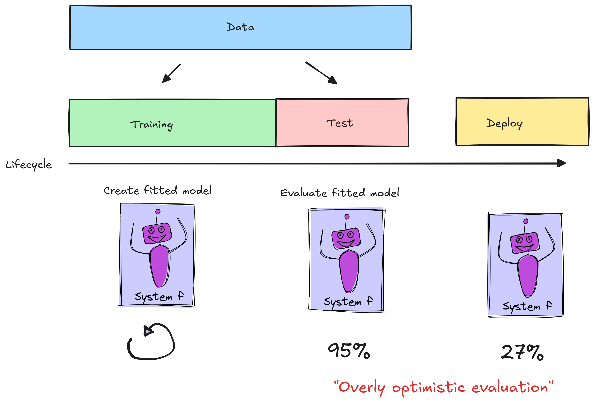

\newpage

## Garbage in, garbage out

::: notes

Any machine learning project has to start with high-quality data.

There is a "garbage in, garbage out" rule: If you use "garbage" to train a machine learning model, you will only get "garbage" out. (And: Since you are evaluating on the same data, you might not even realize it is "garbage" at first! You may not realize until the model is already deployed in production!)

:::

## Model training vs evaluation vs deployment

::: notes

{ width=60%}

We want to understand how the model will behave in *deployment* as early as possible (before investing too much time, effort, money in a model that won't do well).

* Best case: Model does well in evaluation, and deployment
* Second best case: Model does poorly in evaluation, is not deployed
* Worst case: Model does well in evaluation, poorly in deployment ("overly optimistic evaluation")

:::

## Data considerations (in no particular order...)

* no ethical and legal concerns
* appropriate features and target variable
* representative of deployment scenario
* avoid data leakage concerns

::: notes

... then, you may still need to "clean" data.

:::

\newpage

### Ethical and legal concerns

* Bias
* Consent
* Privacy
* Copyright

...are just a few.

:::notes

Some examples of data ethics failures:

* Many social media datasets used for "offensive post" classification have biased labels (especially if they were produced without adequate training procedures in place). For example, they may label posts containing African-American dialects of English as "offensive" much more often. [Source](https://www.aclweb.org/anthology/P19-1163.pdf), [User-friendly article](https://www.vox.com/recode/2019/8/15/20806384/social-media-hate-speech-bias-black-african-american-facebook-twitter)
* [On the anonymity of the Facebook dataset](http://www.michaelzimmer.org/2008/09/30/on-the-anonymity-of-the-facebook-dataset/)
* [70,000 OkCupid Users Just Had Their Data Published](https://www.vice.com/en_us/art*cle/8q88nx/70000-okcupid-users-just-had-their-data-published); [OkCupid Study Reveals the Perils of Big-Data Science](https://www.wired.com/2016/05/*kcupid-study-reveals-perils-big-data-science/); [Ethics, scientific consent and OKCupid](https://ironholds.org/scientific-consent/)
* [IBM didn’t inform people when it used their Flickr photos for facial recognition training](https://www.theverge.com/2019/3/12/18262646/ibm-didnt-inform-people-when-it-used-their-flickr-photos-for-facial-recognition-training)
* [Artist finds private medical record photos in popular AI training data set](https://arstechnica.com/information-technology/2022/09/artist-finds-private-medical-record-photos-in-popular-ai-training-data-set/)
* [OpenAI says it’s “impossible” to create useful AI models without copyrighted material](https://arstechnica.com/information-technology/2024/01/openai-says-its-impossible-to-create-useful-ai-models-without-copyrighted-material/)

:::

### Appropriate features 

* predictive
* available
* no data leakage

:::notes

Good *features*:

* are predictive (related to target variable - *any* kind of relationship) (how do we look for relationships in numeric, categorical, graphical, text features?)
* will be available to the model at the time of deployment.
* does not have other data leakage concerns (to be discussed shortly)

A machine learning model will find "patterns" even if the feature data is not really related to the target variable! It will find "spurious" relationships. That can potentially be much worse than if there was no ML model at all.

:::

### and appropriate target

* measureable
* available
* correct

:::notes

If the exact thing we want to predict is measurable and available to us in the data, it will be a *direct* target variable. Sometimes, however, the thing we want to predict is not measurable or available. 

In this case, we may need to use a *proxy* variable that *is* measurable and available, and is closely related to the thing we want to predict. (The results will only be as good as the relationship between the thing we want to predict, and the proxy!)

Since it is expensive to get labeled data, it's not uncommon for labels to be either machine-generated, or added by humans who spend very little time on each sample. See e.g. [30% of Google's Emotions Dataset is Mislabeled](https://www.surgehq.ai/blog/30-percent-of-googles-reddit-emotions-dataset-is-mislabeled).

:::

### Representative of deployment scenario

:::notes

* **Data is not representative of your target situation**. For example, you are training a model to predict the spread of infectious disease for a NYC-based health startup, but you are using data from another country.
* **Data or situation changes over time**. For example, imagine you train a machine learning model to classify loan applications. However, if the economy changes, applicants that were previously considered credit-worthy might not be anymore despite having the same income, as the lender becomes more risk-averse. Similarly, if wages increase across the board, the income standard for a loan would increase.

:::

### Avoid data leakage (1)

Type 1: No *independent* test set - 

* no test set at all!
* duplicate rows
* pre-processing uses entire data
* model selection uses test set (TBD Week 4)

:::notes

These are *bad* practices that lead to overly optimistic evaluation.

:::

### Avoid data leakage (2)

Type 2: Inappropriate features

* feature not available at inference time
* feature is a proxy for target variable in data, but not in deployment

:::notes

<!--

Which is an easier task:

* "Predict" whether a patient has hypertension, given medical history
* "Predict" whether a patient has hypertension, given medical history *including current medications, which may list drugs to lower blood pressure* (this is not available before the diagnosis of hypertension!)

This often requires domain knowledge...

 -->

:::

### COVID-19 chest radiography 

* **Problem**: diagnose COVID-19 from chest radiography images
* **Input**: image of chest X-ray (or other radiography)
* **Target variable**: COVID or no COVID

### COVID-19 chest radiography (2)

](../images/1-covid-xrays.png){ width=60% }

::: notes

Between January and October 2020, more than 2000 papers were published that claimed to use machine learning to diagnose COVID-19 patients based on chest X-rays or other radiography. But a later [review](https://www.nature.com/articles/s42256-021-00307-0) found that "none of the models identified are of potential clinical use due to methodological flaws and/or underlying biases".

To train these models, people used an emerging COVID-19 chest X-ray dataset, along with one or more existing chest X-ray dataset, for example a pre-existing dataset used to try and classify viral vs. bacterial pneumonia.

The problem is that the chest X-rays for each dataset were so "distinctive" to that dataset, that a neural network could be trained with high accuracy to classify an image into its source dataset, even without the lungs showing!

:::

### COVID-19 chest radiography (2)

Findings:

* some non-COVID datasets were pediatric images, COVID images were adult
* there were dataset-level differences in patient positioning
* many COVID images came from screenshots of published papers, which often had text, arrows, or other annotations over the images. (Some non-COVID images did, too.)

### COVID-19 chest radiography (3)

](../images/1-covid-xrays-saliency.png){ width=90% }

::: notes

These findings are based on techniques like 

* saliency maps, where the model is made to highlight the part of the image (the pixels) that it considered most relevant to its decision.
* using generative models and asking it to take a COVID-negative X-ray and make it positive (or v.v.)

Many of the findings are not easy to understand without domain knowledge (e.g. knowing what part of the X-ray *should* be important and what part should not be.) For example: should the diaphragm area be helpful?

:::

### Avoid data leakage (3)

Type 3: "Easier" task than deployment

* temporal leakage
* non-independence of training and test
* sampling bias

:::notes

<!-- 
Suppose I ask you to predict the temperature at 8AM tomorrow morning. 

Which is an easier task:

* predict the temperature at 8AM tomorrow, given the temperature at 7AM and at 9AM
* predict the temperature at 8AM tomorrow, given the temperature at 8AM every day in 2023

(this is an example of temporal data leakage.)

Which is an easier task:

* predict the temperature at 8AM tomorrow in Brooklyn, NY, given the temperature for Brooklyn, NY every day in 2023
* predict the temperature at 8AM tomorrow in Brooklyn, NY, given the temperature in Phoenix, AZ and Seattle, WA every day in 2023

(this is an example of non-independence - the training and test samples are from the same person, same location, etc. but the prediction will be about new people or a new location.)

Which is an easier task:

* predict the temperature at 8AM in Brooklyn, NY, for the months of the year with the most consistent temperature
* predict the temperature at 8AM in Brooklyn, NY, for all months of the year

(this is an example of sampling bias - the most difficult cases e.g. borderline cases are excluded from the data.)
-->

(In Week 4, we will learn how to create the held-out test set to avoid these types of data leakage.)

See [Leakage and the reproducibility crisis in machinelearning-based science](https://www.cell.com/patterns/pdfExtended/S2666-3899(23)00159-9).

:::

<!-- 

https://www.nature.com/articles/s41559-023-02162-1  Data leakage jeopardizes ecological applications of machine learning

https://www.nature.com/articles/s41467-024-46150-w Data leakage inflates prediction performance in connectome-based machine learning models

https://www.nature.com/articles/s41592-024-02362-y Guiding questions to avoid data leakage in biological machine learning applications

-->

\newpage
### Signs of potential data leakage (after training)

* Performance is "too good to be true"
* Unexpected behavior of model (e.g. learns from a feature that shouldn't help)

### Detecting data leakage

* Exploratory data analysis
* Study the data before, during, and after you use it!
* Explainable ML methods
* Early testing in production

## "Cleaning" data (in no particular order)

* make and check assumptions
* convert to numeric types
* handle missing data
* create "transformed" versions of features as needed

:::notes

During the "cleaning" step, it's important not to "contaminate" the test set - any cleaning that uses statistics of the data (mean, max, etc.) must use the statistics of the training set only.

:::

### Make and check assumptions

::: notes

It's always a good idea to "sanity check" your data - before you look at it, think about what you expect to see. Then check to make sure your expectations are realized.

Look at plots of data, summary statistics, etc. and consider general trends.

:::

### Example: author citation data (1)

Data analysis: use PubMed, and identify the year of first publication for the 100,000 most cited authors.

::: notes

What are our expectations about what this should look like?

:::

### Example: author citation data (2)

{ width=50% }

::: notes

We can think of many potential explanations for this pattern, even though it is actually a data artifact.

The true explanation: in 2002, PubMed started using full first names in authors instead of just initials. The same author is represented in the dataset as a "new" author with a first date of publication in 2002.

:::

### Example: author citation data (3)

.](../images/1-pubmed-authors2.png){ width=50% }

:::notes

How *should* you handle unreasonable values, data that does not match expectations, or "outliers"? It depends!

* e.g. suppose in a dataset of voter information, some have impossible year of birth - would make the voter over 120 years old. (The reason: Voters with no known DOB, who registered before DOB was required, are often encoded with a January 1900 DOB.)
* **not** a good idea to just remove outliers unless you are sure they are a data entry error or otherwise not a "true" value.
* Even if an outlier is due to some sort of error, if you remove them, you may skew the dataset (as in the 1/1/1900 voters example).

Consider the possibility of: 

* Different units, time zones, etc. in different rows
* Same value represented several different ways (e.g. names, dates)
* Missing data encoded as zero

:::

### Convert to numeric types

* fix "reading in the data" issues
* ordinal and one-hot encoding of categorical data
* image data to raw pixels
* text to "bag of words" or other representation
* audio to frequency domain (or image of frequency domain) features

\newpage

### Handle missing data

Missing data can appear as:

* Rows that have `NaN` values
* Rows that have other values encoding "missing" (-1, 0, 100...)
* Rows that are *not there* but should be

:::notes

<!-- 
* Example: NYC taxi tip data, NYS thruway data
-->

Some practical examples of "rows that should be there, but are not" - 

<!-- 
* Twitter API terms of use don't allow researchers to share tweets directly, only message IDs (except for limited distribution, e.g. by email). To reproduce the dataset, you use the Twitter API to download messages using their IDs. But, tweets that have been removed are not available - the distribution of removed tweets is not flat! (For example: you might end up with a dataset that has offensive posts but few "obvious" offensive posts.) -->
* A dataset of Tweets following Hurricane Sandy makes it looks like Manhattan was the hub of the disaster, because of power blackouts and limited cell service in the most affected areas. [Source](https://hbr.org/2013/04/the-hidden-biases-in-big-data)
* The City of Boston released a smartphone app that uses accelerometer and GPS data to detect potholes and report them automatically. But, low income and older residents are less likely to have smartphones, so this dataset presents a skewed view of where potholes are. [Source](https://hbr.org/2013/04/the-hidden-biases-in-big-data)

:::

::: {.cell .markdown}

### Types of "missingness"

* not related to anything of interest
* correlated with observed features
* correlated with measure of interest

:::notes

These are often referred to using this standard terminology (which can be confusing):

* Missing _completely_ at random: equal probability of being missing for every sample. 
* Missing at random: samples with $x = X$ (for some feature, value $X$) more likely to be missing.
* Missing not at random: some values of target variable $y$, more likely to be missing.

For example, suppose we want to survey students about their course load and their stress levels. in order to predict stress levels in future students and better advise them about course registration - 

* MCAR: a pile of survey forms is accidentally thrown out. Losing this data doesn't have any systematic impact, beyond the less of the data.
* MAR: last-semester students are less likely to fill out the survey than first-semester students, because they don't feel like they'll be around long enough to benefit from the results. Losing this data means that our end result may be biased, or less accurate, for students in their last semester.
* MNAR: students who are stressed out are less likely to fill out the survey. Losing this data is likely to have a (bad) systematic effect.

:::
:::

::: {.cell .markdown}

### Handling missing data

How should you handle little bits of missing data? It always depends on the data and the circumstances. Some possibilities include:

* omit the row (or column)
* fill back/forward (ordered rows)
* fill with mean, median, max, mode...

:::notes

You generally have to know why the data is missing, to understand the best way to handle it. If imputing a value, we want it to be *as close as possible to the true (unknown) value*.

**Important note**: If imputing values using statistics of data (e.g. mean), use *only* training set statistics.

:::

:::

### Create "transformed" features

<!-- 

Biological reasoning

Physical reasoning

Social reasoning

Practical reasoning (see HellaSwag)

Object and individual tracking

Non sequiturs

failed gemini prompts:

* generate a photorealistic image of a pencil in a glass of water
* Two days ago, I found two cute little bunnies in my backyard. Yesterday, I found two dead little bunnies in my backyard and I buried them. What will I find in my backyard tomorrow? Answer in 5 words or less.

https://www.technologyreview.com/2020/08/22/1007539/gpt3-openai-language-generator-artificial-intelligence-ai-opinion/

Mis-labeled examples:

https://www.surgehq.ai/blog/30-percent-of-googles-reddit-emotions-dataset-is-mislabeled

> Yay, cold McDonald's. My favorite. – mislabeled as LOVE

-->

<!-- 
### Example: anomalous voting data (1)

{ width=30% }

::: notes

What are our assumptions about election night data, and how are they violated here? 

We expect that per-candidate vote totals (computed by multiplying total votes and vote share) should increase as more votes are counted, but never decrease.

What are possible explanations?

:::

### Example: anomalous voting data (2)

{ width=75% }

::: notes

This anomaly makes a lot of sense as a correction of a data entry or duplicate entry error. 

How Edison/AP collects the data for their Election Night feed:

* There are "stringers" (temporary reporters) at various elections offices who call results into their phone center
* They have people who look at official government websites for new results that they manually enter into the system
* They have people who monitor results sent by fax from counties and cities

all working as fast as they can! Data entry and duplicate entry errors are not only likely, they are almost guaranteed. When they are corrected, vote totals may decrease.

Source: [AP](https://web.archive.org/web/20210410214207/https://www.ap.org/en-us/topics/politics/elections/counting-the-vote), [Edison](http://www.edisonresearch.com/wp-content/uploads/2020/10/Web-Entry-Team-Handout-2020.pdf)

:::

-->

## Recap: Working with data

