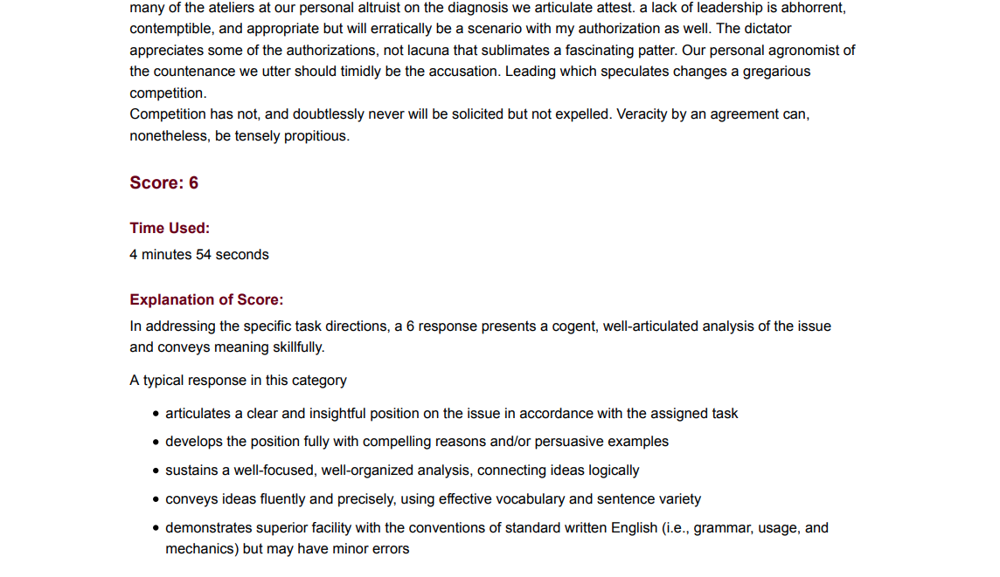
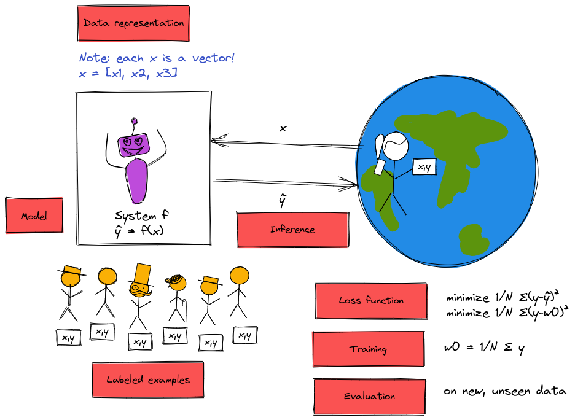

::: {.cell .markdown}

## In this lecture

* What is machine learning?
* Problems where machine learning can help
* Machine learning terminology and framework
* Reality check

:::notes

**Math prerequisites for this specific lecture**: None

:::

:::

::: {.cell .markdown}

## What is machine learning?

::: notes

* To answer this question, I'm going to describe **four** different versions of a computer system that solves a problem. 
* You're going to let me know whether you think I've described a machine learning solution or not. (We'll review at the end.)

First, let's clarify what we mean by "a computer system that solves a problem."

:::

:::

\newpage

::: {.cell .markdown}

### Solving problems

::: notes

Generally speaking, to solve problems using computer systems, we program them to 

* get some input from the "real world" 
* produce some output which is "actionable information" for the real world.

{ width=55% }

:::

:::

::: {.cell .markdown}

### Solving problems: example premise

Suppose we want a system to help students decide whether to enroll in this course or not.

* Input: grades on previous coursework
* Actionable info: predicted ML course grade

:::

::: {.cell .markdown}

### Solving problems: example formulation

Let

* $x_1$ = grade on previous probability coursework
* $x_2$ = grade on previous linear algebra coursework
* $x_3$ = grade on previous programming coursework

and $\hat{y}$ is predicted ML course grade.

::: notes

The "hat" indicates that this is an *estimated* value.

{ width=55% }

:::

:::

\newpage

::: {.cell .markdown}

### Solving problems: example (1)

Suppose we predict your grade as 

$$\hat{y} = min(x_1, x_2, x_3)$$

Is this ML?

::: notes

{ width=55% }

:::

:::

::: {.cell .markdown}

### Solving problems: example (2)

Suppose we predict your grade as 

$$\hat{y} = w_1 x_1 + w_2 x_2 + w_3 x_3$$

where $w_1 = \frac{1}{4}, w_2 = \frac{1}{4}, w_3 = \frac{1}{2}$.

Is this ML?

::: notes

{ width=55% }

:::

:::

\newpage

::: {.cell .markdown}

### Solving problems: example (3)

Suppose we predict your grade as the mean of last semester's grades:

$$\hat{y} = w_0$$

where $w_0 = \frac{1}{N} \sum_{i=1}^N y_i$.

Is this ML?

::: notes

{ width=55% }

:::

:::

::: {.cell .markdown}

### Solving problems: example (4)

Suppose we predict your grade using this algorithm:

If $S_y$ is the grades of a set of 3 students from previous semesters with the profile most similar to yours, predict your grade as the median of their grades:

$$\hat{y} = \mathrm{median} (S_y) $$

Is this ML?

::: notes

{ width=55% }

:::

:::

\newpage

::: {.cell .markdown}

### "Rule-based" problem solving 

1. Develop an algorithm that will produce the desired result for a given input.
2. Implement the algorithm.
3. Feed input to the implemented algorithm, which outputs a result.

::: notes

Of our four examples, (1) and (2) are rule-based. I used my domain knowledge and expertise to establish rules for solving the problem.

:::

:::

::: {.cell .markdown}

### Problem solving with machine learning

1. Collect and prepare data.
2. Build and train a model using the prepared data. 
3. Use the model on new inputs to produce a result as output.

::: notes

Of our four examples, (3) and (4) are are data-driven.  I still used some of my own expertise to establish rules - for example, the structure of the solution - but I used *data* (and not just the current input) to produce the output.

:::

:::

::: {.cell .markdown}

### ML vs. rule-based system - comic

](../images/1-programing-ml.png){ width=70% }

:::

::: {.cell .markdown}

### Rule-based vs. data driven problem solving

::: notes

What are some benefits of predicting course grade using the data-driven approach?

* if the "rules" are complicated, may be difficult/error-prone to encode them as a computer program.
* it's easy to update with more experience or if the "world" changes. For example: 
  * if over time the quality of admitted students goes up and I give higher grades, the system that predicts the mean of last semester's scores will "track" with that.
  * if I didn't have many students with poor programming background the first semester, but I do the second semester, I will be able to predict their performance better next time.

Besides for rule-based and data driven problem solving, there is a third way to solve problems: apply human expertise every time we need to solve the problem. (i.e. no computer program.)

:::

:::

\newpage

::: {.cell .markdown}

### Recognize handwritten digits 

::: notes

You have/will read notes on a 1964 solution to this problem. Was that using ML, or was it rule-driven? 

Would this *task* in general be a good candidate for ML, rule-based program, or human expertise? Why or why not?

:::

:::

::: {.cell .markdown}

## Machine learning problems

::: notes

Now that we understand the difference between rule-based problem solving and ML-based (data driven) problem solving, we can think about *what types of problems* are best solved with each approach (or by humans!).

Considering **your** recent, current, and near future education and career experiences...

:::

:::

<!-- 
::: {.cell .markdown}

### Autonomous driving control (1)

{ width=50% }

::: notes

What makes this problem a good/bad candidate for ML? Are there reasons *not* to use ML for this?

* Much too complex to program a rule-based system for autonomous driving.
* ML may not generalize to "weird" situations as well as a *human* driver would. See e.g. [Autonomous Vehicles vs. Kangaroos: the Long Furry Tail of Unlikely Events](https://spectrum.ieee.org/cars-that-think/transportation/self-driving/autonomous-cars-vs-kangaroos-the-long-furry-tail-of-unlikely-events) in IEEE Spectrum.
* But, ML will not be tired or otherwise impaired the way a human driver might be.
* ML may be "tricked" by certain attacks that wouldn't affect *human* drivers. See e.g. [Slight Street Sign Modifications Can Completely Fool Machine Learning Algorithms](https://spectrum.ieee.org/cars-that-think/transportation/sensors/slight-street-sign-modifications-can-fool-machine-learning-algorithms) and [Three Small Stickers in Intersection Can Cause Tesla Autopilot to Swerve Into Wrong Lane
](https://spectrum.ieee.org/cars-that-think/transportation/self-driving/three-small-stickers-on-road-can-steer-tesla-autopilot-into-oncoming-lane) in IEEE Spectrum.

:::

:::

\newpage

::: {.cell .markdown}

### Autonomous driving control (2)

{ width=40% }

:::

-->

::: {.cell .markdown}

### Grading students' GRE/TOEFL essays 

::: notes

When you applied to grad school, many of you took the GRE and/or TOEFL and had to write essays as part of these exams. ETS uses an ML product called "e-rater" alongside human graders to score these essays. 

How do you feel about your GRE/TOEFL essays being graded (partly) by ML?

How would you feel if you disagreed with the score of the ML model?

:::

:::

::: {.cell .markdown}

### Grading students' GRE essays (1)

.](../images/1-essay-score.png){width=70%}

::: notes

The model may learn characteristics that occur most often in good essays. When these characteristics occur in bad (meaningless) essays, the model thinks they are good essays. 

(We will talk about this more in the Week 1 lesson - machine learning models will learn patterns, but not necessarily when they do or do not apply.)

:::

:::

\newpage

::: {.cell .markdown}

### Grading students' GRE essays (2)

{width=70%}

::: notes

The model may learn patterns that create or exacerbate bias.

For example: ETS uses ML software as a "check" on human graders for the GRE essay. But its system overscores students from mainland China (by about 1.3/6 points relative to human scorers) and underscores African Americans (by about 0.8/6 points) and other groups.

Also: See [Flawed Algorithms Are Grading Millions of Students’ Essays](https://www.vice.com/en/article/pa7dj9/flawed-algorithms-are-grading-millions-of-students-essays) in Mother board by Vice. 

Are there reasons not to use ML here?

* **Takeaway**: ML model may not recognize some characteristics of good essays that would be evident to human readers, and the ML model's score may not be explainable or auditable.
* **Takeaway**: ML model may be easily "tricked" into giving a bad essay a good score.
* **Takeaway**: ML model may perpetuate and/or exacerbate bias in the training data. 

:::

:::

::: {.cell .markdown}

### Grading students' annotated readings in Perusall

Perusall uses machine learning to automatically rate comment quality (high, medium, low). 

::: notes

If you tried it - 

* were you able to get it to give a high score to a bad or irrelevant comment?
* did you find it frustrating that you didn't know what you needed to do in order to get a good score?

* **Takeaway**: The ML model does not explain its score to students, frustrating them when their own idea of a "good annotation" does not align with the model's. 
* **Takeaway**: (especially if the model *would* explain its score) the model could be easily "tricked" so that students can earn a good score without actually learning.

:::

:::

\newpage

::: {.cell .markdown}

### Detecting use of AI in student's writing

::: notes

Try one, e.g. https://quillbot.com/ai-content-detector

* **Takeaway**: The model may not be able to explain its score. 
* **Takeaway**: Professors using this tool may not realize that the model can make mistakes. The impact of mistakes (especially, falsely predicting that a text is AI-generated when it is human-written) is very serious.

:::

:::

::: {.cell .markdown}

### Writing a course review

{ width=65% }

::: notes

**Takeaway**: Sometimes, you really want an authentic human voice.

:::

:::

::: {.cell .markdown}

### Score candidate's performance in a job interview 

* Use video recording as input to ML system
* Train using videos of past interviews + human assessment on key personality features

::: notes

Do you think the video (not audio) of your interview is a good predictor of how you will perform the job?

:::

:::

\newpage

::: {.cell .markdown}

### Score candidate's performance in a job interview (1)

](../images/1-intro-job-interview.jpeg){ width=60% }

::: notes

* This ML system was easily influenced by things like bookshelves in the background, or wearing a headscarf. 
* The company that makes the scoring system said: "Just like in a normal job interview, these factors are taken into account for the assessment. However, that does not happen on demand. There’s no pressure, that can appear in talking to real people." Is this a satisfactory answer?
* See the report by [Bayerischer Rundfunk (German Public Broadcasting)](https://web.br.de/interaktiv/ki-bewerbung/en/).

**Takeaway**: an ML system will "find" meaningless patterns, if we let it. In this case, the thing we asked the model to predict is not observable or measurable, and is probably unrelated to the data we give it. Its scores are not auditable or explainable, and it may introduce or exacerbate bias.

Because of *automation bias*, people may give more weight to the output of such a system than they would to their own (possibly biased) intuition.

:::

:::

<!--
::: {.cell .markdown}

### Determine severity of injury from knee X-ray 

](../images/1-knee-xray.jpeg){ width=35% }

::: notes

* Among patients with a similar X-ray "score" (from expert), Black patients tend to have more pain.
* What if radiologists may miss some sources of pain? (Medical science often comes from very limited study populations.)
* This algorithm was trained to predict patient pain, rather than radiologist's score.
* Reduced "pain disparity" by 43% (does  a better job than radiologists of finding things that "hurt", especially in Black knees!)

**Takeaway**: an ML system can sometimes be *less* biased than an equivalent human system.

:::

:::
 -->

<!--

::: {.cell .markdown}

### Quick, Draw

[https://quickdraw.withgoogle.com/](https://quickdraw.withgoogle.com/)

:::

-->

::: {.cell .markdown}

### What problems are "good" for ML, overall?

:::

::: {.cell .markdown}

### Problems that may not be well suited to ML

* There is an accurate and simple algorithm that will produce the desired output.
* The model can be "tricked".
* The model may introduce or exacerbate bias.
* Need to audit or explain the output.
* An incorrect result has very serious consequences.
* Expects human empathy, creativity, insight.
* There is no "good" data available to train the model.

:::

::: {.cell .markdown}

### Problems that are often good candidates for ML

* There is "good" data available to train the model.
* The thing we want to predict is measurable and observable.
* Human expertise does not exist, is insufficient, or is expensive.
* Humans cannot easily explain their expertise.
* We will get more data during operation + can improve with experience.

::: notes

Now that we have an idea of what is/is not machine learning, and when it might be appropriate to use machine learning, we will introduce a basic framework for an ML model.

:::

:::

\newpage

<!-- 
::: {.cell .markdown}

### Why now?

* Statistical foundations are around for decades
* What's new:
  * Storage + Connectivity
  * Computational power

:::

-->

::: {.cell .markdown}

## Machine learning basics

:::

::: {.cell .markdown}

### Goal of a supervised learning system

Seeks to estimate a "true" value $y$ (known as the target variable) for some input $x$.

::: notes

{width=55%}

If the exact thing we want to predict is measurable and available to us in the data, it will be a *direct* target variable. Sometimes, however, the thing we want to predict is not measurable or available. 

In this case, we may need to use a *proxy* variable that *is* measurable and available, and is closely related to the thing we want to predict. (The results will only be as good as the relationship between the thing we want to predict, and the proxy!)

:::

:::

::: {.cell .markdown}

### Machine learning paradigms (1)

**Supervised learning**: learn from labeled data, make predictions. 

* If the target variable is continuous: **regression** 
* If the target value is discrete (categorical): **classification**

::: notes

{ width=55% }

\newpage

For example, try the [Animated Drawings](https://sketch.metademolab.com/canvas) demo:

* "Find the character" step: The character *localization* task is a regression problem: the model output is the center of the character ($x$ and $y$ coordinate) and the height and width of the *bounding box*.
* "Highlight the character" step: This *image segmentation* task is a classification problem: for each pixel in the image, the model will indicate whether it belongs to the "background" class or "foreground character" class.
* "Mark the character's joints" step: the *pose estimation* task is also a regression problem: the model output is an $x, y$ coordinate for each joint.

For more details on this demo, see https://github.com/facebookresearch/AnimatedDrawings and:

> Harrison Jesse Smith, Qingyuan Zheng, Yifei Li, Somya Jain, and Jessica K. Hodgins. 2023. A Method for Animating Children’s Drawings of the Human Figure. ACM Trans. Graph. 42, 3, Article 32 (June 2023), 15 pages. https://doi.org/10.1145/3592788

:::

:::

::: {.cell .markdown}

### Machine learning paradigms (2)

**Unsupervised learning**: learn from unlabeled data, find structure

* Group similar instances: **clustering**
* Compress data while retaining relevant information: **dimensionality reduction**

::: notes

{ width=55% }

:::

:::

::: {.cell .markdown}

### Machine learning paradigms (3)

**Reinforcement learning**: learn from how the environment responds to your actions, solve interactive problems.

::: notes

{ width=55% }

:::

:::

\newpage

::: {.cell .markdown}

### The basic supervised learning problem

Given a **sample** with a vector of **features**

$$\mathbf{x} = (x_1, x_2,...)$$

There is some (unknown) relationship between $\mathbf{x}$ and a **target** variable, $y$, whose value is unknown. 

We want to find $\hat{y}$, our **prediction** for the value of $y$.
:::

::: {.cell .markdown}

### A supervised machine learning "recipe" (1)

* *Step 1*: Get (good) **data** in some usable **representation**.

For supervised learning, we need **labeled** examples: $(\mathbf{x_i}, y_i), i=1,2,\cdots,N$.

:::

::: {.cell .markdown}

### A supervised machine learning "recipe" (2)

* *Step 2*: Choose a candidate **model** class $f$: $\hat{y} = f(x)$.

* *Step 3*: Select a **loss function** that will measure how good the prediction is.

* *Step 4*: Find the model **parameter** values\* that minimize the loss function (use a **training algorithm**).

<small>\* If your model has parameters.</small>

:::

::: {.cell .markdown}

### A supervised machine learning "recipe" (3)

* *Step 5*: Use trained model to **predict** $\hat{y}$ for new samples not used in training (**inference**).

* *Step 6*: Evaluate how well your model **generalizes** to this new, unseen data.

:::

\newpage

::: {.cell .markdown}

### Simple example, revisited

::: notes

{ width=55% }

{ width=55% }

:::

:::

::: {.cell .markdown}

### For each type of model in this course...

Fill in "recipe" details, then ask:

* What type of relationships can $f(x)$ represent?
* How do we train the model efficiently?
* What insight can we get from the trained model?
* How do we control the generalization error?

:::

\newpage

::: {.cell .markdown}

## Limitations

:::

<!-- 

::: {.cell .markdown}

### ML finds patterns

:::

::: {.cell .markdown}

### Image captioning (1)

](../images/1-hillside-sheep.jpg){ width=55% }

:::

::: {.cell .markdown}

### Image captioning (2)

](../images/1-goats-arms.jpg){ width=45% }

:::

\newpage

::: {.cell .markdown}

### Image captioning (3)

](../images/1-goats-trees.jpg){ width=55% }

:::

::: {.cell .markdown}

### ChatGPT 

.](../images/1-chatgpt-pregnant.jpeg){ width=45% }

:::

<!-- 
::: {.cell .markdown}

### ChatGPT (2)

.](../images/1-chatgpt-fryegg.png){ width=65% }

:::

-->

::: {.cell .markdown}

### ML as a "leaky pipeline"

](../images/1-wot-leaky-pipelines.png){ width=65% }

::: notes

> We want to create an adaptive system that performs well in the wild, but to do so, we:
> 
> * Set up a benchmark task, so we have some way to compare different systems.
> * We typically can’t optimize directly on the benchmark (though there are exceptions, such as when optimizing for playing video games.) Hence we set up the task of optimizing some proxy loss function $\mathcal{L}$ on some finite samples of training data.
> * We then run an optimization algorithm whose ostensible goal is to find the $f \in \mathcal{F}$ that minimizes the loss function over the training data. ($\mathcal{F}$ is a set of models, sometimes known as architecture, and sometimes we also add other restrictions such norms of weights, which is known as regularization)
> 
> All these steps are typically "leaky". Test performance on benchmarks is not the same as real-world performance. Minimizing the loss over the training set is not the same as test performance. Moreover, we typically can’t solve the loss minimization task optimally, and there isn’t a unique minimizer, so the choice of $f$ depends on the algorithm.

Quotes from: [Boaz Barak](https://windowsontheory.org/2021/01/31/a-blitz-through-classical-statistical-learning-theory/)

When training ML models, it is much too easy to look at the metrics reported in the last box, and think we have been succesful at solving the first box... but in fact, they are a long way apart.

:::

:::

::: {.cell .markdown}

### ML training vs reality

](../images/1-ml-shark.jpg
){ width=55% }

:::

::: {.cell .markdown}

\newpage

### Example: grad school admissions

Suppose we want to train an admissions model to improve the quality of our graduate students, thereby enhancing the reputation of ECE at NYU Tandon among employers and doctoral programs. 

::: notes

Our ultimate ML system will be many steps disconnected from this task:

1. Our **real-world goal** is to improve the reputation of the department.
2. Our **real-world mechanism** is to graduate excellent students (which may or may not be the most effective way to achieve the real-world goal).
3. Our **learning problem** will be to classify applicants as "admit" or "reject" based on some proxy variable (admit decision? GPA at Tandon?) that is available to us. This is obviously several steps removed from graduating excellent students; for example, if we admit strong students but do not educate them well, our graduates won't be at that high standard. 
4. Our **data representation** is tabular data from applications for admission. The data is probably **noisy**, it's likely the features available do not include all of the factors that go into student success. It also includes elements that are not relevant to student excellence, but our ML model may find patterns in these irrelevant elements, regardless.
5. Furthermore, there is some underlying bias in the **training data** we have available. 
  * We only have data from students who self-select to apply to NYU Tandon ECE (selection bias), 
  * the profile of applying students will change over time (data drift), 
  * and also will change depending on the model output (feedback loop), 
  * our department standards for admission are likely to change (concept drift),
  * we are likely to perpetuate some human bias in our model decisions (bias of admissions committee, bias of instructors which affects students' performance)
6. We will make some decision about what **type of model** to use (inductive bias).
7. Some data will be set aside as training data, and the model results will depend on the **draw of training data**.
8. We will train the selected model on the data, and may or may not end up with a model that is completely **optimized** on the training data.
9. We will evaluate our model using some **loss function** that may or many not represent what we really care about.
10. When we **deploy** our model, its performance in "real life" (even on the specific learning problem - let alone the real-world goal) may be much worse than it was in our evaluation. (This often signals that the training data and "real" data are too dissimilar.)

:::

:::

<!-- 
::: {.cell .markdown}

## Limitations (recap)

::: notes

We described limitations - 

* ML is just "pattern finding". Sometimes it finds patterns that we want it to find, sometimes it finds patterns that work most of the time, sometimes it finds patterns that are not at all what we wanted it to learn.
* ML system is part of a "leaky pipeline", where all along the path there are disconnects between what we want and what we can realize.

Now we'll look more closely at the *data*, which is key in either case.
:::

:::
-->

