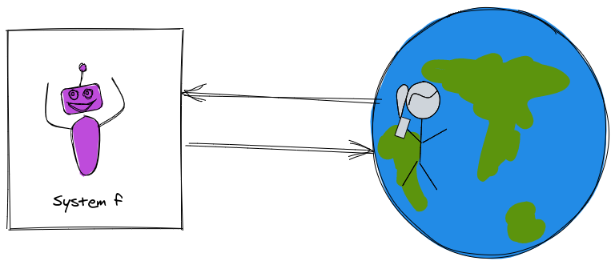
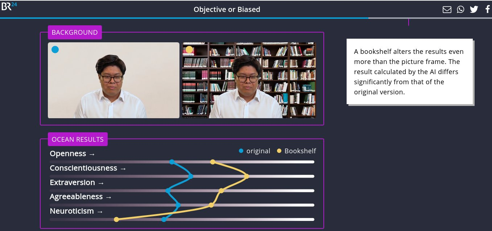

::: {.cell .markdown}

## In this lecture

* What is machine learning?
* Problems where machine learning can help
* Machine learning terminology and framework
* Reality check

:::

::: {.cell .markdown}

## What is machine learning?

::: notes

* To answer this question, I'm going to describe some computer systems that solve a problem. 
* You're going to let me know whether you think I've described a machine learning solution or not.

:::

:::

::: {.cell .markdown}

### Solving problems: example (1) 

::: notes

Generally speaking, to solve problems using computer systems, we program them to 

* get some input from the "real world" 
* produce some output which is "actionable information" for the real world.

{ width=60% }

:::

Suppose we want a system to help students decide whether to enroll in this course or not.

* Input: grades on previous coursework
* Actionable info: predicted ML course grade

:::

::: {.cell .markdown}

### Solving problems: example (2)

Let

* $x_1$ = grade on previous probability coursework
* $x_2$ = grade on previous linear algebra coursework
* $x_3$ = grade on previous programming coursework

and $\hat{y}$ is predicted ML course grade.

::: notes

The "hat" indicates that this is an *estimated* value.

{ width=60% }

:::

:::

::: {.cell .markdown}

### Solving problems: example (3)

Suppose we predict your grade as 

$$\hat{y} = min(x_1, x_2, x_3)$$

Is this ML?

::: notes

{ width=60% }

:::

:::

::: {.cell .markdown}

### Solving problems: example (4)

Suppose we predict your grade as 

$$\hat{y} = w_1 x_1 + w_2 x_2 + w_3 x_3$$

where $w_1 = \frac{1}{4}, w_2 = \frac{1}{4}, w_3 = \frac{1}{2}$.

Is this ML?

::: notes

{ width=60% }

:::

:::

::: {.cell .markdown}

### Solving problems: example (3)

Suppose we predict your grade as the mean of last semester's grades:

$$\hat{y} = w_0$$

where $w_0 = \frac{1}{N} \sum_{i=1}^N y_i$.

Is this ML?

::: notes

{ width=60% }

:::

:::

::: {.cell .markdown}

### Solving problems: example (4)

Suppose we predict your grade using this algorithm:

If $S$ is the set of 3 students from last semester with a profile most similar to yours, predict your grade as the median of their grades:

$$\hat{y} = \underset{y_i \in S}{\mathrm{median}} (y_i) $$

Is this ML?

::: notes

{ width=60% }

:::

:::

::: {.cell .markdown}

### Rule-based vs. data driven problem solving

::: notes

* The first two were examples of *rule-based* problem solving. I used my domain knowledge and expertise to establish rules for solving the problem.
* The second two were examples of *data-driven* problem solving. I still used some of my own expertise to establish rules - for example, the structure of the solution - but I used *data* (and not just data from the current input) to produce the output.

:::

:::

::: {.cell .markdown}

### "Rule-based" problem solving 

1. An algorithm is developed that will produce the desired result for a given input.
2. The algorithm is implemented in code.
3. Input parameters are fed to the implemented algorithm, which outputs a result.

:::

::: {.cell .markdown}

### Problem solving with machine learning

1. Collect and prepare data.
2. Build and train a model using the prepared data.
3. Use the model on new inputs to produce a result as output.

:::

::: {.cell .markdown}
\newpage

## Machine learning problems

::: notes

Now that we understand the difference between rule-based problem solving and ML-based problem solving, which is data driven, we can think about *what types of problems* are best solved with each approach.

:::

:::

::: {.cell .markdown}

### Handwritten digits (1)

{ width=50% }

::: notes

Let's take a classic example: recognizing handwritten digits. Early solutions to this problem date back to the 1960s. 

:::

:::

::: {.cell .markdown}

#### Faces

{ width=50% }

:::

::: {.cell .markdown}

### Good candidate for ML or not?

* Predict volcanic eruptions
* Recommend new products to customers based on past purchases
* Identify spam email
* Grade students' multiple choice quiz answers on NYU Classes
* Grade students' project-based homework

:::

::: {.cell .markdown}

#### Score candidate's performance in a job interview (1)

Is it a good candidate for ML?

* Use video recording as input to ML system
* Train using videos of past interviews + human assessment on key personality features

:::

::: {.cell .markdown}

#### Score candidate's performance in a job interview (2)

Source: [Bayerischer Rundfunk (German Public Broadcasting)](https://web.br.de/interaktiv/ki-bewerbung/en/)

:::

::: notes

What characteristics of a problem make it well-suited to ML or not well-suited to ML?

:::

::: {.cell .markdown}

### Problems that are not well suited to ML

* There is an accurate and simple algorithm that will produce the desired output.
* There is no "good" data available on which to train a model.

:::

::: {.cell .markdown}

### Problems that are good candidates for ML

* Human expertise does not exist or is insufficient (for example, complex medical process that is not fully understood)
* Humans cannot easily explain their expertise (for example, handwritten digit recognition)
* The solution is very specific to particular cases (for example, recommendation systems)

:::

::: {.cell .markdown}

### Why now?

* Statistical foundations have been around for decades
* What's new:
  * Storage
  * Connectivity
  * Computational power

:::

::: {.cell .markdown}

\newpage

## Machine learning terminology

:::

::: {.cell .markdown}

### Machine learning paradigms (1)

**Supervised learning**: learn from labeled data, make predictions

* Continuous target variable: **regression**
* Categorical target variable: **classification**

:::

::: {.cell .markdown}

### Machine learning paradigms (2)

**Unsupervised learning**: learn from unlabeled data, find structure

* Group similar instances: **clustering**
* Compress data while retaining relevant information: **dimensionality reduction**

:::

::: {.cell .markdown}

### Machine learning paradigms (3)

**Reinforcement learning**: learn from how the environment responds to your actions, solve interactive problems

:::

::: {.cell .markdown}

::: {.cell .markdown}

### Simple example, revisited

Earlier, we described four systems to predict a student's grade in the course. 

:::

### The basic supervised learning problem

Given a **sample** with a vector of **features**

$$\mathbf{x} = (x_1, x_2,...)$$

There is some (unknown) relationship between $\mathbf{x}$ and a **target** variable, $y$, whose value is unknown. 

We want to find $\hat{y}$, our **prediction** for the value of $y$.
:::

::: {.cell .markdown}

### A supervised machine learning "recipe"

* Get **data** in some usable **representation** 
* For supervised learning, we need **labeled** examples: $(\mathbf{x_i}, y_i), i=1,2,\cdots,N$
* Select a **model** $f$: $\hat{y} \approx f(x)$
* Select a **loss function** that will measure how good the model is
* If your model has **parameters**, find the parameter values that minimize the loss function (use a **training algorithm**)
* Use model to **predict** $\hat{y}$ for new, unlabeled samples (**inference**)

:::

::: {.cell .markdown}

\newpage

## Your role in the ML process

:::

::: {.cell .markdown}

### ML system via XKCD

{ width=40% }

:::

::: {.cell .markdown}

### The machine learning process

:::

::: {.cell .markdown}

### Challenges in ML design

* Acquiring and preparing data 
* Choosing an appropriate model, and "hyperparameters"
* Designing a system that will *generalize* (not only to "test" data, but also in production)

:::

::: {.cell .markdown}

## Model gap, metric gap, algorithm gap

:::

::: {.cell .markdown}

### The model 

:::

::: {.cell .markdown}

### The metric

* Example: how would you train an ML system to develop new recipes?

:::

::: {.cell .markdown}

### The algorithm

:::