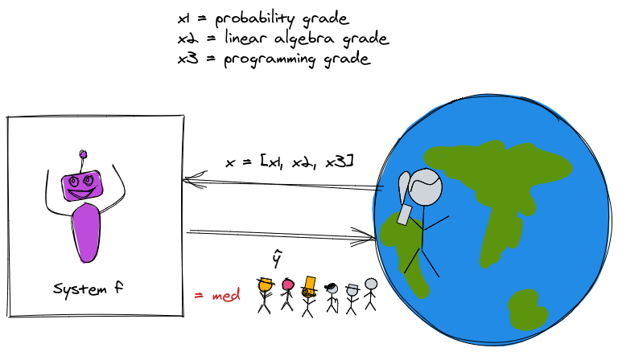
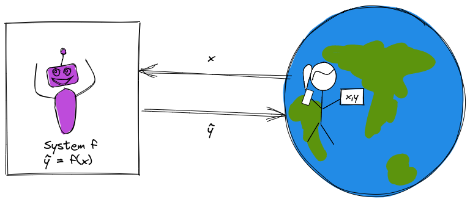
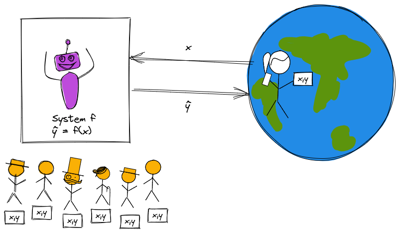

::: {.cell .markdown}

## In this lecture

* What is machine learning?
* Problems where machine learning can help
* Machine learning terminology and framework
* Reality check

:::

::: {.cell .markdown}

## ML via XKCD

{ width=40% }

:::

::: {.cell .markdown}

## What is machine learning?

::: notes

* To answer this question, I'm going to describe some computer systems that solve a problem. 
* You're going to let me know whether you think I've described a machine learning solution or not.

:::

:::

\newpage

::: {.cell .markdown}

### Solving problems: example

::: notes

Generally speaking, to solve problems using computer systems, we program them to 

* get some input from the "real world" 
* produce some output which is "actionable information" for the real world.

{ width=55% }

:::

:::

::: {.cell .markdown}

### Solving problems: example (1) 

Suppose we want a system to help students decide whether to enroll in this course or not.

* Input: grades on previous coursework
* Actionable info: predicted ML course grade

:::

::: {.cell .markdown}

### Solving problems: example (2)

Let

* $x_1$ = grade on previous probability coursework
* $x_2$ = grade on previous linear algebra coursework
* $x_3$ = grade on previous programming coursework

and $\hat{y}$ is predicted ML course grade.

::: notes

The "hat" indicates that this is an *estimated* value.

{ width=55% }

:::

:::

\newpage

::: {.cell .markdown}

### Solving problems: example (3)

Suppose we predict your grade as 

$$\hat{y} = min(x_1, x_2, x_3)$$

Is this ML?

::: notes

{ width=55% }

:::

:::

::: {.cell .markdown}

### Solving problems: example (4)

Suppose we predict your grade as 

$$\hat{y} = w_1 x_1 + w_2 x_2 + w_3 x_3$$

where $w_1 = \frac{1}{4}, w_2 = \frac{1}{4}, w_3 = \frac{1}{2}$.

Is this ML?

::: notes

{ width=55% }

:::

:::

\newpage

::: {.cell .markdown}

### Solving problems: example (5)

Suppose we predict your grade as the mean of last semester's grades:

$$\hat{y} = w_0$$

where $w_0 = \frac{1}{N} \sum_{i=1}^N y_i$.

Is this ML?

::: notes

{ width=55% }

:::

:::

::: {.cell .markdown}

### Solving problems: example (6)

Suppose we predict your grade using this algorithm:

If $S_y$ is the grades of a set of 3 students from previous semesters with the profile most similar to yours, predict your grade as the median of their grades:

$$\hat{y} = \mathrm{median} (S_y) $$

Is this ML?

::: notes

{ width=55% }

:::

:::

\newpage

::: {.cell .markdown}

### "Rule-based" problem solving 

1. Develop an algorithm that will produce the desired result for a given input.
2. Implement the algorithm.
3. Feed input to the implemented algorithm, which outputs a result.

:::

::: {.cell .markdown}

### Problem solving with machine learning

1. Collect and prepare data.
2. Build and train a model using the prepared data.
3. Use the model on new inputs to produce a result as output.

:::

::: {.cell .markdown}

### Rule-based vs. data driven problem solving

::: notes

* The first two were examples of *rule-based* problem solving. I used my domain knowledge and expertise to establish rules for solving the problem.
* The second two were examples of *data-driven* problem solving. I still used some of my own expertise to establish rules - for example, the structure of the solution - but I used *data* (and not just data from the current input) to produce the output.

What are some benefits of predicting course grade using the data-driven approach?

* it's easy to update with more experience or if the "world" changes. For example: 
  * if over time the quality of admitted students goes up and I give higher grades, the system that predicts the mean of last semester's scores will "track" with that.
  * if I didn't have many students with poor programming background the first semester, but I do the second semester, I will be able to predict their performance better in subsequent semesters.
:::

:::

::: {.cell .markdown}

## Machine learning problems

::: notes

Now that we understand the difference between rule-based problem solving and ML-based problem solving, which is data driven, we can think about *what types of problems* are best solved with each approach.

:::

:::

::: {.cell .markdown}

### Recognize handwritten digits 

{ width=50% }

::: notes

You read or will read some notes on a 1964 attempt to solve this problem. Was that attempt using ML, or was it rule-driven? Would this be a good candidate for ML? Why or why not?

Are there any important reasons *not* to use ML for this?

:::

:::

\newpage

::: {.cell .markdown}

### Autonomous driving control (1)

{ width=50% }

::: notes

What makes this problem a good/bad candidate for ML? Are there reasons *not* to use ML for this?

* Much too complex to program a rule-based system for autonomous driving.
* ML may not generalize to "weird" situations as well as a *human* driver would. See e.g. [Autonomous Vehicles vs. Kangaroos: the Long Furry Tail of Unlikely Events](https://spectrum.ieee.org/cars-that-think/transportation/self-driving/autonomous-cars-vs-kangaroos-the-long-furry-tail-of-unlikely-events) in IEEE Spectrum.
* ML may be "tricked" by certain attacks that wouldn't affect *human* drivers. See e.g. [Slight Street Sign Modifications Can Completely Fool Machine Learning Algorithms](https://spectrum.ieee.org/cars-that-think/transportation/sensors/slight-street-sign-modifications-can-fool-machine-learning-algorithms) and [Three Small Stickers in Intersection Can Cause Tesla Autopilot to Swerve Into Wrong Lane
](https://spectrum.ieee.org/cars-that-think/transportation/self-driving/three-small-stickers-on-road-can-steer-tesla-autopilot-into-oncoming-lane) in IEEE Spectrum.

:::

:::

::: {.cell .markdown}

### Autonomous driving control (2)

{ width=40% }

:::

\newpage 

::: {.cell .markdown}

### Grading students' essays (1)

.](../images/1-essay-score.png){width=70%}

::: notes

Are there reasons not to use ML here?

* ML may not be explainable or auditable.
* ML may perpetuate and/or exacerbate bias in the training data. See [Flawed Algorithms Are Grading Millions of Students’ Essays](https://www.vice.com/en/article/pa7dj9/flawed-algorithms-are-grading-millions-of-students-essays) in Mother board by Vice. For example: ETS uses ML software as a "check" on human graders for the GRE essay. But its system overscores students from mainland China (by about 1.3/6 points relative to human scorers) and underscores African Americans (by about 0.8/6 points) and other groups.

:::

:::

::: {.cell .markdown}

### Grading students' essays (2)
{width=70%}

:::

\newpage

::: {.cell .markdown}

### Score candidate's performance in a job interview (1)

::: notes

* Use video recording as input to ML system
* Train using videos of past interviews + human assessment on key personality features
* Do you think the video (not audio) of your interview is a good predictor of how you will perform the job?

:::

 by artist Carrie Sijia Wang.](../images/1-alex-interview.jpg){ width=50% }

:::

::: {.cell .markdown}

### Score candidate's performance in a job interview (2)

](../images/1-intro-job-interview.jpeg){ width=60% }

::: notes

* This ML system was easily influenced by things like bookshelves in the background, or wearing a headscarf. 
* The company that makes the scoring system said: "Just like in a normal job interview, these factors are taken into account for the assessment. However, that does not happen on demand. There’s no pressure, that can appear in talking to real people." Is this a satisfactory answer?
* See the report by [Bayerischer Rundfunk (German Public Broadcasting)](https://web.br.de/interaktiv/ki-bewerbung/en/).

:::

:::

\newpage

::: {.cell .markdown}

### Determine severity of injury from knee X-ray (1)

](../images/1-knee-xray.jpeg){ width=35% }

:::

::: {.cell .markdown}

### Determine severity of injury from knee X-ray (2)

* Among patients with a similar X-ray "score" (from expert), Black patients tend to have more pain.
* What if radiologists may miss some sources of pain? (Medical science often comes from very limited study populations.)

:::

::: {.cell .markdown}

### Determine severity of injury from knee X-ray (3)

* This algorithm was trained to predict patient pain, rather than radiologist's score.
* Reduced "pain disparity" by 43% (does  a better job than radiologists of finding things that "hurt", especially in Black knees!)

:::

::: {.cell .markdown}

### What problems are "good" for ML, overall?

:::

::: {.cell .markdown}

### Problems that may not be well suited to ML

* There is an accurate and simple algorithm that will produce the desired output.
* There is no "good" data available to train the model.
* The model can be "tricked", with potentially severe consequences.
* Need to audit or explain the output.

:::

::: {.cell .markdown}

### Problems that are often good candidates for ML

* Human expertise does not exist or is insufficient
* Humans cannot easily explain their expertise 
* The solution is very specific to particular cases
* It is useful to know answer *and* degree of certainty
* We will get more data during operation + can improve with experience

:::

\newpage

::: {.cell .markdown}

### Why now?

* Statistical foundations are around for decades
* What's new:
  * Storage + Connectivity
  * Computational power

:::

::: {.cell .markdown}

## Machine learning basics

:::

::: {.cell .markdown}

### Goal of a machine learning system

Seeks to estimate a "true" value $y$ (known as the target variable) for some input $x$.

::: notes

{width=60%}

:::

:::

::: {.cell .markdown}

### Machine learning paradigms (1)

**Supervised learning**: learn from labeled data, make predictions. 

* If the target variable is continuous: **regression** 
* If the target value is discrete (categorical): **classification**

::: notes

{ width=60% }

:::

:::

\newpage

::: {.cell .markdown}

### Machine learning paradigms (2)

**Unsupervised learning**: learn from unlabeled data, find structure

* Group similar instances: **clustering**
* Compress data while retaining relevant information: **dimensionality reduction**

::: notes

{ width=60% }

:::

:::

::: {.cell .markdown}

### Machine learning paradigms (3)

**Reinforcement learning**: learn from how the environment responds to your actions, solve interactive problems.

::: notes

{ width=60% }

:::

:::

\newpage

::: {.cell .markdown}

### The basic supervised learning problem

Given a **sample** with a vector of **features**

$$\mathbf{x} = (x_1, x_2,...)$$

There is some (unknown) relationship between $\mathbf{x}$ and a **target** variable, $y$, whose value is unknown. 

We want to find $\hat{y}$, our **prediction** for the value of $y$.
:::

::: {.cell .markdown}

### A supervised machine learning "recipe" (1)

* *Step 1*: Get (good) **data** in some usable **representation**.

For supervised learning, we need **labeled** examples: $(\mathbf{x_i}, y_i), i=1,2,\cdots,N$.

:::

::: {.cell .markdown}

### A supervised machine learning "recipe" (2)

* *Step 2*: Choose a candidate **model** $f$: $\hat{y} = f(x)$.

* *Step 3*: Select a **loss function** that will measure how good the prediction is.

* *Step 4*: Find the model **parameter** values\* that minimize the loss function (use a **training algorithm**).

<small>\* If your model has parameters.</small>

:::

::: {.cell .markdown}

### A supervised machine learning "recipe" (3)

* *Step 5*: Use trained model to **predict** $\hat{y}$ for new samples not used in training (**inference**).

* *Step 6*: Evaluate how well your model **generalizes** to this new, unseen data.

:::

\newpage

::: {.cell .markdown}

### Simple example, revisited

::: notes

{ width=55% }

{ width=55% }

:::

:::

\newpage

::: {.cell .markdown}

## Reality check

:::

::: {.cell .markdown}

### ML as a "leaky pipeline"

](../images/1-wot-leaky-pipelines.png){ width=70% }

::: notes

> We want to create an adaptive system that performs well in the wild, but to do so, we:
> 
> * Set up a benchmark task, so we have some way to compare different systems.
> * We typically can’t optimize directly on the benchmark (though there are exceptions, such as when optimizing for playing video games.) Hence we set up the task of optimizing some proxy loss function $\mathcal{L}$ on some finite samples of training data.
> * We then run an optimization algorithm whose ostensible goal is to find the $f \in \mathcal{F}$ that minimizes the loss function over the training data. ($\mathcal{F}$ is a set of models, sometimes known as architecture, and sometimes we also add other restrictions such norms of weights, which is known as regularization)
> 
> All these steps are typically "leaky". Test performance on benchmarks is not the same as real-world performance. Minimizing the loss over the training set is not the same as test performance. Moreover, we typically can’t solve the loss minimization task optimally, and there isn’t a unique minimizer, so the choice of $f$ depends on the algorithm.

Quotes from: [Boaz Barak](https://windowsontheory.org/2021/01/31/a-blitz-through-classical-statistical-learning-theory/)

:::

:::
