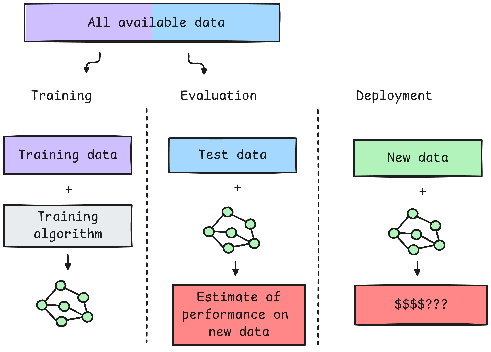
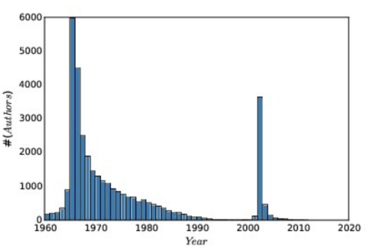
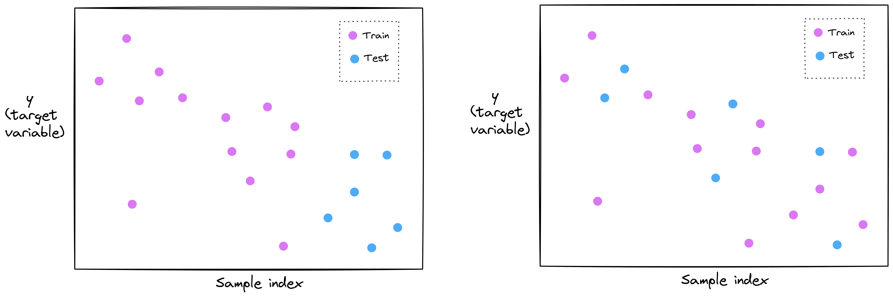
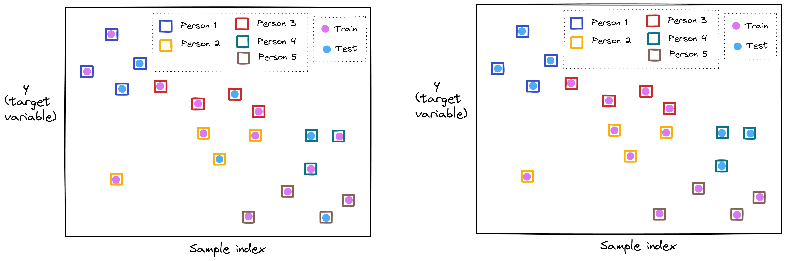
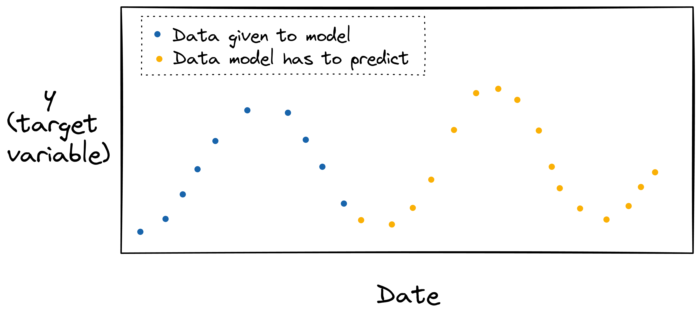
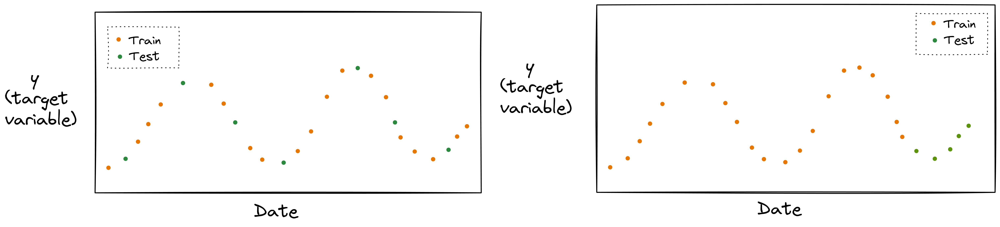

\newpage

## Recap: Machine learning is data driven

::: notes

* Rules based: you can write rules to produce an output using only the current input.
* Data driven: to produce an output/write rules to produce an output, you need to use *other data samples* besides for the current input. 

For example, we introduced *prediction by mean* as the simplest data-driven "model".

If we select a model class where we make the same prediction, $w$, for every sample:

$$\hat{y} = w$$

and we use a mean squared error loss function, where we want to minimize:

$$\frac{1}{N} \sum (y-\hat{y})^2$$

we can show that the optimal value of the parameter $w$, is the mean of $y$ across all samples.

Step 1: plug $\hat{y} = w$ into the loss function: 

$$ \operatorname*{minimize}\quad \frac{1}{N} \sum (y-\hat{y})^2 \to \operatorname*{minimize}\quad \frac{1}{N} \sum (y-w)^2 $$

Step 2: take the derivative with respect to the parameter $w$

$$ \frac{\partial}{\partial w} \frac{1}{N} \sum (y-w)^2 = -\frac{2}{N} \sum (y-w) $$

Step 3: set the derivative equal to 0, and solve for the parameter $w$

$$
\begin{aligned}
-\frac{2}{N} \sum (y-w) &= 0
    && \text{Set the derivative equal to zero} \\[6pt]
\sum(y) - \sum(w) &= 0
    && \text{Multiply by } -\frac{N}{2} \text{ and expand} \\[6pt]
\sum(y) = \sum(w) &= N w
    && \text{Sum the constant } w \text{ over } N \text{ samples} \\[6pt]
\to w &= \frac{1}{N} \sum(y)
    && \text{Solve for } w
\end{aligned}
$$

:::

### Garbage in, garbage out

::: notes

Any machine learning project has to start with "good"" data.

There is a "garbage in, garbage out" rule: If you use "garbage" to train a machine learning model, you will only get "garbage" out. 

And: Since you are evaluating on the same data, you might not even realize it is "garbage" at first! You may not realize until the model is already deployed in production! This is the absolute worst case scenario, as illustrated below...

:::

\newpage

### Model training vs evaluation vs deployment 

{ width=60%}

::: notes

We want to understand how the model will behave in *deployment* as early as possible (before investing too much time, effort, money in a model that won't do well).

:::

### {#train-vs-eval-2 .unlisted data-menu-title="Model training vs evaluation vs deployment (2)"}

| Training Accuracy | Evaluation Accuracy | Deployment Accuracy | Outcome |
|-------------------|---------------------|---------------------|---------|
| 0.95              | 0.93                | 0.91                | 🤩      |
| 0.55              | 0.52                | N/A                 | 😐      |
| 0.95              | 0.93                | 0.51                | 😱      |

::: notes

* Best case: Model does well in evaluation, and deployment
* Second best case: Model does poorly in evaluation, is not deployed
* Worst case: Model does well in evaluation, poorly in deployment ("overly optimistic evaluation")

When preparing to work with data, then, we have to think about both of the ways in which our data will be used:

* to *model* a relationship between $\hat{y} = f(x)$. This stage is designed to optimize the training objective, *on the training data*. 
* and then to *evaluate* the model $f(x)$, to see how well $\hat{y}$ agrees with $y$. We evaluate on a separate held-out test set not used in training. (It's typical for the performance to be slightly worse on the test set, since the model is optimized on the training set!) 

The goal of the evaluation is to estimate how the model will perform in deployment, which is what we *really* care about and want to optimize. 

We need to make sure that we have suitable data for *both* purposes.

:::

\newpage

## Working with data: two stages

1. Is this data appropriate for the task?
2. How should I prepare it for modeling?

## Stage 1: Is this data appropriate for the task?

### Legal and ethical concerns

* **Consent:** Did people agree to this data being collected and used for this purpose?
* **Privacy:** Could the data identify people or reveal sensitive information? 
* **Copyright:** Do we have the right to use, modify, and redistribute the data?
* **Bias/fairness:** Could it produce unequal outcomes?

:::notes

Before we ask whether a dataset is useful, we need to ask whether we legally may or ethically should use it at all. Otherwise we risk expensive lawsuits, or being shut down by regulators. 

Here is one example of a failure related to each concern:

* **Consent:** Everalbum used customers' photos to develop facial recognition technology without obtaining permission. In [2021](https://www.ftc.gov/news-events/news/press-releases/2021/01/california-company-settles-ftc-allegations-it-deceived-consumers-about-use-facial-recognition-photo), the FTC required the company to delete the photos and facial recognition models.
* **Privacy:** OkCupid operated a dating platform whose users shared sensitive information, including sexual orientation, location, and personal responses. An individual scraped about 70,000 profiles and published the data without users' consent, making people vulnerable to identification even if their names were removed. In [2016](https://www.vice.com/en/article/70000-okcupid-users-just-had-their-data-published/), the disclosure triggered public backlash and forced the dataset offline.
* **Copyright:** Stability AI used millions of Getty images to train Stable Diffusion without permission, according to Getty Images. In [2023](https://arstechnica.com/tech-policy/2023/04/stable-diffusion-copyright-lawsuits-could-be-a-legal-earthquake-for-ai/), Getty sued Stability AI, which faced costly copyright litigation in the United States and United Kingdom.
* **Bias/fairness:** Facebook used a machine learning ad delivery system to optimize who received housing ads, and the system let advertisers exclude people based on protected characteristics. In [2019](https://www.propublica.org/article/facebook-advertising-discrimination-housing-race-sex-national-origin), HUD charged Facebook with violating the Fair Housing Act; Meta later agreed to restrict housing ad targeting and change its delivery system.

::: {.handout-only}

and some citations/further reading:

* Marin Benčević, Marija Habijan, Irena Galić, Danilo Babin, Aleksandra Pižurica, Understanding skin color bias in deep learning-based skin lesion segmentation, Computer Methods and Programs in Biomedicine, Volume 245, 2024, [https://doi.org/10.1016/j.cmpb.2024.108044](https://doi.org/10.1016/j.cmpb.2024.108044)
* Ziad Obermeyer, Brian Powers, Christine Vogeli, Sendhil Mullainathan, Dissecting racial bias in an algorithm used to manage the health of populations, Science, Volume 366, Issue 6464, 2019, pp. 447–453, [https://doi.org/10.1126/science.aax2342](https://doi.org/10.1126/science.aax2342)
* Shirin Ghaffary, The algorithms that detect hate speech online are biased against black people, Vox, August 15, 2019, [https://www.vox.com/recode/2019/8/15/20806384/social-media-hate-speech-bias-black-african-american-facebook-twitter](https://www.vox.com/recode/2019/8/15/20806384/social-media-hate-speech-bias-black-african-american-facebook-twitter)
* Benj Edwards, Artist finds private medical record photos in popular AI training data set, Ars Technica, September 21, 2022, [https://arstechnica.com/information-technology/2022/09/artist-finds-private-medical-record-photos-in-popular-ai-training-data-set/](https://arstechnica.com/information-technology/2022/09/artist-finds-private-medical-record-photos-in-popular-ai-training-data-set/)
* Joseph Cox, "70,000 OkCupid Users Just Had Their Data Published," Vice, May 12, 2016. [https://www.vice.com/en/article/70000-okcupid-users-just-had-their-data-published/](https://www.vice.com/en/article/70000-okcupid-users-just-had-their-data-published/)
* Geoffrey A. Fowler, Millions of people uploaded photos to the Ever app. Then the company used them to develop facial recognition technology, NBC News, May 9, 2019. [https://www.nbcnews.com/tech/security/millions-people-uploaded-photos-ever-app-then-company-used-them-n1003371](https://www.nbcnews.com/tech/security/millions-people-uploaded-photos-ever-app-then-company-used-them-n1003371)
* David Meyer, Amazon reportedly killed an AI recruitment system because it couldn't stop the tool from discriminating against women, Fortune via Yahoo Finance, October 10, 2018. [https://finance.yahoo.com/news/amazon-reportedly-killed-ai-recruitment-100042269.html](https://finance.yahoo.com/news/amazon-reportedly-killed-ai-recruitment-100042269.html)
<!-- * Timothy B. Lee, Stable Diffusion copyright lawsuits could be a legal earthquake for AI, Ars Technica, April 3, 2023, [https://arstechnica.com/tech-policy/2023/04/stable-diffusion-copyright-lawsuits-could-be-a-legal-earthquake-for-ai/](https://arstechnica.com/tech-policy/2023/04/stable-diffusion-copyright-lawsuits-could-be-a-legal-earthquake-for-ai/) -->

:::

:::

\newpage

### Representativeness concerns

Is the data similar to deployment setting in:

* **Population:** Do the people, places, or objects in the data match the population where the model will be used?
* **Context/setting:** Does the location and data collection environment match where the model will be used?
* **Time period:** Does the data reflect the period when the model will make predictions?
* **Label balance:** Is the distribution of the target  similar to what the model will encounter?

:::notes

Representativeness affects both **modeling** and **evaluation**:

* During modeling, the model learns patterns from the population, setting, time period, and class proportions in the training data. 
* During evaluation, those same factors determine whether the test score predicts performance after deployment. A model can receive a high score on a test set that does not resemble the real deployment population.

Here are some examples from practice:

* **Population:** The [Framingham cardiovascular risk score](https://jamanetwork.com/journals/jama/fullarticle/193997) was designed to estimate a patient's ten-year risk of coronary heart disease from factors such as age, sex, blood pressure, cholesterol, and smoking. Researchers trained it using data from the mostly white residents of Framingham, Massachusetts. When clinicians applied the score to other ethnic groups, its accuracy varied because those populations had different risk patterns. A model can therefore learn relationships that work for the training population but misestimate risk for people outside it.
* **Context/setting:** [Google Health's deep learning system](https://research.google/pubs/a-human-centered-evaluation-of-a-deep-learning-system-deployed-in-clinics-for-the-detection-of-diabetic-retinopathy/) for detecting diabetic retinopathy from retinal photographs was deployed in clinics in Thailand. The system performed well under controlled evaluation conditions, but clinics used different lighting, camera conditions, and patient preparation practices, such as whether patients' pupils were dilated. In the first six months, 21% of 1,838 images were judged ungradable because they failed the model's quality requirements. The result showed how changes between development and deployment environments can reduce the practical reliability of an image classification system.
* **Time period:** [Google Flu Trends](https://www.wired.com/2015/10/can-learn-epic-failure-google-flu-trends/) was designed to estimate flu prevalence faster than official health reports by using patterns in Google searches. Google trained and calibrated the system against historical CDC flu data and search queries. After deployment, it overestimated flu cases, especially during the 2012-2013 flu season, because media coverage changed search behavior and Google changed its search system. The search patterns changed over time, so the model's original relationship between searches and flu cases no longer held.
* **Label balance:** An AI writing detector is designed to classify text as human written or AI generated. [Turnitin's detector](https://www.theverge.com/2023/4/5/23669796/turnitin-ai-writing-detection-false-positives) was trained on examples of both types of writing, but the true proportion of AI generated text in student submissions was not known and would not necessarily match the training proportion. When a rare class appears much more often in training or evaluation than it does in deployment, the reported error rates can mislead users. After deployment, the detector produced false positives on human writing.

::: {.handout-only}

and some citations/further reading:

* Ralph B. D’Agostino, Scott Grundy, Lisa M. Sullivan, Peter Wilson, Validation of the Framingham Coronary Heart Disease prediction scores: results of a multiple ethnic groups investigation, JAMA, Volume 286, Issue 2, 2001, pp. 180–187, [https://jamanetwork.com/journals/jama/fullarticle/193997](https://jamanetwork.com/journals/jama/fullarticle/193997)
* Carrie J. Beede et al., A Human-Centered Evaluation of a Deep Learning System Deployed in Clinics for the Detection of Diabetic Retinopathy, CHI 2020, [https://doi.org/10.1145/3313831.3376718](https://doi.org/10.1145/3313831.3376718)
* C. Galen, R. Steele, Evaluating Performance Maintenance and Deterioration Over Time of Machine Learning-based Malware Detection Models on the EMBER PE Dataset, 2020 Seventh International Conference on Social Networks Analysis, Management and Security (SNAMS), Paris, France, 2020, pp. 1–7, [https://doi.org/10.1109/SNAMS52053.2020.9336538](https://doi.org/10.1109/SNAMS52053.2020.9336538)

<!-- 
* **Data is not representative of your target situation**. For example, you are training a model to predict the spread of infectious disease for a New York City health startup, but you are using data from another country.
* **Data or situation changes over time**. For example, imagine you train a machine learning model to classify loan applications. However, if the economy changes, applicants that were previously considered creditworthy might not be anymore despite having the same income, as the lender becomes more risk averse. Similarly, if wages increase across the board, the income standard for a loan would increase.
-->

::: 

:::

### Predictive feature concerns

Before modeling, ask:

* **Plausible signal:** Is there a defensible reason this should predict the target?
* **Artifacts and proxies:** Could the model use an accidental artifact?

::: notes

Here are some examples from practice:

* **Plausible signal:** Researchers trained machine-learning models to infer personality traits from handwriting in a [2023 study](https://doi.org/10.1155/2023/1249004) and reported accuracies above 99%, despite controlled studies finding that graphology does not reliably measure personality ([Dazzi & Pedrabissi, 2009](https://doi.org/10.2466/PR0.105.F.1255-1268); [Neter & Ben-Shakhar, 1989](https://doi.org/10.1016/0191-8869(89)90120-7)). (The problem was that the researchers did not obtain independent personality measurements: they generated the personality labels from graphology rules based on the same handwriting features given to the model. The model therefore learned to reproduce those rules, not to predict actual personality.)
* **Artifacts and proxies:** During the COVID-19 pandemic, researchers trained chest X-ray models to distinguish COVID-19 pneumonia from other conditions. In some datasets, COVID-19 images came from different hospitals, scanners, or image acquisition protocols than the control images, allowing the model to learn hospital and equipment artifacts instead of disease related features. The models could score well on internal test sets that shared those artifacts but perform poorly on images from new hospitals. This failure is documented in [Common pitfalls and recommendations for using machine learning to detect and prognosticate for COVID-19](https://doi.org/10.1038/s42256-021-00307-0).

::: {.handout-only}

and for citations/further reading, many more examples appear in:

* Mel Andrews, Andrew Smart, Abeba Birhane, The reanimation of pseudoscience in machine learning and its ethical repercussions, Nature Machine Intelligence, Volume 5, Issue 9, 2024, Article 101027, [https://doi.org/10.1016/j.patter.2024.101027](https://doi.org/10.1016/j.patter.2024.101027)

:::

:::

\newpage

### Example: distinguish real headshots from AI generated headshots.

:::notes

Suppose a career networking platform wants to enforce a "real photos only" policy. Engineers create a dataset from a [real face recognition dataset](https://people.cs.umass.edu/~elm/papers/Huang_eccv2008-lfw.pdf), and fake headshots generated by an AI model.

The model achieves excellent test accuracy but fails in production.  Looking at the data, we can see why:

:::

### {#headshot-authenticity .unlisted data-menu-title="Headshot authenticity"}

| "Real" training image | Real deployment image |
|:---:|:---:|
| { width=60% } | { width=60% } |

:::notes

The "real" images in its training and test sets were cropped from candid photographs, while the generated images looked like posed studio headshots. The model could learn candid versus studio cues, including lighting, framing, and background, instead of real versus synthetic cues. This is an example of an "accidental artifact".

This is a "Frankenstein dataset": the label is correlated with the source dataset. Holding out samples from the same sources does not reveal the problem. In production, real profile photographs are also professional headshots, so the shortcut disappears.

:::

### {#headshots-change-over-time .unlisted data-menu-title="Headshots change over time"}

| Earlier generator | Newer generator |
|:---:|:---:|
| { height=200px } | { height=200px } |

:::notes

Even after collecting real studio style headshots, the fake image distribution changes over time. A detector trained on images from an earlier generator may fail as newer generators produce more photorealistic portraits. This is an example of a "representativeness" concern.

The training data must reflect the model's current deployment period. This dataset would need frequent updates and evaluation on images from generators not used for training.

:::

\newpage

### Other data quality concerns

* Label error
* Other data entry error
* Inconsistent units/formats
* Missing data

::: notes

Some examples of data quality failures:

* You train a content classification model on a human-labeled dataset of 58K Reddit comments categorized according to 27 emotions. But up to 30% of the data is mislabeled, possibly because the annotators were shown text without context, did not understand slang or sarcasm, were unfamiliar with political or pop culture references, or just rushed through the job. For example, the sentence: "Really? Wow. You’re either hopelessly ignorant or you’re trolling. For your sake, I hope you’re trolling" is mislabeled as OPTIMISM.
* You train a ride hailing demand prediction model on GPS data from mobile phones. Some trips contain corrupted coordinates, such as a location recorded in the middle of the ocean (see: [Null Island](https://www.youtube.com/watch?v=bjvIpI-1w84)) or a misplaced decimal point showing a car moving 3,000 km in a minute. The model treats these entries as real trips, introducing noise and spurious patterns.
* You combine clinical datasets from multiple hospitals, but one site records lab results in mg/dL while another uses mmol/L. Your model makes nonsensical predictions.  

::: {.handout-only}

Citations/further reading:

* Curtis G. Northcutt. Pervasive Label Errors in ML Datasets Destabilize Benchmarks. Blog post, March 29, 2021. [https://l7.curtisnorthcutt.com/label-errors](https://l7.curtisnorthcutt.com/label-errors  )
* Curtis G. Northcutt, Anish Athalye, Jonas Mueller. Pervasive Label Errors in Test Sets Destabilize Machine Learning Benchmarks. In Advances in Neural Information Processing Systems (NeurIPS 2021). [https://neurips.cc/virtual/2021/47102](https://neurips.cc/virtual/2021/47102)
* Surge AI, 30 Percent of Google's Reddit Emotions Dataset Is Mislabeled. [https://surgehq.ai/blog/30-percent-of-googles-reddit-emotions-dataset-is-mislabeled](https://surgehq.ai/blog/30-percent-of-googles-reddit-emotions-dataset-is-mislabeled)
* Brown, S. J., Goetzmann, W. N., Ibbotson, R. G., & Ross, S. A. Survivorship bias in performance studies. The Review of Financial Studies, 5(4), 553–580 (1992). [https://doi.org/10.1093/rfs/5.4.553 ](https://doi.org/10.1093/rfs/5.4.553 ) 

:::

:::

## Stage 2: How do I process the data?

* Explore data, make and check assumptions
* Split data (avoid data leakage)
* Select features, target
* Construct samples
* Handle missing data
* Convert to numeric types
* Create "transformed" features

### Make and check assumptions

::: notes

It's always a good idea to "sanity check" your data. Before you look at it, think about what you expect to see. Review the data dictionary, and any documentation related to how the dataset was compiled. 

Then, check to make sure your expectations are realized.

* Look at individual samples - aggregate trends can hide important details!
* Generate and look at plots of data distributions
* Compute summary statistics
* and consider general trends

:::

<!-- 
::: {.grad-only}

### Example: author citation data (1)

Data analysis: use PubMed, and identify the year of first publication for the 100,000 most cited authors.

::: notes

What are our expectations about what this should look like?

:::

### Example: author citation data (2)

{ width=50% }

::: notes

We can think of many potential explanations for this pattern, even though it is actually a data artifact.

The true explanation: in 2002, PubMed started using full first names in authors instead of just initials. The same author is represented in the dataset as a "new" author with a first date of publication in 2002.

:::

\newpage

### Example: author citation data (3)

.](../images/1-pubmed-authors2.png){ width=50% }

:::notes

How *should* you handle unreasonable values, data that does not match expectations, or "outliers"? It depends!

* e.g. suppose in a dataset of voter information, some have an impossible year of birth that would make the voter over 120 years old. (The reason: Voters with no known DOB, who registered before DOB was required, are often encoded with a January 1900 DOB.)
* **not** a good idea to just remove outliers unless you are sure they are a data entry error or otherwise not a "true" value.
* Even if an outlier is due to some sort of error, if you remove them, you may skew the dataset (as in the 1/1/1900 voters example).

Consider the possibility of: 

* Different units, time zones, etc. in different rows
* Same value represented several different ways (e.g. names, dates)
* Missing data encoded as zero

:::

:::

-->

\newpage

### Split data

:::notes

If we split data incorrectly, we can introduce *data leakage*, which causes an *overly optimistic evaluation*. Data leakage happens when information that would not be available in the real deployment setting "leaks" into the training or evaluation process, and makes the evaluation much "easier" than the real deployment task. We said earlier how important it is to avoid that!

The basic idea behind data splitting is the relationship between the training set and the evaluation set, should be the same as the relationship between the training set and the data we will see in deployment.

* if there is no structure in the data - shuffle split (avoid accidental patterns)
* if there is group structure - use a split that keeps members of each group in either training set, or validation set, but not both
* for time series data - use a split that keeps validation data in the future, relative to training data

In the following example, if we put the first samples in the training set and the last samples in the test set, we would accidentally create a distribution shift between training and test data, since there seems to be some order effect. For this data, we should randomly select samples to put in the test data - this is called a shuffle split.

{ width=100% }

In the next example, suppose we have multiple samples from the same individual. 

{ width=100% }

In this case, the correct approach depends on how the model will be deployed:

\newpage

* if the model will be asked to make predictions on new samples from the same people as in the training set, then the shuffle split is still OK! Here the evaluation task is to predict new samples from the people in the training set, which is the same as the deployment task.
* if, however, the model will be asked to make predictions for *new people* not in the training set, then the shuffle split will cause an overly optimistic evaluation. Predicting new samples from the people in the training set is an *easier* task than the deployment task! In this case, we must split the data so that each individual person is either in the training set, or in the test set.

In the next example, suppose we have a time sequence, and we want to predict a value that changes gradually over time, given the previous sequence:

{ width=50% }

In this case, a shuffle split (like the example on the left) will cause data leakage/an overly optimistic evaluation, because this makes the evaluation task much easier than the deployment task! Instead, we need to split the data chronologically (like the example on the right) to mimic the deployment task.

{ width=100% }

:::

<!-- 

### COVID-19 chest radiography 

* **Problem**: diagnose COVID-19 from chest radiography images
* **Input**: image of chest X-ray (or other radiography)
* **Target variable**: COVID or no COVID

### COVID-19 chest radiography (2)

](../images/1-covid-xrays.png){ width=60% }

::: notes

Between January and October 2020, more than 2000 papers were published that claimed to use machine learning to diagnose COVID-19 patients based on chest X-rays or other radiography. But a later [review](https://www.nature.com/articles/s42256-021-00307-0) found that "none of the models identified are of potential clinical use due to methodological flaws and/or underlying biases".

To train these models, people used an emerging COVID-19 chest X-ray dataset, along with one or more existing chest X-ray datasets, for example a dataset used to classify viral versus bacterial pneumonia.

The problem is that the chest X-rays for each dataset were so "distinctive" to that dataset, that a neural network could be trained with high accuracy to classify an image into its source dataset, even without the lungs showing!

:::

### COVID-19 chest radiography (2)

Findings:

* some control datasets contained pediatric images, while COVID images were from adults
* there were dataset-level differences in patient positioning
* many COVID images came from screenshots of published papers, which often had text, arrows, or other annotations over the images. (Some non-COVID images did, too.)

### COVID-19 chest radiography (3)

](../images/1-covid-xrays-saliency.png){ width=90% }

::: notes

These findings are based on techniques like 

* saliency maps, where the model is made to highlight the part of the image (the pixels) that it considered most relevant to its decision.
* using generative models and asking it to take a COVID-negative X-ray and make it positive (or v.v.)

Many of the findings are not easy to understand without domain knowledge (e.g. knowing what part of the X-ray *should* be important and what part should not be.) For example: should the diaphragm area be helpful?

:::

<!-- 

https://www.nature.com/articles/s41559-023-02162-1  Data leakage jeopardizes ecological applications of machine learning

https://www.nature.com/articles/s41467-024-46150-w Data leakage inflates prediction performance in connectome-based machine learning models

https://www.nature.com/articles/s41592-024-02362-y Guiding questions to avoid data leakage in biological machine learning applications

-->

\newpage

<!-- 
• Convert to numeric types
• Create “transformed” features
• Explore data, make and check assumptions
• Handle missing data

-->

### Select features

Include features if they are:

* Plausibly predictive
* Available at inference time
* Don't have other major issues

::: notes

We must *exclude* fields in the data that have no plausible relationship to the target variable:

* A machine learning model will find "patterns" even if the feature data is not really related to the target variable! It will find "spurious" relationships. That can potentially be much worse than if there was no ML model at all.
* In many cases, there will be fields in the data that you shouldn't use, e.g. you won't use someone's phone number or home address to predict their Intro ML course grade.
* Always exclude fields that are purely identifiers (e.g. a numeric identifier for a sample).

We also must *exclude* fields in the data that are not going to be available to our model when it is deployed for "real":

* Example: You build a model to help decide which applicants should be approved for loans. In the training dataset, you accidentally include fields such as "number of late payments," which are only known after the loan has already been issued. By training on them, the model looks impressively accurate during evaluation, but in deployment those features are unavailable, so the model cannot make real world predictions.

Including fields that won't be available in deployment is also a type of data leakage/causes an overly optimistic evaluation. The evaluation task, where the extra feature is available, is "easier" than the deployment task where the feature is not available.

:::

### Select target

Target should be: 

* measureable
* available
* correct

:::notes

If the exact thing we want to predict is measurable and available to us in the data, it will be a *direct* target variable. Sometimes, however, the thing we want to predict is not measurable or available.  In this case, we may need to use a *proxy* variable that *is* measurable and available, and is closely related to the thing we want to predict. (The results will only be as good as the relationship between the thing we want to predict, and the proxy!)

Example: You want to predict a patient’s illness severity in order to allocate extra care resources. But severity itself is not directly measurable in your dataset. Instead, you use past healthcare costs as a proxy variable, assuming that sicker patients generate higher costs. (In practice, this systematically underestimates the needs of disadvantaged groups who historically have had less access to care. The model appears accurate against the proxy, but fails against the true target.)

Citation: Ziad Obermeyer, Brian Powers, Christine Vogeli, Sendhil Mullainathan, Dissecting racial bias in an algorithm used to manage the health of populations, Science, Volume 366, Issue 6464, 2019, pp. 447–453, [https://doi.org/10.1126/science.aax2342](https://doi.org/10.1126/science.aax2342)

We mentioned label error when we talked about data quality. Since it is often expensive to get labeled data, it's not uncommon for the target variable to be machine generated, or added by humans who spend very little time on each sample, and subject to high error rates.

:::

### Construct samples

For each sample, you need:

* all features you plan to use
* the corresponding target value
* a reliable way to match them

:::notes

Before training a supervised model, define what one sample represents: one person, image, transaction, event, or other unit of prediction.

Every feature and the target variable must be available at that individual sample level. 

You may combine multiple data sources to "enrich" each sample. To do so, you need some key that establishes a one-to-one correspondence between the records. The feature values and target must describe the same person, object, or event. 

If you cannot match the features to the target for each sample, you cannot construct the labeled dataset needed for supervised learning.

:::

### Handle missing data

::: notes

Missing data can appear jn several different ways:

* Rows that have `NaN` values
* Rows that have other values encoding "missing" (-1, 0, 100...)
* Rows that are *not there* but should be

The first type is the easiest to detect! 

The second type can be tricky if the value that is supposed to mean "missing" is also a feasible "real" value. For example, in the classic [NYC Taxi Dataset](https://www.nyc.gov/site/tlc/about/tlc-trip-record-data.page), the "tip" field is recorded as a 0 for all trips that were paid in cash, because that data is not available for cash trips. However, it's also plausible for the "tip" field to really be 0 - so if you didn't look at the data dictionary and find out that cash tips aren't recorded, you might think those were "real" 0s and not "missing" 0s.

The third type of missing data is easy to overlook because the missing values do not appear as blank cells—they appear as rows that are completely absent. For example, in a [traffic dataset](https://data.ny.gov/Transportation/NYS-Thruway-Origin-and-Destination-Points-for-All-/4dbf-24u2), a row might only be recorded when at least one vehicle travels from a particular entrance to a particular exit during a 15-minute period. If no vehicles make that trip, no row is created. However, that missing row actually contains useful information: the traffic count was zero. To accurately describe or model traffic, these missing rows should be added and recorded with a value of 0.

Missing data can occur for different reasons, and the cause of the missingness matters because it can affect how we analyze the data. It is often characterized as:

* **Missing Completely at Random (MCAR)**: the chance that a value is missing does not depend on any observed or unobserved information. In other words, all samples are roughly equally likely to have missing values.
* **Missing at Random (MAR)**: the chance that a value is missing depends on other information that we have observed. For example, whether income is missing might depend on a person's age or occupation, both of which are recorded in the dataset.
* **Missing Not at Random (MNAR)**: the chance that a value is missing depends on the missing value itself. For example, people with very high incomes might be more likely to leave the income question blank.

\newpage

How should you handle small amounts of missing data?

* You may leave the value as missing (e.g. `NaN`) if your modeling or analysis method can handle missing values directly.
* You may omit the row if the amount of missing data is small and the data is Missing Completely at Random (MCAR), so removing those rows is unlikely to introduce bias. You may also consider dropping a column if it contains too much missing data or is not important to the analysis.
* Otherwise, you may impute (fill in) the missing values, with the goal of estimating the unknown value as reasonably as possible.

Some simple imputation methods include:

* filling with the mean, median, or mode
* using forward fill or interpolation for ordered or time-series data, when nearby observations are likely to be informative

:::

### Convert to numeric types

* ordinal and one-hot encoding of categorical data
* text to "bag of words" or other representation
* image data to raw pixels
* audio to frequency domain (or image of frequency domain) features

::: notes

For most machine learning models, we will need all data to be represented using some kind of numeric data type!

Suppose we have a fragrance dataset, and we want to prepare to train a model to predict rating for new perfumes:

| Perfume | Perfumer | Longevity | Family | Description | Rating |
|---|---|---|---|---|---:|
| Rose Veil | A. Rivera | short | floral | soft rose with pepper | 4.2 |
| Blooming Iris | A. Rivera | medium | floral | soft dry iris | 4.8 |
| Pepper Ember | J. Kim | medium | spicy | warm pepper | 4.6 |
| Saffron Smoke | J. Kim | long | spicy | warm saffron and cedar | 4.0 |
| Cedar Night | L. Patel | long | woody | dry cedar | 4.4 |
| Forest Moss | L. Patel | short | woody | dry moss | 4.7 |

Here, the longevity, fragrance family, name of the perfumer, and the description may all relate to the rating, but they are not numeric. We need to transform them into some type of numeric format.

The `Longevity` field and the `Family` field are both categorical: they can take on a discrete set of possible values. However, the `Longevity` field has a natural order (`short < medium < long`), while there is no logical order to `floral, spice, woody`.

For an ordinal categorical variable, where the categories have a meaningful order, we can use ordinal encoding, replacing each category with a number that preserves the ordering. For example, we could encode `Longevity` as:

| Longevity | Encoded value |
| --------- | ------------: |
| short     |             0 |
| medium    |             1 |
| long      |             2 |

\newpage

The transformed `Longevity` column would therefore look like:

| Perfume       | Longevity | Longevity_encoded |
| ------------- | --------- | ----------------: |
| Rose Veil     | short     |                 0 |
| Blooming Iris | medium    |                 1 |
| Pepper Ember  | medium    |                 1 |
| Saffron Smoke | long      |                 2 |
| Cedar Night   | long      |                 2 |
| Forest Moss   | short     |                 0 |

This encoding makes sense because the numbers preserve the natural ordering: `short < medium < long`.

For a nominal categorical variable, where the categories do not have a meaningful order, we generally do not want to assign arbitrary numbers. For example, encoding `floral = 0`, `spicy = 1`, and `woody = 2` could incorrectly suggest that woody is somehow "larger than" spicy, or that spicy lies between floral and woody.

Instead, we can use one-hot encoding. One-hot encoding creates a separate binary column for each category. A value of `1` indicates that the sample belongs to that category, while `0` indicates that it does not.

For `Family`, the transformation would be:

| Perfume       | Family | Family_floral | Family_spicy | Family_woody |
| ------------- | ------ | ------------: | -----------: | -----------: |
| Rose Veil     | floral |             1 |            0 |            0 |
| Blooming Iris | floral |             1 |            0 |            0 |
| Pepper Ember  | spicy  |             0 |            1 |            0 |
| Saffron Smoke | spicy  |             0 |            1 |            0 |
| Cedar Night   | woody  |             0 |            0 |            1 |
| Forest Moss   | woody  |             0 |            0 |            1 |

The `Perfumer` field could be one-hot encoded, but what if the set of possible perfumers is very large? Then, one-hot encoding would create a large number of additional, mostly sparse columns. 

Instead, we could use target encoding. With target encoding, each category is replaced by a numeric value based on the target variable. 

For example, if our target is `Rating`, we could replace each perfumer with the average rating of perfumes made by that perfumer:

| Perfumer  | Ratings  | Target-encoded value |
| --------- | -------- | -------------------: |
| A. Rivera | 4.2, 4.8 |                 4.50 |
| J. Kim    | 4.6, 4.0 |                 4.30 |
| L. Patel  | 4.4, 4.7 |                 4.55 |

\newpage

The transformed column would then look like:

| Perfume       | Perfumer  | Perfumer_encoded |
| ------------- | --------- | ---------------: |
| Rose Veil     | A. Rivera |             4.50 |
| Blooming Iris | A. Rivera |             4.50 |
| Pepper Ember  | J. Kim    |             4.30 |
| Saffron Smoke | J. Kim    |             4.30 |
| Cedar Night   | L. Patel  |             4.55 |
| Forest Moss   | L. Patel  |             4.55 |

This reduces a potentially large categorical variable to a single numeric column. However, target encoding must be used carefully because it uses information from the target variable itself. If the encoding is calculated using the full dataset, information from the test data can leak into the training data. The encoding should be learned only from the training data.

What happens if a perfumer appears in the test set that never appeared in the training set? Since we do not have a target-encoded value for that perfumer, a common approach is to use the overall average target value from the training set. In this example, the average training-set rating is approximately 4.45, so a new perfumer could be encoded as:

| Perfume    | Perfumer | Perfumer_encoded |
| ---------- | -------- | ---------------: |
| Amber Tide | M. Chen  |             4.45 |

This gives the model a reasonable default value.

The `Description` field contains free-form text, not categories, so we need a different way to turn it into numbers. One simple approach is *bag of words*. Bag of words creates a vocabulary containing the words that appear in the training descriptions, then creates one column for each word in the vocabulary. Each description is represented by the number of times each vocabulary word appears.

For example, suppose we use the vocabulary:

`soft`, `rose`, `iris`, `warm`, `pepper`, `saffron`, `dry`, `cedar`, `moss`

(omitting words like `and` and `with`, which are not relevant to the task).

Then the descriptions could be transformed like this:

| Perfume       | soft | rose | iris | warm | pepper | saffron | dry | cedar | moss |
| ------------- | ---: | ---: | ---: | ---: | ------: | -------: | --: | ----: | ---: |
| Rose Veil     |    1 |    1 |    0 |    0 |       1 |        0 |   0 |     0 |    0 |
| Blooming Iris |    1 |    0 |    1 |    0 |       0 |        0 |   1 |     0 |    0 |
| Pepper Ember  |    0 |    0 |    0 |    1 |       1 |        0 |   0 |     0 |    0 |
| Saffron Smoke |    0 |    0 |    0 |    1 |       0 |        1 |   0 |     1 |    0 |
| Cedar Night   |    0 |    0 |    0 |    0 |       0 |        0 |   1 |     1 |    0 |
| Forest Moss   |    0 |    0 |    0 |    0 |       0 |        0 |   1 |     0 |    1 |

\newpage

Each text description is now represented by a set of numeric features that can be used by a model. In a real dataset, the vocabulary would usually contain many more words, so this transformation can create a large and sparse set of columns. 

Bag of words ignores word order and context. It is therefore a simple representation of which words appear in a description, rather than a representation of the full meaning of the text.

As with other preprocessing steps, the vocabulary should be learned from the training set only. If a new description in the test set contains a word that was never seen during training, that word is simply not represented by one of the existing bag-of-words columns.

Other types of data also need to be converted into numeric features before they can be used by most models. 

* For image data, one simple representation is the raw pixel values: each pixel is represented by numeric intensity or color values, such as RGB (red, green, blue) values. 
* For audio data, the raw waveform can be transformed into the frequency domain, which describes how much energy is present at different frequencies. These frequency-based features are often represented using a spectrogram, which is essentially an image showing how the frequency content of the audio changes over time. The resulting numeric values, or the spectrogram itself, can then be used as features for a model.

:::

### Create "transformed" features

::: notes

Sometimes the raw features are not in the most useful form for a model, so we create new features from them. For example,

* instead of using a timestamp directly, we might create an `is_rush_hour` feature that indicates whether the observation occurred during a typical commuting period. 
* we might extract `hour_of_day`, `day_of_week`, `month`, or `is_weekend` from a date
* we might compute `age` from a date of birth, `price_per_square_foot` from price and area,  `distance_from_city_center` from latitude and longitude
* we might create a `days_since_last_purchase` feature from transaction dates
* we might take the log of a highly skewed variable such as income
* we might combine measurements into a ratio such as `debt_to_income`. 

The goal is to represent the raw data in a form that makes patterns easier for the model to learn. This will be highly data- and context-specific!

:::

::: {.grad-only}

##  Data leakage

### Types of data leakage (1)

No independent test set:

* no test set at all!
* random split of samples that are not independent
* preprocessing uses entire data
* model selection uses test set 

:::notes

If there is no test set, if the test set is not really independent of the training set, or if the test set becomes "contaminated" by using it during model development, then the evaluation task ("make predictions on data that isn't really new!") is easier than the real deployment task ("make predictions on actually new data").

To mitigate this, we split the data into training and test sets, and **don't look at the test set again** until final model evaluation.
But, a random split only makes an independent test set if the samples are independent. It doesn't work if: 

  * there are duplicates in the data
  * there are multiple samples from the same respondent
  * there is some kind of temporal relationship
  * etc.

so in these cases, we need to split the data in a way that preserves the independence of the test set. (We'll revisit in Week 4.)

If we use the test data for preprocessing, model selection, or model training, we "contaminate" it and then we no longer have an independent test set for model evaluation.

See [Leakage and the reproducibility crisis in machine learning-based science](https://www.cell.com/patterns/pdfExtended/S2666-3899(23)00159-9).

Example: Suppose you are training a model to predict bicycle traffic on the Brooklyn Bridge. Your dataset includes features such as "time of day" (in 15-minute intervals), "day of week", "temperature", "precipitation", etc.

* In model development and evaluation, you split the data randomly into training and test sets at the row level. That means the training set might include traffic counts for 7:00-7:15 AM and 7:30-7:45 AM on June 10th, while the test set includes 7:15-7:30 on the same data. Because the test rows are sandwiched between training rows, the model evaluation appears very accurate. It is essentially interpolating between adjacent points.
* When deployed to predict traffic on unseen future days, this advantage disappears, and performance is much worse than the evaluation would suggest.

:::

### Types of data leakage (2)

Inappropriate features:

* feature not available at inference time
* feature is a proxy for target variable in data, but not in deployment

:::notes

Example: Suppose you are training a model to predict whether a patient has hypertension. You are using a dataset of patient medical info, using "has a hypertension diagnosis" as the target variable on which to train the model.

* In model development and evaluation, you use "current medications" as a feature. For patients who have already been diagnosed with hypertension, this may include drugs to lower blood pressure! 
* When the model is deployed, it will have to make predictions given medical history *before a hypertension diagnosis is made*.

Example: Suppose you are training a model to predict whether a profile photo on LinkedIn is AI generated. You prepare a dataset with a bunch of AI generated photos of headshots and "real" faces cropped from candid photographs found online.

* In model development and evaluation, the model may "learn" that a headshot style photo is AI generated and a cropped candid photo is not. It will appear to have high accuracy on the evaluation data.
* When the model is deployed, this relationship between "photo style" and target variable will not exist, since virtually all of the photos will be headshot style. The model will have very poor performance.

(Knowing which features are valid often requires domain knowledge...)

:::

### Signs of potential data leakage (after training)

* Performance is "too good to be true"
* Unexpected behavior of model (e.g. learns from a feature that shouldn't help)

### Detecting data leakage

* Exploratory data analysis
* Study the data before, during, and after you use it!
* Explainable ML methods
* Early testing in production

:::

## Recap: Working with data

:::notes

This lesson focused on the work that must happen before and around model training and evaluation.

First, ask whether the data is appropriate: was it collected legally and ethically, does it represent the deployment setting, does it contain plausible predictive signals rather than accidental artifacts, and is it accurate and complete?

Then prepare the data for modeling. Define what each sample represents, select features and a target, split the data without leakage, handle missing values, convert non-numeric data into numeric features, and create useful transformed features.

Data is also central to evaluation: if the evaluation data is not representative, or if information from it leaks into training, the measured performance can be overly optimistic and fail to predict how the model will perform in deployment. This is a much worse outcome than simply having a poor-performing model (but knowing it is poor)!

:::
