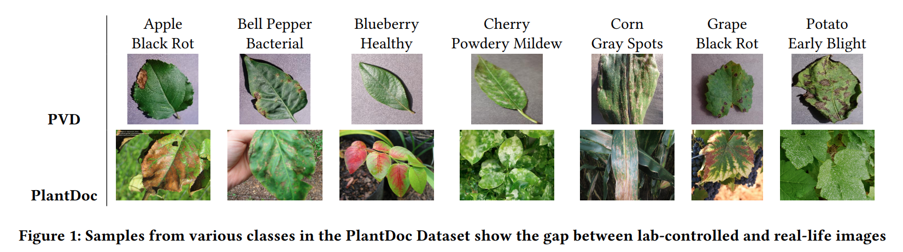
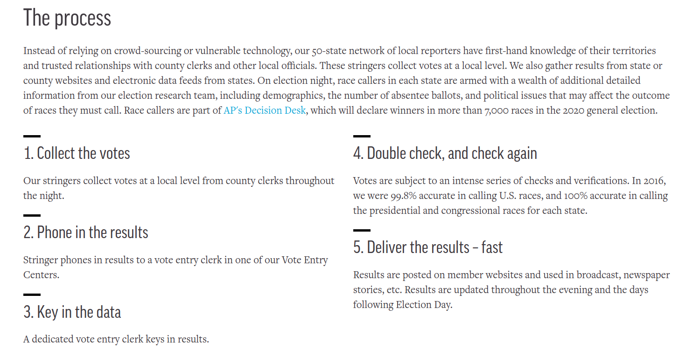

\newpage

## Garbage in, garbage out

::: notes

Any machine learning project has to start with "good"" data.

There is a "garbage in, garbage out" rule: If you use "garbage" to train a machine learning model, you will only get "garbage" out. 

And: Since you are evaluating on the same data, you might not even realize it is "garbage" at first! You may not realize until the model is already deployed in production! This is the absolute worst case scenario, as illustrated below...

:::

## Model training vs evaluation vs deployment (1) 

{ width=60%}

::: notes

We want to understand how the model will behave in *deployment* as early as possible (before investing too much time, effort, money in a model that won't do well).

:::

## Model training vs evaluation vs deployment (2) 

| Training Accuracy | Evaluation Accuracy | Deployment Accuracy | Outcome |
|-------------------|---------------------|---------------------|---------|
| 0.95              | 0.93                | 0.91                | 🤩      |
| 0.55              | 0.52                | N/A                 | 😐      |
| 0.95              | 0.93                | 0.51                | 😱      |

::: notes

* Best case: Model does well in evaluation, and deployment
* Second best case: Model does poorly in evaluation, is not deployed
* Worst case: Model does well in evaluation, poorly in deployment ("overly optimistic evaluation")

:::

## Working with data: two stages

1. Can I use this data?
2. How should I process this data?

\newpage

## Stage 1: Can I use this data?

### Ethical and legal concerns

* Bias/fairness
* Privacy
* Consent
* Copyright

:::notes

Some examples of data ethics failures:

*  You are going to train a machine learning model to classify photographs of skin lesions as "cancer" or "not cancer". You have a dataset of photographs with diagnoses from a hospital in a primarily white neighborhood. Your model is likely to underperform on photographs of darker skin tones because of the selection bias in the data.
* You train a model to allocate health care resources based on a historical dataset of health care use. But because some groups historically used less health care due to lack of access or socioeconomic factors, despite being equally or more ill, the model underestimates their needs. This data has a social/historical bias, which you are perpetuating in the model.
* You train a model to identify "offensive" posts on social media. You are using a dataset of real posts that were labeled as "offensive" or "not offensive" by a team of human annotators. But the human annotators were more likely to label language from African American English as offensive, so your model disproportionately removes posts by Black users.
* To generate a large dataset for model training, you extract text-image pairs from a public web archive. However, this web archive includes materials that should never have been online, such as private medical records, which end up in the dataset and raise serious privacy risks.
* You create an account on an online dating platform, which allows you to view and scrape other users' profiles. However, this data includes deeply personal details - like sexual preferences - which users did not consent to have extracted, aggregated, or redistributed.
* To train a generative image model, you scrape millions of images from the public web. In response to some prompts, your model outputs original training images - which may be copyrighted artworks or contain trademarks - almost exactly.

Citations/further reading:

* Marin Benčević, Marija Habijan, Irena Galić, Danilo Babin, Aleksandra Pižurica, Understanding skin color bias in deep learning-based skin lesion segmentation, Computer Methods and Programs in Biomedicine, Volume 245, 2024, [https://doi.org/10.1016/j.cmpb.2024.108044](https://doi.org/10.1016/j.cmpb.2024.108044)
* Ziad Obermeyer, Brian Powers, Christine Vogeli, Sendhil Mullainathan, Dissecting racial bias in an algorithm used to manage the health of populations, Science, Volume 366, Issue 6464, 2019, pp. 447–453, [https://doi.org/10.1126/science.aax2342](https://doi.org/10.1126/science.aax2342)
* Shirin Ghaffary, The algorithms that detect hate speech online are biased against black people, Vox, August 15, 2019, [https://www.vox.com/recode/2019/8/15/20806384/social-media-hate-speech-bias-black-african-american-facebook-twitter](https://www.vox.com/recode/2019/8/15/20806384/social-media-hate-speech-bias-black-african-american-facebook-twitter)
* Maarten Sap, Dallas Card, Saadia Gabriel, Yejin Choi, Noah A. Smith, The Risk of Racial Bias in Hate Speech Detection, Proceedings of the 57th Annual Meeting of the Association for Computational Linguistics, 2019, pages 1668–1678, [https://doi.org/10.18653/v1/P19-1163](https://doi.org/10.18653/v1/P19-1163)
* Benj Edwards, Artist finds private medical record photos in popular AI training data set, Ars Technica, September 21, 2022, [https://arstechnica.com/information-technology/2022/09/artist-finds-private-medical-record-photos-in-popular-ai-training-data-set/](https://arstechnica.com/information-technology/2022/09/artist-finds-private-medical-record-photos-in-popular-ai-training-data-set/)
* Joseph Cox, "70,000 OkCupid Users Just Had Their Data Published," Vice, May 12, 2016. [https://www.vice.com/en/article/70000-okcupid-users-just-had-their-data-published/](https://www.vice.com/en/article/70000-okcupid-users-just-had-their-data-published/)
<!-- * Timothy B. Lee, Stable Diffusion copyright lawsuits could be a legal earthquake for AI, Ars Technica, April 3, 2023, [https://arstechnica.com/tech-policy/2023/04/stable-diffusion-copyright-lawsuits-could-be-a-legal-earthquake-for-ai/](https://arstechnica.com/tech-policy/2023/04/stable-diffusion-copyright-lawsuits-could-be-a-legal-earthquake-for-ai/) -->

**Takeaway**: Consider possible sources of bias in the data you are using. Be aware of how the data was collected and its provenance/lineage. Ensure that appropriate consent was obtained, and verify that the data was not collected in violation of service terms, privacy expectations, or copyright protections.

:::

### Representativeness concerns

Compared to where your model will be used, is the data similar in:

* Population 
* Context/setting
* Time period
* Label balance

:::notes

Some examples of representativeness failures:

* You train a cardiovascular risk prediction model on data from middle-aged adults in high-income countries. When the same model is applied to younger populations in low- and middle-income countries, it systematically underestimated risk, because disease patterns, diet, and access to care differed significantly.
* You train a model to identify crop disease based on a dataset of labeled plant photographs. When applied to real photographs "in the wild", your model fails:

{ width=70%}

* You train a malware detection model using samples of malware and non-malicious software collected over a six year period. Initially, it performs very well. However, as you deploy it years later, the model’s accuracy declines significantly because new malware variants - evolving beyond the original training distribution - are not accurately detected.
* You want to train a model to detect AI-generated text, for potential integration into learning platforms like Brightspace. To create a labeled data set, you grab a sample of Wikipedia articles (for human-written samples), and then you prompt a LLM to generate a similar number Wikipedia-style articles on a wide range of topics. Your model "learns" that text samples are AI-generated approximately half the time, even though the true prevalence of AI-generated text might be much lower - or much higher - in real student work.

Citations/further reading:

* Ralph B. D’Agostino, Scott Grundy, Lisa M. Sullivan, Peter Wilson, Validation of the Framingham Coronary Heart Disease prediction scores: results of a multiple ethnic groups investigation, JAMA, Volume 286, Issue 2, 2001, pp. 180–187, [https://jamanetwork.com/journals/jama/fullarticle/193997](https://jamanetwork.com/journals/jama/fullarticle/193997)
* Davinder Singh, Naman Jain, Pranjali Jain, Pratik Kayal, Sudhakar Kumawat, Nipun Batra, PlantDoc: A Dataset for Visual Plant Disease Detection, Proceedings of the 7th ACM IKDD CoDS and 25th COMAD (CoDS COMAD 2020), pp. 249–253, 2020, [https://doi.org/10.1145/3371158.3371196](https://doi.org/10.1145/3371158.3371196)
* C. Galen, R. Steele, Evaluating Performance Maintenance and Deterioration Over Time of Machine Learning-based Malware Detection Models on the EMBER PE Dataset, 2020 Seventh International Conference on Social Networks Analysis, Management and Security (SNAMS), Paris, France, 2020, pp. 1–7, [https://doi.org/10.1109/SNAMS52053.2020.9336538](https://doi.org/10.1109/SNAMS52053.2020.9336538)

**Takeaway**: Ensure that your dataset reflects the real-world conditions where your model will be deployed. Check whether the population, context, time period, and class balance in the data match the deployment setting, and be careful when combining data from multiple sources into what's known as a "Frankenstein" dataset.

<!-- 
* **Data is not representative of your target situation**. For example, you are training a model to predict the spread of infectious disease for a NYC-based health startup, but you are using data from another country.
* **Data or situation changes over time**. For example, imagine you train a machine learning model to classify loan applications. However, if the economy changes, applicants that were previously considered credit-worthy might not be anymore despite having the same income, as the lender becomes more risk-averse. Similarly, if wages increase across the board, the income standard for a loan would increase.
-->

:::

### Predictive feature concerns

::: notes

Some examples of predictive feature failures:

* You train a model to predict criminality based on facial features. There is nothing inherently predictive in facial structure. Later, it turns out that the apparent signal comes from differences in image sources (mugshots vs. ID photos).
* You attempt to build an "AI lie detector" that classifies deception based on micro-expressions in facial video. Human lie detection is barely above chance, and there are no reliable facial markers of deception, so the dataset has no true predictive features to learn from.
* You train a model to classify people as entrepreneurs from facial images scraped from Crunchbase. While the model achieves high reported accuracy, there is no causal or biologically plausible relationship between facial morphology and occupational choices. The model exploits dataset artifacts.

Citations/further reading - many more examples in: 

* Mel Andrews, Andrew Smart, Abeba Birhane, The reanimation of pseudoscience in machine learning and its ethical repercussions, Nature Machine Intelligence, Volume 5, Issue 9, 2024, Article 101027, [https://doi.org/10.1016/j.patter.2024.101027](https://doi.org/10.1016/j.patter.2024.101027)

**Takeaway**: A model cannot succeed if the dataset lacks true predictive features. (Be careful - the model may seem to be predictive only because of a data leakage problem, like some of the examples noted above!)

:::

### Other data quality concerns

* Label error
* Other data entry error
* Inconsistent units/formats
* Missing data

::: notes

Some examples of data quality failures:

* You train a COVID-19 diagnostic model using a chest X-ray dataset that was compiled from case studies published in the early weeks of the pandemic. Later reviews find that some samples are mislabeled, and are actually other types of pneumonia, especially samples that were reported before a reliable diagnostic test for COVID-19 was widely available.
* You train a ride-hailing demand prediction model on GPS data from mobile phones. Some trips contain corrupted coordinates (e.g., location recorded in the middle of the ocean, or a misplaced decimal point showing a car moving 3,000 km in a minute). The model treats these entries as real trips, introducing noise and spurious patterns.
* You combine clinical datasets from multiple hospitals, but one site records lab results in mg/dL while another uses mmol/L. Your model makes nonsensical predictions.  
* You train a predictive model using historical returns of currently active mutual funds. Since funds that failed or were closed are missing from the data, the model learns on only successful funds, so it overestimates expected returns. (This is known as survivorship bias.)

Citations/further reading:

* Curtis G. Northcutt. Pervasive Label Errors in ML Datasets Destabilize Benchmarks. Blog post, March 29, 2021. [https://l7.curtisnorthcutt.com/label-errors](https://l7.curtisnorthcutt.com/label-errors  )
* Curtis G. Northcutt, Anish Athalye, Jonas Mueller. Pervasive Label Errors in Test Sets Destabilize Machine Learning Benchmarks. In Advances in Neural Information Processing Systems (NeurIPS 2021). [https://neurips.cc/virtual/2021/47102](https://neurips.cc/virtual/2021/47102)
* Brown, S. J., Goetzmann, W. N., Ibbotson, R. G., & Ross, S. A. Survivorship bias in performance studies. The Review of Financial Studies, 5(4), 553–580 (1992). [https://doi.org/10.1093/rfs/5.4.553 ](https://doi.org/10.1093/rfs/5.4.553 ) 

**Takeaway**: Problems in the data can undermine the predictive ability of the models trained on it.

:::

### Should I use the data? illustration

:::notes

{ width=60% }

:::

\newpage

## Stage 2: How do I process the data?

* Select features, target
* Split data (avoid data leakage)
* Convert to numeric types
* Create "transformed" features
* Explore data, make and check assumptions
* Handle missing data

### Select features

Include features if they are:

* Plausibly predictive
* Available at inference time
* Don't have other data leakage issues

::: notes

We must *exclude* fields in the data that have no plausible relationship to the target variable:

* A machine learning model will find "patterns" even if the feature data is not really related to the target variable! It will find "spurious" relationships. That can potentially be much worse than if there was no ML model at all.
* In many cases, there will be fields in the data that you shouldn't use, e.g. you won't use someone's phone number or home address to predict their Intro ML course grade.
* Always exclude fields that are purely identifiers (e.g. a numeric identifier for a sample, for a respondent).

We also must *exclude* fields in the data that are not going to be available to our model when it is deployed for "real":

* Example: You build a model to help decide which applicants should be approved for loans. In the training dataset, you accidentally include fields such as "number of late payments," which are only known after the loan has already been issued. By training on them, the model looks impressively accurate during evaluation, but in deployment those features are unavailable, so the model cannot make real-world predictions.

Data leakage: TBD

:::

### Select target

Target should be: 

* measureable
* available
* correct

:::notes

If the exact thing we want to predict is measurable and available to us in the data, it will be a *direct* target variable. Sometimes, however, the thing we want to predict is not measurable or available.  In this case, we may need to use a *proxy* variable that *is* measurable and available, and is closely related to the thing we want to predict. (The results will only be as good as the relationship between the thing we want to predict, and the proxy!)

Example: You want to predict a patient’s illness severity in order to allocate extra care resources. But severity itself is not directly measurable in your dataset. Instead, you use past healthcare costs as a proxy variable, assuming that sicker patients generate higher costs. (In practice, this systematically underestimates the needs of disadvantaged groups who historically have had less access to care. The model appears accurate against the proxy, but fails against the true target.)

Citation: Ziad Obermeyer, Brian Powers, Christine Vogeli, Sendhil Mullainathan, Dissecting racial bias in an algorithm used to manage the health of populations, Science, Volume 366, Issue 6464, 2019, pp. 447–453, [https://doi.org/10.1126/science.aax2342](https://doi.org/10.1126/science.aax2342)

We mentioned label error when we talked about data quality. Since it is expensive to get labeled data, it's not uncommon for labels to be either machine-generated, or added by humans who spend very little time on each sample.

:::

### Splitting data

:::notes

If we split data incorrectly, we can introduce *data leakage*, which causes an *overly optimistic evaluation* - we said earlier how important it is to avoid that!

Data leakage happens when information that would not be available in the real deployment setting "leaks" into the training or evaluation process, and makes the evaluation much "easier" than the real deployment task.

:::

### Types of data leakage (1)

No independent test set:

* no test set at all!
* random split of non-independent samples
* pre-processing uses entire data
* model selection uses test set 

:::notes

If there is no test set, if the test set is not really independent of the training set, or if the test set becomes "contaminated" by using it during model development, then the evaluation task ("make predictions on data that isn't really new!") is easier than the real deployment task ("make predictions on actually new data").

To mitigate this, we split the data into training and test sets, and **don't look at the test set again** until final model evaluation.
But, a random split only makes an independent test set if the samples are independent. It doesn't work if: 

  * there are duplicates in the data
  * there are multiple samples from the same respondent
  * there is some kind of temporal relationship
  * etc.

so in these cases, we need to split the data in a way that preserves the independence of the test set. (We'll revisit in Week 4.)

And, if we use the test data - for pre-processing, for model selection, or for model training - we "contaminate" it and then we no longer have an independent test set for model evaluation

See [Leakage and the reproducibility crisis in machine learning-based science](https://www.cell.com/patterns/pdfExtended/S2666-3899(23)00159-9).

Example: Suppose you are training a model to predict bicycle traffic on the Brooklyn Bridge. Your dataset includes features such as "time of day" (in 15-minute intervals), "day of week", "temperature", "precipitation", etc.

* In model development and evaluation, you split the data randomly into training and test sets at the row level. That means the training set might include traffic counts for 7:00-7:15 AM and 7:30-7:45 AM on June 10th, while the test set includes 7:15-7:30 on the same data. Because the test rows are sandwiched between training rows, the model evaluation appears very accurate — it’s essentially interpolating between adjacent points.
* When deployed to predict traffic on unseen future days, this advantage disappears, and performance is much worse than the evaluation would suggest.

:::

### Types of data leakage (2)

Inappropriate features

* feature not available at inference time
* feature is a proxy for target variable in data, but not in deployment

:::notes

Example: Suppose you are training a model to predict whether a patient has hypertension. You are using a dataset of patient medical info, using "has a hypertension diagnosis" as the target variable on which to train the model.

* In model development and evaluation, you use "current medications" as a feature. For patients who have already been diagnosed with hypertension, this may include drugs to lower blood pressure! 
* When the model is deployed, it will have to make predictions given medical history *before a hypertension diagnosis is made*.

Example: Suppose you are training a model to predict whether a profile photo on LinkedIn is AI-generated. You prepare a dataset with a bunch of AI-generated photos of headshots, and "real" faces cropped from candid photographs found online.

* In model development and evaluation, the model may "learn" that a headshot-style photo is AI-generated, and a cropped candid photo is not. It will appear to have high accuracy on the evaluation data.
* When the model is deployed, this relationship between "photo style" and target variable will not exist, since virtually all of the photos will be headshot-style. The model will have very poor performance.

(Knowing which features are valid often requires domain knowledge...)

For example....

:::

### COVID-19 chest radiography 

* **Problem**: diagnose COVID-19 from chest radiography images
* **Input**: image of chest X-ray (or other radiography)
* **Target variable**: COVID or no COVID

### COVID-19 chest radiography (2)

](../images/1-covid-xrays.png){ width=60% }

::: notes

Between January and October 2020, more than 2000 papers were published that claimed to use machine learning to diagnose COVID-19 patients based on chest X-rays or other radiography. But a later [review](https://www.nature.com/articles/s42256-021-00307-0) found that "none of the models identified are of potential clinical use due to methodological flaws and/or underlying biases".

To train these models, people used an emerging COVID-19 chest X-ray dataset, along with one or more existing chest X-ray dataset, for example a pre-existing dataset used to try and classify viral vs. bacterial pneumonia.

The problem is that the chest X-rays for each dataset were so "distinctive" to that dataset, that a neural network could be trained with high accuracy to classify an image into its source dataset, even without the lungs showing!

:::

### COVID-19 chest radiography (2)

Findings:

* some non-COVID datasets were pediatric images, COVID images were adult
* there were dataset-level differences in patient positioning
* many COVID images came from screenshots of published papers, which often had text, arrows, or other annotations over the images. (Some non-COVID images did, too.)

### COVID-19 chest radiography (3)

](../images/1-covid-xrays-saliency.png){ width=90% }

::: notes

These findings are based on techniques like 

* saliency maps, where the model is made to highlight the part of the image (the pixels) that it considered most relevant to its decision.
* using generative models and asking it to take a COVID-negative X-ray and make it positive (or v.v.)

Many of the findings are not easy to understand without domain knowledge (e.g. knowing what part of the X-ray *should* be important and what part should not be.) For example: should the diaphragm area be helpful?

:::

<!-- 

https://www.nature.com/articles/s41559-023-02162-1  Data leakage jeopardizes ecological applications of machine learning

https://www.nature.com/articles/s41467-024-46150-w Data leakage inflates prediction performance in connectome-based machine learning models

https://www.nature.com/articles/s41592-024-02362-y Guiding questions to avoid data leakage in biological machine learning applications

-->

### Signs of potential data leakage (after training)

* Performance is "too good to be true"
* Unexpected behavior of model (e.g. learns from a feature that shouldn't help)

### Detecting data leakage

* Exploratory data analysis
* Study the data before, during, and after you use it!
* Explainable ML methods
* Early testing in production

\newpage

<!-- 
• Convert to numeric types
• Create “transformed” features
• Explore data, make and check assumptions
• Handle missing data

-->

### Convert to numeric types

* fix "reading in the data" issues
* ordinal and one-hot encoding of categorical data
* image data to raw pixels
* text to "bag of words" or other representation
* audio to frequency domain (or image of frequency domain) features

### Create "transformed" features

### Make and check assumptions

::: notes

It's always a good idea to "sanity check" your data - before you look at it, think about what you expect to see. Then check to make sure your expectations are realized.

Look at plots of data, summary statistics, etc. and consider general trends.

:::

### Example: author citation data (1)

Data analysis: use PubMed, and identify the year of first publication for the 100,000 most cited authors.

::: notes

What are our expectations about what this should look like?

:::

### Example: author citation data (2)

{ width=50% }

::: notes

We can think of many potential explanations for this pattern, even though it is actually a data artifact.

The true explanation: in 2002, PubMed started using full first names in authors instead of just initials. The same author is represented in the dataset as a "new" author with a first date of publication in 2002.

:::

\newpage

### Example: author citation data (3)

.](../images/1-pubmed-authors2.png){ width=50% }

:::notes

How *should* you handle unreasonable values, data that does not match expectations, or "outliers"? It depends!

* e.g. suppose in a dataset of voter information, some have impossible year of birth - would make the voter over 120 years old. (The reason: Voters with no known DOB, who registered before DOB was required, are often encoded with a January 1900 DOB.)
* **not** a good idea to just remove outliers unless you are sure they are a data entry error or otherwise not a "true" value.
* Even if an outlier is due to some sort of error, if you remove them, you may skew the dataset (as in the 1/1/1900 voters example).

Consider the possibility of: 

* Different units, time zones, etc. in different rows
* Same value represented several different ways (e.g. names, dates)
* Missing data encoded as zero

:::

\newpage

### Handle missing data

Missing data can appear as:

* Rows that have `NaN` values
* Rows that have other values encoding "missing" (-1, 0, 100...)
* Rows that are *not there* but should be

:::notes

<!-- 
* Example: NYC taxi tip data, NYS thruway data
-->

Some practical examples of "rows that should be there, but are not" - 

<!-- 
* Twitter API terms of use don't allow researchers to share tweets directly, only message IDs (except for limited distribution, e.g. by email). To reproduce the dataset, you use the Twitter API to download messages using their IDs. But, tweets that have been removed are not available - the distribution of removed tweets is not flat! (For example: you might end up with a dataset that has offensive posts but few "obvious" offensive posts.) -->
* A dataset of Tweets following Hurricane Sandy makes it looks like Manhattan was the hub of the disaster, because of power blackouts and limited cell service in the most affected areas. [Source](https://hbr.org/2013/04/the-hidden-biases-in-big-data)
* The City of Boston released a smartphone app that uses accelerometer and GPS data to detect potholes and report them automatically. But, low income and older residents are less likely to have smartphones, so this dataset presents a skewed view of where potholes are. [Source](https://hbr.org/2013/04/the-hidden-biases-in-big-data)

:::

::: {.cell .markdown}

### Types of "missingness"

* not related to anything of interest
* correlated with observed features
* correlated with measure of interest

:::notes

These are often referred to using this standard terminology (which can be confusing):

* Missing _completely_ at random: equal probability of being missing for every sample. 
* Missing at random: samples with $x = X$ (for some feature, value $X$) more likely to be missing.
* Missing not at random: some values of target variable $y$, more likely to be missing.

For example, suppose we want to survey students about their course load and their stress levels. in order to predict stress levels in future students and better advise them about course registration - 

* MCAR: a pile of survey forms is accidentally thrown out. Losing this data doesn't have any systematic impact, beyond the less of the data.
* MAR: last-semester students are less likely to fill out the survey than first-semester students, because they don't feel like they'll be around long enough to benefit from the results. Losing this data means that our end result may be biased, or less accurate, for students in their last semester.
* MNAR: students who are stressed out are less likely to fill out the survey. Losing this data is likely to have a (bad) systematic effect.

:::
:::

### Handling missing data

How should you handle little bits of missing data? It always depends on the data and the circumstances. Some possibilities include:

* omit the row (or column)
* fill back/forward (ordered rows)
* fill with mean, median, max, mode...

:::notes

You generally have to know why the data is missing, to understand the best way to handle it. If imputing a value, we want it to be *as close as possible to the true (unknown) value*.

During the data preparation stage, it's important not to "contaminate" the test set - any cleaning that uses statistics of the data (mean, max, etc.) must use the statistics of the training set only. 

For example: if imputing missing values with the mean of a feature, we would use the mean of the feature in the training set only.

:::

<!-- 

Biological reasoning

Physical reasoning

Social reasoning

Practical reasoning (see HellaSwag)

Object and individual tracking

Non sequiturs

failed gemini prompts:

* generate a photorealistic image of a pencil in a glass of water
* Two days ago, I found two cute little bunnies in my backyard. Yesterday, I found two dead little bunnies in my backyard and I buried them. What will I find in my backyard tomorrow? Answer in 5 words or less.

https://www.technologyreview.com/2020/08/22/1007539/gpt3-openai-language-generator-artificial-intelligence-ai-opinion/

Mis-labeled examples:

https://www.surgehq.ai/blog/30-percent-of-googles-reddit-emotions-dataset-is-mislabeled

> Yay, cold McDonald's. My favorite. – mislabeled as LOVE

-->

<!-- 
### Example: anomalous voting data (1)

{ width=30% }

::: notes

What are our assumptions about election night data, and how are they violated here? 

We expect that per-candidate vote totals (computed by multiplying total votes and vote share) should increase as more votes are counted, but never decrease.

What are possible explanations?

:::

### Example: anomalous voting data (2)

{ width=75% }

::: notes

This anomaly makes a lot of sense as a correction of a data entry or duplicate entry error. 

How Edison/AP collects the data for their Election Night feed:

* There are "stringers" (temporary reporters) at various elections offices who call results into their phone center
* They have people who look at official government websites for new results that they manually enter into the system
* They have people who monitor results sent by fax from counties and cities

all working as fast as they can! Data entry and duplicate entry errors are not only likely, they are almost guaranteed. When they are corrected, vote totals may decrease.

Source: [AP](https://web.archive.org/web/20210410214207/https://www.ap.org/en-us/topics/politics/elections/counting-the-vote), [Edison](http://www.edisonresearch.com/wp-content/uploads/2020/10/Web-Entry-Team-Handout-2020.pdf)

:::

-->

## Recap: Working with data

