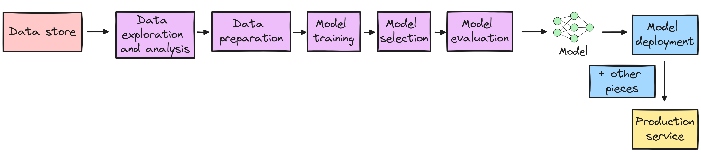
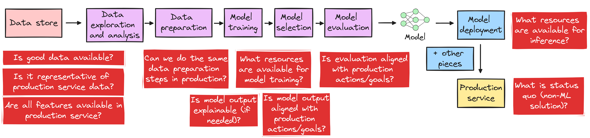
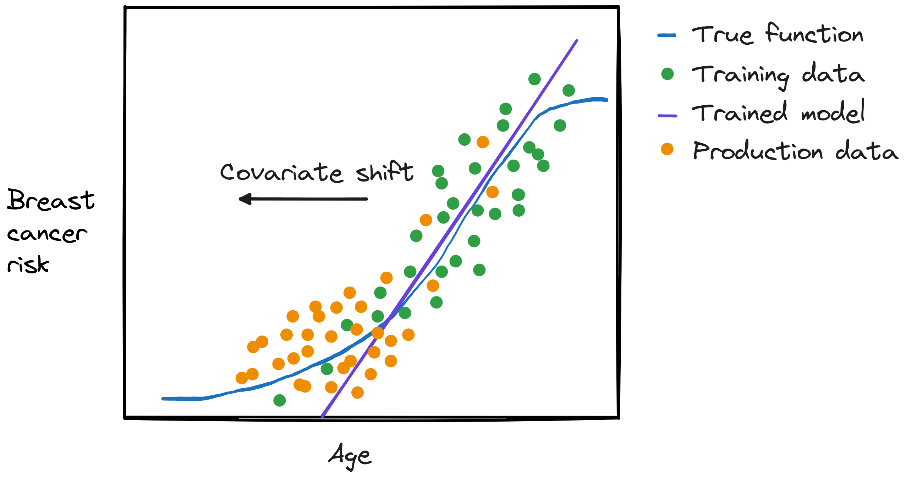
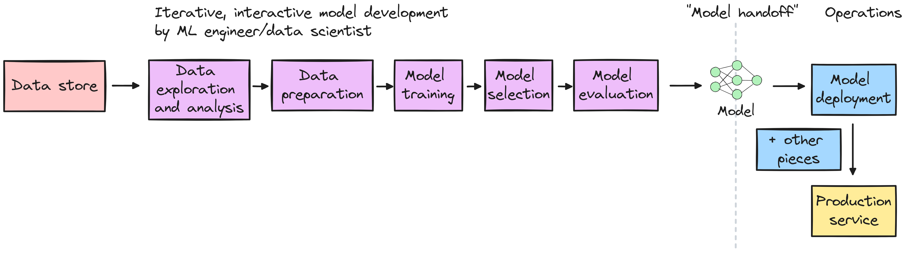

\newpage

## Deploying machine learning systems

### Until now - model development

{ width=85% }

::: notes

Note: we know that these are not separate, isolated steps - for example, if data exploration shows a non-linear relationship between feature and target, we might add a non-linear transformation in the data preparation step, *if* the model we will train is not already capable of learning non-linear relationships.

:::

### Next step - model deployment

{ width=95% }

::: notes

In production, a model might be behind an API that can be called on demand by online services, be deployed on an edge or mobile device, or do batch prediction.

:::

### Thinking about production: before model development

{ width=95% }

::: notes

Check out [Introduction to Machine Learning Problem Framing](https://developers.google.com/machine-learning/problem-framing) for more on this!

:::

\newpage

### Re-thinking model development: After model deployment (1)

{ width=50% }

:::notes

Two sets of metrics for models deployed "in production":

- optimizing metrics, e.g.: how accurate is it, how fair are its predictions.
- operational metrics, e.g.:  how long does it take to return a prediction (inference latency), how much does it cost (energy, infrastructure rental) to return one result.

:::

### Re-thinking model development: After model deployment (2)

{ width=55% }

::: notes

Evaluating a model in production (optimizing metrics) is often not straightforward, we often don't have ground truth - 

* Some problems have **natural ground truth labels**: for example, you can predict how long a customer will wait on hold, then time how long they actually waited.
* Sometimes you can get labels from users, explicitly or implicitly: for example, you can add a "report not spam" button on emails that were classified as spam, or you can infer that they are not spam if a user moves it from spam folder to inbox. (But, response rates may be low.) (Users labels may not be good - will a user know whether a translation is acceptable or not?)

But, getting labels in production is often problematic - 

* **ML system itself influences outcome**: for example, you use an ML system to identify students at risk of failing end-of-year reading exams, to get extra resources to them. At the end of the year, some students who got extra help passed the exam. Was your prediction wrong? (In some cases, we might sacrifice some performance with a "held out" set - e.g. mark 1% of email as "held out" and send *all* to user, even those classified as spam, and see what the user does with it!)
* **Feedback loop may be long**: for example, you use an ML system to show users a movie that they may like, and you consider a recommendation successful if the user then watches the movie. But, they may watch it hours, days, weeks after it is first recommended! Your initial inferred label may be premature.

We want labeled production data for evaluation, *and* potentially for future re-training!

:::

\newpage

## Training-serving skew

### Data distribution shift

Between training and production (or later in production), things may change e.g.:

* the environment in which your service operates, changes (sudden or gradual)
* feedback loop: your production service changes the environment
* something in the "other pieces" changes

:::notes

Example of "something in the other pieces" changing:

* Your model uses a weather API to get temperature as a feature for input to model. The API changes its default reporting format from Farenheit to Celsius.
* Your credit card expires, so the weather API refuses your requests and your data processing code automatically fills in a NaN for temperature features.

:::

### Types of data distribution shift

Given model input $X$, target $y$:

$$P(X, y) = P(y | X)P(X) = P(X|y) P(y)$$

Three types of "shifts": covariate, label, concept.

### Covariate shift

Using $P(X, y) = P(y | X)P(X)$ - 

* $P(X)$ changes
* $P(y | X)$  stays the same

::: notes

Example: you are predicting breast cancer risk given an input feature `age`. Your training data comes from a clinic where patients are evaluated for breast cancer, so that "source" distribution trends older. However, your model is deployed in a smartphone app and users trend younger. (But, the probability of a young/old sample getting breast cancer has not changed.)

{ width=45% }

:::

\newpage

### Label shift

Using $P(X, y) = P(X|y) P(y)$ - 

* $P(y)$ changes
* $P(X|y)$  stays the same

::: notes

In the previous example (breast cancer risk), we would also see label shift - with younger users, you would see fewer positive samples.

But, we could also have a scenario with label shift but no covariate shift. Example: a medicine is developed that reduces breast cancer risk among all age groups. $P(y)$ is smaller (less breast cancer), but given a positive sample, the likelihood of being old/young has not changed.

{ width=45% }

:::

### Concept drift

Using $P(X, y) = P(y | X)P(X)$ - 

* $P(y | X)$ changes
* $P(X)$ has not changed

::: notes

Example: a vaccine is developed that, if given to teenagers, reduces their risk of developing breast cancer in their lifetime. Since the availability of the vaccine depends on age, the relationship between age and cancer risk will change.

{ width=45% }

Example: predicted price for a non-stop red-eye flight from NYC to Paris changes - 

* may be cyclic/seasonal: more expensive during summer months, or around holidays
* or not: more expensive around Paris 2024 Olympics

:::

## Deploying *better* machine learning systems

### Model re-training

{ width=55% }

### "Level zero"

{ width=95% }

### Improving on level zero

{ width=95% }

:::notes

With our previous workflow, it would be very expensive (in person-hours) to re-train model, so we wouldn't want to do it as often as necessary. To make it less "expensive", we need to:

* close the feedback loop: collect data from production
* monitor for data/performance problems
* automate data → model → service pipeline

The trigger to re-train model can be time-based, performance-based, or data-drift-based.

Note that the "deliverable" that the ML team hands off is no longer a trained model - now it's source code and/or configuration files defining a pipeline, that generates the trained model.

:::

\newpage

## Operations!

<!-- https://huyenchip.com/2020/12/27/real-time-machine-learning.html#fast_inference -->

### Operational metrics for training

Training is expensive!

::: notes

There may be multiple ways a given "optimizing metric" target (e.g. "achieve 99% validation accuracy"), with different costs. e.g., the metrics

* time to accuracy (TTA)
* energy to accuracy (ETA)

may depend on batch size, learning rate, network size/architecture...

:::

### Operational metrics for inference

* prediction serving latency (how long to return one result for one input?)
* throughput (when running on a large batch, how many outputs per unit time?)
* model size (especially if it will be deployed on mobile device/at edge)
* energy, cost...

:::notes

Batch vs. online inference

* Batch/offline: inference on large dataset, need high throughput
* Online: inference for one sample at a time, typically user is waiting for response, need low latency

:::

### Minimizing prediction serving latency

{ width=65% }

::: notes

To minimize the overall prediction serving latency, we would want to reduce the time:

* to get input features (retrieve data, compute features)
* **to compute one prediction (inference latency)**
* to get query from/deliver the result to user

:::

### Idea 1: Model architecture

* Use base model that's small/specifically designed for efficient inference (e.g. MobileNet)
* Use big model, but prune activations that are usually zero
* Use knowledge distillation: train a small model to match "soft" predictions of big model
* Potentially some impact on "optimizing metrics"

### Idea 2: Model compression

* Reduced precision/quantization: use 16-bit floats (half precision) or 8-bit integers (fixed-point) instead of 32-bit floats (full precision)
* Can fit more numbers (weights, etc.) in "fast" memory
* Can perform faster computation
* Potentially some impact on "optimizing metrics" (quantization error)

### Idea 3: Hardware acceleration

* Use chips that are "good at" basic ML operations (matrix multiplication, convolution)
* Add specialized memory/data paths for ML (e.g. local fast cache for network weights)

:::notes

How did GPUs become so important for machine learning?

* GPUs were originally designed to do graphics e.g. for video games - most of the computations in graphic rendering are linear algebra, e.g. matrix operations.
* Also designed for high *data* parallelism - compute same thing on many data elements (e.g. same shading function on many polygons). (Not like multi-core CPUs which have task parallelism - compute different functions.)
* In early 2000s: shift toward *programmable* GPUs - NVIDIA released APIs for general purpose computation on GPU. 

Summary of tradeoffs:

CPU: low cost, low power general computation.
GPU: can quickly do a big linear algebra operation on a bunch of data samples at once.

:::

### Where should inference happen: Cloud

* lots of compute 
* potentially costly
* can dynamically adapt to workload
* subject to network performance
* don't need to distribute model

### Where should inference happen: Edge

* less compute, 
* limited memory/disk
* good for user data privacy 
* not subject to network performance
* but not good for model privacy

<!-- https://www.cs.cornell.edu/courses/cs4787/2022fa/lectures/lecture27.pdf -->

<!--

CASE STUDY: TWITTER/X TIMELINE

This case study comes from the Twitter/X Engineering blog: https://blog.twitter.com/engineering/en_us/topics/insights/2017/using-deep-learning-at-scale-in-twitters-timelines

Problem framing:

Goal: get users to visit/engage with Twitter more (translates to ad revenue!)
Mechanism: show users a set of the most relevant Tweets first
Model: predict relevance of each tweet to the user
Note the “leaky pipeline” we brought up in Week 1 - the real-world mechanism may not achieve real-world goal to a meaningful extent, the target of learning problem is not exactly the variable we care about.

Features used as input:

from the Tweet itself (not personal): how recent it is, whether it has image or video, number of retweets or likes
from you (personal): how often and how heavily you use Twitter, what Tweets you engaged with (like, RT) in the past
from you + the author (personal): strength of your connection to the author, your past interactions with them
(which of these features can be pre-computed? How frequently must they be updated?)

When and where the model runs:

every time you open the app or refresh timeline, they score every Tweet (since your last visit) from people you follow
service must score large number of Tweets per second
must be fast enough to “instantly” serve Tweets back to the people viewing the timeline
How model quality is measured:

during training: well-defined accuracy metric. But, this doesn’t predict how people will react to those Tweets.
there are no natural ground truth labels.
evaluate models with A/B testing: serve two sets of users with two different models, and see which were more engaged, spent more time on the service, etc.
Also consider operational metrics:

how much better is Model A than Model B? (in A/B testing)
is the better model more costly? (more compute resources, more complicated operation and support)
the pipeline’s ease of use, scalability, and extendability
Additional challenges: missing data

for a given input, some features may be unavailable
Overall considerations: Quality and speed of predictions, resource utilization, maintainability. The highest “quality” model is not necessarily the one that is deployed in production.

Case study: Uber eats https://www.uber.com/blog/michelangelo-machine-learning-platform/ 
-->

## Summary

* Consider ML model development + deployment together
* In practice, ML engineers develop pipelines, not models
* Often tension between optimizing metrics + operational metrics 
