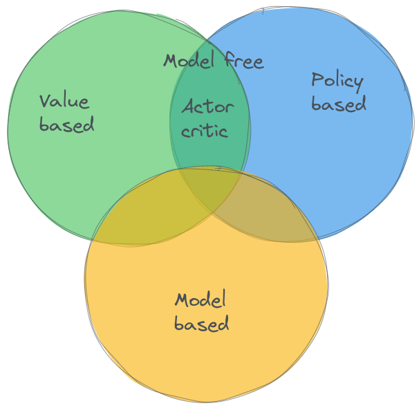
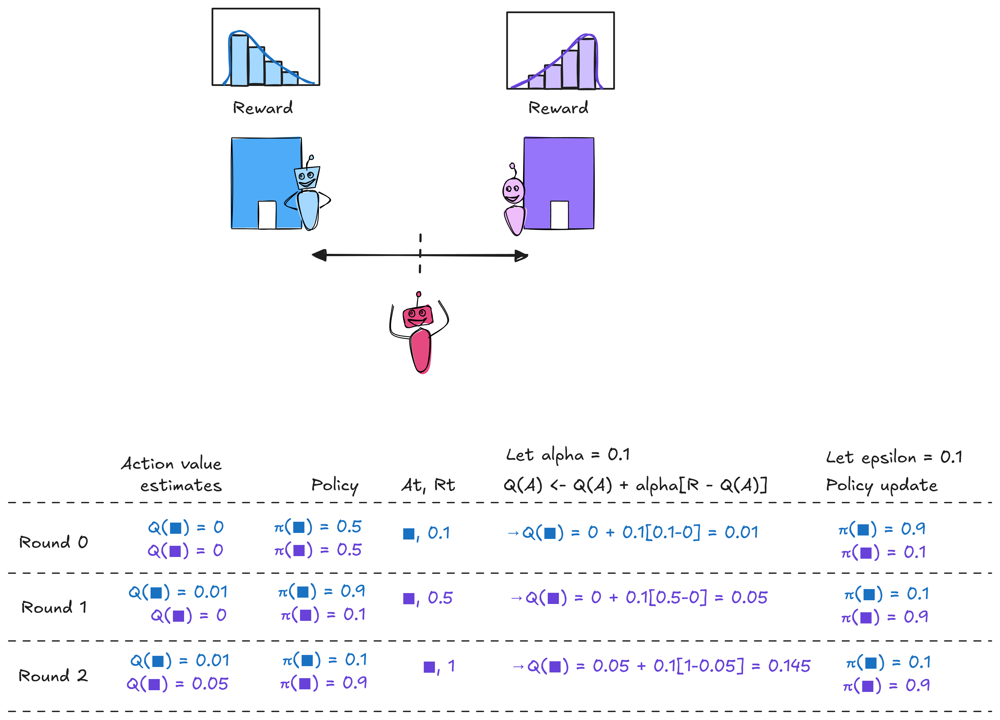
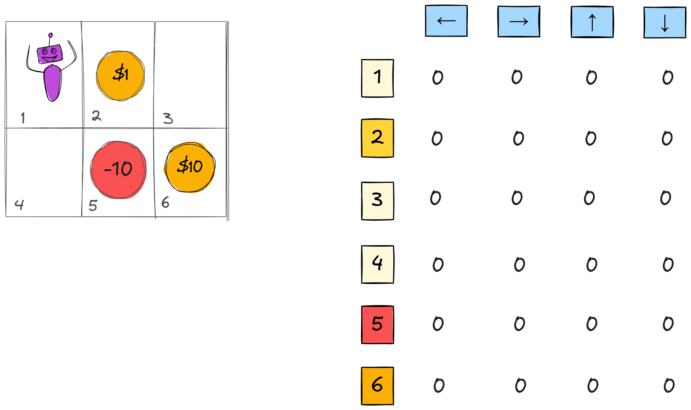
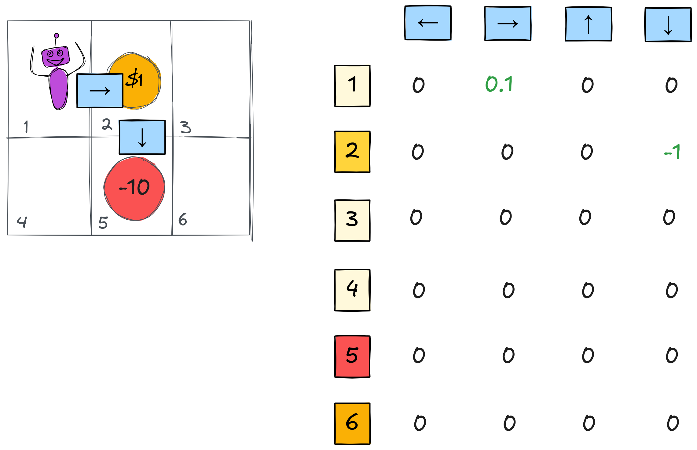
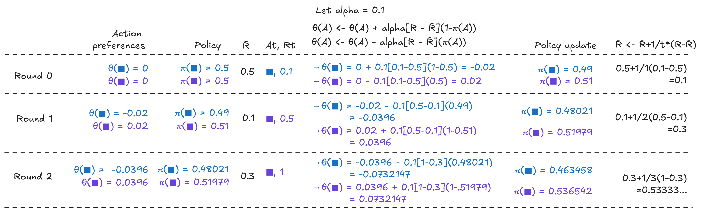
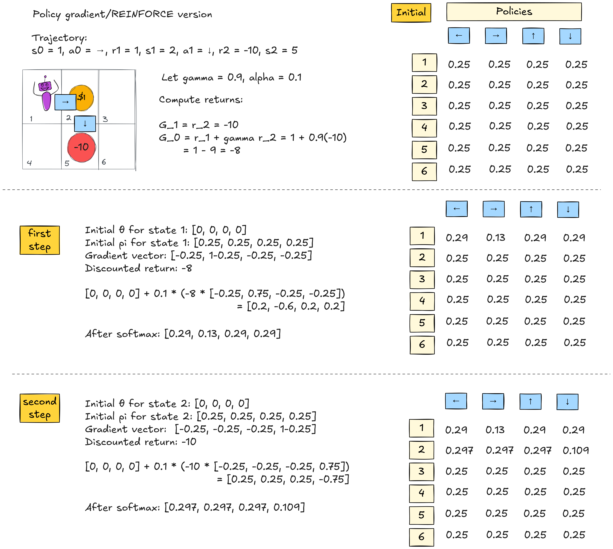

## Reinforcement learning

### Elements of RL

* An *agent* acts in an *environment* 
* The agent sees a sequence of *observations* about the environment
* The agent wants to achieve a *goal*, in spite of some *uncertainty* about the environment.

::: notes

May need to consider indirect, delayed result of actions. 

{ width=40% } 

:::

### Elements of RL - environment 

* The *state* of the agent at time $t$ is $S_t$ (from $s \in \mathcal{S}$)
* The agent chooses action $A_t$ at time $t$ (from $a \in \mathcal{A}$)
* The agent earns a reward $R_t$ for its actions (possibly stochastic)
* The next state is determined by current state and current action, using a (possibly stochastic) state transition function:

$$P(s', r \mid s, a) = \mathbb{P}[S_{t+1} = s',\, R_{t+1} = r \mid S_t = s,\, A_t = a]$$

::: notes

The set of states $\mathcal{S}$, actions $\mathcal{A}$, the reward, and the state transition function, "live" outside the agent - part of the environment.

:::

### Elements of RL - observations

Over interactions in $T$ time steps, the agent takes a sequence of actions and observes next states and rewards.

This sequence of interactions is called a *trajectory* or an *episode*:

$$S_0, A_0, R_1, S_1, A_1, R_2, S_2, \dots, A_{T-1}, R_T, S_T$$

### Elements of RL - what agent may learn

::: notes

* the *policy* $\pi$ is the agent's mapping from state to action (or probabilities of action).  We will always have a policy at the end, but it won't always be explicitly learned.
* We already said that the environment sends a *reward* back to the agent. The agent may learn a *value function* that describes expected total **future** reward from a state.
* The agent may have/learn a *model* of the environment, which we can use to **plan** before or during interactions with the environment

:::

### Taxonomy of RL agents

::: notes

{ width=40% }

<!-- Via [this blog post](https://lilianweng.github.io/lil-log/2018/02/19/a-long-peek-into-reinforcement-learning.html#exploration-exploitation-dilemma) -->

* Policy-based: learn an explicit representation of policy $\pi: S \rightarrow A$.
* Value-based: try to learn what is the expected total reward for each state or state-action pair. We still end up with a policy, but it's not learned directly. For example, we might use a greedy policy: always pick the action that leads to the best expected reward, according to the value function that we learned.
* Actor-critic methods use both policy and value function learning.
* Model-based: uses either a known or learned model _of environment_.
* Model-free: does not know or try to explicitly learn a model _of environment_. 
* (Model-free methods interact with the environment by trial-and-error, where model-based methods can plan for future situations by computation on the model.)

<!--
* On-policy: Use the deterministic outcomes or samples from the target policy to train the algorithm.
* Off-policy: Training on a distribution of transitions or episodes produced by a different behavior policy rather than that produced by the target policy.
-->

:::

\newpage

## The optimization problem

### Reward

Suppose the state transition function is

$$P(s', r \mid s, a)  = \mathbb{P} [S_{t+1} = s', R_{t+1} = r \mid S_t = s, A_t = a]$$

the reward for a state-action will be

$$ R(s, a) = \mathbb{E} [R_{t+1} \mid S_t = s, A_t = a] = \sum_{s' \in \mathcal{S}} \sum_{r\in\mathcal{R}} r  P(s', r \mid s, a) $$

::: notes

The state transition function gives the probability of transitioning from state $s$ to $s'$ after taking action $a$, while obtaining reward $r$.

:::

### Policy

We want a *policy*, or a probability distribution over actions for a given state:

$$\pi(a \mid s) = \mathbb{P}_\pi [A=a \mid S=s]$$

### Value function

Let future reward (**return**) from time $t$ on be

$$G_t = R_{t+1} + \gamma R_{t+2} + \gamma^2 R_{t+3} + \dots = \sum_{k=t+1}^{T} \gamma^{k-t-1} R_{k}$$

where the discount factor $0 < \gamma < 1$ penalizes future reward.

### State-value

The state-value of a state $s$ is the expected return if we are in the state at time t:

$$V_{\pi}(s) = \mathbb{E}_{\pi}[G_t \mid S_t = s]$$

### Action-value

The action value of a state-action pair is

$$Q_{\pi}(s, a) = \mathbb{E}_{\pi}[G_t \mid S_t = s, A_t = a]$$

### Relationship between Q and V

For a policy $\pi$, we can sum the action values weighted by the probability of that action to get:

$$V_{\pi}(s) = \sum_{a \in \mathcal{A}} Q_{\pi}(s, a) \pi(a \mid s)$$

### Action advantage function

The difference between them is the action advantage:

$$A_{\pi}(s, a) = Q_{\pi}(s, a) - V_{\pi}(s)$$

::: notes

"Taking this action in this state" vs. "getting to this state."

:::

### Optimal value function

The optimal value function maximizes the return (future expected reward):

$$V_{*}(s) = \max_{\pi} V_{\pi}(s)$$
$$Q_{*}(s, a) = \max_{\pi} Q_{\pi}(s, a)$$

### Optimal policy

The optimal policy selects, in each state, the action with highest optimal action-value:

$$\pi_{*}(s) = \arg\max_{a \in \mathcal{A}} Q_{*}(s, a)$$

i.e. $V_{*}(s) = \max_{a \in \mathcal{A}} Q_{*}(s,a)$ and $Q_{*}(s, a)$ is the optimal action-value function.

::: notes

(Note: maximizing over policies in the definitions of $V_*$ and $Q_*$ is equivalent to maximizing over actions in each state, because any optimal policy selects, in each state, an action that achieves $\max_a Q_*(s,a)$.)

:::

### Optimal policy breakdown

We can also express the optimal action in terms of current reward and
the discounted value of next state:

$$
\pi_{*}(s)
= \arg\max_{a \in \mathcal{A}}
\left[\, r(s,a) \;+\; \gamma \sum_{s' \in \mathcal{S}} P(s' \mid s,a)\, V_{*}(s') \right]
$$

::: notes

Later, we will discuss strategies for learning the value function and/or policy.

But first: what type of policy will the RL agent use?

:::

### Exploration and exploitation

If the policy is always to take the best action we know about, we might miss out on learning about other, better actions!

* **exploration**: take some action to find out about environment, even if you may miss out on some reward
* **exploitation**: take the action that maximizes reward, based on what you know about the environment.

### $\epsilon$-greedy policy

* With probability $\epsilon$, choose random action uniformly
* With probability $1-\epsilon$, choose optimal 

Can decay $\epsilon$ over time.

:::notes

There are many alternatives, e.g. an upper confidence bound policy, where we trade off actions that we know are optimal vs actions about whose effect we are less certain.

In either case: you would still use a greedy policy during inference! It's just during training that you would use a policy that includes both exploitation and exploration. (We call this "off-policy" when we use a different policy during training and inference.)

Now that we have a policy - we need to learn a value function. And of course, we want to learn from *experience*.

:::

### Monte Carlo

We could update value function for a state after the end of a *complete* experience, after observing $G_t$.

$$V_{\pi}(S_t) \leftarrow V_{\pi}(S_t) + \alpha[G_t - V_{\pi}(S_t)]$$

This is the Monte Carlo method.

:::notes

The new value of state $S_t$ is the previous estimate of the value of state $S_t$, plus learning rate times: 

* $G_t$, the return after step $t$  (observed)
* minus previous estimate of value of state $S_t$ (estimated)

However, this only considers the return of an entire experience - does not consider which states/actions in the experience were useful, and which were not. 

:::

### TD learning

Instead, we could update the value function after a single step, e.g. after observing $R_{t+1}$ and $S_{t+1}$ but no more.

$$V_{\pi}(S_t) \leftarrow V_{\pi}(S_t) + \alpha[R_{t+1} + \gamma V_{\pi}(S_{t+1}) - V_{\pi}(S_t)]$$

This is called temporal difference (TD) learning.

:::notes

The new value of state $S_t$ is the previous estimate of the value of state $S_t$, plus learning rate times: 

* immediate reward (observed)
* plus discounted value of next state (next state is observed, its value is estimated)
* minus previous estimate of value of state $S_t$ (estimated)

Here we have essentially broken down $G_t$ into $R_{t+1}$ (immediate reward) and $\gamma V_{\pi}(S_{t+1})$ (discounted future reward).

:::

\newpage

## Multi-armed bandits with value estimation

* $k$-armed bandit can take one of $k$ actions, receives reward
* only one state, no state transitions (we call it *context-free* in RL)
* one decision per round
* no discounting or future return

::: notes

As an example, we will look at the multi-armed bandit problem, the simplest possible problem. It is:

* value-based 
* uses TD learning
* and learns the expected value of each action

:::

### Action values

Suppose the true value of selecting action $a$ at time $t$ is 

$$q_*(a) = \mathbb{E}[R_t \mid A_t = a]$$

i.e. expected reward $R_t$ given that action $A_t$ is $a$. 

::: notes

$R_t$ can be stochastic - we don't necessarily get the same reward for the same action.

:::

### Estimated action values

* $q_*(a)$ is unknown
* We *estimate* the value of action $a$ at time $t$ as $Q_t(a)$

::: notes

We want $Q_t(a)$ to be as close as possible to $q_*(a)$. The goal is to learn which action gives the highest expected reward, by learning the action values.

:::

### Iterative approximation for bandit value estimation

After selecting action $A_t$ and observing reward $R_t$, we update the estimate:

$$Q_{t+1}(A_t) \leftarrow Q_t(A_t) + \alpha \bigl[ R_t - Q_t(A_t) \bigr]$$

::: notes

Because there are no states, bandits learn action values $Q(a)$ directly. 

Note that this looks a lot like gradient descent:

* $R_t - Q_t(A_t)$ is like an "error" term, says how "wrong" our estimated value is
* We update our estimate by adding a fraction of it
* $\alpha$ is a learning rate

:::

\newpage

### MAB example with value estimation

::: notes

{ width=100% }

:::

### What's missing 

::: notes

The MAB problem does not model:

* states and transitions between them
* sequences of actions
* delayed consequences
* credit assignment over time

:::

\newpage

## Q learning

::: notes

Next, we will look more closely at Q learning, which also

* is value-based 
* uses TD learning 
* but it learns the action-value function as value of a state-*action* pair

:::

### Q table

* Each row/column is an action
* Each column/row is a state
* Table stores current estimate $\hat{Q}(s,a)$

:::notes

{ width=80% }

:::

### Iterative approximation for Q learning

* observe state $S_t$, then iteratively:

   * choose action $A_t$ and execute, 
   * observe immediate reward $R_{t+1}$ and new state $S_{t+1}$
   * update ${Q}(S_t,A_t)$ using 

$$Q(S_t, A_t) \leftarrow Q(S_t, A_t) + \alpha[R_{t+1} + \gamma \max_{a' \in \mathcal{A}} Q(S_{t+1}, a') - Q(S_t, A_t)]$$
   
   * go to new state $S_{t+1}$.

:::notes

New Q value estimate is the previous estimate, plus learning rate times:

* immediate reward (observed)
* plus discounted estimate of optimal Q value of next state (optimal, using greedy policy - not epsilon greedy!)
* minus previous estimate of Q value

:::

### Q table - example with two steps

:::notes

{ width=80% }

In practice, we want to learn environments with very large state space where we cannot enumerate a Q table like this. But, in place of a lookup table, we can learn underlying relationships using e.g. deep neural networks $\rightarrow$ deep Q learning.

:::

<!-- example via HF: https://huggingface.co/learn/deep-rl-course/en/unit2/q-learning-example -->
<!--

### Loss function

Bellman error: MSE between current $\hat{Q}$ and next one:

$$L = \frac{1}{2} (r_t + \gamma \max_{a'} \hat{Q}(s,a') - \hat{Q}(s,a))^2$$ 

### Gradient descent rule

$$Q(s,a) \leftarrow Q(s,a) + \eta \left[ r + \gamma \max_{a'} Q(s',a') - Q(s,a) \right]$$
-->

\newpage

## Multi-armed bandits with policy gradient optimization

::: notes

* our examples so far were value-based
* let's revisit our bandit, but this time with a policy-based approach

:::

### Policy preferences for bandit case

We want to learn a policy

$$\pi_{\theta}(a ) = \mathbb{P}_{\pi_{\theta}} [A=a ]$$

parameterized by $\theta$, a vector of learned action preferences.

::: notes

* this is again the one-state case; we'll extend to multiple cases shortly
* instead of learning action values, we'll be updating the action preferences.

:::

### Softmax policy

The softmax function converts preference vector $\theta$ into a probability distribution over actions:

$$
\pi_{\theta}(a) = \frac{e^{\theta_{a}}}{\sum_{b \in \mathcal{A}} e^{\theta_{b}}}.
$$

### Iterative approximation for bandit with policy gradient

After selecting action $A_t$ and receiving reward $R_t$, the action preferences are updated by:

$$
\theta_{t+1,a} = 
\begin{cases}
\theta_{t,a} + \alpha (R_t - \bar{R}_t)\bigl(1 - \pi_t(a)\bigr), & \text{if } a = A_t, \\[6pt]
\theta_{t,a} - \alpha (R_t - \bar{R}_t)\,\pi_t(a), & \text{if } a \neq A_t.
\end{cases}
$$

$\bar{R}_t$ is average reward so far: $\bar{R}_{t+1} = \bar{R}_{t} + \frac{1}{t} \bigl(R_t - \bar{R}_{t}\bigr)$

::: notes

Intuition: If $R_t$ is higher than average, increase action preference, decrease preference for other actions. We'll show later how this expression is derived exactly.

:::

### MAB example with policy gradient

::: notes

{ width=100% }

:::

\newpage

### What's missing (again)

::: notes

The MAB problem does not model:

* states and transitions between them
* sequences of actions
* delayed consequences
* credit assignment over time

:::

## General policy gradient 

Optimize a parameterized policy over actions *and* states

$$\pi_\theta(a_t \mid s_t)$$

using gradient ascent on the expected return *over many steps*.

$$G_t = R_{t+1} + \gamma R_{t+2} + \gamma^2 R_{t+3} + \ldots$$

::: notes

Instead of just immediate reward, now we care about returns - allows credit assignment over the whole trajectory. Our policy should make actions that produced higher return more likely, and those that produced lower return less likely, even if the effect is delayed. 

:::

## REINFORCE algorithm

### Gradient of the log policy

$$
\begin{aligned}
\nabla_\theta J(\theta)
    &= \nabla_\theta \, \mathbb{E}_{\tau \sim \pi_\theta}[\,G(\tau)\,]
        && \text{Initial objective: maximize expected return} \\[6pt]
    &= \nabla_\theta \sum_{\tau} \pi_\theta(\tau)\, G(\tau)
        && \text{Write expectation as sum over trajectories} \\[6pt]
    &= \sum_{\tau} \nabla_\theta \pi_\theta(\tau)\, G(\tau)
        && \text{Move gradient inside the sum} \\[6pt]
    &= \sum_{\tau} \pi_\theta(\tau)\, \nabla_\theta \ln \pi_\theta(\tau)\, G(\tau)
        && \text{Log-derivative trick } (\nabla_\theta \pi = \pi \nabla_\theta \ln \pi) \\[6pt]
    &= \mathbb{E}_{\tau \sim \pi_\theta} 
        \left[ G(\tau)\, \nabla_\theta \ln \pi_\theta(\tau) \right]
        && \text{Return to expectation form} \\[6pt]
    &= \mathbb{E}_{\tau \sim \pi_\theta}
        \left[
            \sum_{t=0}^{T-1}
                G_t \,
                \nabla_\theta \ln \pi_\theta(a_t \mid s_t)
        \right]
        && \text{Turn into product over timesteps (sum of logs)} \\[6pt]
\end{aligned}
$$

<!-- This log-derivative trick follows from the chain rule https://andrewcharlesjones.github.io/journal/log-derivative.html -->

<!-- 

::: notes

The objective is derived as follows. We start with the objective to maximize:

$$J(\theta) = \mathbb{E}_{\tau \sim \pi_\theta}[G(\tau)]$$z

where $\tau$ is a trajectory sampled from the policy $\pi_\theta(a_t \mid s_t)$, and $G(\tau)$ is the total return of the trajectory (total discounted reward).

Take gradient with respect to $\theta$:

$$\nabla_\theta J(\theta)
= \nabla_\theta \mathbb{E}_{\tau \sim \pi_\theta}[G(\tau)]$$

Rewrite the expectation as a sum over trajectories, weighted by probability of a trajectory given policy, and move the gradient inside the sum:

$$= \sum_{\tau} \nabla_\theta \pi_\theta(\tau)\, G(\tau)$$

We prefer to take the gradient of a log-probability, not a probability (better numerical stability, etc.) so we use the log-derivative trick $\nabla_\theta \pi = \pi \nabla_\theta \ln \pi$:

$$= \sum_{\tau} \pi_\theta(\tau)\, \nabla_\theta \ln \pi_\theta(\tau)\, G(\tau)$$

which we can re-write as an expectation:

$$= \mathbb{E}_{\tau \sim \pi_\theta} \left[ G(\tau)\, \nabla_\theta \ln \pi_\theta(\tau) \right]$$

Break this into product over timesteps (which is a sum in log domain):

$$\ln \pi_\theta(\tau)
= \sum_t \ln \pi_\theta(a_t \mid s_t)$$

Now we have:

$$\nabla_\theta J(\theta)
= \mathbb{E}_{\tau \sim \pi_\theta}
\left[ 
\sum_t G_t \, \nabla_\theta \ln \pi_\theta(a_t \mid s_t)
\right]$$

:::

-->

### Gradient of the log policy update rule

This gives us the REINFORCE update:

$$\theta_{t+1} \leftarrow \theta_t + \alpha G_t\, \nabla_\theta \ln \pi_\theta(a_t \mid s_t)$$

where $G_t$ is known only at the end of the episode.

### Gradient of the log policy for softmax 

$$
\begin{aligned}
\pi_\theta(a \mid s)
    &= \frac{ e^{\theta_{s,a}}}{    \displaystyle \sum_{b \in \mathcal{A}} e^{\theta_{s,b}}}
        && \text{Start from softmax policy} \\[6pt]
\ln \pi_\theta(a \mid s)
    &= \ln \left( \frac{ e^{\theta_{s,a}}  }{  \displaystyle \sum_{b \in \mathcal{A}} e^{\theta_{s,b}}   }\right)
        && \text{Take the log} \\[6pt]
    &= \ln  e^{\theta_{s,a}} - \ln \displaystyle \sum_{b \in \mathcal{A}} e^{\theta_{s,b}} 
        && \text{Write as difference} \\[6pt]
    &= \theta_{s,a} - \ln \left( \sum_{b \in \mathcal{A}} e^{\theta_{s,b}} \right)
        && \text{Simplify} \\[6pt]
\end{aligned}
$$

### Gradient of the log policy for softmax (derivative)

Taking derivative with respect to $\theta_{s,a'}$:

$$
\frac{\partial}{\partial \theta_{s,a'}}
\ln \pi_\theta(a \mid s)
=
\frac{\partial}{\partial \theta_{s,a'}}\theta_{s,a}
-
\frac{\partial}{\partial \theta_{s,a'}}
\ln \left( \sum_{b \in \mathcal{A}} e^{\theta_{s,b}} \right)
$$

### Gradient of the log policy for softmax (first term)

First term:

$$
\frac{\partial}{\partial \theta_{s,a'}}\theta_{s,a}
=
\begin{cases}
1, & a' = a, \\
0, & a' \neq a,
\end{cases}
$$

::: notes

It's either:

* derivative of a thing with respect to itself: 1
* derivative of a thing with respect to an unrelated thing: 0

:::

\newpage

### Gradient of the log policy for softmax (second term)

$$
\begin{aligned}
\frac{\partial}{\partial \theta_{s,a'}} \ln \left( \sum_{b \in \mathcal{A}} e^{\theta_{s,b}} \right)
    &= \frac{1}{\sum_{b \in \mathcal{A}} e^{\theta_{s,b}}}  \frac{\partial}{\partial \theta_{s,a'}} \left( \sum_{b \in \mathcal{A}} e^{\theta_{s,b}} \right)
        && \text{Chain rule} \\[6pt]
    &= \frac{ \frac{\partial}{\partial \theta_{s,a'}} e^{\theta_{s,a'}}}{\sum_{b \in \mathcal{A}} e^{\theta_{s,b}}}
        && \text{Only } b = a' \text{ term depends on } \theta_{s,a'} \\[6pt]
    &= \frac{ e^{\theta_{s,a'}}}{\sum_{b \in \mathcal{A}} e^{\theta_{s,b}}}
        && \text{Derivative of } e^x \\[6pt]
    &= \pi_\theta(a' \mid s)
        && \text{Definition of softmax policy } \\[6pt]
\end{aligned}
$$

### Gradient of the log policy for softmax (final)

$$
\frac{\partial}{\partial \theta_{s,a'}} \ln \pi_\theta(a \mid s)
=
\begin{cases}
1 - \pi_\theta(a \mid s), & a' = a, \\
- \pi_\theta(a' \mid s), & a' \neq a.
\end{cases}
$$

### Iterative approximation for policy gradient (REINFORCE)

After *entire* trajectory/episode (all rewards are known, Monte Carlo sampling), compute for each time $t$:

$$
\begin{aligned}
G_t
    &= \sum_{k=t+1}^{T} \gamma^{k-t-1} R_{k}
        && \text{Discounted return starting at } t \\[6pt]
    & \nabla_\theta \ln \pi_\theta(a_t \mid s_t)
        && \text{Gradient of the log policy with respect to } \theta(s_t, a_t) \\[6pt]
\end{aligned}
$$

and apply

$$\theta_{t+1} \leftarrow \theta_t + \alpha G_t\, \nabla_\theta \ln \pi_\theta(a_t \mid s_t)$$

### MAB with policy gradient vs REINFORCE

With one state, one action per episode, REINFORCE becomes:

$$
\begin{aligned}
\theta_{t+1}
    &= \theta_t + \alpha R_t \,\nabla_\theta \ln \pi_\theta(A_t)
        && \text{REINFORCE with one state, one action} \\[6pt]
    &= \theta_t + \alpha (R_t - b_t)\,\nabla_\theta \ln \pi_\theta(A_t)
        && \text{Incorporate a baseline } b_t \\[6pt]
    &= 
\begin{cases}
\theta_{t,a} + \alpha (R_t - b_t)\bigl(1 - \pi_t(a)\bigr), & \text{if } a = A_t, \\[6pt]
\theta_{t,a} - \alpha (R_t - b_t)\,\pi_t(a), & \text{if } a \neq A_t,
\end{cases}
        && \text{Substitute softmax gradient}
\end{aligned}
$$

which is exactly what we used for MAB.

\newpage

### Example for REINFORCE

::: notes

{ width=100% }

As before, if we want to learn a very large state space, then instead of maintaining a table of action preferences $\theta$, we can train a neural network to approximate $\theta(s,a)$.

<!-- 

Notation note:

* $A_t$: random variable representing the action taken at time $t$
* $a_t$: specific realized action taken at time $t$
* $a$: generic action variable
* $a'$: dummy action variable used for maximization, to avoid confusion with generic $a$ used in same equation
-->

:::

## Summary
