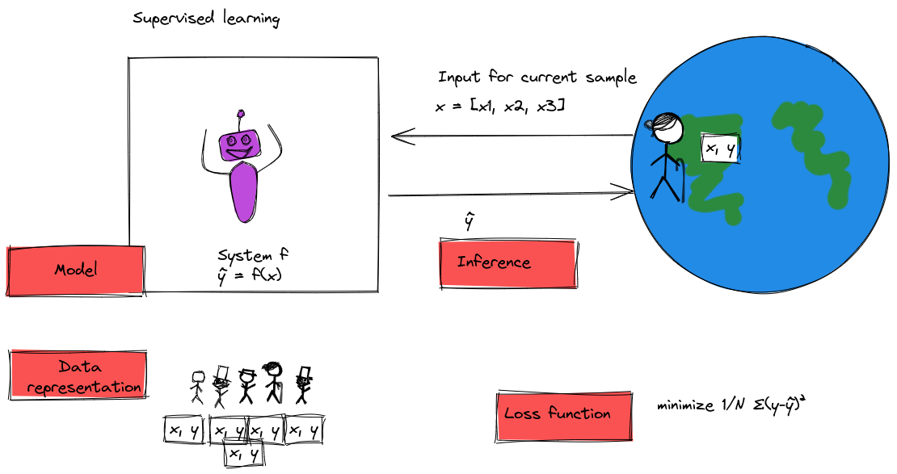
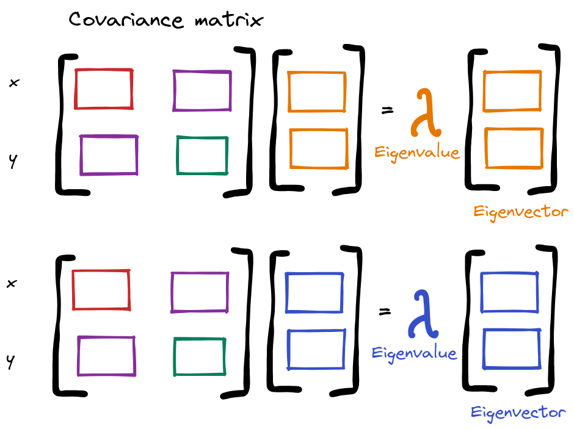
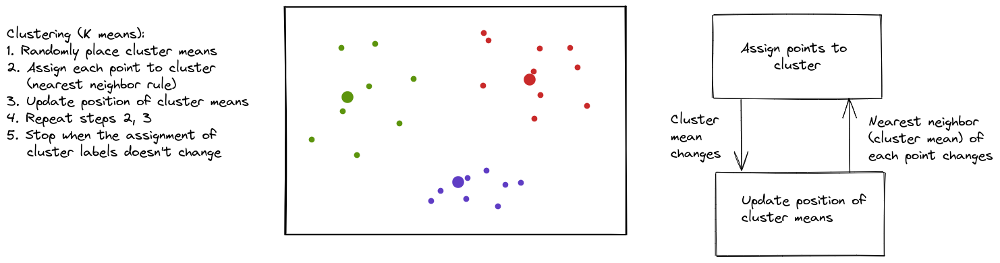
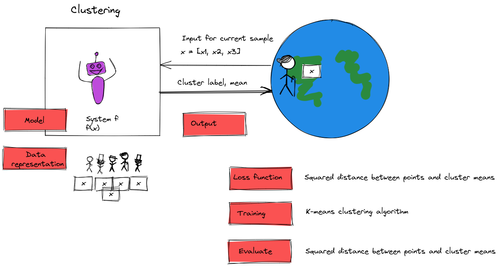
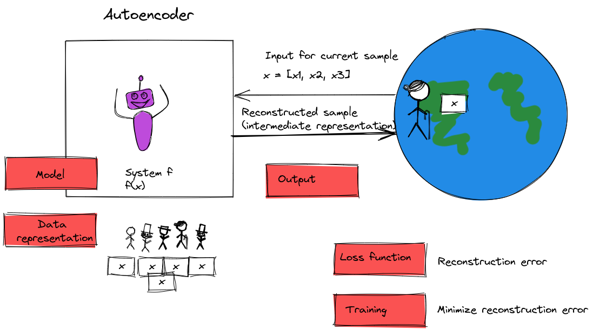
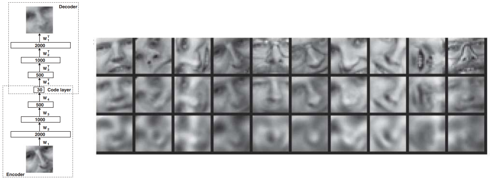

\newpage

## Unsupervised learning

### The basic supervised learning problem

Given a **sample** with a vector of **features**

$$\mathbf{x} = (x_1, x_2,..., x_d)$$

There is some (unknown) relationship between $\mathbf{x}$ and a **target** variable, $y$, whose value is unknown. 

We want to find $\hat{y}$, our **prediction** for the value of $y$.

:::notes

{ width=55% }

:::

### The basic unsupervised learning problem

Given a **sample** with a vector of **features**

$$\mathbf{x} = (x_1, x_2,..., x_d)$$

We want to learn something about the underlying *structure* of the data.

No labels!

::: notes

{ width=55% }

\newpage

What are some things we might be able to learn about the structure of the data?

* dimensionality reduction
* clustering
* anomaly detection
* feature learning
* density estimation

{ width=100% }

:::

## Dimensionality reduction with PCA

::: notes

Why?

* Supervised ML on small feature set
* Visualize data
* Compress data

:::

### Dimensionality reduction problem

* Given $N \times p$ data matrix ${X}$ where each row is a sample $x_n$
* **Problem**: Map data to $N \times p'$ where $p' \ll p$

### Dimensionality reduction with PCA vs feature selection

Previous feature selection:

* Choose subset of existing features 
* Many features are somewhat correlated; redundant information 

Now: *new* features, so we can get max information with min features.

::: notes

{ width=100% }

:::

\newpage

### Projections

Given vectors $z$ and $v$,  $\theta$ is the angle between them. Projection of $z$ onto $v$ is:

$$\hat{z} = \text{Proj}_v (z) = \alpha v, \quad \alpha = \frac{v^T z}{v^T v} = \frac{||z||}{||v||} \cos \theta$$

$V = \{\alpha v | \alpha \in R\}$ are the vectors on the line spanned by $v$, then $\text{Proj}_v (z)$ is the closest vector in $V$ to $z$: $\hat{z} =  \operatorname*{argmin}_{w \in V} || z - w ||^2$. 

::: notes

{ width=35% }

:::

### PCA intution (1)

{ width=60%}

### PCA intuition (2)

](../images/pca-animation.gif){ width=60% }

\newpage

### PCA intuition (3)

Project onto which line?

* Maximize average squared distance from the center to each red dot;  **variance of new feature**
* Minimize average squared length of the corresponding red connecting lines; **total reconstruction error**

::: notes

Can you convince yourself that these two objectives are related, and are achieved by the same projection?

<!-- 
Suppose we have a zero-centered data set ($\bar{x} = 0$) and consider a single data point. The point's contribution to the variance is fixed (red line). We decide the direction of the projection, which will determine the projected point's contribution to the "new" variance (purple line) and the difference between the original point and projected point (green line).
-->

{ width=50% }

The intuition is that, by Pythagorean decomposition: the variance of the data (a fixed quantity) is equal to the variance of the projected data (which we want to be large) plus the reconstruction error (which we want to be small).

<!--
OR, you can think of it as: data variance = remaining variance + lost variance!

-->

:::

### Sample covariance matrix (1)

* sample variance $s_x^2 = \frac{1}{N} \sum_{i=1}^N (x_i - \bar{x}) ^2$
* sample covariance $s_{xy} = \frac{1}{N} \sum_{i=1}^N (x_i - \bar{x})(y_i - \bar{y})$
* $\text{Cov}(x, y)$ is a $p \times p$ matrix $Q$ with components:

$$ Q_{k,l} = \frac{1}{N} \sum_{i=1}^N (x_{ik} - \bar{x}_k)(x_{il} - \bar{x}_l)$$

::: notes

Note: $x$ and $y$ in this notation are two different features, not a feature matrix and label.

{ width=35% }

:::

### Sample covariance matrix (2)

Let $\widetilde{X}$ be the data matrix with sample mean removed, row $\widetilde{x}_i = x_i - \bar{x}$

Sample covariance matrix is:

$$Q = \frac{1}{N} \widetilde{X} ^T \widetilde{X}$$

(compute covariance matrix by matrix product!)

### Directional variance 

Projection onto $v$: $z_i= (v^T \widetilde{x}_i) v$

* Sample mean: $\bar{z} = v^T \bar{x}$
* Sample variance: $s_z^2 = v^T Q v$

::: notes

Now we have these mean-removed rows of data, and we want to project each row onto some vector $v$, where $z$ is the projection of $\widetilde{x}_i$ onto $v$. And we want to choose $v$ to maximize the variance of $z$, $s_z^2$. 

We will call this the *directional variance* - the variance of the projection of the row onto $v$.

:::

### Maximizing directional variance (1)

Given data $\widetilde{x}_i$, what directions of unit vector $v$ ($||v|| = 1$) maximizes the variance of projection along direction of $v$?

$$\operatorname*{max}_v v^T Q v \quad \text{s.t} ||v|| = 1$$

::: notes

Important note:

* an eigenvector is a special vector that, when you multiply the covariance matrix by the eigenvector, the result is a shorter or longer eigenvector pointing in the *same direction*. 
* the eigenvalue is the value by which eigenvector is scaled when multiplied by the covariance matrix.
* a $p \times p$ matrix has $p$ eigenvectors.
* the eigenvectors are orthogonal.

{ width=35% }

:::

### Maximizing directional variance (2)

Let $v_1, \ldots, v_p$ be *eigenvectors* of $Q$ (there are $p$): 

$$Q v_j = \lambda_j v_j$$

* Sort them in descending order: $\lambda_1 \geq \lambda_2 \geq \cdots \lambda_p$. 
* The largest one is the vector that maximizes directional variance, the next is direction of second most variance, etc.

::: notes

**Theorem**: any eigenvector of $Q$ is a local maxima of the optimization problem

$$\operatorname*{max}_v v^T Q v \quad \text{s.t} ||v|| = 1$$

**Proof**:  Define the Lagrangian, 

$$L(v, \lambda) = v^T Qv - \lambda [ || v||^2 -1]$$

At any local maxima,

$$\frac{\partial L}{\partial v} = 0 \implies Qv - \lambda v = 0$$

Therefore, $v$ is an eigenvector of $Q$.

For a nice, detailed proof of this, I recommend [this set of notes](http://www.stat.cmu.edu/~cshalizi/uADA/12/lectures/ch18.pdf) by Cosma Shalizi at CMU.

:::

### Projections onto eigenvectors: uncorrelated features

* Eigenvectors are orthogonal: $v_j^T v_k = 0$ if $j \neq k$
* So the projections of the data onto eigenvectors are uncorrelated

::: notes
 
 These are called the _principal components_
 
::: 

### PCA intuition (5)

](../images/pca-animation.gif){ width=50% }

\newpage

### PCA in summary (1)

Given high-dimensional data,

1. Center data (remove mean)
2. Get covariance matrix
3. Get eigenvectors, eigenvalues
4. Sort by eigenvalue
5. Choose $p'$ eigenvectors with largest eigenvalues
6. Project data onto those eigenvectors

Now you have $N \times p'$ data that maximizes info

::: notes

Note: in practice, we compute PCA using singular value decomposition (SVD) which is numerically more stable.

{ width=70% }

:::
\newpage

### Approximating data

Given data $\widetilde{x}_i$, $i=1, \ldots, N$, and PCs $v_1, \ldots, v_p$, we can project + then reconstruct the data:

$$\widetilde{x}_i = \sum_{j=1}^p (v_j^T \widetilde{x}_i) v_j $$

Consider approximation with *first* $d < p$ coefficients: 

$$\hat{x}_i = \sum_{i=1}^d (v_j^T \widetilde{x}_i) v_j$$

### Average approximation error

For sample $i$, error is:

$$\widetilde{x}_i - \hat{x}_i = \sum_{j=d+1}^p (v_j^T \widetilde{x}_i) v_j$$

::: notes

The projection onto the first principal components carries the most information; the projection onto the last principal components carries the least. So the error due to missing the last PCs is small!

:::

<!--
which, on average, is sum of smallest $p-d$ eigenvalues:

$$\frac{1}{N} \sum_{i=1}^N ||\widetilde{x}_i - \hat{x}_i||^2 = \sum_{j=d+1}^p \lambda_j$$ -->

<!-- see page 14 of https://www.dcs.bbk.ac.uk/~ale/dsta/dsta-7/zaki-data_mining_and_analysis-ch7.pdf -->

### Proportion of variance explained

The \emph{proportion of variance} explained by $d$ PCs is:

$$PoV(d) = \frac{\sum_{j=1}^d \lambda_j} {\sum_{j=1}^p \lambda_j }$$

where the denominator is variance of projected data:  $\frac{1}{N} \sum_{i=1}^N ||\widetilde{x}_i||^2 = \sum_{j=1}^p \lambda_j$

<!--

### PCA demo

[Notebook link](https://colab.research.google.com/drive/18mMQF9VK8A7ehR1v8G4k5yiopoHsptNv)

### PCA reference

Excellent set of notes on the topic: [Link](https://www.stat.cmu.edu/~cshalizi/uADA/12/lectures/ch18.pdf)

--> 

\newpage

## Clustering

### Clustering problem

* Given $N \times d$ data matrix ${X}$ where each row is a sample $x_n$

* **Problem**: Group data into $K$ clusters
* More formally: Assign $\sigma_n = \{1, \ldots, K\}$ cluster label for each sample
* Samples in same cluster should be close: $||x_n - x_m||$ is small when $\sigma_n = \sigma_m$

### K-means clustering 

We want to minimize 

$$J = \sum_{i=1}^K \sum_{n\in C_i} || x_n - \mu_j || ^2 $$

* $u_i$ is the mean of each cluster
* $\sigma_n \in \{1, \ldots, K\}$ is the cluster that $x_n$ belongs to 

<!-- _
{ width=70% }
-->

### K-means algorithm

Start with random (?) guesses for each $\mu_i$. Then, iteratively:

* Update cluster membership (nearest neighbor rule): For every $n$, 

$$\sigma_n = \operatorname*{argmin}_i ||x_n - \mu_i||^2$$

* Update mean of each cluster (centroid rule): for every $i$, $u_i$ is  average of $x_n$ in $C_i$ 

(Sensitive to initial conditions!)

:::notes

{width=90%}

:::

\newpage

### K-means visualization

{width=70%}

### K-means summary

:::notes

{ width=80% }

:::

<!--

### K-means demo

[Notebook link](https://colab.research.google.com/github/jakevdp/PythonDataScienceHandbook/blob/master/notebooks/05.11-K-Means.ipynb)

### Last week

Two "classical" ML methods:

* K means for clustering
* PCA for dimensionality reduction

This week: deep unsupervised learning

--> 

\newpage

## Dimensionality reduction with deep learning

### Dimensionality reduction using an autoencoder

An *autoencoder* is a learner that includes:

* Encoder: produces low-dimensional representation of input, $x \rightarrow z$
* Decoder: reconstructs an estimate of input from the low-dimensional representation, $z \rightarrow \hat{x}$
* $z$ known as *latent variables*, *latent representation*, or *code*

:::notes

{ width=70% }

:::

### K-means as an autoencoder (1)

* Encoder: map each data point to one of $K$ clusters 
* Decoder: "reconstruct" data point as center of its cluster

### K-means as an autoencoder (2)

* Let $X\in \mathbb{R}^{n\times d}$ be the data matrix containg $n$ $d$-dimensional data points. 
* Let $Z$ be a $n\times k$ matrix (if $k$ clusters) where each entry is all zeros, except for one 1
* Let $D$ be a $k\times d$ matrix of cluster centers.

### K-means as an autoencoder (3)

* Encoder performs non-linear mapping, expresses result as one-hot vector in $Z$.
* Decoder is linear: 

$$X\approx \hat{X} = ZD$$

:::notes
Note: $Z$ was $n \times k$, $D$ was $k \times d$, so $ZD$ will be $n \times d$.
:::

### PCA as an autoencoder (1)

* Let $X\in \mathbb{R}^{n\times d}$ be the (mean-removed) data matrix containg $n$ $d$-dimensional data points. 
* Let $V$ be a $d\times k$ matrix of $k$ eigenvectors with highest eigenvalues
* $Z = XV$ is the $n \times k$ matrix of PCA projections
* Then $X\approx \hat{X} = ZV^T$

### PCA as an autoencoder (2)

* Encoder: linear projection using $k$ best principal components 
* Decoder: also linear projection 

### Limits of PCA

* PCA learns linear projection
* Neural network with non-linear activation  function can learn complex non-linear features
* Use neural network to do something like PCA?

### Neural autoencoder

* Neural network with $d$ inputs, $d$ outputs
* Use input as target 
* (*Self-supervised*: creates its own labels)
* Train network to learn approximation of identity function

::: notes

{ width=70% }

What should the architecture of the network be?

:::

\newpage

### Overcomplete autoencoder

{ width=30% }

### Undercomplete autoencoder

{ width=30% }

### Sparse autoencoder (1)

* Does a small "bottleneck" force autoencoder to learn useful latent features?
* Even if "bottleneck" is very small, can still memorize data by encoding index
* Instead of limiting number of hidden nodes, add a penalty function on *activations*

<!-- https://www.jeremyjordan.me/autoencoders/ -->

### Sparse autoencoder (2)

Allow many hidden units, but for a given input, most of them must produce a very small activation.

* Add penalty term to loss function, like regularization, but not on weights!
* Penalty is on average activation value (over all the training samples)

\newpage

### Autoencoder comparison

* **Undercomplete autoencoder**: uses entire network for each sample. Limits capacity to memorize, but also limits capacity to extract complex features.
* **Sparse autoencoder**: different parts of network can "specialize" depending on input. Limits capacity to memorize, but can still extract complex features.

### What are autoencoders good for?

* Not typically useful for compression - too data-specific
* Can use to initialize supervised learning model - throw away decoder, fine-tune with classifier
* Can use for dimensionality reduction for data visualization (often in combination with other unsupervised learning methods)
* Can use for data denoising

<!--
### Autoencoder demo

[Demo link](https://colab.research.google.com/drive/1rBsUxtDFbn4iPOHQcoEvZyFORTtWwmoo?usp=sharing)

-->

### Example: reconstruction of faces

{ width=80% }

### Example: MNIST visualization

{ width=80% }

\newpage

## Density estimation

### Types of density estimation

* Explicit: define and solve for density (then sample from it if you want)
* Implicit: sample from density without defining it

<!--
### Generative models

Given a set of data instances $X$ and a set of labels $y$,

* Generative models capture the joint probability $p(X, y)$, or just $p(X)$ if there are no labels.
* Discriminative models capture the conditional probability $p(y | X)$
-->

### GAN: Generative adversarial networks

* From [Goodfellow et al 2014](https://arxiv.org/abs/1406.2661)
* Unsupervised, generative, implicit density estimation: Given training data, generate new samples from same distribution 

### GAN: basic idea (1)

Two neural networks play a "game":

Generator: 

* takes random noise $z$ drawn from $p_z$ as input, 
* generates samples, tries to trick "discriminator" into believing they are real,
* learns parameters $\theta$.

### GAN: basic idea (2)

Discriminator: 

* takes samples $x$ drawn from $p_\text{data}$ as input, 
* produces classification $y$ (1=real, 0=fake), 
* learns parameters $\phi$.

### Discriminator loss function (1)

Discriminator wants to update its parameters $\phi$ so 

* $D_\phi({x})$ (output for real data) is close to 1 
* $D_\phi(G_\theta({z}))$ (output for generated data) is close to 0

### Discriminator loss function (2)

Binary cross-entropy loss:

$$- \sum_{i=1}^N y_i \log D_\phi(x_i) - \sum_{i=1}^N (1-y_i) \log (1-D_\phi(x_i))$$

Left side is for "true" samples and the right side is for "fake" samples...

### Discriminator objective

Replace sums with expectations, then discriminator wants to *maximize*

$$\mathbb{E}_{x \sim {p}_{\textrm{data}}} [\log D_\phi({x})] + 
\mathbb{E}_{z \sim p_{z}} [\log (1-D_\phi(G_\theta({z})))]$$

### Generator objective (1)

Generator wants to update its parameters $\theta$ so that:

* $D_\phi(G_\theta({z}))$ (output for generated data) is close to 1
* Minimize $\mathbb{E}_{z \sim p_{z}} [\log (1-D_\phi(G_\theta({z})))]$

### Overall objective

$$\min_{\theta} \max_{\phi}  \mathbb{E}_{x \sim {p}_{\textrm{data}}} [\log D_\phi({x})] + 
\mathbb{E}_{z \sim p_{z}} [\log (1-D_\phi(G_\theta({z})))]$$

### Problem: gradient of cross-entropy loss

* Cross-entropy loss designed to accelerate learning (steep gradient) when classifier is wrong
* Gradient is flat when classifier is correct, when generator needs to improve!

### Generator objective (2)

* Instead, generator can do gradient *ascent* on the objective  

$$\log \left(D_\phi(G_\theta({z}^{(i)})) \right)$$

* Instead of minimizing likelihood of discriminator being correct, now
maximizing likelihood of discriminator being wrong.  
* Can still learn even when discriminator is successful at rejecting generator samples

### Training: First, update discriminator

1. Get mini-batch of size $m$ from data: ${x}^{(1)}, \ldots, {x}^{(m)} \sim p_\text{data}$
2. Get mini-batch of size $m$ from noise input: ${z}^{(1)}, \ldots, {z}^{(m)} \sim p_z$
3. Forward pass: get $G_\theta({z}^{(i)})$ for each noise input, get $D_\phi({x}^{(i)})$ for each real sample, get $D_\phi(G_\theta({z}^{(i)}))$ for each fake sample.
4. Backward pass: gradient *ascent* on discriminator parameters $\phi$:

$$\frac{1}{m}  \sum_{i=1}^m \left[\log D_\phi({x}^{(i)}) + \log (1 - D_\phi(G_\theta({z}^{(i)}))) \right]$$

::: notes

:::

### Training: Then, update generator

5. Get mini-batch of size $m$ from noise input: ${z}^{(1)}, \ldots, {z}^{(m)} \sim p_z$
6. Forward pass: get $G_\theta({z}^{(i)})$ for each noise input, get $D_\phi(G_\theta({z}^{(i)}))$ for each fake sample.
7. Backward pass: gradient *ascent* on generator parameters $\theta$:

$$\frac{1}{m}  \sum_{i=1}^m \log \left(D_\phi(G_\theta({z}^{(i)})) \right)$$

\newpage

### Illustration: training discriminator

{ width=100% }

### Illustration: training generator

{ width=100% }

<!--

### GAN demo

[GAN Lab in browser](https://poloclub.github.io/ganlab/)

-->