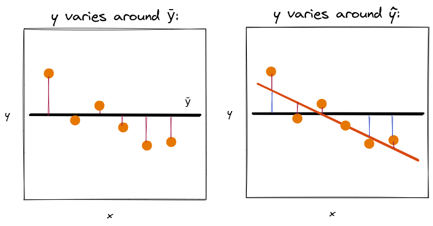

\newpage

## In this lecture

* Simple (univariate) linear regression
* Multiple linear regression
* Linear basis function regression
* OLS solution for simple regression
* Interpretation 
* OLS solution for multiple/LBF regression
* Solution using gradient descent 

## Regression

### Regression - quick review

The output variable $y$ is continuously valued.

We need a function $f$ to map each input vector $\mathbf{x_i}$ to a prediction, 

$$\hat{y_i} = f(\mathbf{x_i})$$

where (we hope!) $\hat{y_i} \approx y_i$.

### Prediction by mean

Last week, we imagined a simple model that predicts the mean of target variable in training data:

$$\hat{y} = w_0$$

where $w_0 = \frac{1}{n} \sum_{i=1}^n y_i = \bar{y}$.

### Prediction by mean, illustration

::: notes

{ width=80% }

\newpage

Note that the loss function we defined for this problem - sum of squared differences between the true value and predicted value - is the variance of $y$.

Under what conditions will that loss function be very small (or even zero)?

{ width=50% }

:::

### Sample mean, variance - definitions

Sample mean and variance:

$$\bar{y} = \frac{1}{n} \sum_{i=1}^n y_i, \quad \sigma_y^2 = \frac{1}{n} \sum_{i=1}^n (y_i - \bar{y}) ^2$$

## Simple linear regression

::: notes

A "simple" linear regression is a linear regression with only one feature.

:::

### Regression with one feature

For simple linear regression, we have feature-label pairs:

$$(x_i, y_i), i=1,2,\cdots,n$$

(we'll often drop the index $i$ when it's convenient.)

### Simple linear regression model

Assume a linear relationship:

$$ \hat{y} = w_0 + w_1 x$$

where $\mathbf{w} = [w_0, w_1]$, the intercept and slope, are model **parameters** that we *fit* in training.

\newpage

### Residual term (1)

There is variance in $y$ among the data:

* some of it is "explained" by $f(x) = w_0 + w_1 x$
* some of the variance in $y$ is *not* explained by $f(x)$

::: notes

{ width=40% }

Maybe $y$ varies with some other function of $x$, maybe part of the variance in $y$ is explained by other features not in $x$, maybe it is truly "random"...

:::

### Residual term (2)

The *residual* term captures everything that isn't in the model:

$$y = w_0 + w_1 x + e$$

where $e = y - \hat{y}$.

### Example: TX vaccination levels

.](../images/2-reg-tx-covid.jpeg){ width=45% }

\newpage

::: notes

Suppose we want to use linear regression to "predict" the vaccination levels of a TX county, given its vote in the 2020 election. The share of vote for the Republican candidate partly "explains" the variance among TX counties.

* The predicted value for each county, $\hat{y}$, is along the diagonal line. Draw a vertical line from each county's point ($y$) to the corresponding point on the line ($\hat{y}$). This is the residual $e = y - \hat{y}$.
* Travis county is an example of a county that is explained "well" by the linear model.
* Presidio county is an example of a county that is not explained as well by the linear model. The magnitude of the *residual* is greater for this county.
* The difference between the "true" value $y$ and the predicted value $\hat{y}$ may be due to all kinds of differences between Travis county and Presidio county - not everything about vaccination level can be explained by 2020 vote share! This is what the residual captures.

Interpreting the linear regression: If slope $w_1$ is -0.4176 percent vaccinated/percent voting for Trump, we can say that 

* a 1-point increase in share of Trump voters is, on average, associated with a 0.4176 point decrease in percent of population vaccinated as of 6/14/21.

What can we say about possible explanations? We can't say much using this method - anything is possible:

* statistical fluke
* causal - Republican local governments may run less aggressive vaccine campaign
* partisanship/political values may be responsible for both vote and vaccination attitude among individuals
* confounding variable -. rural areas are more difficult to coordinate vaccines for, and also have higher vote share for Trump

This method doesn't tell us *why* this association is observed, only that it is. (There are other methods in statistics for determining whether it is a statistical fluke, or for determining whether it is a causal relationship.)

(Also note that the 0.4176 point decrease is only an *estimate* of the "true" relationship.)

:::

\newpage

## Multiple linear regression

### Matrix representation of data

Represent data as a **matrix**, with $n$ samples and $d$ features;
one sample per row and one feature per column:

$$ X = 
\begin{bmatrix}
x_{1,1} & \cdots & x_{1,d} \\
\vdots  & \ddots & \vdots  \\
x_{n,1} & \cdots & x_{n,d} 
\end{bmatrix},
y = 
\begin{bmatrix}
y_{1}  \\
\vdots \\
y_{n} 
\end{bmatrix}
$$

$x_{i,j}$ is $j$th feature of $i$th sample.

### Linear model

For a given sample (row), assume a linear relationship between feature vector $\mathbf{x_i} = [x_{i,1}, \cdots, x_{i,d}]$ and scalar target variable $y_i$:

$$ \hat{y_i} = w_0 + w_1 x_{i,1} + \cdots + w_d x_{i,d} $$

Model has $d+1$ **parameters**. 

::: notes

* Samples are vector-label pairs: $(\mathbf{x_i}, y_i), i=1,2,\cdots,n$
* Each sample has a feature vector $\mathbf{x_i} = [x_i,1, \cdots, x_i,d]$ and scalar target $y_i$
* Predicted value for $i$th sample will be $\hat{y_i} = w_0 + w_1 x_{i,1} + \cdots + w_d x_{i,d}$

It's a little awkward to carry around that $w_0$ separately, if we roll it in to the rest of the weights we can use a matrix representation...

:::

### Matrix representation of linear regression (1)

Define a new **design matrix** and **weight vector**:

$$ A = 
\begin{bmatrix}
1 & x_{1,1} & \cdots & x_{1,d} \\
\vdots & \vdots  & \ddots & \vdots  \\
1 & x_{n,1} & \cdots & x_{n,d} 
\end{bmatrix},
\mathbf{w} = 
\begin{bmatrix}
w_{0}  \\
w_{1}  \\
\vdots \\
w_{d} 
\end{bmatrix}
$$

### Matrix representation of linear regression (2)

Then, $\hat{\mathbf{y}} = A\mathbf{w}$.

And given a new sample with feature vector $\mathbf{x}$, predicted value is $\hat{y} = [1, \mathbf{x}^T] \mathbf{w}$.

\newpage

::: notes

Here is an example showing the computation:

{ width=60% }

What does the residual look like in the multivariate case?

:::

### Illustration - residual with two features

{ width=50% }

\newpage

## Linear basis function regression

::: notes

The assumption that the output is a linear function of the input features is very restrictive. Instead, what if we consider *linear combinations* of *fixed non-linear* functions?

:::

### Basis functions

A function 

$$ \phi_j (\mathbf{x}) = \phi_j (x_1, \cdots, x_d) $$ 

is called a **basis function**. 

### Linear basis function model for regression

Standard linear model:

$$ \hat{y_i} = w_0 + w_1 x_{i,1} + \cdots + w_d x_{i,d} $$

Linear basis function model:

$$ \hat{y_i} =  w_0 \phi_0(\mathbf{x_i}) + \cdots + w_p \phi_p(\mathbf{x_i}) $$

::: notes

Some notes:

* The 1s column we added to the design matrix is easily represented as a basis function.
* There is not necessarily a one-to-one correspondence between the columns of $X$ and the basis functions ($p \neq d$ is OK!). You can have more basis functions than columns of $X$.
* Each basis function can accept as input the entire vector $\mathbf{x_i}$.
* The model has $p + 1$ parameters.

:::

### Vector form of linear basis function model

The prediction of this model expressed in vector form is:

$$\hat{y_i} = \langle \mathbf{\phi (x_i)}, \mathbf{w} \rangle $$

where

$$
\mathbf{\phi (x_i)} = [\phi_0 (\mathbf{x_i}), \cdots, \phi_p (\mathbf{x_i})], \mathbf{w} = [w_0, \cdots, w_p]
$$

::: notes

Note: the angle brackets denote a dot product!

:::

### Matrix form of linear basis function model

Given data $(\mathbf{x_i},y_i), i=1,\cdots,n$:

$$ 
\Phi = 
\begin{bmatrix}
\phi_0 (\mathbf{x_1}) & \phi_1 (\mathbf{x_1}) & \cdots & \phi_p (\mathbf{x_1}) \\
\vdots  & \vdots & \ddots & \vdots  \\
\phi_0 (\mathbf{x_n}) & \phi_1 (\mathbf{x_n}) &\cdots & \phi_p (\mathbf{x_n}) 
\end{bmatrix} 
$$

and $\mathbf{\hat{y}} = \Phi \mathbf{w}$.

\newpage

### "Recipe" for linear regression (???)

1. Get **data**: $(\mathbf{x_i}, y_i), i=1,2,\cdots,n$ 
2. Choose a **model**: $\hat{y_i} = \langle \mathbf{\phi (x_i)}, \mathbf{w} \rangle$
3. Choose a **loss function**: **???**
4. Find model **parameters** that minimize loss: **???**
5. Use model to **predict** $\hat{y}$ for new, unlabeled samples
6. Evaluate model performance on new, unseen data

::: notes

Now that we have described some more flexible versions of the linear regression model, we will turn to the problem of finding the weight parameters, starting with the simple linear regression. (The simple linear regression solution will highlight some interesting statistical relationships.)

:::

## Ordinary least squares solution for simple linear regression

### Mean squared error

We will use the *mean squared error* (MSE) loss function:

$$ L(\mathbf{w}) = \frac{1}{n} \sum_{i=1}^n (y_i - \hat{y_i})^2 = \frac{1}{n} \sum_{i=1}^n ( e_i )^2 $$ 

a variation on the *residual sum of squares* (RSS):

$$\sum_{i=1}^n (y_i - \hat{y_i})^2 = \sum_{i=1}^n ( e_i )^2 $$ 

::: notes

"Least squares" solution: find values of $\mathbf{w}$ to minimize MSE.

:::

### "Recipe" for linear regression

1. Get **data**: $(\mathbf{x_i}, y_i), i=1,2,\cdots,n$ 
2. Choose a **model**: $\hat{y_i} = \langle \mathbf{\phi (x_i)}, \mathbf{w} \rangle$
3. Choose a **loss function**: $L(\mathbf{w}) = \frac{1}{n} \sum_{i=1}^n (y_i - \hat{y_i})^2$
4. Find model **parameters** that minimize loss: $\mathbf{w^*}$
5. Use model to **predict** $\hat{y}$ for new, unlabeled samples
6. Evaluate model performance on new, unseen data

::: notes

How to find $\mathbf{w^*}$?

The loss function is convex, so to find $\mathbf{w^*}$ where $L(\mathbf{w})$ is minimized, we:

* take the partial derivative of $L(\mathbf{w})$ with respect to each entry of $\mathbf{w}$
* set each partial derivative to zero

:::

\newpage

### Optimizing $\mathbf{w}$ - simple linear regression (1)

Given 

$$ MSE(w_0, w_1) = \frac{1}{n} \sum_{i=1}^n [y_i - (w_0 + w_1 x_i) ]^2 $$

we take

$$ \frac{\partial MSE}{\partial w_0} = 0, \frac{\partial MSE}{\partial w_1} = 0$$

### Optimizing $\mathbf{w}$ - simple linear regression (2)

First, the intercept:

$$ MSE(w_0, w_1) = \frac{1}{n} \sum_{i=1}^n [y_i - (w_0 + w_1 x_i) ] ^2 $$

$$ \frac{\partial MSE}{\partial w_0} =  -\frac{2}{n} \sum_{i=1}^n [y_i - (w_0 + w_1 x_i)] $$

using chain rule, power rule. 

::: notes

(We can then drop the $-2$ constant factor when we set this expression equal to $0$.)

:::

### Optimizing $\mathbf{w}$ - simple linear regression (3)

Set this equal to $0$, "distribute" the sum, and we can see

$$\frac{1}{n} \sum_{i=1}^n [y_i - (w_0 + w_1 x_i)] = 0$$

$$ \implies w_0^* = \bar{y} - w_1^* \bar{x}$$

where $\bar{x}, \bar{y}$ are the means of $x, y$.

### Optimizing $\mathbf{w}$ - simple linear regression (4)

Now, the slope coefficient:

$$ MSE(w_0, w_1) = \frac{1}{n} \sum_{i=1}^n [y_i - (w_0 + w_1 x_i) ] ^2 $$

$$ \frac{\partial MSE}{\partial w_1} = \frac{1}{n}\sum_{i=1}^n  2(y_i - w_0 -w_1 x_i)(-x_i)$$

### Optimizing $\mathbf{w}$ - simple linear regression (5)

$$  \implies -\frac{2}{n} \sum_{i=1}^n x_i (y_i - w_0 -w_1 x_i)  = 0$$

Solve for $w_1^*$:

$$ w_1^*  = \frac{\sum_{i=1}^n (x_i - \bar{x})(y_i - \bar{y}) }{\sum_{i=1}^n (x_i - \bar{x})^2}$$

::: notes

Note: some algebra is omitted here, but refer to the secondary notes for details.

:::

### Optimizing $\mathbf{w}$ - simple linear regression (6)

The slope coefficient is the ratio of *sample covariance* $\sigma_{xy}$ to *sample variance* $\sigma_x^2$:

$$ \frac{\sigma_{xy}}{\sigma_x^2} $$

where $\sigma_{xy} = \frac{1}{n} \sum_{i=1}^n (x_i - \bar{x})(y_i - \bar{y})$ and $\sigma_x^2 = \frac{1}{n} \sum_{i=1}^n (x_i - \bar{x}) ^2$

### Optimizing $\mathbf{w}$ - simple linear regression (7)

We can also express it as

$$ \frac{r_{xy} \sigma_y}{\sigma_x} $$

where sample correlation coefficient 
$r_{xy} = \frac{\sigma_{xy}}{\sigma_x \sigma_y}$.

::: notes

(Note: from Cauchy-Schwartz law, $|\sigma_{xy}| < \sigma_x \sigma_y$, we know $r_{xy} \in [-1, 1]$)

:::

::: {.cell .markdown}

### MSE for optimal simple linear regression

$$MSE(w_0^*, w_1^*) = \sigma_y^2 - \frac{\sigma_{xy}^2}{\sigma_{x}^2} $$ 

$$\implies \frac{MSE(w_0^*, w_1^*)}{\sigma_y^2} =  1- \frac{\sigma_{xy}^2}{\sigma_{x}^2 \sigma_{y}^2}$$

::: notes

* the ratio on the left is the *fraction of unexplained variance*: of all the variance in $y$, how much is still "left" unexplained after our model explains some of it? (best case: 0)
* the ratio on the right is the *coefficient of determination*, R2 (best case: 1).

:::

:::

\newpage

## Regression metrics

### Many numbers:

* Correlation coefficient R ($r_{xy}$)
* Slope coefficient $w_1$ and intercept $w_0$
* RSS, MSE, R2

::: notes

Which of these depend only on the data, and which depend on the model too?

Which of these tell us something about the "goodness" of our model?

:::

### Interpreting R: correlation coefficient

### Interpreting R2: coefficient of determination (1)

$$R2 = 1 - \frac{MSE}{\sigma_y^2} = 1 -
\frac{\sum_{i=1}^n (y_i - \hat{y_i})^2}{\sum_{i=1}^n (y_i - \overline{y_i})^2}$$

For linear regression: What proportion of the variance in $y$ is "explained" by our model?

* $R^2 \approx 1$ - model "explains" all the variance in $y$
* $R^2 \approx 0$ - model doesn't "explain" any of the variance in $y$

### Interpreting R2: coefficient of determination (2)

Alternatively: what is the ratio of error of our model, to error of prediction by mean?

$$R2 = 1 - \frac{MSE}{\sigma_y^2} = 1 -
\frac{\sum_{i=1}^n (y_i - \hat{y_i})^2}{\sum_{i=1}^n (y_i - \overline{y_i})^2}$$

\newpage

### Example: TX vaccination levels (2)

.](../images/2-reg-tx-covid.jpeg){ width=40% }

### Example: FL vaccination levels

.](../images/2-reg-fl-covid.jpeg){ width=40% }

::: notes

In Florida, a change in vote share is associated with a bigger change in vaccination level than in Texas; but in Texas, more of the variance among counties is explained by the linear regression on vote share.

:::

\newpage

## Ordinary least squares solution for multiple/linear basis function regression

### Setup: L2 norm

Definition: L2 norm of a vector $\mathbf{x} = (x_1, \cdots, x_n)$:

$$ || \mathbf{x} || = \sqrt{x_1^2 + \cdots + x_n^2}$$

We will want to minimize the L2 norm of the residual.

### Setup: Gradient vector

To minimize a multivariate function $f(\mathbf{x}) = f(x_1, \cdots, x_n)$, we find places where the **gradient** is zero, i.e. each entry must be zero:

$$ \nabla f(\mathbf{x}) = 
\begin{bmatrix}
\frac{\partial f(\mathbf{x})}{\partial x_1}  \\
\vdots \\
\frac{\partial f(\mathbf{x})}{\partial x_n}  \\
\end{bmatrix}
$$

::: notes

The gradient is the vector of partial derivatives.

:::

### MSE for multiple/LBF regresion

Given a vector $\mathbf{y}$ and matrix $\Phi$ (with $d$ columns, $n$ rows), 

$$L(\mathbf{w}) = \frac{1}{2} \|\mathbf{y} - \Phi \mathbf{w}\|^2$$

where the norm above is the L2 norm. 

::: notes

(we defined it with a $\frac{1}{2}$ constant factor for convenience.)

:::

### Gradient of MSE 

$$L(\mathbf{w}) = \frac{1}{2} \|\mathbf{y} - \Phi \mathbf{w}\|^2$$

gives us the gradient

$$\nabla L(\mathbf{w}) = - \Phi^T (\mathbf{y} -  \Phi \mathbf{w})$$

### Solving for $\mathbf{w}$

$$
\begin{aligned}
\nabla L(\mathbf{w}) &= 0, \\
- \Phi^T (\mathbf{y}  - \Phi \mathbf{w}) &= 0, \\
\Phi^T \Phi \mathbf{w} &= \Phi^T \mathbf{y} ,~~\text{or}\\
\mathbf{w} &= (\Phi^T \Phi)^{-1} \Phi^T \mathbf{y}  .
\end{aligned}
$$

### Solving a set of linear equations

If $\Phi^T \Phi$ is full rank (usually: if $n \geq d$), then a unique solution is given by

$$\mathbf{w^*} = \left(\Phi^T \Phi \right)^{-1} \Phi^T \mathbf{y}$$

This expression:

$$\Phi^T \Phi \mathbf{w} =  \Phi^T \mathbf{y}$$

represents a set of $d$ equations in $d$ unknowns, called the *normal equations*. 

::: notes

We can solve this as we would any set of linear equations (see supplementary notebook on computing regression coefficients by hand.)

:::

## Solution using gradient descent

### Why gradient descent?

We had

$$\mathbf{w^*} = \left(\Phi^T \Phi \right)^{-1} \Phi^T \mathbf{y}$$

where $\Phi$ is an $n \times d$ matrix. If $n \geq d$ then it is (usually) full rank and a unique solution exists.

What if $n$, $d$ are large?

::: notes

Runtime of a "naive" solution using "standard" matrix multiplication: 

* $O(dn^2)$ to multiply $\Phi^T \Phi$
* $O(dn)$ to muplity $\Phi^T y$
* $O(d^3)$ to compute the inverse of $\Phi^T \Phi$ (the "naive" way, although there are more efficient ways)

Since $n$ is generally much larger than $d$, the first term dominates and the runtime is $O(dn^2)$. Can we do better?

(Note: in practice, there ways to solve a system of linear equations that are quicker than $O(dn^2)$.)

:::

### Gradients and optimization 

Gradient has *two* important properties for optimization:

At a minima (or maxima, or saddle point), 

$$\nabla L(\mathbf{w}) = 0$$

At other points, $\nabla L(\mathbf{w})$ points towards direction of maximum (infinitesimal) *increase*.

\newpage

### Gradient descent idea

To move towards minimum of a (smooth, convex) function, use first order approximation: 

Start from some initial point, then iteratively 

* compute gradient at current point, and 
* add some fraction of the negative gradient to the current point

### Visual example: least square solution 3D plot

{ width=40% }

### Standard ("batch") gradient descent

For each step $t$ along the error curve:

$$
\begin{aligned}
\mathbf{w}^{t+1} &= \mathbf{w}^t - \alpha \nabla L(\mathbf{w}^t) \\
 &= \mathbf{w}^t - \frac{\alpha}{n} \sum_{i=1}^n \nabla L_i(\mathbf{w}^t, \mathbf{x}_i, y_i)
\end{aligned}
$$

Repeat until stopping criterion is met.

::: notes

To update $\mathbf{w}$, must compute $n$ loss functions and gradients - each iteration is $O(nd)$. We need multiple iterations, but as long as we need fewer than $n$ iterations, it's more efficient than the previous approach.

However, if $n$ is large, it may still be expensive!

:::

\newpage

### Stochastic gradient descent 

Idea: 

At each step, compute estimate of gradient using only one randomly selected sample, and move in the direction it indicates.

Many of the steps will be in the wrong direction, but progress towards minimum occurs *on average*, as long as the steps are small.

::: notes

Each iteration is now only $O(d)$, but we may need more iterations. However, as long as we need fewer than $n$ iterations, we come out ahead.

See supplementary notes for an analysis of the number of iterations needed.

:::

### Mini-batch (also "stochastic") gradient descent (1)

Idea: 

At each step, select a small subset of training data ("mini-batch"), and evaluate gradient on that mini-batch. 

Then move in the direction it indicates.

### Mini-batch (also "stochastic") gradient descent (2)

For each step $t$ along the error curve: 

* Select random mini-batch $I_t\subset{1,\ldots,n}$
* Compute gradient approximation:

$$g^t = \frac{1}{|I_t|} \sum_{i\in I_t} \nabla L(\mathbf{x}_i, y_i, \mathbf{w}^t)$$

* Update parameters: $\mathbf{w}^{t+1} = \mathbf{w}^t - \alpha^t g^t$

## Next: more on linear regression
