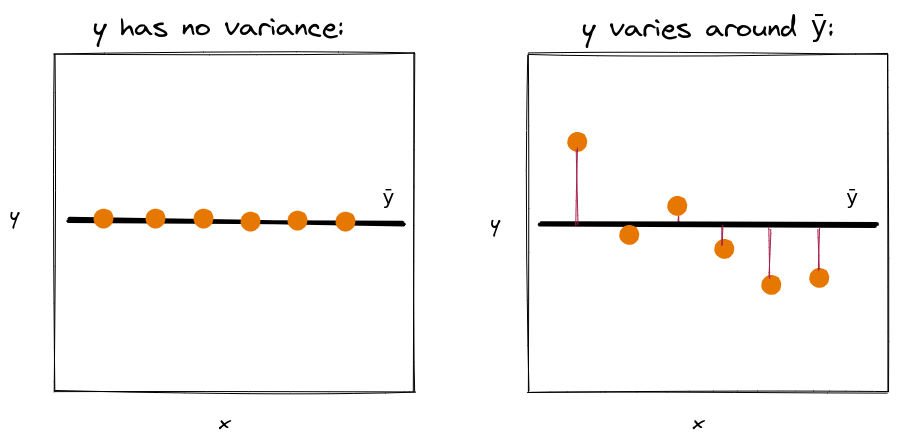
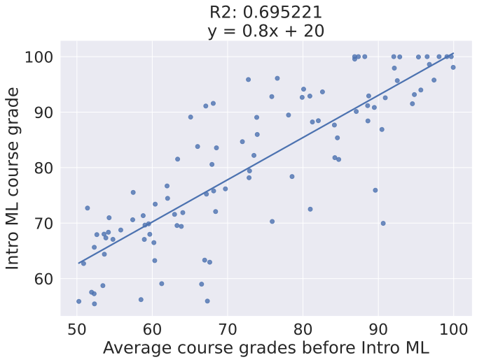

::: {.cell .markdown}

:::notes

**Math prerequisites for this lecture**: You should know

* matrix notation, matrix-vector multiplication (Section II, Chapter 5 in Boyd and Vandenberghe)
* inner product/dot product (Section I, Chapter 1 in Boyd and Vandenberghe)
* derivatives and optimization (Appendix C in Boyd and Vandenberghe)
* norm of a vector (Section I, Chapter 3 in Boyd and Vandenberghe)
* matrix inverse (Section II, Chapter 11 in Boyd and Vandenberghe)

:::

## In this lecture

* Simple (univariate) linear regression
* Multiple linear regression
* Linear basis function regression
* OLS solution for simple regression
* OLS solution for multiple/LBF regression
* Interpretation 

:::notes

With linear regression, as with all of the supervised learning models in this course, we will consider:

* The parts of the basic "recipe" (loss function, training algorithm, etc.)

and these four questions:

* What type of relationships $f(x)$ can it represent?
* What insight can we get from the trained model?
* How do we train the model efficiently?
* How do we control the generalization error?

For linear regression, we will consider the first two questions in this lesson, and the second two questions in the next lesson.

:::

:::

\newpage

## Regression

### Regression - quick review

The output variable $y$ is continuously valued.

We need a function $f$ to map each input vector $\mathbf{x_i}$ to a prediction, 

$$\hat{y_i} = f(\mathbf{x_i})$$

where (we hope!) $\hat{y_i} \approx y_i$.

### Prediction by mean

Last week, we imagined a simple model that predicts the mean of target variable in training data:

$$\hat{y_i} = w_0$$

$\forall i$, where $w_0 = \frac{1}{n} \sum_{i=1}^n y_i = \bar{y}$.

::: notes

We can show that the mean is the one-parameter model that optimizes the *mean squared error* (MSE) loss function:

$$ L(\mathbf{w}) = \frac{1}{n} \sum_{i=1}^n (y_i - \hat{y_i})^2 =  \frac{1}{n} \sum_{i=1}^n (y_i - w_0)^2  $$ 

Take the derivative of $L(\mathbf{w})$ with respect to $w_0$

$$ \frac{\partial L(\mathbf{w}) }{\partial w_0} = \frac{-2}{n} \sum_{i=1}^n (y_i - w_0) $$

and set it equal to zero:

$$\frac{-2}{n} \sum_{i=1}^n (y_i - w_0) = 0$$

Since we set it equal to zero, we can ignore that $-2$ factor -

$$\frac{1}{n} \sum_{i=1}^n (y_i - w_0) = 0$$

Now solve for $w_0$:

$$w_0 = \frac{1}{n} \sum_{i=1}^n y_i $$

This is the single parameter value that minimizes the mean squared error loss function.

:::

\newpage
### Prediction by mean, illustration

::: notes

{ width=80% }

Note that the loss function we defined for this problem - sum of squared differences between the true value and predicted value - is the variance of $y$.

Under what conditions will that loss function be very small (or even zero)?

{ width=50% }

:::

### Mean, variance - definitions

Mean and variance:

$$\bar{y} = \frac{1}{n} \sum_{i=1}^n y_i, \quad \sigma_y^2 = \frac{1}{n} \sum_{i=1}^n (y_i - \bar{y}) ^2$$

::: notes

We are using the "biased" estimate of mean and variace, without Bessel's correction.

:::

\newpage

## Simple linear regression

::: notes

A "simple" linear regression is a linear regression with only one feature.

:::

### Regression with one feature

For simple linear regression, we have feature-label pairs:

$$(x_i, y_i), i=1,2,\cdots,n$$

(we'll often drop the index $i$ when it's convenient.)

### Simple linear regression model

Assume a linear relationship:

$$ \hat{y_i} = w_0 + w_1 x_i$$

where $\mathbf{w} = [w_0, w_1]$, the intercept and slope, are model **parameters** that we *fit* in training.

### Residual term (1)

There is variance in $y$ among the data:

* some of it is "explained" by $f(x) = w_0 + w_1 x$
* some of the variance in $y$ is *not* explained by $f(x)$

::: notes

{ width=40% }

Maybe $y$ varies with some other function of $x$, maybe part of the variance in $y$ is explained by other features not in $x$, maybe it is truly "random"...

:::

### Residual term (2)

The *residual* term captures everything that isn't in the model:

$$y_i = w_0 + w_1 x_i + e_i$$

where $e_i = y_i - \hat{y_i}$.

\newpage

<!-- 

### Example:  Intro ML grades (1)

{ width=40% }

::: notes

Note: this is a fictional example with completely invented numbers.

Suppose students in Intro ML have the following distribution of course grades. We want to develop a model that can predict a student's course grade.

:::
-->

### Example:  Intro ML grades 

{ width=40% }

::: notes

Suppose students we want to develop a model that can predict a student's course grade.

To some extent, a student's average grades on previous coursework "explains" their grade in Intro ML. 

* The predicted value for each student, $\hat{y}$, is along the diagonal line. Draw a vertical line from each student's point ($y$) to the corresponding point on the line ($\hat{y}$). This is the residual $e = y - \hat{y}$.
* Some students fall right on the line - these are examples that are explained "well" by the model. 
* Some students are far from the line. The magnitude of the *residual* is greater for these examples.
* The difference between the "true" value $y$ and the predicted value $\hat{y}$ may be due to all kinds of differences between the "well-explained example" and the "not-well-explained-example" - not everything about Intro ML course grade can be explained by performance in previous coursework! This is what the residual captures.

Interpreting the linear regression: If slope $w_1$ is 0.8 points in Intro ML per point average in previous coursework, we can say that 

* a 1-point increase in score on previous coursework is, on average, associated with a 0.8 point increase in Intro ML course grade.

What can we say about possible explanations? We can't say much using this method - anything is possible:

* statistical fluke (we haven't done any test for significance)
* causal - students who did well in previous coursework are better prepared
* confounding variable - students who did well in previous coursework might have more time to study because they don't have any other jobs or obligations, and they are likely to do well in Intro ML for the same reason.

This method doesn't tell us *why* this association is observed, only that it is. (There are other methods in statistics for determining whether it is a statistical fluke, or for determining whether it is a causal relationship.)

(Also note that the 0.8 point increase according to the regression model is only an *estimate* of the "true" relationship.)

:::

<!-- images via https://colab.research.google.com/drive/1I_Ca2TKVNQhO_bRAHvP1D8Zcv-opssWf -->

<!--
### Example: TX vaccination levels

.](../images/2-reg-tx-covid.jpeg){ width=45% }

\newpage

::: notes

Suppose we want to use linear regression to "predict" the vaccination levels of a TX county, given its vote in the 2020 election. The share of vote for the Republican candidate partly "explains" the variance among TX counties.

* The predicted value for each county, $\hat{y}$, is along the diagonal line. Draw a vertical line from each county's point ($y$) to the corresponding point on the line ($\hat{y}$). This is the residual $e = y - \hat{y}$.
* Travis county is an example of a county that is explained "well" by the linear model.
* Presidio county is an example of a county that is not explained as well by the linear model. The magnitude of the *residual* is greater for this county.
* The difference between the "true" value $y$ and the predicted value $\hat{y}$ may be due to all kinds of differences between Travis county and Presidio county - not everything about vaccination level can be explained by 2020 vote share! This is what the residual captures.

Interpreting the linear regression: If slope $w_1$ is -0.4176 percent vaccinated/percent voting for Trump, we can say that 

* a 1-point increase in share of Trump voters is, on average, associated with a 0.4176 point decrease in percent of population vaccinated as of 6/14/21.

What can we say about possible explanations? We can't say much using this method - anything is possible:

* statistical fluke
* causal - Republican local governments may run less aggressive vaccine campaign
* partisanship/political values may be responsible for both vote and vaccination attitude among individuals
* confounding variable -. rural areas are more difficult to coordinate vaccines for, and also have higher vote share for Trump

This method doesn't tell us *why* this association is observed, only that it is. (There are other methods in statistics for determining whether it is a statistical fluke, or for determining whether it is a causal relationship.)

(Also note that the 0.4176 point decrease is only an *estimate* of the "true" relationship.)

:::

-->

\newpage

## Multiple linear regression

### Matrix representation of data

Represent data as a **matrix**, with $n$ samples and $d$ features;
one sample per row and one feature per column:

$$ \mathbf{X} = 
\begin{bmatrix}
x_{1,1} & \cdots & x_{1,d} \\
\vdots  & \ddots & \vdots  \\
x_{n,1} & \cdots & x_{n,d} 
\end{bmatrix},
\mathbf{y} = 
\begin{bmatrix}
y_{1}  \\
\vdots \\
y_{n} 
\end{bmatrix}
$$

$x_{i,j}$ is $j$th feature of $i$th sample.

::: notes

Note: by convention, we use capital letter for matrix, bold lowercase letter for vector.

:::

### Linear model

For a given sample (row), assume a linear relationship between feature vector $\mathbf{x_i} = [x_{i,1}, \cdots, x_{i,d}]$ and scalar target variable $y_i$:

$$ \hat{y_i} = w_0 + w_1 x_{i,1} + \cdots + w_d x_{i,d} $$

Model has $d+1$ **parameters**. 

::: notes

* Samples are vector-label pairs: $(\mathbf{x_i}, y_i), i=1,2,\cdots,n$
* Each sample has a feature vector $\mathbf{x_i} = [x_{i,1}, \cdots, x_{i,d}]$ and scalar target $y_i$
* Predicted value for $i$th sample will be $\hat{y_i} = w_0 + w_1 x_{i,1} + \cdots + w_d x_{i,d}$

It's a little awkward to carry around that $w_0$ separately, if we roll it in to the rest of the weights we can use a matrix representation...

:::

### Matrix representation of linear regression (1)

Define a new **design matrix** and **weight vector**:

$$ \mathbf{A} = 
\begin{bmatrix}
1 & x_{1,1} & \cdots & x_{1,d} \\
\vdots & \vdots  & \ddots & \vdots  \\
1 & x_{n,1} & \cdots & x_{n,d} 
\end{bmatrix},
\mathbf{w} = 
\begin{bmatrix}
w_{0}  \\
w_{1}  \\
\vdots \\
w_{d} 
\end{bmatrix}
$$

### Matrix representation of linear regression (2)

Then, $\hat{\mathbf{y}} = \mathbf{A}\mathbf{w}$.

And given a new sample with feature vector $\mathbf{x_i}$, predicted value is $\hat{y_i} = \langle [1, \mathbf{x_i}] , \mathbf{w} \rangle = [1, \mathbf{x_i}^T] \mathbf{w}$.

::: notes

(The angle brackets denote a dot product.)

:::

\newpage

::: notes

Here is an example showing the computation:

{ width=60% }

What does the residual look like in the multivariate case?

:::

### Illustration - residual with two features

{ width=50% }

## Linear basis function regression

::: notes

The assumption that the output is a linear function of the input features is very restrictive. Instead, what if we consider *linear combinations* of *fixed non-linear* functions?

:::

### Basis functions

A function 

$$ \phi_j (\mathbf{x}) = \phi_j (x_1, \cdots, x_d) $$ 

is called a **basis function**. 

### Linear basis function model for regression

Standard linear model:

$$ \hat{y_i} = w_0 + w_1 x_{i,1} + \cdots + w_d x_{i,d} $$

Linear basis function model:

$$ \hat{y_i} =  w_0 \phi_0(\mathbf{x_i}) + \cdots + w_p \phi_p(\mathbf{x_i}) $$

::: notes

Some notes:

* The 1s column we added to the design matrix is easily represented as a basis function ($\phi_0(\mathbf{x}) = 1$).
* There is not necessarily a one-to-one correspondence between the columns of $X$ and the basis functions ($p \neq d$ is OK!). You can have more/fewer basis functions than columns of $X$.
* Each basis function can accept as input the entire vector $\mathbf{x_i}$.
* The model has $p + 1$ parameters.

:::

### Vector form of linear basis function model

The prediction of this model expressed in vector form is:

$$\hat{y_i} = \langle \mathbf{\phi (x_i)}, \mathbf{w} \rangle = \mathbf{w}^T \mathbf{\phi (x_i)} $$

where

$$
\mathbf{\phi (x_i)} = [\phi_0 (\mathbf{x_i}), \cdots, \phi_p (\mathbf{x_i})], \mathbf{w} = [w_0, \cdots, w_p]
$$

::: notes

(The angle brackets denote a dot product.)

**Important note**: although the model can be non-linear in $\mathbf{x}$, it is still 
linear in the parameters $\mathbf{w}$ (note that $\mathbf{w}$ appears *outside* $\mathbf{\phi}(\cdot)$!) 
That's what makes it a *linear model*.

Some basis functions have their own parameters that appear inside the basis function, 
i.e. we might have a model $$\hat{y_i} = \mathbf{ w}^T \mathbf{ \phi}(\mathbf{ x_i}, 
\mathbf{\theta})$$ where $\mathbf{\theta}$ are the parameters of the basis function.
The model is *non-linear* in those parameters, and they need to be fixed before training.

:::

### Matrix form of linear basis function model

Given data $(\mathbf{x_i},y_i), i=1,\cdots,n$:

$$ 
\Phi = 
\begin{bmatrix}
\phi_0 (\mathbf{x_1}) & \phi_1 (\mathbf{x_1}) & \cdots & \phi_p (\mathbf{x_1}) \\
\vdots  & \vdots & \ddots & \vdots  \\
\phi_0 (\mathbf{x_n}) & \phi_1 (\mathbf{x_n}) &\cdots & \phi_p (\mathbf{x_n}) 
\end{bmatrix} 
$$

and $\mathbf{\hat{y}} = \Phi \mathbf{w}$.

\newpage

### "Recipe" for linear regression (???)

1. Get **data**: $(\mathbf{x_i}, y_i), i=1,2,\cdots,n$ 
2. Choose a **model**: $\hat{y_i} = \langle \mathbf{\phi (x_i)}, \mathbf{w} \rangle$
3. Choose a **loss function**: **???**
4. Find model **parameters** that minimize loss: **???**
5. Use model to **predict** $\hat{y}$ for new, unlabeled samples
6. Evaluate model performance on new, unseen data

::: notes

Now that we have described some more flexible versions of the linear regression model, we will turn to the problem of finding the weight parameters, starting with the simple linear regression. (The simple linear regression solution will highlight some interesting statistical relationships.)

:::

## Ordinary least squares solution for simple linear regression

### Mean squared error loss function

We will use the *mean squared error* (MSE) loss function:

$$ L(\mathbf{w}) = \frac{1}{n} \sum_{i=1}^n (y_i - \hat{y_i})^2 $$ 

which is related to the *residual sum of squares* (RSS):

$$\sum_{i=1}^n (y_i - \hat{y_i})^2 = \sum_{i=1}^n ( e_i )^2 $$ 

::: notes

"Least squares" solution: find values of $\mathbf{w}$ to minimize MSE.

:::

### "Recipe" for linear regression

1. Get **data**: $(\mathbf{x_i}, y_i), i=1,2,\cdots,n$ 
2. Choose a **model**: $\hat{y_i} = \langle \mathbf{\phi (x_i)}, \mathbf{w} \rangle$
3. Choose a **loss function**: $L(\mathbf{w}) = \frac{1}{n} \sum_{i=1}^n (y_i - \hat{y_i})^2$
4. Find model **parameters** that minimize loss: $\mathbf{w^*}$
5. Use model to **predict** $\hat{y}$ for new, unlabeled samples
6. Evaluate model performance on new, unseen data

::: notes

How to find $\mathbf{w^*}$?

The loss function is convex, so to find $\mathbf{w^*}$ where $L(\mathbf{w})$ is minimized, we:

* take the partial derivative of $L(\mathbf{w})$ with respect to each entry of $\mathbf{w}$
* set each partial derivative to zero

:::

\newpage

### Optimizing $\mathbf{w}$ - simple linear regression (1)

Given 

$$ L(w_0, w_1) = \frac{1}{n} \sum_{i=1}^n [y_i - (w_0 + w_1 x_i) ]^2 $$

we take

$$ \frac{\partial L}{\partial w_0} = 0, \frac{\partial L}{\partial w_1} = 0$$

### Optimizing $\mathbf{w}$ - simple linear regression (2)

First, the intercept:

$$ L(w_0, w_1) = \frac{1}{n} \sum_{i=1}^n [y_i - (w_0 + w_1 x_i) ] ^2 $$

$$ \frac{\partial L}{\partial w_0} =  -\frac{2}{n} \sum_{i=1}^n [y_i - (w_0 + w_1 x_i)] $$

using chain rule, power rule. 

::: notes

(We can then drop the $-2$ constant factor when we set this expression equal to $0$.)

:::

### Optimizing $\mathbf{w}$ - simple linear regression (3)

Set this equal to $0$, "distribute" the sum, and we can see

$$\frac{1}{n} \sum_{i=1}^n [y_i - (w_0 + w_1 x_i)] = 0$$

$$ \implies w_0^* = \bar{y} - w_1^* \bar{x}$$

where $\bar{x}, \bar{y}$ are the means of $x, y$.

### Optimizing $\mathbf{w}$ - simple linear regression (4)

Now, the slope coefficient:

$$ L(w_0, w_1) = \frac{1}{n} \sum_{i=1}^n [y_i - (w_0 + w_1 x_i) ] ^2 $$

$$ \frac{\partial L}{\partial w_1} = \frac{1}{n}\sum_{i=1}^n  2(y_i - w_0 -w_1 x_i)(-x_i)$$

### Optimizing $\mathbf{w}$ - simple linear regression (5)

$$  \implies -\frac{2}{n} \sum_{i=1}^n x_i (y_i - w_0 -w_1 x_i)  = 0$$

Solve for $w_1^*$:

$$ w_1^*  = \frac{\sum_{i=1}^n (x_i - \bar{x})(y_i - \bar{y}) }{\sum_{i=1}^n (x_i - \bar{x})^2}$$

::: notes

Note: some algebra is omitted here, but refer to the secondary notes for details.

:::

### Optimizing $\mathbf{w}$ - relationship to variance/covariance

The slope coefficient is the ratio of *covariance* $\sigma_{xy}$ to *variance* $\sigma_x^2$:

$$ \frac{\sigma_{xy}}{\sigma_x^2} $$

where $\sigma_{xy} = \frac{1}{n} \sum_{i=1}^n (x_i - \bar{x})(y_i - \bar{y})$ and $\sigma_x^2 = \frac{1}{n} \sum_{i=1}^n (x_i - \bar{x}) ^2$

### Optimizing $\mathbf{w}$ - relationship to correlation coefficient

We can also express it as

$$ \frac{r_{xy} \sigma_y}{\sigma_x} $$

where correlation coefficient 
$r_{xy} = \frac{\sigma_{xy}}{\sigma_x \sigma_y}$.

::: notes

(Note: from Cauchy-Schwartz law, $|\sigma_{xy}| < \sigma_x \sigma_y$, we know $r_{xy} \in [-1, 1]$)

:::

::: {.cell .markdown}

### MSE for optimal simple linear regression

$$L(w_0^*, w_1^*) = {\sigma_e^2 } = \sigma_y^2 - \frac{\sigma_{xy}^2}{\sigma_{x}^2} $$ 

$$R2 = 1 -  \frac{\sigma_e^2 }{\sigma_y^2} $$

::: notes

**If** we fit a simple regression model using this ordinary least squares solution,

* the ratio $\frac{\sigma_e^2 }{\sigma_y^2}$ is the *fraction of unexplained variance*: of all the variance in $y$ (denominator), how much is still "left" unexplained after our model explains some of it (numerator, variance of residual)? (best case: 0)
* The *coefficient of determination*, R2, is the *fraction of explained variance*. (best case: 1)
:::

:::

## Ordinary least squares solution for multiple/linear basis function regression

### Setup: L2 norm

Definition: L2 norm of a vector $\mathbf{x} = (x_1, \cdots, x_n)$:

$$ || \mathbf{x} || = \sqrt{x_1^2 + \cdots + x_n^2}$$

We will want to minimize the L2 norm of the residual.

### Setup: Gradient vector

To minimize a multivariate function $f(\mathbf{x}) = f(x_1, \cdots, x_n)$, we find places where the **gradient** is zero, i.e. each entry must be zero:

$$ \nabla f(\mathbf{x}) = 
\begin{bmatrix}
\frac{\partial f(\mathbf{x})}{\partial x_1}  \\
\vdots \\
\frac{\partial f(\mathbf{x})}{\partial x_n}  \\
\end{bmatrix}
$$

::: notes

The gradient is the vector of partial derivatives.

:::

### MSE for multiple/LBF regresion

Given a vector $\mathbf{y}$ and matrix $\Phi$ (with $d$ columns, $n$ rows), 

$$L(\mathbf{w}) = \frac{1}{2} \|\mathbf{y} - \Phi \mathbf{w}\|^2$$

where the norm above is the L2 norm. 

::: notes

(we defined it with a $\frac{1}{2}$ constant factor for convenience.)

:::

### Gradient of MSE 

$$L(\mathbf{w}) = \frac{1}{2} \|\mathbf{y} - \Phi \mathbf{w}\|^2$$

gives us the gradient

$$\nabla L(\mathbf{w}) = - \Phi^T (\mathbf{y} -  \Phi \mathbf{w})$$

### Solving for $\mathbf{w}$

$$
\begin{aligned}
\nabla L(\mathbf{w}) &= 0, \\
- \Phi^T (\mathbf{y}  - \Phi \mathbf{w}) &= 0, \\
\Phi^T \Phi \mathbf{w} &= \Phi^T \mathbf{y} ,~~\text{or}\\
\mathbf{w} &= (\Phi^T \Phi)^{-1} \Phi^T \mathbf{y}  .
\end{aligned}
$$

### Solving a set of linear equations

If $\Phi^T \Phi$ is full rank (usually: if $n \geq d$), then a unique solution is given by

$$\mathbf{w^*} = \left(\Phi^T \Phi \right)^{-1} \Phi^T \mathbf{y}$$

This expression:

$$\Phi^T \Phi \mathbf{w} =  \Phi^T \mathbf{y}$$

represents a set of $d$ equations in $d$ unknowns, called the *normal equations*. 

::: notes

We can solve this as we would any set of linear equations (see supplementary notebook on computing regression coefficients by hand.)

:::

## Interpreting regression metrics

### Understanding the numbers

* Correlation coefficient $r_{xy}$
* Slope coefficient $w_j$ for feature $j$
* MSE, R2

::: notes

Which of these depend only on the data, and which depend on the model too?

Which of these tell us something about the "goodness" of our model?

:::

### Interpreting correlation coefficient

::: notes

The correlation coefficient $\frac{\sigma_{xy}}{\sigma_x \sigma_y}$ is fundamental to the data - it is not about a fitted model.

:::

\newpage

### Interpreting coefficient $w_j$

The coefficient $w_j$ for feature $j$ says: 

* simple regression: "an increase of one unit in this feature is associated with an increase of the target variable by $w_j$"
* multiple regression: "an increase of one unit in this feature, **while holding the other features that are in the model constant**, is associated with an increase of the target variable by $w_j$"

::: notes

Note: doesn't say whether the effect is *causal* or whether it is *significant* (out of scope of this course).

Be aware of units - we cannot directly compare the magnitude of coefficients of features measured in different units.

:::

### Interpreting R2 as explained variance

$$R2 = 1 - \frac{MSE}{\sigma_y^2} = 1 -
\frac{\sum_{i=1}^n (y_i - \hat{y_i})^2}{\sum_{i=1}^n (y_i - \overline{y_i})^2}$$

For linear regression: What proportion of the variance in $y$ is "explained" by our model?

* $R^2 \approx 1$ - model "explains" all the variance in $y$
* $R^2 \approx 0$ - model doesn't "explain" any of the variance in $y$

### Interpreting R2 as error relative to "mean model"

Alternatively: what is the ratio of error of our model, to error of prediction by mean?

$$R2 = 1 - \frac{MSE}{\sigma_y^2} = 1 -
\frac{\sum_{i=1}^n (y_i - \hat{y_i})^2}{\sum_{i=1}^n (y_i - \overline{y_i})^2}$$

:::notes

What would be R2 of a model that is *worse* than prediction by mean?

:::

### Example: Intro ML grades (2)

{ width=75% }

::: notes

In Instructor A's section, a change in average overall course grades is associated with a bigger change in Intro ML course grade than in Instructor B's section; but in Instructor B's section, more of the variance among students is explained by the linear regression on previous overall grades.

:::

<!--

### Example: TX vaccination levels (2)

.](../images/2-reg-tx-covid.jpeg){ width=40% }

### Example: FL vaccination levels

.](../images/2-reg-fl-covid.jpeg){ width=40% }

::: notes

In Florida, a change in vote share is associated with a bigger change in vaccination level than in Texas; but in Texas, more of the variance among counties is explained by the linear regression on vote share.

:::

\newpage

--> 

## Recap

### Completed "recipe"

1. Get **data**: $(\mathbf{x_i}, y_i), i=1,2,\cdots,n$ 
2. Choose a **model**: $\hat{y_i} = \langle \mathbf{\phi (x_i)}, \mathbf{w} \rangle$
3. Choose a **loss function**: $L(\mathbf{w}) = \frac{1}{n} \sum_{i=1}^n (y_i - \hat{y}_i) ^2$
4. Find model **parameters** that minimize loss: OLS solution for $\mathbf{w}^{*}$
5. Use model to **predict** $\hat{y}$ for new, unlabeled samples
6. Evaluate model performance on new, unseen data

### Key questions

* What type of relationships $f(x)$ can it represent?
* What insight can we get from the trained model?
* (How do we train the model efficiently?)
* (How do we control the generalization error?)

::: notes

We will address the last two questions next week.

:::

