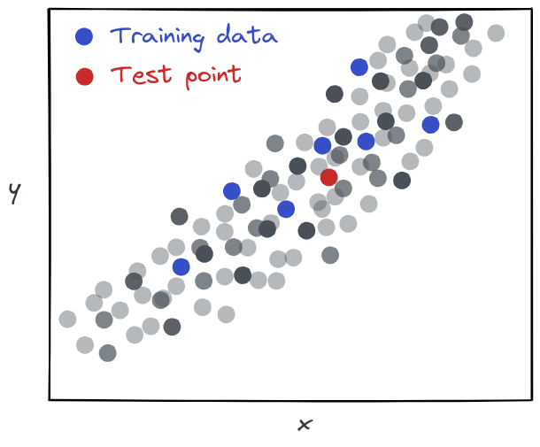
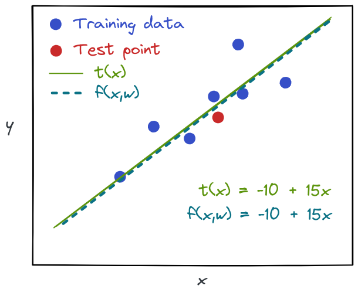
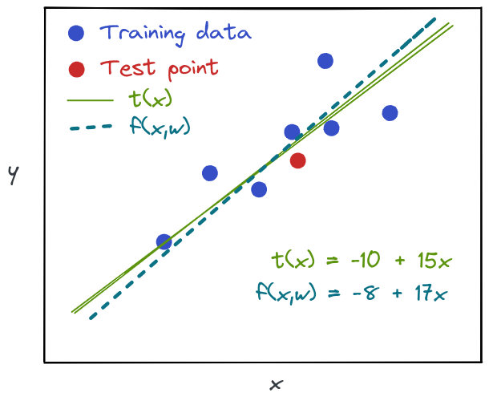
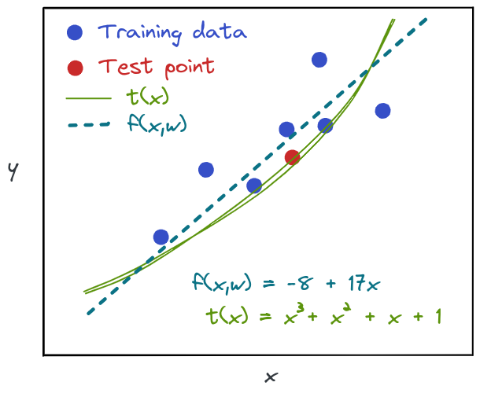
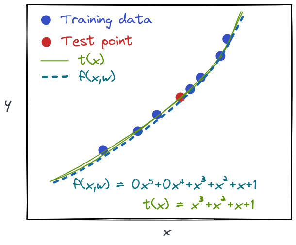
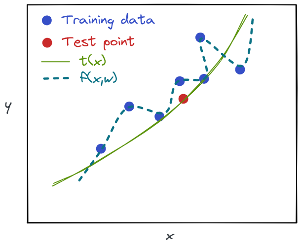
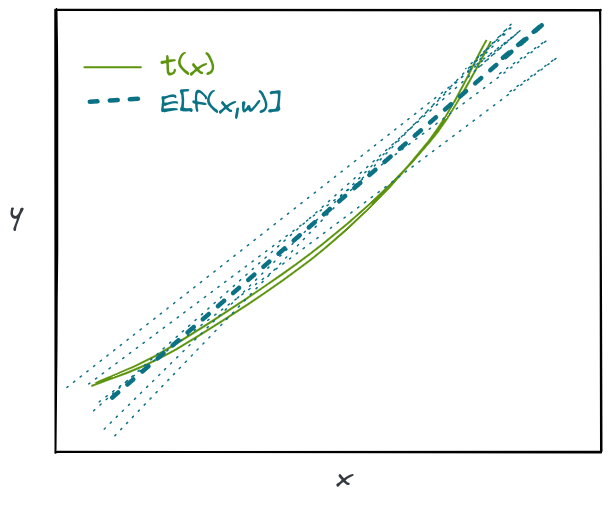
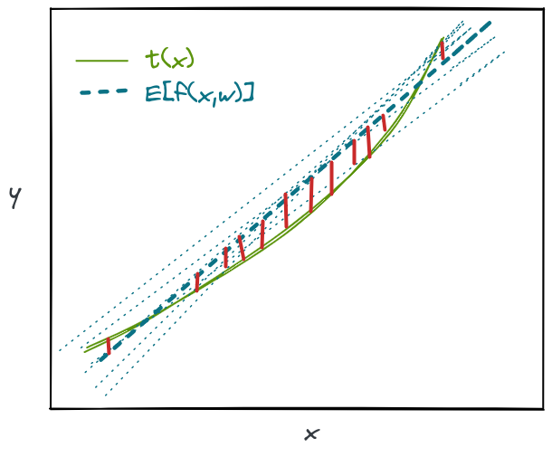
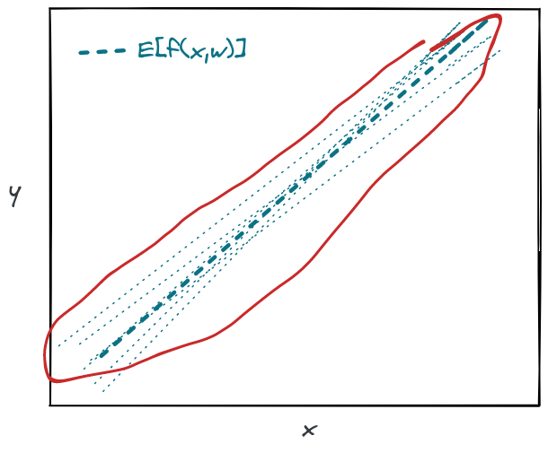
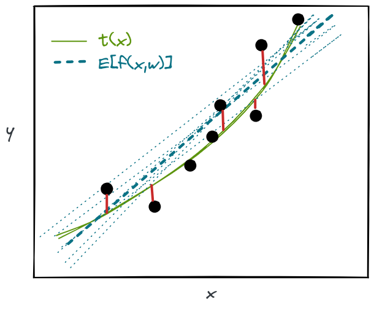

## In this lecture

* Prediction error
* Error decomposition
* Bias variance tradeoff

\newpage

## When learning fails

::: notes

Consider the following scenario: You were given a learning task and have approached it with a choice of model, a training algorithm, and parameters. You used some of the data to fit the parameters and tested the fitted model on a test set. The test results, unfortunately, turn out to be unsatisfactory.

What went wrong then, and what should you do next?

There are many elements that can be "fixed." The main approaches are listed as follows:

* Fix a data problem
* Get more data
* Change the model (i.e. the function that maps input data to target variable) by:
  * Making it more flexible using hyperparameters
  * Making it less flexible using hyperparameters
  * Completely changing its form
* Change the feature representation of the data
* Change the training algorithm used to fit the model

In order to find the best remedy, it is essential first to understand the cause of the bad performance. 

Note: this scenario is closely paraphrased from *Section 11.3 What to Do If Learning Fails* in [Understanding Machine Learning: From Theory to Algorithms](https://www.cs.huji.ac.il/~shais/UnderstandingMachineLearning/) (Shalev-Shwartz and Ben-David).

:::

## Prediction error

### ML premise: fit a function

Given as *training* data a set of feature vector-label pairs 

$$(\mathbf{x_i}, y_i), \quad i = 1,\ldots n$$ 

we want to fit a function $f$ (parameterized by $\mathbf{w}$, which we'll estimate as $\mathbf{\hat{w}}$) such that 

$$y_i \approx f(\mathbf{x_i}, \mathbf{w})$$

(i.e. $y_i \approx \hat{y_i}$.)

### ML premise: true function

Suppose our data is sampled from some *unknown* "true" function $t$ so that

$$y_i = t(\mathbf{x_i}) + \epsilon_i $$

where $\epsilon \sim N(0, \sigma_\epsilon^2)$ is some *unknowable* stochastic error.

### ML premise: minimize error

Our goal is to minimize a squared error loss function on some *test* point, $(\mathbf{x_t}, y_t)$:

$$E[ (y_t - \hat{y_t})^2]$$

where the expectation is over the sampled data, and the noise.

\newpage

### ML premise: illustration

::: notes

{ width=35% }

:::

### Source of prediction error: noise

In the best case scenario, even if the model is exactly the true function

$$ f(\mathbf{x}, \mathbf{w}) = t(\mathbf{x}) \quad  \forall x$$

we still have some prediction error due to the stochastic noise!

::: notes

{width=35%}

:::

\newpage

### Source of prediction error: parameter estimate

Perhaps the true function is 

$$ t(\mathbf{x}) = f(\mathbf{x}, \mathbf{w_t}) \quad  \forall x$$

but because of the random sample of training data + noise in the data, our parameter estimate is not exactly correct: $\mathbf{\hat{w}} \neq \mathbf{w_t}$.

::: notes

{width=35%}

:::

### Source of prediction error: assumed model class (1)

Maybe 

$$ t(\mathbf{x}) \neq f(\mathbf{x}, \mathbf{w})$$

for any $\mathbf{w}$!

Our assumed *model class* (or *hypothesis class*) may not be complex enough to model the true function.

::: notes

**Note**: the *model class* is the set of possible models we could fit, parameterized by the parameter vector.

**Note**: the set of assumptions we make - such as selecting a model class $f$ - introduce what's known as *inductive bias* into our model.

{width=35%}

:::

### Source of prediction error: assumed model class (2)

What if we use a model class that is *too* complex?

::: notes

{ width=35% }

{width=40%}

This is not specific to polynomial models - there are many situations where a training algorithm will "learn" a parameter value that should be zero, because it fits the noise. For example, if you have irrelevant features used as input to the model.

:::

### Sources of prediction error: summary

* Stochastic noise which is fundamentally unpredictable
* Parameter estimate has some error due to noise in training data 
* Assumed model class is not complex enough (**under-modeling**)

::: notes

Note: the "parameter estimate" error also includes overfitting!

:::

\newpage

## Error decomposition

### A note on this decomposition

We will derive the expected error on the test *point*:

* first, assuming the training sample is fixed, so the expectation is only over $\epsilon_t$
* then, relaxing this assumption, so the expectation is over the training set sampled from $\mathcal{D}$

::: notes

This is allowed because $\epsilon_t$ is independent of $\mathcal{D}$; so

$$E_{\mathcal{D}, \epsilon}[\ldots] = E_{\mathcal{D}}[E_{\epsilon}[\ldots]]$$

Finally, we'll take that expectation over all the test points.

:::

### First: assuming fixed training sample

For convenience, denote $f(\mathbf{x_t}, \mathbf{\hat{w}})$ as $f$ and $t(\mathbf{x_t})$ as $t$.

$$
\begin{aligned}
E_{\epsilon} [(y_t-\hat{y_t})^2] &= E_{\epsilon}[(t + \epsilon_t - f)^2] \\
 &= E_{\epsilon}[(t - f)^2 + \epsilon_t^2 + 2\epsilon_t(t - f)] \\
 &= (t-f)^2 + E_\epsilon[\epsilon_t^2] + 0 \\
 &= (t-f)^2 + \sigma_\epsilon^2
\end{aligned} 
$$

::: notes

The expected value (over the $\epsilon$) of squared error is because:

* under the assumption that training sample is fixed, $f$ and $t$ are constant
* $E[\epsilon_t] = 0$

The last term is not affected when we then take the expectation over ${\mathcal{D}}$. This term is called the *irreducible error*, and it not under our control. 

The first term ($(t-f)^2$) is the model estimation error, and this *is* under our control - it is *reducible* error - so next we will turn to $E_{\mathcal{D}}[(t-f)^2]$.

:::

### Second: expectation over ${\mathcal{D}}$

We again denote $f(\mathbf{x_t}, \mathbf{\hat{w}})$ as $f$ and $t(\mathbf{x_t})$ as $t$.

$$
\begin{aligned}
E_{\mathcal{D}} [(t-f)^2 + \sigma_\epsilon^2] &= E_{\mathcal{D}}[(t-f)^2] + \sigma_\epsilon^2 \\
 &= E_{\mathcal{D}}[t^2 + f^2 -2tf] + \sigma_\epsilon^2 \\
 &= t^2 + E_{\mathcal{D}}[f^2] -2t E_{\mathcal{D}}[f] + \sigma_\epsilon^2 \\
 &= (t - E_{\mathcal{D}}[f])^2 + (E_{\mathcal{D}}[f^2] - E_{\mathcal{D}}[f]^2) + \sigma_\epsilon^2 
\end{aligned} 
$$

::: notes

because:

* the true value $t(\mathbf{x_t})$ is independent of the training sample drawn from $\mathcal{D}$.

<!-- 

TODO: refer to https://stats.stackexchange.com/questions/164378/bias-variance-decomposition-and-independence-of-x-and-epsilon

-->

:::

\newpage

### A hypothetical (impossible) experiment

::: notes

To understand this decomposition, it helps to think about this experiment.

:::

Suppose we would get many independent training sets (from same process).

For each training set,

* train our model (estimate parameters), and
* use this model to estimate value of test point(s)

::: notes

{ width=35% }
:::

### Error decomposition: bias

In the first term in

$$(\textcolor{red}{t - E_{\mathcal{D}}[f]})^2 + (E_{\mathcal{D}}[f^2] - E_{\mathcal{D}}[f]^2) + \sigma_\epsilon^2$$

$\textcolor{red}{t - E_{\mathcal{D}}[f]}$ is called the **bias**. 

::: notes

The bias is the difference between the *true value* and the *mean prediction of the model* (over many different random samples of training data.)

Informally: it tells us to what extent the model is *systematically* wrong!

{ width=35% }

:::

### Error decomposition: variance

The second term in

$$(t - E_{\mathcal{D}}[f])^2 + \textcolor{blue}{(E_{\mathcal{D}}[f^2] - E_{\mathcal{D}}[f]^2)} + \sigma_\epsilon^2$$

$\textcolor{blue}{E_{\mathcal{D}}[f^2] - E_{\mathcal{D}}[f]^2}$ is the **variance** of the model prediction over $\mathcal{D}$. 

::: notes

Informally: it tells us: if you train many of these models, with a new sample of training data each time, how much variation is there in the model output?

Or: how much does the model output depend on the training data?

{ width=35% }

:::

### Error decomposition: irreducible error

We already said that the third term in 

$$(t - E_{\mathcal{D}}[f])^2 + (E_{\mathcal{D}}[f^2] - E_{\mathcal{D}}[f]^2) + \textcolor{brown}{\sigma_\epsilon^2}$$

is called the **irreducible errror**.

::: notes

This term is a *lower bound* on the MSE.

{ width=35% }

:::

### Error decomposition: summary

Putting it together, the expected test point error

$$(\textcolor{red}{t - E_{\mathcal{D}}[f]})^2 + \textcolor{blue}{(E_{\mathcal{D}}[f^2] - E_{\mathcal{D}}[f]^2)} + \textcolor{brown}{\sigma_\epsilon^2}$$

is

$$(\textcolor{red}{\text{Bias}})^2 + 
\textcolor{blue}{\text{Variance over } \mathcal{D}} + 
\textcolor{brown}{\text{Irreducible Error}}$$

## Bias-variance tradeoff

### Intuition behind bias-variance and model complexity

It's often the case that changing the model to reduce bias, increases variance (and vice versa). Why?

### Bias variance tradeoff

{width=50%}

::: notes

Note: this is a "classic" view of the bias-variance tradeoff. Recent results suggest that this is only part of the picture - we'll discuss this again later in the semester.

:::

### How to get small error?

* Get model selection right: not too flexible, but flexible enough - **how?**
* Get enough data to constrain variability of model?

