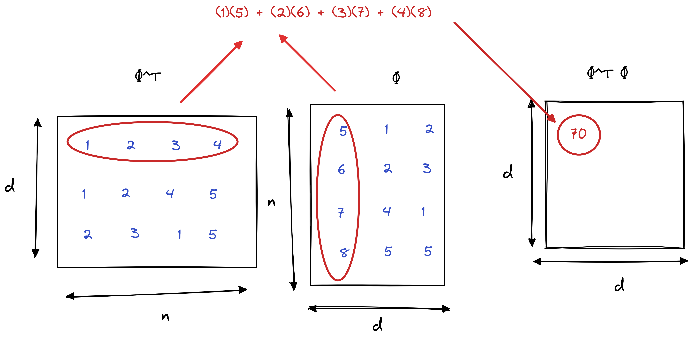
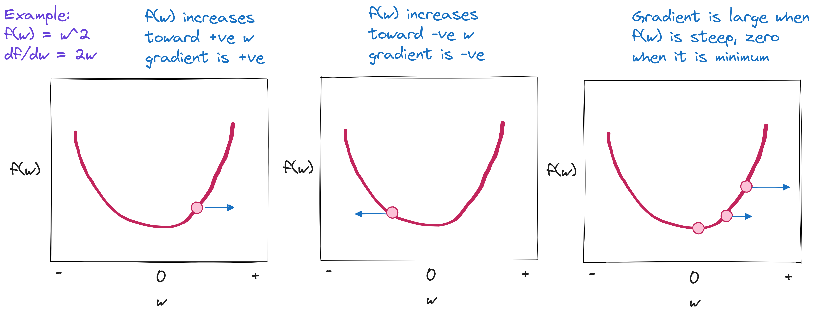
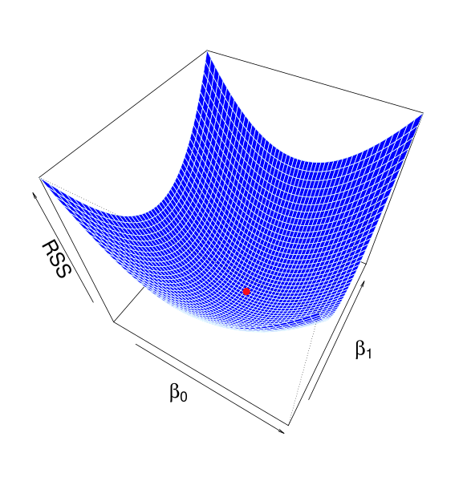
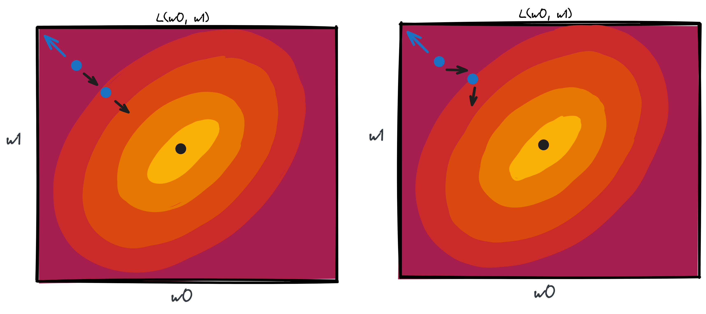
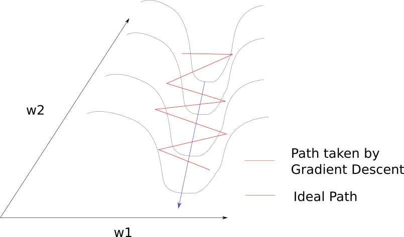
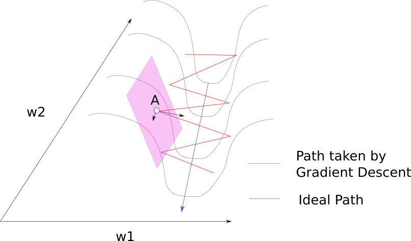
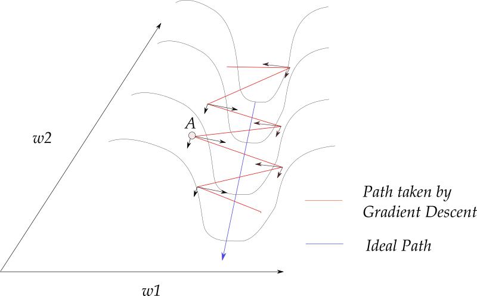

:::notes

**Math prerequisites for this lecture**: You should know about:

* derivatives and optimization (Appendix C in Boyd and Vandenberghe)
* complexity of algorithms and especially of vector and matrix operations (Appendix B in Boyd and Vandenberghe, also the complexity part of Section I, Chapter 1 and Section II, Chapter 5)

:::

\newpage

## In this lecture

Addresses "How do we train the model efficiently?"

* Runtime of OLS solution for multiple/LBF regression
* Solution using gradient descent 
* Variations on main idea

## Runtime of OLS solution

### Limitations of OLS solution

* Specific to linear regression, L2 loss
* For extremely large datasets: runtime, memory

### Background: Big O notation

Approximate the number of operations required, as a function of input size.

* Ignore constant terms, constant factors
* Ignore all but the dominant term

Example: $3n^3 + 100n^2 + 1000$ would be $O(n^3)$.


### Computing OLS solution

How long does it take to compute

$$\mathbf{w^*} = \left(\Phi^T \Phi \right)^{-1} \Phi^T \mathbf{y}$$

where $\Phi$ is an $n \times d$ matrix?


::: notes

Runtime of a "naive" solution using "standard" matrix multiplication: 

* $O(d^2n)$ to multiply $\Phi^T \Phi$
* $O(dn)$ to multiply $\Phi^T y$
* $O(d^3)$ to compute the inverse of $\Phi^T \Phi$ (Note: in practice, we can do it a bit faster.)

Since $n$ is generally much larger than $d$, the first term dominates and the runtime is $O(d^2n)$. 


{ width=60% }


:::

\newpage

## Solution using gradient descent


### Iterative solution

Suppose we would start with all-zero or random weights. Then iteratively (for $t$ rounds):

* pick random weights
* if loss performance is better, keep those weights
* if loss performance is worse, discard them

::: notes

For infinite $t$, we'd eventually find optimal weights - but clearly we could do better.

:::

### Background: Gradients and optimization 

Gradient has *two* important properties for optimization:

At a minima (or maxima, or saddle point), 

$$\nabla L(\mathbf{w}) = 0$$

At other points, $\nabla L(\mathbf{w})$ points towards direction of maximum (infinitesimal) rate of *increase*.

::: notes

{width=80%}

:::


### Gradient descent idea

To move towards minimum of a (smooth, convex) function: 

Start from some initial point, then iteratively 

* compute gradient at current point, and 
* add some fraction of the **negative** gradient to the current point

<!-- 
### Gradient descent illustration

. Image credit: Peter Roelants](../images/gradient-descent-animation.gif){width=80%}


### Visual example: least square solution 3D plot

{ width=40% }

-->


\newpage

### Standard ("batch") gradient descent

For each step $t$ along the error curve:

$$
\begin{aligned}
\mathbf{w}^{t+1} &= \mathbf{w}^t - \alpha \nabla L(\mathbf{w}^t) \\
 &= \mathbf{w}^t - \frac{\alpha}{n} \sum_{i=1}^n \nabla L_i(\mathbf{w}^t, \mathbf{x}_i, y_i)
\end{aligned}
$$


Repeat until stopping criterion is met.

::: notes

"Stopping criteria" may be: loss is sufficiently small, gradient is sufficiently close to zero, or a pre-set max number of iterations is reached.

Note: the superscript $t$ tracks what iteration we are on. It's not an exponent!

:::


### Example: gradient descent for linear regression (1)

With a mean squared error loss function

$$ 
\begin{aligned}
L(w) &= \frac{1}{n} \sum_{i=1}^n (y_i - \langle w, x_i \rangle)^2 \\
     &= \frac{1}{n} \|y - Xw\|^2 
\end{aligned}
$$

::: notes

Gradient of the loss function is:

* Vector form: $\frac{-\alpha^t}{n} \sum_{i=1}^n (y_i - \langle w^t,x_i \rangle) x_i$ 
* Matrix form: $\frac{-\alpha^t}{n} X^T (y - X w^t)$

we move in the *opposite* direction, so...

:::

### Example: gradient descent for linear regression (2)

We will compute the weights at each step as

$$
\begin{aligned} 
w^{t+1} &= w^t + \frac{\alpha^t}{n} \sum_{i=1}^n (y_i - \langle w^t,x_i \rangle) x_i \\
        &= w^t + \frac{\alpha^t}{n} X^T (y - X w^t)                  
\end{aligned}
$$

(dropping the constant 2 factor)

::: notes


To update $\mathbf{w}$, must compute $n$ loss functions and gradients - each iteration is $O(nd)$. We need multiple iterations, but in many cases it's more efficient than the previous approach.

However, if $n$ is large, it may still be expensive!

:::

\newpage

## Variations on main idea

::: notes


Two main "knobs" to turn:

* "batch" size
* learning rate

:::

### Stochastic gradient descent 

Idea: 

At each step, compute estimate of gradient using only one randomly selected sample, and move in the direction it indicates.


::: notes


{ width=70% }

Each iteration is now only $O(d)$, but we may need more iterations than for gradient descent. However, in many cases we still come out ahead (especially if $n$ is large!).

See [supplementary notes](https://chinmayhegde.github.io/introml-notes-sp2020/pages/lecture3_notes.html) for an analysis of the number of iterations needed.

Also:

* SGD is often more efficient because of *redundancy* in the data - data points have some similarity.
* But, we miss out on the benefits of vectorization. In practice, it takes longer to compute something over 1 sample 1024 times, than over 1024 samples 1 time.
* If the function we want to optimize does not have a global minimum, the noise can be helpful - we can "bounce" out of a local minimum.


:::

\newpage

### Mini-batch (also "stochastic") gradient descent (1)

Idea: 

At each step, select a small subset of training data ("mini-batch"), and evaluate gradient on that mini-batch. 

Then move in the direction it indicates.

### Mini-batch (also "stochastic") gradient descent (2)


For each step $t$ along the error curve: 

* Select random mini-batch $I_t\subset{1,\ldots,n}$
* Compute gradient approximation:

$$g^t = \frac{1}{|I_t|} \sum_{i\in I_t} \nabla L(\mathbf{x}_i, y_i, \mathbf{w}^t)$$

* Update parameters: $\mathbf{w}^{t+1} = \mathbf{w}^t - \alpha^t g^t$

::: notes

Now that each iteration is not equal to an iteration over *all* data, we need to introduce the idea of an "epoch":

* One epoch = one pass over *all* the data
* Mini-batch SGD is often used in practice because we get some benefit of vectorization, but also take advantage of redundancy in data. 

After a fixed number of epochs (passes over the entire data), 
   * we may end up at a better minimum (lower loss) with a small batch size,
   * *but*, the time per epoch may be longer with a small batch size.

:::


<!-- 

https://www.cs.cornell.edu/courses/cs4787/2021sp/
https://www.cs.cornell.edu/courses/cs6787/2018fa/Lecture2.pdf


https://ruder.io/optimizing-gradient-descent/

https://sebastianraschka.com/faq/docs/sgd-methods.html
https://sebastianraschka.com/faq/docs/gradient-optimization.html
https://distill.pub/2017/momentum/
https://www.cs.toronto.edu/~tijmen/csc321/slides/lecture_slides_lec6.pdf
https://sebastianraschka.com/pdf/lecture-notes/stat479ss19/L12_optim_slides.pdf
https://vis.ensmallen.org/
https://sebastianraschka.com/pdf/lecture-notes/stat479ss19/L05_gradient-descent_slides.pdf

-->


### Selecting the learning rate


{ width=85% }

::: notes

Image credit: Hands-On Machine Learning with Scikit-Learn, Keras, and TensorFlow, 2nd Edition, by Aurélien Géron.

Also note: SGD "noise ball"

:::

\newpage


### Annealing the learning rate

One approach: decay learning rate slowly over time, such as 

* Exponential decay: $\alpha_t = \alpha_0 e^{-k t}$
* 1/t decay: $\alpha_t = \alpha_0 / (1 + k t )$ 

(where $k$ is tuning parameter).


::: notes

But: this is still sensitive, requires careful selection of gradient descent parameters for the specific learning problem. 

Can we do this in a way that is somehow "tuned" to the shape of the loss function?

:::


### Gradient descent in a ravine (1)

{width=50%}

### Gradient descent in a ravine (2)

{width=50%}


\newpage

### Momentum (1)

* Idea:  Update includes a *velocity* vector $v$, that accumulates gradient of past steps. 
* Each update is a linear combination of the gradient and the previous updates. 
* (Go faster if gradient keeps pointing in the same direction!)

<!--

### Momentum (2)

Classical momentum: for some $0 \leq \gamma_t < 1$,

$$v_{t+1} = \gamma_t v_t - \alpha_t \nabla L\left(w_t\right)$$

so

$$w_{t+1} = w_t + v_{t+1} = w_t  - \alpha_t \nabla L\left(w_t\right) + \gamma_t v_t$$

($\gamma_t$ is often around 0.9, or starts at 0.5 and anneals to 0.99 over many epochs.)

Note: $v_{t+1} = w_{t+1} - w_t$ is $\Delta w$.

-->

### Momentum (2)

Classical momentum: for some $0 \leq \gamma_t < 1$,

$$v^{t+1} = \gamma^t v^t +   \nabla L\left(w^t\right)$$

so

$$w^{t+1} = w^t - \alpha^t v^{t+1} = w^t  - \alpha^t \left( \gamma^t v^t + \nabla L\left(w^t\right) \right)$$

($\gamma$ may be in range 0.9  - 0.99.)

### Momentum: pseudocode

```{=html}
GD:

<pre><code>for t in range(num_steps):
  dw = compute_grad(w)
  w -= lr * dw
</code></pre>

GD + Momentum:

<pre><code>v = 0
for t in range(num_steps):
  dw = compute_grad(w)
  <span style="color: blue">v = gamma * v + dw</span>
  w -= lr * <span style="color: blue">v</span>
</code></pre>
```

```{=latex}

GD:

\begin{lstlisting}
for t in range(num_steps):
  dw = compute_grad(w)
  w -= lr * dw
\end{lstlisting}


GD + Momentum:

\begin{lstlisting}
for t in range(num_steps):
  dw = compute_grad(w)
  <@\textcolor{blue}{v = gamma * v + dw}@>
  w -= lr * <@\textcolor{blue}{v}@>
\end{lstlisting}

```

### Momentum: illustrated

{width=45%}


\newpage


### AdaGrad (1)

Next idea: "per-parameter learning rates"!

Track per-parameter square of gradient, to normalize parameter update step. 

### AdaGrad (2)

$$w^{t+1} = w^t  - \frac{\alpha}{\sqrt{ v^{t+1} + \epsilon } } \nabla L\left(w^t\right) $$

where

$$v^{t+1} = v^{t} + \nabla L\left(w^{t}\right) ^2$$


::: notes

Weights with large gradient have smaller learning rate, weights with small gradients have larger learning rates.

i.e.: take smaller steps in steep directions, take bigger steps where the gradient is flat.

:::

### AdaGrad: pseudocode

```{=html}
GD:

<pre><code>for t in range(num_steps):
  dw = compute_grad(w)
  w -= lr * dw
</code></pre>


GD + AdaGrad:

<pre><code>grad_sq = 0
for t in range(num_steps):
  dw = compute_grad(w)
  <span style="color: purple">grad_sq = grad_sq +  dw * dw</span>
  w -= lr * dw <span style="color: purple">/ sqrt(grad_sq + epsilon)</span>
</code></pre>

```

```{=latex}

GD:

\begin{lstlisting}
for t in range(num_steps):
  dw = compute_grad(w)
  w -= lr * dw
\end{lstlisting}


GD + AdaGrad:

\begin{lstlisting}
grad_sq = 0
for t in range(num_steps):
  dw = compute_grad(w)
  <@\textcolor{violet}{grad\_sq =  grad\_sq +  dw * dw}@>
  w -= lr * dw <@\textcolor{violet}{/ sqrt(grad\_sq + epsilon)}@>
\end{lstlisting}

```


### RMSProp: Leaky AdaGrad

Idea: Use EWMA to emphasize *recent* gradient magnitudes.

$$w^{t+1} = w^t  - \frac{\alpha}{\sqrt{ v^{t+1} + \epsilon } } \nabla L\left(w^t\right) $$

where

$$v^{t+1} = \gamma v^{t} + (1 - \gamma) \nabla L\left(w^{t}\right) ^2$$


### RMSProp: pseudocode

```{=html}

GD + AdaGrad:

<pre><code>grad_sq = 0
for t in range(num_steps):
  dw = compute_grad(w)
  <span style="color: purple">grad_sq = grad_sq +  dw * dw</span>
  w -= lr * dw <span style="color: purple">/ sqrt(grad_sq + epsilon)</span>
</code></pre>


GD + RMSProp:

<pre><code>grad_sq = 0
for t in range(num_steps):
  dw = compute_grad(w)
  <span style="color: magenta">grad_sq = gamma * grad_sq + (1 - gamma) * dw * dw</span>
  w -= lr * dw <span style="color: magenta">/ sqrt(grad_sq + epsilon)</span>
</code></pre>

```

```{=latex}


GD + AdaGrad:

\begin{lstlisting}
grad_sq = 0
for t in range(num_steps):
  dw = compute_grad(w)
  <@\textcolor{violet}{grad\_sq =  grad\_sq +  dw * dw}@>
  w -= lr * dw <@\textcolor{violet}{/ sqrt(grad\_sq + epsilon)}@>
\end{lstlisting}


GD + RMSProp:

\begin{lstlisting}
grad_sq = 0
for t in range(num_steps):
  dw = compute_grad(w)
  <@\textcolor{magenta}{grad\_sq = gamma * grad\_sq + (1 - gamma) * dw * dw}@>
  w -= lr * dw <@\textcolor{magenta}{/ sqrt(grad\_sq + epsilon)}@>
\end{lstlisting}

```


### Adam: Adaptive Moment Estimation

* Uses ideas from momentum (first moment) and RMSProp (second moment)!
* plus bias correction 
<!-- https://web.eecs.umich.edu/~justincj/slides/eecs498/498_FA2019_lecture04.pdf -->


### Adam: pseudocode vs Momentum

```{=html}

GD + Momentum:

<pre><code>v = 0
for t in range(num_steps):
  dw = compute_grad(w)
  <span style="color: blue">v = gamma * v + dw</span>
  w -= lr * <span style="color: blue">v</span>
</code></pre>


GD + Adam (without bias correction):

<pre><code>moment1 = 0
moment2 = 0
for t in range(num_steps):
  dw = compute_grad(w)
  <span style="color: blue">moment1 = b1 * moment1 + (1 - b1) * dw</span>
  moment2 = b2 * moment2 + (1 - b2) * dw * dw
  w -= lr * <span style="color: blue">moment1</span> / sqrt(moment2 + epsilon)
</code></pre>

```

```{=latex}

GD + Momentum:

\begin{lstlisting}
for t in range(num_steps):
  dw = compute_grad(w)
  <@\textcolor{blue}{v = gamma * v + dw}@>
  w -= lr * <@\textcolor{blue}{v}@>
\end{lstlisting}


GD + Adam (without bias correction):

\begin{lstlisting}
moment1 = 0
moment2 = 0
for t in range(num_steps):
  dw = compute_grad(w)
  <@\textcolor{blue}{moment1 = b1 * moment1 + (1 - b1) * dw}@>
  moment2 = b2 * moment2 + (1 - b2) * dw * dw
  w -= lr * <@\textcolor{blue}{moment1}@> / sqrt(moment2 + epsilon)
\end{lstlisting}
```

\newpage

### Adam: pseudocode vs RMSProp

```{=html}

GD + RMSProp:

<pre><code>grad_sq = 0
for t in range(num_steps):
  dw = compute_grad(w)
  <span style="color: magenta">grad_sq = gamma * grad_sq + (1 - gamma) * dw * dw</span>
  w -= lr * dw <span style="color: magenta">/ sqrt(grad_sq + epsilon)</span>
</code></pre>

GD + Adam (without bias correction):

<pre><code>moment1 = 0
moment2 = 0
for t in range(num_steps):
  dw = compute_grad(w)
  <span style="color: blue">moment1 = b1 * moment1 + (1 - b1) * dw</span>
  <span style="color: magenta">moment2 = b2 * moment2 + (1 - b2) * dw * dw</span>
  w -= lr * <span style="color: blue">moment1</span> <span style="color: magenta">/ sqrt(moment2 + epsilon)</span>
</code></pre>

```

```{=latex}

GD + RMSProp:

\begin{lstlisting}
grad_sq = 0
for t in range(num_steps):
  dw = compute_grad(w)
  <@\textcolor{magenta}{grad\_sq = gamma * grad\_sq + (1 - gamma) * dw * dw}@>
  w -= lr * dw <@\textcolor{magenta}{/ sqrt(grad\_sq + epsilon)}@>
\end{lstlisting}

GD + Adam (without bias correction):

\begin{lstlisting}
moment1 = 0
moment2 = 0
for t in range(num_steps):
  dw = compute_grad(w)
  <@\textcolor{blue}{moment1 = b1 * moment1 + (1 - b1) * dw}@>
  <@\textcolor{magenta}{moment2 = b2 * moment2 + (1 - b2) * dw * dw}@>
  w -= lr * <@\textcolor{blue}{moment1}@> <@\textcolor{magenta}{/ sqrt(moment2 + epsilon)}@>
\end{lstlisting}
```

::: notes

Usually `b1` is smaller than `b2`, i.e. we update `moment1` more aggressively than `moment2`.

:::

### Adam: Pseudocode with bias correction

```{=html}

<pre><code>moment1 = 0
moment2 = 0
for t in range(num_steps):
  dw = compute_grad(w)
  <span style="color: blue">moment1 = b1 * moment1 + (1 - b1) * dw</span>
  <span style="color: magenta">moment2 = b2 * moment2 + (1 - b2) * dw * dw</span>
  <span style="color: green">moment1_unbias = moment1 / (1 - b1 ** t)
  moment2_unbias = moment2 / (1 - b2 ** t)</span>
  w -= lr * <span style="color: blue">moment1_unbias</span> <span style="color: magenta">/ sqrt(moment2_unbias + epsilon)</span>
</code></pre>
```

```{=latex}
\begin{lstlisting}
moment1 = 0
moment2 = 0
for t in range(num_steps):
  dw = compute_grad(w)
  <@\textcolor{blue}{moment1 = b1 * moment1 + (1 - b1) * dw}@>
  <@\textcolor{magenta}{moment2 = b2 * moment2 + (1 - b2) * dw * dw}@>
  <@\textcolor{ForestGreen}{moment2\_unbias = moment2 / (1 - b2  t) }@>
  <@\textcolor{ForestGreen}{moment2\_unbias = moment2 / (1 - b2  t)}@>
  w -= lr * <@\textcolor{blue}{moment1\_unbias}@> <@\textcolor{magenta}{/ sqrt(moment2\_unbias + epsilon)}@>

\end{lstlisting}
```

::: notes


When we initialize both moments to zero, they are initially "biased" to smaller values (since they update slowly!)
This bias correction accounts for that.

:::


\newpage

### Illustration (Beale's function)


.](../images/beale-gradient.gif){width=40%}


::: notes

Due to the large initial gradient, velocity based techniques shoot off and bounce around, while those that scale gradients/step sizes like RMSProp proceed more like accelerated SGD.

:::

### Illustration (Long valley)


.](../images/long-valley-gradient.gif){width=40%}

::: notes

SGD stalls and momentum has oscillations until it builds up velocity in optimization direction. Algorithms that scale step size quickly break symmetry and descend in optimization direction.

:::


## Recap

* Gradient descent as a general approach to training
* Variations

::: notes

Gradient descent is easy on linear regression! You won't get to apply any of these more advanced techniques until later in the semester, when we work with less friendly loss surfaces.

:::