::: {.handout-only}

## In this lecture

* Prediction error
* Error decomposition
* Bias variance tradeoff
* Model selection

:::

## When learning fails

::: notes

Consider the following scenario: You were given a learning task and have approached it with a choice of model, a training algorithm, and data. You used some of the data to fit the parameters and tested the fitted model on a test set. The test results, unfortunately, turn out to be unsatisfactory.

What went wrong then, and what should you do next?

There are many elements that can be "fixed." The main approaches are listed as follows:

* Fix a data problem
* Get more data
* Change the model (i.e. the function that maps input data to target variable) by:
  * Making it more flexible
  * Making it less flexible
  * Completely changing its form
* Change the feature representation of the data
* Change the training algorithm used to fit the model

In order to find the best remedy, it is essential first to understand the cause of the bad performance. 

Note: this scenario is closely paraphrased from *Section 11.3 What to Do If Learning Fails* in [Understanding Machine Learning: From Theory to Algorithms](https://www.cs.huji.ac.il/~shais/UnderstandingMachineLearning/) (Shalev-Shwartz and Ben-David).

:::

\newpage

## Prediction error

### ML premise: fit a function

Given as *training* data a set of feature vector-label pairs 

$$(\mathbf{x}_i, y_i), \quad i = 1,\ldots N$$ 

we want to fit a function $f$ (parameterized by $\mathbf{w}$, which we'll estimate as $\mathbf{\hat{w}}$) such that 

$$y_i \approx f(\mathbf{x}_i, \mathbf{w})$$

(i.e. $y_i \approx \hat{y_i}$.)

### ML premise: true function

Suppose our data is sampled from some *unknown* "true" function $t$ so that

$$y_i = t(\mathbf{x}_i) + \epsilon_i $$

where $\epsilon \sim N(0, \sigma_\epsilon^2)$ is some *unknowable* stochastic error.

### ML premise: minimize error

Our goal is to minimize a squared error loss function on some *test* point, $(\mathbf{x}_t, y_t)$:

$$E[ (y_t - \hat{y_t})^2]$$

where the expectation is over the sampled data, and the noise.

\newpage

### ML premise: illustration

::: notes

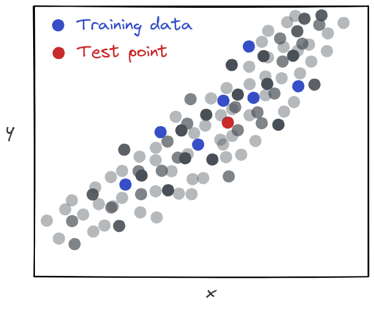{ width=35% }

:::

### Source of prediction error: noise

In the best case scenario, even if the model is exactly the true function

$$ f(\mathbf{x}, \mathbf{w}) = t(\mathbf{x}) \quad  \forall x$$

we still have some prediction error due to the stochastic noise!

::: notes

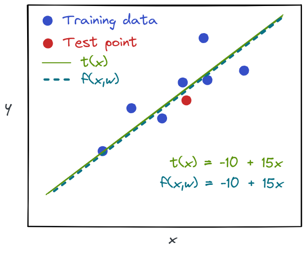{width=35%}

:::

\newpage

### Source of prediction error: parameter estimate

Perhaps the true function is 

$$ t(\mathbf{x}) = f(\mathbf{x}, \mathbf{w_t}) \quad  \forall x$$

but because of the random sample of training data + noise in the data, our parameter estimate is not exactly correct: $\mathbf{\hat{w}} \neq \mathbf{w_t}$.

::: notes

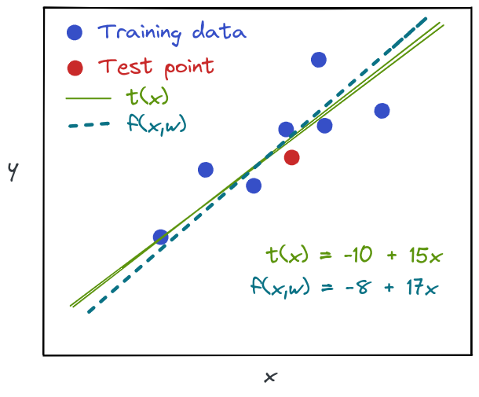{width=35%}

:::

### Source of prediction error: assumed model class (1)

Maybe 

$$ t(\mathbf{x}) \neq f(\mathbf{x}, \mathbf{w})$$

for any $\mathbf{w}$!

Our assumed *model class* (or *hypothesis class*) may not be complex enough to model the true function.

::: notes

**Note**: the *model class* is the set of possible models we could fit, parameterized by the parameter vector.

**Note**: the set of assumptions we make - such as selecting a model class $f$ - introduce what's known as *inductive bias* into our model.

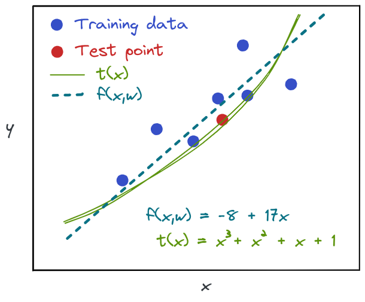{width=35%}

:::

### Source of prediction error: assumed model class (2)

What if we use a model class that is *too* complex?

::: notes

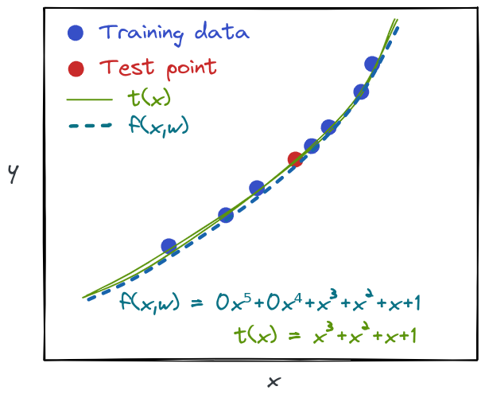{ width=35% }

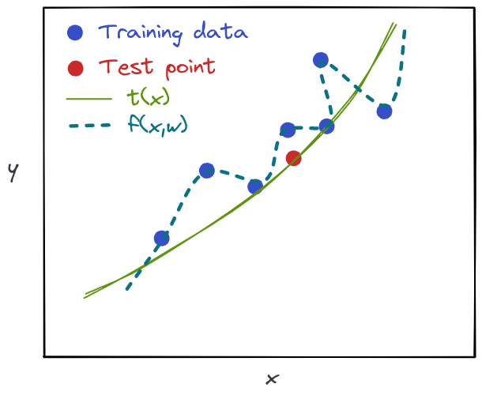{width=40%}

This is not specific to polynomial models - there are many situations where a training algorithm will "learn" a parameter value that should be zero, because it fits the noise. For example, if you have irrelevant features used as input to the model.

:::

### Sources of prediction error: summary

* Stochastic noise which is fundamentally unpredictable
* Parameter estimate has some error due to noise in training data 
* Assumed model class is not complex enough (**under-modeling**)

::: notes

Note: the "parameter estimate" error also includes overfitting!

:::

\newpage

## Error decomposition

### A note on this decomposition

We will derive the expected error on the test *point*:

* first, assuming the training sample is fixed, so the expectation is only over $\epsilon_t$
* then, relaxing this assumption, so the expectation is over the training set sample $\mathcal{D}$

::: notes

This is allowed because of independence of $\epsilon_t$ and $\mathcal{D}$; so

$$E_{\mathcal{D}, \epsilon}[\ldots] = E_{\mathcal{D}}[E_{\epsilon}[\ldots]]$$

Finally, we'll take that expectation over all the test points.

:::

### First: assuming fixed training sample

For convenience, denote $f(\mathbf{x}_t, \mathbf{\hat{w}})$ as $f$ and $t(\mathbf{x}_t)$ as $t$.

$$
\begin{aligned}
E_{\epsilon} [(y_t-\hat{y_t})^2] &= E_{\epsilon}[(t + \epsilon_t - f)^2] \\
 &= E_{\epsilon}[(t - f)^2 + \epsilon_t^2 + 2\epsilon_t(t - f)] \\
 &= (t-f)^2 + E_\epsilon[\epsilon_t^2] + 0 \\
 &= (t-f)^2 + \sigma_\epsilon^2
\end{aligned} 
$$

::: notes

The expected value (over the $\epsilon$) of squared error is because:

* under the assumption that training sample is fixed, $f$ and $t$ are constant
* $E[\epsilon_t] = 0$

The last term is not affected when we then take the expectation over ${\mathcal{D}}$, either. This term is called the *irreducible error*, and it not under our control. 

The first term ($(t-f)^2$) is the model estimation error, and this *is* under our control - it is *reducible* error - so next we will turn to $E_{\mathcal{D}}[(t-f)^2]$.

:::

### Second: expectation over ${\mathcal{D}}$

We again denote $f(\mathbf{x}_t, \mathbf{\hat{w}})$ as $f$ and $t(\mathbf{x}_t)$ as $t$.

$$
\begin{aligned}
E_{\mathcal{D}} [(t-f)^2 + \sigma_\epsilon^2] &= E_{\mathcal{D}}[(t-f)^2] + \sigma_\epsilon^2 \\
 &= E_{\mathcal{D}}[t^2 + f^2 -2tf] + \sigma_\epsilon^2 \\
 &= t^2 + E_{\mathcal{D}}[f^2] -2t E_{\mathcal{D}}[f] + \sigma_\epsilon^2 \\
 &= (t - E_{\mathcal{D}}[f])^2 + (E_{\mathcal{D}}[f^2] - E_{\mathcal{D}}[f]^2) + \sigma_\epsilon^2 
\end{aligned} 
$$

::: notes

because:

* the true value $t(\mathbf{x}_t)$ is independent of the training sample drawn from $\mathcal{D}$.

<!-- 

TODO: refer to https://stats.stackexchange.com/questions/164378/bias-variance-decomposition-and-independence-of-x-and-epsilon

-->

:::

\newpage

### A hypothetical (impossible) experiment

::: notes

To understand this decomposition, it helps to think about this experiment.

:::

Suppose we would get many independent training sets (from same process).

For each training set,

* train our model (estimate parameters), and
* use this model to estimate value of test point(s)

::: notes

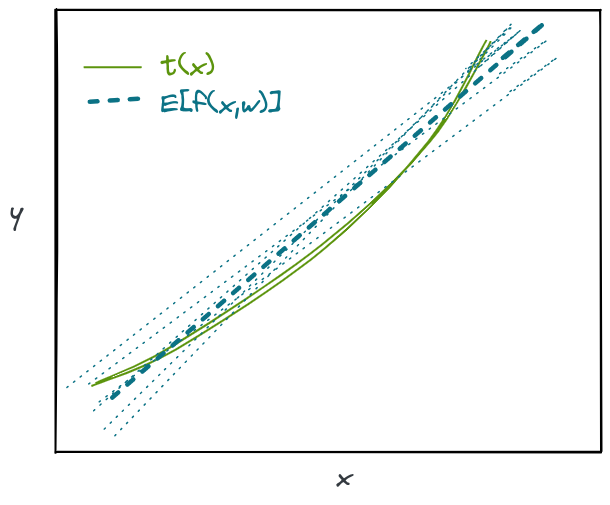{ width=35% }
:::

### Error decomposition: bias

In the first term in

$$(\textcolor{red}{t - E_{\mathcal{D}}[f]})^2 + (E_{\mathcal{D}}[f^2] - E_{\mathcal{D}}[f]^2) + \sigma_\epsilon^2$$

$\textcolor{red}{t - E_{\mathcal{D}}[f]}$ is called the **bias**. 

::: notes

The bias is the difference between the *true value* and the *mean prediction of the model* (over many different random samples of training data.)

Informally: it tells us to what extent the model is *systematically* wrong!

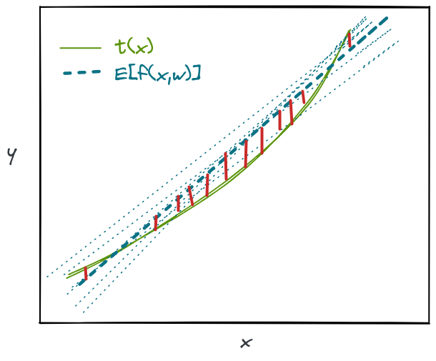{ width=35% }

:::

### Error decomposition: variance

The second term in

$$(t - E_{\mathcal{D}}[f])^2 + \textcolor{blue}{(E_{\mathcal{D}}[f^2] - E_{\mathcal{D}}[f]^2)} + \sigma_\epsilon^2$$

$\textcolor{blue}{E_{\mathcal{D}}[f^2] - E_{\mathcal{D}}[f]^2}$ is the **variance** of the model prediction over $\mathcal{D}$. 

::: notes

Informally: it tells us: if you train many of these models, with a new sample of training data each time, how much variation is there in the model output?

Or: how much does the model output depend on the training data?

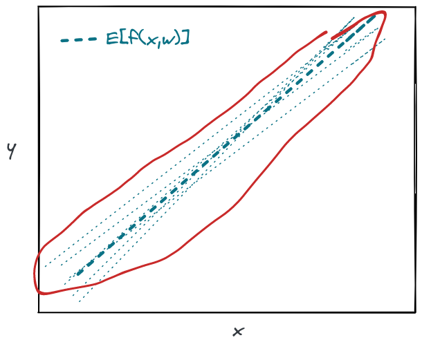{ width=35% }

:::

### Error decomposition: irreducible error

We already said that the third term in 

$$(t - E_{\mathcal{D}}[f])^2 + (E_{\mathcal{D}}[f^2] - E_{\mathcal{D}}[f]^2) + \textcolor{brown}{\sigma_\epsilon^2}$$

is called the **irreducible errror**.

::: notes

This term is a *lower bound* on the MSE.

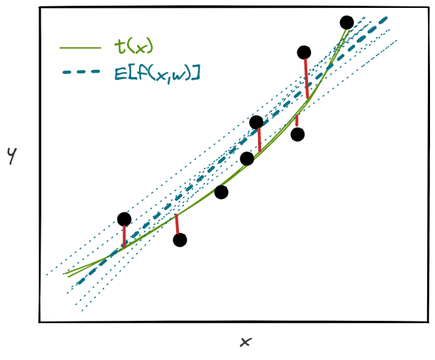{ width=35% }

:::

### Error decomposition: summary

Putting it together, the expected test point error

$$(\textcolor{red}{t - E_{\mathcal{D}}[f]})^2 + \textcolor{blue}{(E_{\mathcal{D}}[f^2] - E_{\mathcal{D}}[f]^2)} + \textcolor{brown}{\sigma_\epsilon^2}$$

is

$$(\textcolor{red}{\text{Bias}})^2 + 
\textcolor{blue}{\text{Variance over } \mathcal{D}} + 
\textcolor{brown}{\text{Irreducible Error}}$$

## Bias-variance tradeoff

### Intuition behind bias-variance and model complexity

It's often the case that changing the model to reduce bias, increases variance (and vice versa). Why?

### Classical ML view: Bias variance tradeoff

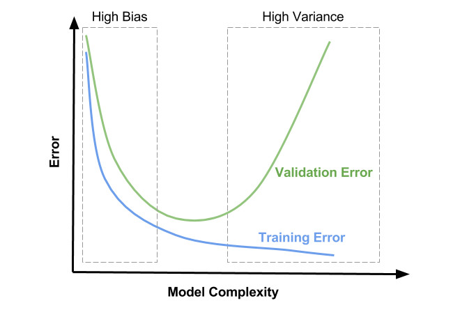{width=50%}

::: notes

Note: this is a "classic" view of the bias-variance tradeoff. Recent results suggest that this is only part of the picture.

:::

\newpage

### Updated view: double descent

.](../images/8-polynomial-animation.gif){ width=40% }

::: notes

Explanation (via [Boaz Barak](https://windowsontheory.org/2021/01/31/a-blitz-through-classical-statistical-learning-theory/)):

> When $d$ of the model is less than $d_t$ of the polynomial, we are "under-fitting" and will not get good performance. As $d$ increases between $d_t$ and $N$, we fit more and more of the noise, until for $d=N$ we have a perfect interpolating polynomial that will have perfect training but very poor test performance. When $d$ grows beyond $N$, more than one polynomial can fit the data, and (under certain conditions) SGD will select the minimal norm one, which will make the interpolation smoother and smoother and actually result in better performance.

For an intuitive explanation of "double descent", see:

* [Double Descent](https://mlu-explain.github.io/double-descent/) (Jared Wilber, Brent Werness)
* [Double Descent 2](https://mlu-explain.github.io/double-descent2/) (Brent Werness, Jared Wilber)

:::

<!--
https://colab.research.google.com/github/aslanides/aslanides.github.io/blob/master/colabs/2019-10-10-interpolation-regime.ipynb
-->

\newpage

## Bias and variance of linear regression

### Bias of linear model (1)

Let us give a definition of *bias* on a test point, $(x_t, y_t)$ for a function $f$ with parameter estimate $\hat{w}$:

$$\text{Bias}(x_t) := t( x_t ) -  E[f(x_t, \hat{w})] $$

### Bias of linear model (2)

Suppose that there is no under-modeling, so there is a parameter vector $w_t$ such that

$$t(x) = f(x,w_t) = \phi(x)^T w_t$$

### Bias of linear model (3)

Then for each training sample $i=1,\ldots,N$,  

$$y_i = \phi(x_i)^T w_t + \epsilon_i$$ 

and for the entire training set, 

$$y=\Phi w_t + \epsilon$$

### Bias of linear model (4)

For a fixed training set, the least squares parameter estimate will be

$$
\begin{aligned}
\hat{w} &= (\Phi^T \Phi)^{-1} \Phi^T y \\
&= (\Phi^T \Phi)^{-1} \Phi^T (\Phi w_t + \epsilon) \\
&=w_t+ (\Phi^T \Phi)^{-1} \Phi^T \epsilon
\end{aligned}
$$

Now we can find $E[\hat{w}]$ over the samples of noisy training data: since $E[\epsilon] = 0$, 
we have $E[\hat{w}] =w_t$.

### Bias of linear model (5)

Informally, we can say that: on average, the parameter estimate matches the "true" parameter.

Then $E[f(x_t, \hat{w})] = E[f(x_t, w_t)] = t(x_t)$.

**Conclusion**: We can see that when the model is linear and there is no under-modeling, there is no bias:

$$\text{Bias}(x_t) =  0$$

\newpage

### Variance of linear model 

We will similarly solve 

$$
\begin{aligned}
\text{Var}(x_{t}) &= E\left[\left(f(x_{t}, \hat{w}) - E[f(x_{t}, \hat{w})]\right)^2\right]
\end{aligned}
$$

These steps are a little more involved, but we find that without undermodeling:

$$
E [\text{Var}(x_t)] = \frac{\sigma_\epsilon ^2 p}{N} 
$$

::: notes

Now, we will use $\text{Var}(\hat{w})$ to compute $\text{Var}(x_t)$ for the linear model. 

First, recall from our discussion of bias that when there is no under-modeling 

$$E[f(x_{t}, \hat{w})] = \phi(x_{t})^T \hat{w} = \phi(x_{t})^T w_t $$

Then the variance of the linear model output for a test point is

$$ 
\begin{aligned}
\text{Var}(x_{t}) & = E [f(x_{t}, \hat{w}) - E[f(x_{t}, \hat{w})]]^2 \\
&= E [\phi(x_{t})^T \hat{w} - \phi(x_{t})^T w_t ]^2 \\
&= E [\phi(x_{t})^T (\hat{w} - w_t) ]^2 \\
\end{aligned}
$$

Also note the following trick: if ${a}$ is a non-random vector and ${z}$ is a random vector, then

$$E[{a}^T {z}]^2 = E[{a}^T {zz}^T {a}] = {a}^T E[{zz}^T]{a}$$

Therefore, 

$$
\begin{aligned}
\text{Var}(x_{t}) & = E [\phi(x_{t})^T (\hat{w} - w_t) ]^2 \\
& =  \phi(x_{t})^T  E [(\hat{w} -w_t)(\hat{w} -w_t)^T] \phi(x_{t}) \\
\end{aligned}
$$

Finally, recall that

$$\text{Var}(\hat{w}) = E [(\hat{w} -w_t)(\hat{w} -w_t)^T] = \sigma_\epsilon^2 (\Phi^T \Phi)^{-1}$$

so

$$
\begin{aligned}
\text{Var}(x_{t}) & =  \phi(x_{t})^T  E [(\hat{w} -w_t)(\hat{w} -w_t)^T] \phi(x_{t})  \\
& =  \sigma_\epsilon^2  \phi(x_{t})^T (\Phi^T \Phi)^{-1} \phi(x_{t}) \\
\end{aligned}
$$

This derivation assumed there is no under-modeling. However, in the case of under-modeling, the variance expression is similar.

For the next part, we will compute the variance term from the *in-sample* prediction error, i.e. the error if the test point is randomly drawn from the training data:

* Training data is $(x_i, y_i), i=1,\ldots, N$
* $x_{t} = x_i$ with probability $\frac{1}{N}$

Each row of $\Phi$ is a vector $\phi(x_i)$ for sample $i$, then

$$\Phi^T \Phi = \sum_{i=1}^N \phi(x_i) \phi(x_i)^T$$

We will use a trick: for random vectors ${u}, {v}$, $E[{u}^T{v}] = Tr( E[{v} {u}^T])$, where $Tr(X)$ is the sum of diagonal of $X$.

Then the expectation (over the test points) of the variance of the model output is:

$$
\begin{aligned}
E [\text{Var}(x_t)] & = \sigma_\epsilon^2 E [\phi(x_t)^T (\Phi^T \Phi)^{-1} \phi(x_t)] \\
& = \sigma_\epsilon ^2 Tr\left( E [\phi(x_t)  \phi(x_t)^T] (\Phi^T \Phi)^{-1}\right) \\
& = \frac{\sigma_\epsilon ^2}{N} Tr\left(\sum_{i=1}^N [\phi(x_{i})  \phi(x_{i})^T] (\Phi^T \Phi)^{-1}\right) \\
& = \frac{\sigma_\epsilon ^2}{N} Tr\left( (\Phi^T \Phi)(\Phi^T \Phi)^{-1}\right) \\
& = \frac{\sigma_\epsilon ^2}{N} Tr\left(  I_p \right) \\
& = \frac{\sigma_\epsilon ^2 p}{N} 
\end{aligned}
$$

The average variance increases with the number of parameters $p$, and decreases with the number of samples used for training $N$, as long as the test point is distributed like the training data. 

:::

## Recap: Error decomposition and bias/variance tradeoff

* Decomposition of model error into different parts
* Intuition about model complexity vs model error
* Linear model is unbiased if there is no under-modeling, variance scales with $\frac{\sigma_\epsilon ^2 p}{N}$
* Next: how to choose "good" models that balance the tradeoff?

\newpage

## Model selection

### A supervised machine learning "recipe" 

* *Step 1*: Get labeled data:  $(\mathbf{x}_i, y_i), i=1,2,\cdots,N$.
* *Step 2*: Choose a candidate **model** $f$: $\hat{y} = f(x)$.
* *Step 3*: Select a **loss function**.
* *Step 4*: Find the model **parameter** values that minimize the loss function (**training**).
* *Step 5*: Use trained model to **predict** $\hat{y}$ for new samples not used in training (**inference**).
* *Step 6*: Evaluate how well your model **generalizes**.

:::notes

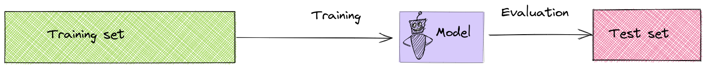{ width=80%  }

:::

### Model selection problems

::: notes

Model selection problem: how to select the $f()$ that maps features $X$ to target $y$?

* Polynomial order selection
* Selecting number of knots and degrees in spline features
* Selecting number of features

... there are many more.

:::

## Model selection solutions

::: notes

Why not select using the training set? You fit each candidate to minimize its training error. A more flexible model will fit noise in those samples, so training error will be small. You'll always select the most flexible model with this approach. 

Why not select using the test set? If you compare candidates on the test set and choose the best, you have used its outcomes to make a modeling decision. The chosen model may fit quirks of that test set, and its test score will give an optimistic estimate of performance on new data.

:::

### Hold-out validation (1)

* Divide data into training, validation, test sets
* For each candidate model, learn model parameters on training set
* Measure error for all models on validation set
* Select model that minimizes error on validation set
* Evaluate *that* model on test set

::: notes

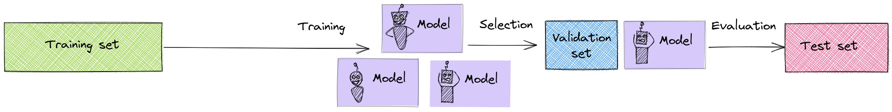{ width=80%  }

Note: sometimes you'll hear "validation set" and "test set" used according to the reverse meanings.

:::

### Hold-out validation (2)

* Split $X, y$ into training, validation, and test.
* Loop over models of increasing complexity: For $p=1,\ldots,p_{max}$,
  * **Fit**: $\hat{w}_p = \text{fit}_p(X_{tr}, y_{tr})$
  * **Predict**: $\hat{y}_{v,p} = \text{pred}(X_{v}, \hat{w}_p)$
  * **Score**: $S_p = \text{score}(y_{v}, \hat{y}_{v,p})$

### Hold-out validation (3)

* Select model order with best score (here, assuming "lower is better"): $$p^* = \operatorname*{argmin}_p S_p$$
* Evaluate: $$S_{p^*} = \text{score}(y_{ts}, \hat{y}_{ts,p^*}), \quad \hat{y}_{ts,p^*} = \text{pred}(X_{ts}, \hat{w}_{p^*})$$

### Problems with hold-out validation

::: notes

* Fitted model (and test error!) varies a lot depending on samples selected for training and validation.
* Fewer samples available for estimating parameters.
* Especially bad for problems with small number of samples.

:::

### K-fold cross validation

Alternative to single split:

* Divide data into $K$ equal-sized parts (typically 5, 10)
* For each of the "splits": evaluate model using $K-1$ parts for training, last part for validation
* Average the $K$ validation scores and choose based on average

:::notes

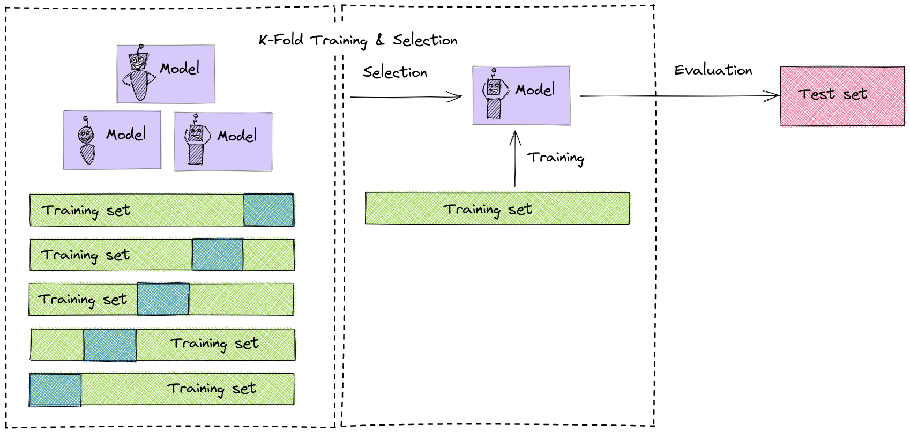{ width=80%  }

:::

\newpage

### K-fold CV - algorithm (1)

**Outer loop** over folds: for $i=1$ to $K$

* Get training and validation sets for fold $i$:

* **Inner loop** over models of increasing complexity: For $p=1$ to $p_{max}$,
  * **Fit**: $\hat{w}_{p,i} = \text{fit}_p(X_{tr_i}, y_{tr_i})$
  * **Predict**: $\hat{y}_{v_i,p} = \text{pred}(X_{v_i}, \hat{w}_{p,i})$
  * **Score**: $S_{p,i} = \text{score}(y_{v_i}, \hat{y}_{v_i,p})$

### K-fold CV - algorithm (2)

* Find average score (across $K$ scores) for each model: $\bar{S}_p$
* Select model with best *average* score: $p^* = \operatorname*{argmin}_p \bar{S}_p$
* Re-train model on entire training set: $\hat{w}_{p^*} = \text{fit}_p(X_{tr}, y_{tr})$
* Evaluate new fitted model on test set

::: notes

.](../images/3-validation-options.png){ width=100% }

:::

\newpage

### K-fold CV - how to split? 

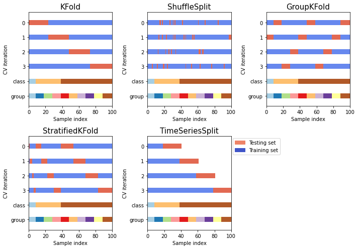{ width=65% }

::: notes

Selecting the right K-fold CV is very important for avoiding data leakage! (Also for training/test split.)

* if there is no structure in the data - shuffle split (avoid accidental patterns)
* if there is group structure - use a split that keeps members of each group in either training set, or validation set, but not both
* for time series data - use a split that keeps validation data in the future, relative to training data

Think about the task that the model will be asked to do in "production," relative to the data it is trained on! 

:::
