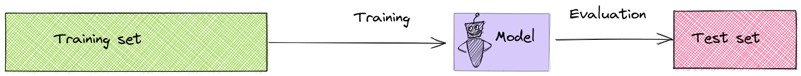
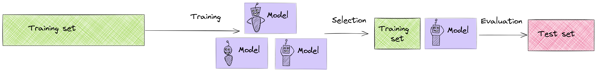
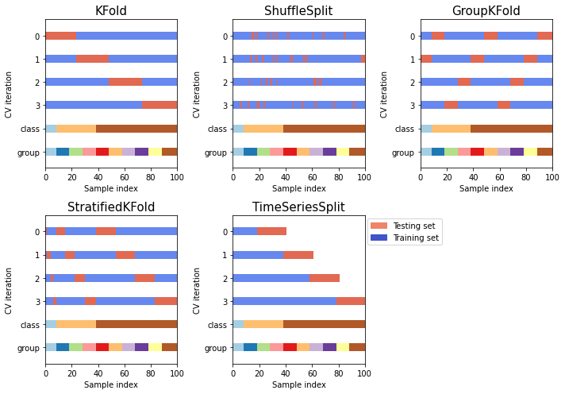
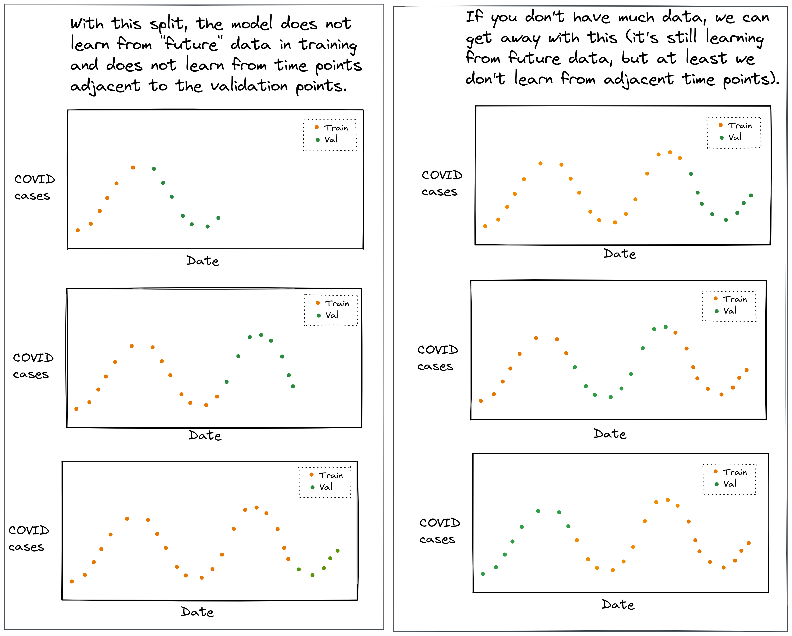
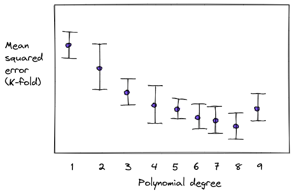
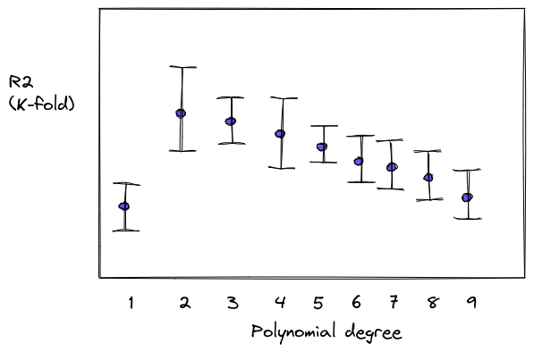
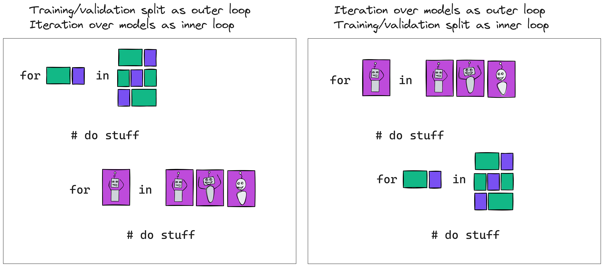

:::notes

**Math prerequisites for this lecture**: None.

:::

\newpage

::: {.cell .markdown}

## A supervised machine learning "recipe" 

* *Step 1*: Get labeled data:  $(\mathbf{x_i}, y_i), i=1,2,\cdots,N$.
* *Step 2*: Choose a candidate **model** $f$: $\hat{y} = f(x)$.
* *Step 3*: Select a **loss function**.
* *Step 4*: Find the model **parameter** values that minimize the loss function (**training**).
* *Step 5*: Use trained model to **predict** $\hat{y}$ for new samples not used in training (**inference**).
* *Step 6*: Evaluate how well your model **generalizes**.

:::notes

{ width=80%  }

:::

:::

## Model selection problems

::: notes

Model selection problem: how to select the $f()$ that maps features $X$ to target $y$?

We'll look at two examples of model selection problems, but there are many more.

:::

### Model order selection problem

* Given data $(x_i, y_i), i=1\cdots,N$ (one feature)
* Polynomial model: $\hat{y} = w_0 + w_1 x + \cdots + w_d x^d$
* $d$ is degree of polynomial, called **model order**
* **Model order selection problem**: choosing $d$

### Using training loss for model order selection?

Suppose we would "search" over each possible $d$:

* Fit model of order $d$ on training data, get $\mathbf{w}$
* Compute predictions on training data
* Compute loss function on training data: $MSE = \frac{1}{n}\sum_{i=1}^n (y_i - \hat{y_i})^2$
* Select $d$ that minimizes loss on training set

::: notes

{ width=80%  }

Note that we shouldn't use the test data to select a model either - the test set must be left as an "unused" data set on which to evaluate how well the model generalizes.

:::

\newpage

### Model order selection for spline features (1)

Polynomial models of high $d$ are actually bad, usually - 

)](../images/4-polynomial-regressions-one-plot.png){ width=80%  }

::: notes

* tends to get kind of weird at the boundaries of the data (Runge's phenomenon)
* really bad if you need to extrapolate past the range of the training data
* acts *globally* when different regions of the data might have different behavior

:::

### Model order selection for spline features (2)

Instead, we tend to prefer lower-$d$ piecewise functions, so we can fit *local* behavior:

)](../images/4-piecewise.png){ width=50%  }

::: notes

The feature axis is divided into breakpoints - we call each one a "knot" - and then we define basis functions that are equal to a polynomial function of the feature between two knots.

If we constrain the piecewise function to meet at the knots, we call these splines - basis splines or "B splines".

:::

\newpage

### Model order selection for spline features (3)

For constant functions (degree 0) - given "knots" at positions $k_t, k_{t+1}$:

$$
\phi_{t,0}(x_{i,j}) = \begin{cases}
1, \quad  k_t \leq x < k_{t+1} \\
0, \quad  \text{otherwise}
\end{cases}
$$

### Model order selection for spline features (4)

For degree $p>0$, defined recursively:

$$
\phi_{t, p}( x ) := \dfrac{ x - k_t }{k_{t+p} - k_t} \phi_{t,p-1}( x ) + \dfrac{k_{t+p+1} - x }{k_{t+p+1} - k_{t+1}} \phi_{t+1,p-1}( x )
$$

::: notes

You won't need to compute this yourself - use [`SplineTransformer`](https://scikit-learn.org/stable/modules/generated/sklearn.preprocessing.SplineTransformer.html) in `sklearn`.

:::

### Model order selection for spline features (5)

.)](../images/4-bins-various-n-cuts.png){ width=80% }

::: notes

Now we have two "knobs" for tuning model complexity: 

* the degree of the splines, 
* and the number of knots!

The number of features will be: number of knots + degree - 1

:::

\newpage

### Feature selection problem (1)

Given high dimensional data $\mathbf{X} \in R^{n \times d}$ and target variable $y$, 

Linear model: $\hat{y} = w_0 + \sum_{j=1}^d w_j x_j$

::: notes

* Many features, only some are relevant
* **Feature selection problem**: fit a model with a small number of features

:::

### Feature selection problem (2)

Select a subset of $k << d$ features, $\mathbf{X}_S \in R^{n \times k}$ that is most relevant to target $y$. 

Linear model: $\hat{y} = w_0 + \sum_{x \in \mathbf{X}_S} w_j x_j$

::: notes

Why use a subset of features?

* High risk of overfitting if you use all features!
* For linear regression, when $N \geq p$, variance increases linearly with number of parameters, inversely with number of samples. (Not derived in class, but read extra notes posted after class at home.)

:::

## Validation

### Hold-out validation

* Divide data into training, validation, test sets
* For each candidate model, learn model parameters on training set
* Measure error for all models on validation set
* Select model that minimizes error on validation set
* Evaluate *that* model on test set

::: notes

{ width=80%  }

Note: sometimes you'll hear "validation set" and "test set" used according to the reverse meanings.

:::

### Hold-out validation (1)

* Split $X, y$ into training, validation, and test.
* Loop over models of increasing complexity: For $p=1,\ldots,p_{max}$,
  * **Fit**: $\hat{w}_p = \text{fit}_p(X_{tr}, y_{tr})$
  * **Predict**: $\hat{y}_{v,p} = \text{pred}(X_{v}, \hat{w}_p)$
  * **Score**: $S_p = \text{score}(y_{v}, \hat{y}_{v,p})$

### Hold-out validation (2)

* Select model order with best score (here, assuming "lower is better"): $$p^* = \operatorname*{argmin}_p S_p$$
* Evaluate: $$S_{p^*} = \text{score}(y_{ts}, \hat{y}_{ts,p^*}), \quad \hat{y}_{ts,p^*} = \text{pred}(X_{ts}, \hat{w}_{p^*})$$

### Problems with hold-out validation

::: notes

* Fitted model (and test error!) varies a lot depending on samples selected for training and validation.
* Fewer samples available for estimating parameters.
* Especially bad for problems with small number of samples.

:::

### K-fold cross validation

Alternative to simple split:

* Divide data into $K$ equal-sized parts (typically 5, 10)
* For each of the "splits": evaluate model using $K-1$ parts for training, last part for validation
* Average the $K$ validation scores and choose based on average

:::notes

{ width=80%  }

:::

### K-fold CV - algorithm (1)

**Outer loop** over folds: for $i=1$ to $K$

* Get training and validation sets for fold $i$:

* **Inner loop** over models of increasing complexity: For $p=1$ to $p_{max}$,
  * **Fit**: $\hat{w}_{p,i} = \text{fit}_p(X_{tr_i}, y_{tr_i})$
  * **Predict**: $\hat{y}_{v_i,p} = \text{pred}(X_{v_i}, \hat{w}_{p,i})$
  * **Score**: $S_{p,i} = \text{score}(y_{v_i}, \hat{y}_{v_i,p})$

### K-fold CV - algorithm (2)

* Find average score (across $K$ scores) for each model: $\bar{S}_p$
* Select model with best *average* score: $p^* = \operatorname*{argmin}_p \bar{S}_p$
* Re-train model on entire training set: $\hat{w}_{p^*} = \text{fit}_p(X_{tr}, y_{tr})$
* Evaluate new fitted model on test set

::: notes

.](../images/3-validation-options.png){ width=100% }

:::

\newpage

### Leave-p-out CV

* In each iteration, $p$ validation points
* Remaining $n-p$ points are for training
* Repeat for *all* possible sets of $p$ validation points 

:::notes

This is *not* like K-fold CV which uses non-overlapping validation sets (they are only the same for $p=1$)! 

:::

### Computation (leave-p-out CV)

${n \choose p}$ iterations, in each:

 - train on $n-p$ samples
 - score on $p$ samples

:::notes

Usually, this is too expensive - but sometimes LOO CV can be a good match to the model (KNN).

:::

### Computation (K-fold CV)

K iterations, in each:

 - train on $n-n/k$ samples
 - score on $n/k$ samples

### K-fold CV - how to split? 

{ width=65% }

::: notes

Selecting the right K-fold CV is very important for avoiding data leakage! (Also for training/test split.)

* if there is no structure in the data - shuffle split (avoid accidental patterns)
* if there is group structure - use a split that keeps members of each group in either training set, or validation set, but not both
* for time series data - use a split that keeps validation data in the future, relative to training data

Think about the task that the model will be asked to do in "production," relative to the data it is trained on! Refer to [the function documentation](https://scikit-learn.org/stable/modules/cross_validation.html#cross-validation) for more examples.

\newpage

{ width=60% }

![Example 2: The split on the left seems OK, unless (as shown on the right), each person contributes several samples to the dataset, and the value of $y$ is similar for different samples from the same person. This is an example of data leakage. The model is learning from data from an individual, then it is validated and evaluated on data from the same individual - but in production, the model is expected to make predictions about individuals it has never seen. The training, validation, and evaluation process will have overly optimistic performance compared to production (and the model may overfit).](../images/4-shuffle-group.png){ width=60% }

{ width=74% }

\newpage

{ width=77% }

{ width=77% }

:::

\newpage

## One standard error rule

* Model selection that minimizes mean error often results in too-complex model
* One standard error rule: use simplest model where mean error is within one SE of the minimum mean error

### One standard error rule - algorithm (1)

* Given data $X, y$
* Compute score $S_{p,i}$ for model $p$ on fold $i$ (of $K$)
* Compute average ($\bar{S}_p$), standard deviation $\sigma_p$, and standard error of scores:

$$SE_p = \frac{\sigma_p}{\sqrt{K-1}}$$

### One standard error rule - algorithm (2)

"Best score" model selection: $p^* = \operatorname*{argmin}_p \bar{S}_p$

**One SE rule** for "lower is better" scoring metric: Compute target score: $S_t = \bar{S}_{p^*} + SE_{p^*}$

then select simplest model with score lower than target:

$$p^{*,1{\text{SE}}} = \min \{p | \bar{S}_p \leq S_t\}$$

::: notes

{width=60%}

Note: this assumes you are using a "smaller is better" metric such as MSE. If you are using a "larger is better" metric, like R2, how would we change the algorithm?

:::

\newpage

### One standard error rule - algorithm (3)

"Best score" model selection: $p^* = \operatorname*{argmax}_p \bar{S}_p$

**One SE rule** for "higher is better" scoring metric: Compute target score: $S_t = \bar{S}_{p^*} - SE_{p^*}$

then select simplest model with score higher than target:

$$p^{*,1{\text{SE}}} = \min \{p | \bar{S}_p \geq S_t\}$$

::: notes

{width=60%}

:::

::: {.cell .markdown}
## Placing computation

:::

::: {.cell .markdown}
### Placement options

Any "step" could be placed:

* before the train/test split
* after the split, outside loop
* in the first (outer) loop
* in the second (inner) loop

:::notes

We want to place each "step" in the appropriate position to minimize the computation required, but also in order to use the split effectively! In placing a "step", we need to ask ourselves:

* does the result of this computation depend on the train/test split?
* does the result of this computation depend on the first loop variable?
* does the result of this computation depend on the second loop variable?

\newpage

Note: the order of the loops (first loop over models, then over splits; or first loop over splits, then over models) is up to us - we can select the order that is most efficient for computation.

{width=60%}

Data pre-processing should be considered part of model training, so steps where the value after pre-processing depends on the data, should use *only* the training data. For example - 

* filling missing values with some statistic from the data (mean, median, max, etc.)
* standardizing (removing mean and scaling to unit variance) or other scaling

:::

:::

### Example: design matrix for n-way interactions

Suppose we want to evaluate models for increasing $n$, where the model of $n$ includes $n$-way interaction features. For example:

* Model 1: $x_1, x_2, x_3$
* Model 2: $x_1, x_2, x_3, x_1 \times x_2, x_1 \times x_3, x_2 \times x_3$
* Model 3: $x_1, x_2, x_3, x_1 \times x_2, x_1 \times x_3, x_2 \times x_3, x_1 \times x_2 \times x_3$

::: notes

If we place the computation of the interaction features in the innermost loop, we will compute the same values repeatedly - and we don't need to! We can actually compute the entire design matrix *outside* the entire K-fold CV, and inside the K-fold CV - 

* select from this overall matrix, the columns corresponding to the current model
* select from this overall matrix, the rows corresponding to the training/validation data for this split

{width=40%}

:::

### Example: design matrix for models with spline features

Suppose we want to evaluate models on a spline transformation of the data, with a fixed degree (e.g. $d=2$) and an increasing number of "knots". For example:

* Model 1: 3 knots
* Model 2: 4 knots
* Model 3: 5 knots

(we will specify the positions of the knots ourselves, rather than having them be inferred from the data.)

::: notes

In this example, we cannot put the computation of the spline features outside the K-fold CV - *all* the values in the "transformed" dataset are different in each model. (Unlike the previous example, there is no "repetition" of features from one model to the next.)

However, we can consider two *valid* ways to place the computation of spline features: 

{width=40%}

* In the first (left) case, however, we re-compute the spline features repeatedly for the same samples - we don't need to!
* Instead, we should use the second (right) loop order, and then in the inner loop, just select the rows corresponding to training and validation from the design matrix *for the given model*.

:::

* pre-processing: fill missing values with median?
* compute design matrix: n-way interactions?
* compute design matrix: splines with increasing number of knots?

