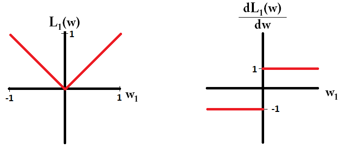

## Regularization

### Penalty for model complexity

With no bounds on complexity of model, we can always get a model with zero training error on finite training set - overfitting.

Basic idea: apply penalty in loss function to discourage more complex models

### Regularization vs. standard LS

Least squares estimate:

$$ \hat{w} = \operatorname*{argmin}_w MSE(w), \quad MSE(w) = \frac{1}{n}\sum_{i=1}^n (y_i - \hat{y_i})^2 $$

Regularized estimate w/ **regularizing function** $\phi(w)$:

$$ \hat{w} = \operatorname*{argmin}_w J(w), \quad  J(w) = MSE(w) + \phi(w) $$

### Common regularizers

Ridge regression (L2):

$$ \phi (w) = \alpha \sum_{j=1}^d | w_j | ^2 $$

LASSO regression (L1):

$$ \phi (w) = \alpha \sum_{j=1}^d | w_j | $$

### Graphical representation

. As we increase $\alpha$, regularized solution moves from LS to 0. ](../images/regularization-contour.png){ width=100%}

### Common features: Ridge and LASSO

* Both penalize large $w_j$
* Both have parameter $\alpha$ that controls level of regularization
* Intercept $w_0$ not included in regularization sum (starts at 1!), this depends on mean of $y$ and should not be constrained.

### Differences: Ridge and LASSO (1)

Ridge (L2):

* minimizes $|w_j|^2$, 
* minimal penalty for small non-zero coefficients
* heavily penalizes large coefficients
* tends to make many "small" coefficients
* Not for feature selection

### Differences: LASSO (2)

LASSO (L1)

* minimizes $|w_j|$
* tends to make coefficients either 0 or large (sparse!)
* does feature selection (setting $w_j$ to zero is equivalent to un-selecting feature)

### Standardization (1)

Before learning a model with regularization, we typically *standardize* each feature and target to have zero mean, unit variance:

* $x_{i,j} \rightarrow  \frac{x_{i,j} - \bar{x}_j}{s_{x_j}}$
* $y_{i} \rightarrow  \frac{y_{i} - \bar{y}}{s_{y}}$

### Standardization (2)

Why? 

* Without scaling, regularization depends on data range
* With mean removal, no longer need $w_0$, so regularization term is just L1 or L2 norm of coefficient vector

### L1 and L2 norm with standardization (1)

Assuming data standardized to zero mean, unit variance, the Ridge cost function is:

$$
\begin{aligned}
J(\mathbf{w}) &= \sum_{i=1}^n (y_i - \hat{y}_i)^2 + \alpha  \sum_{j=1}^d |w_j| ^2  \\
&= || \mathbf{A} \mathbf{w} -  \mathbf{y} || ^2 + \alpha || \mathbf{w} || ^2 
\end{aligned}
$$ 

### L1 and L2 norm with standardization (2)

LASSO cost function ($|| \mathbf{w} ||_1$ is L1 norm):

$$
\begin{aligned}
J(\mathbf{w}) &= \sum_{i=1}^n (y_i - \hat{y}_i)^2 + \alpha  \sum_{j=1}^d |w_j| \\
&= ||\mathbf{A} \mathbf{w} -  \mathbf{y} || ^2 + \alpha || \mathbf{w} ||_1 
\end{aligned}
$$ 

### Ridge regularization

Why minimize $|| \mathbf{w} || ^2$?

Without regularization:

* large coefficients lead to high variance
* large positive and negative coefficients cancel each other for correlated features (remember attractiveness ratings in linear regression case study...)

### Ridge term and derivative

{ width=40%}

### Ridge closed-form solution

$$J(\mathbf{w}) = ||\mathbf{A} \mathbf{w} -  \mathbf{y} || ^2 + \alpha || \mathbf{w} || ^2$$ 

Taking derivative:

$$\frac{\partial J(\mathbf{w})}{\partial \mathbf{w}} = 2 \mathbf{A}^T(\mathbf{y} - \mathbf{A} \mathbf{w}) + 2 \alpha \mathbf{w} $$ 

Setting it to zero, we find

$$\mathbf{w}_{\text{ridge}} = (\mathbf{A}^T\mathbf{A} + \alpha \mathbf{I})^{-1} \mathbf{A}^T \mathbf{y}$$

### LASSO term and derivative

{ width=40%}

* No closed-form solution: derivative of $|w_j|$ is not continuous
* But there is a unique minimum, because cost function is convex, can solve iteratively

### Effect of regularization level

Greater $\alpha$, more complex model.

* Ridge: Greater $\alpha$ makes coefficients smaller.
* LASSO: Greater $\alpha$ makes more weights zero.

### Selecting regularization level

How to select $\alpha$? by CV!

* Outer loop: loop over CV folds
* Inner loop: loop over $\alpha$

