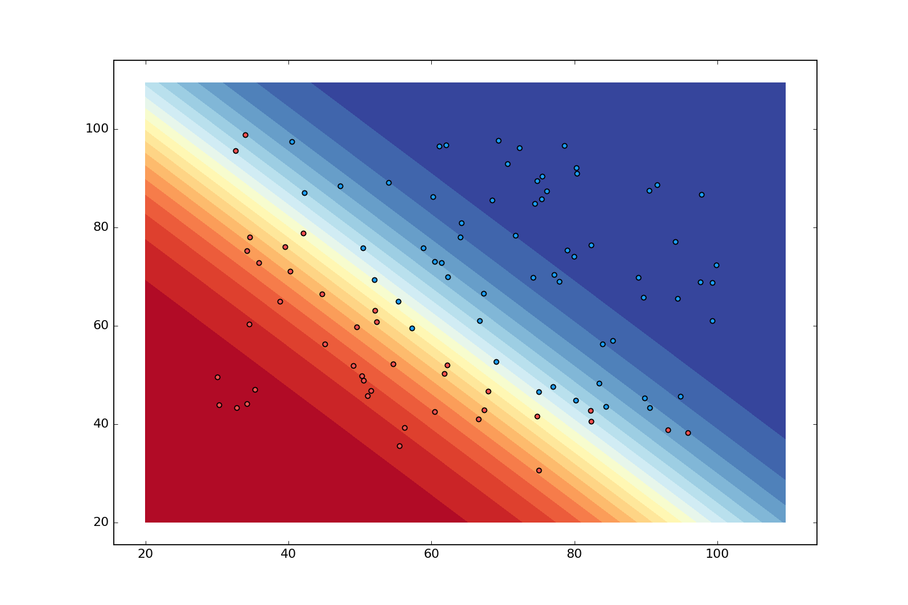

\newpage

## In this lecture

* Linear classifiers
* Logistic regression 
* Fitting logistic regression
* Naive Bayes classifier

## Classification

Suppose we have a series of data points $\{(\mathbf{x_1},y_1),(\mathbf{x_2},y_2),\ldots,(\mathbf{x_n},y_n)\}$
and there is some (unknown) relationship between $\mathbf{x_i}$ and $y_i$. 

* **Classification**: The output variable $y$ is constrained to be $\in {0, 1,\cdots,K-1}$

* **Binary classification**: The output variable $y$ is constrained to be $\in {0, 1}$

::: notes

In regression problems, we are modeling

$$\hat{y} = f(x)$$ 

where $y$ is continuous valued.

In classification problems, we are modeling 

$$\hat{y} = f(x)$$

where $\hat{y}$ is discrete. Alternatively, instead of/in addition to directly learning $f(x)$ (the class labels), we can learn a *decision boundary*.  

:::

## Linear classifiers

### Binary classification with linear decision boundary

::: notes

* Plot training data points
* Draw a line (**decision boundary**) separating 0 class and 1 class
* If a new data point is in the **decision region** corresponding to class 0, then $\hat{y} = 0$. 
* If it is in the decision region corresponding to class 1, then $\hat{y} = 1$.

{ width=40% }

In higher dimensions, there is a separating hyperplane (instead of a separating line).

:::

### Linear classification rule

* Given a **weight vector**: $\mathbf{w} = [w_0, \cdots, w_d]$
* Compute linear combination $z = w_0 + \sum_{j=1}^d w_d x_d$
* Predict class:
$$  \hat{y} = 
    \begin{cases}
	1, z > 0 \\
	0, z \leq 0
	\end{cases}
 $$

### Multi-class classification: illustration

{ width=50% }

### Linear separability 

Given training data samples $(\mathbf{x}, y)$...

The problem is **perfectly linearly separable** if there exists a **separating hyperplane** $H_i$ such that all $\mathbf{x} \in C_i$ lie on its positive side, and all $\mathbf{x} \in C_j, j \neq i$ lie on its negative side.

\newpage

### Non-uniqueness of separating hyperplane

::: notes

When a separating hyperplane exists, it is not unique (there are in fact infinitely many such hyperplanes.)

{ width=40% }

:::

### Non-existence of perfectly separating hyperplane

::: notes

Many datasets _not_ linearly separable - some points will be misclassified by *any* possible hyperplane.

{ width=40% }

:::

### Choosing a hyperplane

Which hyperplane to choose? 

We will try to find the hyperplane that minimizes loss according to some **loss function**.

::: notes

Will revisit several times this semester.

Today, logistic regression:  

* we model the decision boundary as a line/hyperplane (in other words, it is a linear classifier)
* we choose the hyperplane which the probability of having observed this particular data is maximized ("maximum likelihood")
* we model as a continuous function, the *probability of belonging* to the positive class
* we apply a *threshold* rule to turn the "soft" probability as a "hard" decision

::: 

\newpage

## Logistic regression

### Probabilistic model for binary classification 

Instead of looking for a model $f$ so that

$$y_i \approx f(x_i)$$

we will look for an $f$ so that

$$ P(y_i = 1 | x_i) = f(x_i), P(y_i = 0 | x_i) = 1 - f(x_i)$$

::: notes

Suppose we have the weights of a linear decision boundary. For any point in the feature space, 
we can compute the linear combination $z = w_0 + \sum_{j=1}^d w_d x_d$.

Now we want to map that real-valued $z$ to the range $[0,1]$ (representing a probability). 

:::

### Logistic/sigmoid function

{ width=30% }

::: notes

Note the intuitive relationship behind this function's output and the distance from the linear separator (the argument that is input to the function).

{ width=50% }

:::

### Logistic function for binary classification

Let $z = w_0 + \sum_{j=1}^d w_d x_d$, then

$$ P(y=1|\mathbf{x}) = \frac{1}{1 + e^{-z}}, \quad  P(y=0|\mathbf{x}) = \frac{e^{-z}}{1 + e^{-z}} $$ 

(note: $P(y=1) + P(y=0) = 1$)

### Logistic function with threshold

Choose a threshold $t$, then

$$ \hat{y} = 
\begin{cases}
1, \quad P(y=1|\mathbf{x}) \geq t \\
0, \quad P(y=1|\mathbf{x}) < t
\end{cases}
$$

### Logistic model as a "soft" classifier

{ width=30% }

### Logistic classifier properties 

* Class probabilities depend on distance from separating hyperplane
* Points far from separating hyperplane have probability $\approx 0$ or $\approx 1$
* When $|| \mathbf{w}||$ is larger, class probabilities go towards extremes (0,1) more quickly

### Logistic regression - illustration

{ width=40% }

\newpage

### Multi-class logistic regression

Suppose $y \in 0, \ldots, K-1$. We use:

* $\mathbf{W} \in R^{K\times d}$ (parameter matrix) 
* $\mathbf{z} = \mathbf{Wx^T}$ ($K$ linear functions)

::: notes

(Assume we have stacked a 1s column so that the intercept is rolled into the parameter matrix.)

:::

### Softmax function

$$ g_k(\mathbf{z}) = \frac{e^{z_k}}{\sum_{\ell=0}^{K-1} e^{z_\ell}}$$

* Takes as input a vector of $K$ numbers
* Outputs $K$ probabilities proportional to the exponentials of the input numbers.

### Softmax function as a PMF

Acts like a probability mass function:

* $g_k(\mathbf{z}) \in [0,1]$ for each $k$
* $\sum_{k=0}^{K-1} g_k(\mathbf{z}) = 1$
* larger input corresponds to larger "probability"

### Softmax function for multi-class logistic regression (1)

Class probabilities are given by

$$P(y=k | \mathbf{x}) = \frac{e^{z_k}}{\sum_{\ell=0}^{K-1} e^{z_\ell}}$$

### Softmax function for multi-class logistic regression (2)

When $z_k \gg z_{\ell}$ for all $\ell \neq k$:

* $g_k(\mathbf{z}) \approx 1$
* $g_\ell(\mathbf{z}) \approx 0$ for all $\ell \neq k$

Assign highest probability to class $k$ when $z_k$ is largest.

\newpage

## Fitting logistic regression model

::: notes

We know that to fit weights, we need 

* a loss function, 
* and a training algorithm to find the weights that minimize the loss function.

:::

### Learning model parameters

Weights $\mathbf{W}$ are the unknown **model parameters**:

$$ \mathbf{z} = \mathbf{W x}, \mathbf{W} \in R^{K \times d}$$

$$ P(y=k | \mathbf{x}) = g_k(\mathbf{z}) = g_k(\mathbf{Wx})$$

Given training data $(\mathbf{x}_i, y_i), i=1,\ldots,n$, we must learn $\mathbf{W}$.

:::notes

The weight matrix $\mathbf{W}$ has a column for each parameter, and a row for each class. (In the binary classification case, there is just one row, i.e. we have a weight vector.)

Note that if the data is linearly separable, there will be more than one $\mathbf{W}$ that perfectly classifies the training data! We will choose the *maximum likelihood* one.

:::

### Maximum likelihood estimation (1)

Let $P(\mathbf{y}| \mathbf{X}, \mathbf{W})$ be the probability of observing class labels $\mathbf{y} = [y_0, \ldots, y_n]$ 

given inputs $\mathbf{X} = [\mathbf{x}_0, \ldots, \mathbf{x}_n]$ and weights $\mathbf{W}$.

The **maximum likelihood estimate** is

$$ \mathbf{\hat{W}} = \operatorname*{argmax}_W P(\mathbf{y}| \mathbf{X}, \mathbf{W})$$

::: notes

It is the estimate of parameters for which these observations are most likely.

:::

### Maximum likelihood estimation (2)

Assume outputs $y_i$ are independent of one another,

$$ P(\mathbf{y}| \mathbf{X}, \mathbf{W}) = \prod_{i=1}^n P(y_i| \mathbf{x_i}, \mathbf{W})$$

::: notes

Note: for binary classification, $P(y_i| \mathbf{x_i}, \mathbf{w})$ is equal to 

* $y_i P(y_i  = 1| \mathbf{x_i}, \mathbf{w})$ when $y_i = 1$
* and $(1 - y_i) P(y_i = 0| \mathbf{x_i}, \mathbf{w})$ when $y_i = 0$.

and since only one term will be non-zero for any given $y_i$, $P(y_i| \mathbf{x_i}, \mathbf{w})$ is equal to the sum of those: 

$$y_i P(y_i  = 1| \mathbf{x_i}, \mathbf{w}) + (1 - y_i) P(y_i = 0| \mathbf{x_i}, \mathbf{w})$$

This expression is familiar as the PMF of a Bernoulli random variable.

We take the log of both sides, because then the product turns into a sum (better for numeric stability!), and we make it negative so we can minimize instead of maximize...

:::

### Maximum likelihood estimation (3)

Define the **negative log likelihood**:

$$
\begin{aligned}
L(\mathbf{W}) &= -\ln P(\mathbf{y}| \mathbf{X}, \mathbf{W}) \\
&= - \sum_{i=1}^n \ln P(y_i| \mathbf{x_i}, \mathbf{W})
\end{aligned}
$$

::: notes

Note that maximizing the likelihood is the same as minimizing the negative log likelihood.

:::

### Maximum likelihood estimation (4)

Now we can re-write max likelihood estimator as a loss function to minimize:

$$ \mathbf{\hat{W}} = \operatorname*{argmax}_W P(\mathbf{y}| \mathbf{X}, \mathbf{W}) = \operatorname*{argmin}_W L(\mathbf{W})$$

::: notes

We will "plug in" the model to specifically define the loss function, first for the binary classification case (binary cross-entropy loss) and then for the multi-class case (categorical cross-entropy loss).

:::

### Binary cross-entropy loss function

$$  L(\mathbf{W}) = - \sum_{i = 1}^n  \left( y_i \ln P(y_i  = 1| \mathbf{x_i}, \mathbf{w}) + (1 - y_i) \ln P(y_i = 0| \mathbf{x_i}, \mathbf{w}) \right) $$

### Categorical cross-entropy loss function (1)

Define "one-hot" vector - for a sample from class $k$, all entries in the vector are $0$ except for the entry with index $k$, which is $1$:

$$r_{ik} = 
\begin{cases}
1 \quad y_i = k \\
0 \quad y_i \neq k
\end{cases}
$$

$$i = 1,\ldots , n, \quad k=0, \ldots, K-1$$

:::notes

This is used for multi-class classification.

For example: if the class labels are $[0, 1, 2, 3, 4]$, for a sample for which $y_i = 3$, $r_{ik} = [0, 0, 0, 1, 0]$.

:::

### Categorical cross-entropy loss function (2)

Then, 

$$  L(\mathbf{W}) = - \sum_{k=0}^{K-1} r_{ik} \ln P(y_i = k| \mathbf{x_i}, \mathbf{W})$$

\newpage

### Minimizing cross-entropy loss

To minimize, we would take the partial derivative:

$$ \frac{\partial L(W)}{\partial W_{kj}} = 0 $$

for all $W_{kj}$. **But**, there is no closed-form expression - can only estimate weights via numerical optimization (e.g. gradient descent). 

:::notes

To get the gradient descent update rule, we need to get the gradient of the loss function. 

We will show this for the binary classifier case only. The next step will be to plug in our sigmoid function, $P(y_i = 1| \mathbf{x_i}, \mathbf{w}) = \sigma(z_i)$.

:::

### Binary cross-entropy loss function for logistic regression (1)

For binary classification with class labels $0, 1$:

\begin{equation} 
\begin{aligned}
\ln P(y_i | \mathbf{x_i}, \mathbf{w})  & = y_i \ln P(y_i = 1| \mathbf{x_i}, \mathbf{w}) + (1 − y_i) \ln P(y_i = 0| \mathbf{x_i}, \mathbf{w}) \\
 & = y_i \ln \sigma(z_i)  + (1 − y_i) \ln (1-\sigma(z_i)) \\
 & = y_i (\ln \sigma(z_i) - \ln \sigma(-z_i)) + \ln \sigma(-z_i) \\
 & = y_i \ln \frac{\sigma(z_i)}{\sigma(-z_i)} + \ln \sigma(-z_i) \\
 & = y_i \ln \frac{1+e^{z_i}}{1+e^{-z_i}} + \ln \sigma(-z_i) \\
 & = y_i \ln \frac{e^{z_i}(e^{-z_i}+1)}{1+e^{-z_i}} + \ln \sigma(-z_i)  \\
 & =  y_i z_i - \ln (1+e^{z_i}) 
\end{aligned}
\end{equation}

:::notes

Notes: $\sigma(-z) = 1-\sigma(z)$

:::

### Binary cross-entropy loss function for logistic regression (2)

Binary cross-entropy loss function for $[0, 1]$ class labels:

$$ - \sum_{i=1}^n \ln P(y_i| \mathbf{x_i}, \mathbf{w}) = \sum_{i=1}^n \ln (1+e^{z_i}) - y_i z_i$$

:::notes

Note: The categorical cross-entropy loss function for softmax regression will have a similar form:

$$ \sum_{i=1}^n \left[ \ln \left(\sum_k e^{z_{ik}}\right) - \sum_k z_{ik} r_{ik} \right] $$

\newpage

For the binary cross entropy loss, we will get the gradient descent update rule by applying the chain rule to the loss function - 

$$ L(w) = - \sum_{i=1}^n \ln P(y_i| \mathbf{x_i}, \mathbf{w}) = \sum_{i=1}^n \ln (1+e^{z_i}) - y_i z_i$$

Since we have expressed the loss in terms of $z$, not $w$, it is convenient to use the chain rule to do

$$ \frac{\partial L(w)}{\partial w_{j}} = \frac{\partial L(w)}{\partial z} \frac{\partial z}{\partial w_j}  $$

and noting that $\frac{\partial z}{\partial w_j} = x_j$ (where $j$ is a column index, not a sample index), now we have

$$ \frac{\partial L(w)}{\partial w_{j}} = \frac{\partial L(w)}{\partial z} x_j $$

Then, we can work on $\frac{\partial L(w)}{\partial z}$ - 

$$
\begin{aligned} 
\frac{\partial L(w)}{\partial z} &= \frac{\partial }{\partial z} \ln (1+e^{z_i})  - \frac{\partial }{\partial z} y_i z_i  \\
        						 &=  \frac{1}{1 + e^{-z_i} }  -  y_i 
\end{aligned}
$$

:::

### Gradient descent update rule for logistic regression

Gradient descent update rule will be - 

$$
\begin{aligned} 
w^{t+1} &= w^t - \alpha \frac{1}{n} \sum_{i=1}^n \left( \frac{1}{1 + e^{-z_i} } - y_i \right) x_i \\
        &= w^t +  \alpha \frac{1}{n} \sum_{i=1}^n \left(y_i - \frac{1}{1 + e^{-z_i} }\right) x_i                  
\end{aligned}
$$

:::notes

(we added a $\frac{1}{n}$ term for scale-invariance and numerical stability.) 

This is very similar to the equivalent expression we derived for a linear regression - 

$$ w^{t+1} = w^t + \alpha \frac{1}{n} \sum_{i=1}^n \left(y_i - \langle w^t,x_i \rangle \right) x_i $$

and has a similar intuition. In both cases, we compute the difference between the true value $y$ and the model output. If your model output is much larger (e.g. more positive) than $y$, you shift your prediction in the negative direction. If your model output is smaller than $y$, you shift your prediction in the positive direction.

:::

\newpage

## Beyond the "recipe"

As with all our models, we want to know - 

* What type of relationships can we represent?
* How "expensive" is the model (in terms of computation)?
* What insight can we get from the trained model?
* How do we control the generalization error?

### Relationships

* Logistic regression learns linear boundary
* What if the "natural" decision boundary is non-linear?

:::notes

Can use basis functions to map problem to transformed feature space where it *is* linearly separable.

:::

### Runtime 

:::notes

The logistic regression is similar to the linear regression - 

* prediction: the dominant term is the computation of $z_i$, which is $O(d)$
* training: for one iteration of gradient descent, we have $O(d)$ computations for each sample, so a full batch gradient descent iteration is $O(nd)$ per iteration

:::

### Insight from trained model 

* Unlike linear regression, weights do _not_ correspond to change in output associated with one-unit change in input. (The coefficient tells us about the change in *log odds*, not the change in output.)
* Sign of weight _does_ tell us about relationship between a given feature and target variable.

### Controlling generalization error

* Bias occurs when there is undermodeling
* Variance increases with $d$, stochastic noise, and decreases with $n$
* Can add a regularization penalty to loss function

\newpage

## "Recipe" for logistic regression (binary classifier) 

:::notes

* Choose a **model**: 
$$P(y = 1 | \mathbf{x}, \mathbf{w}) = \sigma\left(w_0 + \sum_{j=1}^d w_d x_d\right)$$

$$ \hat{y} = 
\begin{cases}
1, \quad P(y=1|\mathbf{x}) \geq t \\
0, \quad P(y=1|\mathbf{x}) < t
\end{cases}
$$

* Get **data** - for supervised learning, we need **labeled** examples: $(x_i, y_i), i=1,2,\cdots,n$
* Choose a **loss function** that will measure how well model fits data: binary cross-entropy 

$$\sum_{i=1}^n \ln (1+e^{z_i}) - y_i z_i$$

* Find model **parameters** that minimize loss: use gradient descent to find weight vector $\mathbf{w}$
* Use model to **predict** $\hat{y}$ for new, unlabeled samples.

:::

## "Recipe" for logistic regression (multi-class classifier)

:::notes

* Choose a **model**: find probability of belonging to each class, then choose the class for which the probability is highest.

$$P(y=k | \mathbf{x}, \mathbf{W}) = \frac{e^{z_k}}{\sum_{\ell=0}^{K-1} e^{z_\ell}} \text{ where } \mathbf{z} = \mathbf{Wx^T}$$

* Get **data** - for supervised learning, we need **labeled** examples: $(x_i, y_i), i=1,2,\cdots,n$
* Choose a **loss function** that will measure how well model fits data: categorical cross-entropy 

$$ \sum_{i=1}^n \left[ \ln \left(\sum_k e^{z_{ik}}\right) - \sum_k z_{ik} r_{ik} \right] \text{ where }$$

$$r_{ik} = 
\begin{cases}
1 \quad y_i = k \\
0 \quad y_i \neq k
\end{cases}
$$

* Find model **parameters** that minimize loss: use gradient descent to find weight matrix $\mathbf{W}$
* Use model to **predict** $\hat{y}$ for new, unlabeled samples.

:::

\newpage

## Naive Bayes classifier

:::notes
A quick look at a different type of model!
:::

### Probabilistic models (1)

For logistic regression, minimizing the cross-entropy loss finds the parameters for which 

$P(\mathbf{y}| \mathbf{X}, \mathbf{W})$

is maximized.

### Probabilistic models (2)

For linear regression, assuming normally distributed stochastic error, minimizing the **squared error** loss finds the parameters for which 

$P(\mathbf{y}| \mathbf{X}, \mathbf{w})$

is maximized.

:::notes
Surprise! We've been doing maximum likelihood estimation all along.
:::

### Probabilistic models (3)

ML models that try to 

* get a good fit for $P(y|X)$: **discriminative** models.
* fit $P(X, y)$ or $P(X|y) P(y)$: **generative** models. 

:::notes

Linear regression and logistic regression are both considered discriminative models; they say "given that we have this data, what's the most likely label?" (e.g. learning a mapping from an input to a target variable).

Generative models try to learn "what does data for each class look like" and then apply Bayes rule.

:::

### Bayes rule

For a sample $\mathbf{x}_i$, $y_k$ is label of class $k$: 

$$P(y_k | \mathbf{x}_i) = \frac{P(\mathbf{x}_i|y_k) P(y_k)}{P(\mathbf{x}_i)}$$

:::notes

* $P(y_k | \mathbf{x}_i)$: posterior probability. "What is the probability that this sample belongs to class $k$, given its observed feature values are $\mathbf{x}_i$?"
* $P(\mathbf{x}_i | y_k)$: conditional probability: "What is the probability of observing the feature values $\mathbf{x}_i$ in a sample, given that the sample belongs to class $k$?"
* $P(y_k)$: prior probability
* $P(\mathbf{x}_i)$: evidence

:::
<!--
http://stanford.edu/~jurafsky/slp3/slides/7_NB.pdf
https://sebastianraschka.com/faq/docs/naive-naive-bayes.html
https://sebastianraschka.com/Articles/2014_naive_bayes_1.html
https://sebastianraschka.com/faq/docs/naive-bayes-vs-logistic-regression.html
-->

\newpage

### Class conditional probability (1)

"Naive" assumption: conditional independence of features:

$$
\begin{aligned}
P(\mathbf{x}_i | y_k) &= P(x_{i,1} | y_k) P(x_{i,2} | y_k) \ldots P(x_{i,d} | y_k)  \\
				    &= \prod_{j=1}^d P(x_{i,j}|y_k)
\end{aligned}
$$

:::notes
This is called "naive" because this assumption is probably not true in most realistic situations.  

<!--
For example, given the two words “peanut” and “butter” in a text document, intuition tells us that this assumption is obviously violated: If a document contains the word “peanut” it will be more likely that it also contains the word “butter” (or “allergy”).
-->

(But the classifier may still work OK!)

Also assumes samples are i.i.d.
:::

### Class conditional probability (2)

Example: for binary/categorical features, we could compute

$$\hat{P}(x_{i,j}| y_k) = \frac{N_{x_{i,j}, y_k}}{N_{y_k}}$$

:::notes

* $N_{x_{i,j}, y_k}$ is the number of samples belonging to class $k$ that have feature $j$.
* $N_{y_k}$ is the total number of samples belonging to class $k$.

Example: for cat photo classifier,

$$
\hat{P}(\mathbf{x}_i = \text{[has tail, has pointy ears, has fur, purrs when petted, likes to eat fish]}| y = \text{cat})$$

$$ \rightarrow P(\frac{N_{\text{tail, cat}}}{N_{\text{cat}}}) P(\frac{N_{\text{pointy ears, cat}}}{N_{\text{cat}}}) P(\frac{N_{\text{fur, cat}}}{N_{\text{cat}}}) P(\frac{N_{\text{purrs, cat}}}{N_{\text{cat}}}) P(\frac{N_{\text{eats fish, cat}}}{N_{\text{cat}}})$$

$$\rightarrow \frac{20}{20} \frac{18}{20} \frac{17}{20} \frac{5}{20} \frac{15}{20}$$

:::

### Prior probability

Can estimate prior probability as

$$\hat{P}(y_k) = \frac{N_{y_k}}{N}$$

:::notes

Prior probabilities: probability of encountering a particular class $k$.

Example: $\frac{20}{1500}$ photos are cats.

:::

### Evidence

We don't actually need $P(\mathbf{x}_i)$ to make decisions, since it is the same for every class.

\newpage

### Naive bayes decision boundary

:::notes
{width=80%}
:::

### Why generative model?

:::notes

The generative model solves a more general problem than the discriminative model! 

But, only the generative model can be used to **generate** new samples similar to the training data.

Example: "generate a new sample that is probably a cat."

:::