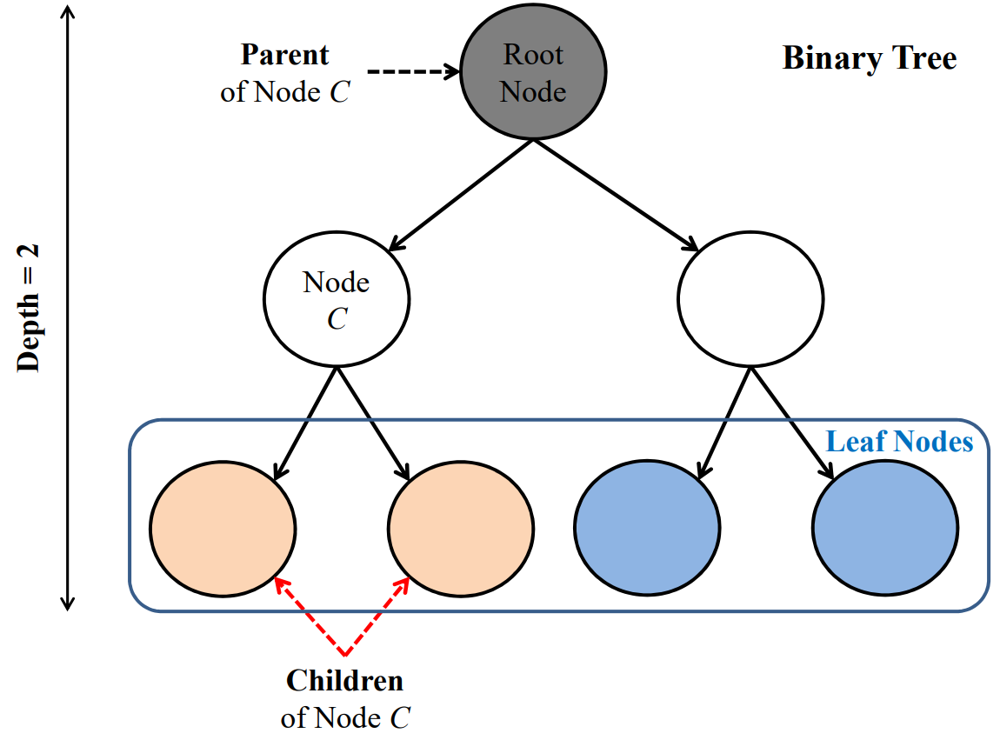

## In this lecture

* Decision trees
* Training decision trees
* Bias and variance of decision trees

\newpage

## Recap

### Models for regression

::: notes

\def \lintrain {$\hat{w} = (A^T A)^{-1} A^T y$ }
\def \linregress {$\hat{y} = [1, x^T] \hat{w}$}
\def \linloss {$(\hat{y}-y)^2$}

\def \knnregress {$\hat{y} = \frac{1}{K} \sum_{ K_x} y_i $}

+-----------+-----------------+---------+-------------------+----------------+----------------+
| Model     | Function shape  | Loss fn.| Training          | Prediction     | ⇩ complexity   |
+===========+=================+=========+===================+================+================+
| Linear    | Linear          | \linloss| \lintrain         | \linregress    | Regularization |
| regression| (or transformed)|         |                   |                |                |
+-----------+-----------------+---------+-------------------+----------------+----------------+   
| KNN       | Arbitrarily     | NA      |Non-parametric,    | \knnregress    |Increase K      |
|           | complicated     |         |store training data|                |                |
+-----------+-----------------+---------+-------------------+----------------+----------------+

:::

### Models for classification

::: notes

\def \predclass {$P(y=m | x) =$}
\def \logclass {$\frac{e^{z_m}}{\sum_{\ell=1}^M e^{z_\ell}}$}
\def \knnclass {$\frac{1}{K} \sum_{K_x} I(y_i = m)$}
\def \logloss {$-\ln P(y|X)$ }

+----------+----------------+----------+-------------------+----------------+---------------+
|Model     | Function shape | Loss fn. | Training          | \predclass     |⇩ complexity   |
+==========+================+==========+===================+================+===============+
|Logistic  | Linear         | \logloss | No closed form    | \logclass      |Regularization |
|regression|(or transformed)|          | soln., use solver |                |               |
+----------+----------------+----------+-------------------+----------------+---------------+   
|KNN       |Arbitrarily     | NA       |Non-parametric,    | \knnclass      |Increase K     |
|          |complicated     |          |store training data|                |               |
+----------+----------------+----------+-------------------+----------------+----------------+

:::

### Flexible decisions with cheap prediction?

KNN was very flexible, but prediction is **slow**.

Next: flexible decisions, non-parametric approach, fast prediction

\newpage

## Decision tree

### Tree terminology

::: notes

TODO: add illustration

{ width=50% }

:::

### Note on notation

Following notation of ISLR, Chapter 8:

* $X_j$ is feature $j$
* $x_i$ is sample $i$

### Stratification of feature space (1)

* Given set of possible predictors, $X_1, \ldots, X_p$
* Training: Divide predictor space (set of possible values of $X$) into $J$ non-overlapping regions: $R_1, \ldots, R_J$, by splitting sequentially on one feature at a time.

### Stratification of feature space (2)

* Prediction: For each observation that falls in region $R_j$, predict
  - mean of labels of training points in $R_j$ (regression)
  - mode of labels of training points in $R_j$ (classification)

### Tree representation

* At node that is not a leaf: test one feature $X_i$
* Branch from node depending on value of $X_i$
* Each leaf node: predict $\hat{y}_{R_m}$ 

### Tree characterization

* size of tree $|T|$ (number of leaf nodes) 
* depth (max length from root node to a leaf node)

### Stratification of feature space - illustration

{ width=50% }

::: notes

The stratification on the top left cannot be produced by a decision tree using recursive binary splitting. The other three subfigures represent a single stratification.

:::

\newpage

## Training a decision tree

### Basic idea (1)

* Goal: find the high-dimensional rectangles that minimize error
* Computationally expensive to consider every possible partition

### Basic idea (2)

* Instead: recursive binary splitting (top-down, greedy approach) 
* Greedy: at each step, make the best decision at that step, without looking ahead and making a decision that might yield better results at future steps

### Recursive binary splitting

For any feature $j$ and *cutpoint* $s$, define the regions

$$R_1(j, s) = \{X|X_j < s\}, \quad R_2(j, s) = \{X|X_j \geq s\}$$

where $\{X|X_j < s\}$ is the region of predictor space in which $X_j$ takes on a value less than $s$.

### Recursive binary splitting steps

Start at root of the tree, considering all training samples.

1. At the current node,
2. Find feature $X_j$ and cutpoint $s$ that minimizes some loss function (?)
3. Split training samples at that node into two leaf nodes
4. Stop when no training error (?)
5. Otherwise, repeat at leaf nodes

### Loss function for regression tree 

For regression: look for feature $j$ and cutpoint $s$ that leads to the greatest possible reduction in squared error:

$$\sum_{i: x_i \in R_1(j,s)} (y_i - \hat{y}_{R_1})^2 \quad + \sum_{i: x_i \in R_2(j,s)} (y_i - \hat{y}_{R_2})^2$$ 

(where $\hat{y}_{R_j}$ is the prediction for the samples in $R_j$.)

### Loss function for classification tree 

For classification, find a split that minimizes some measure of node *impurity*:

* A node whose samples all belong to the same class - most *pure*
* A node whose samples are evenly distributed among all classes - highly *impure*

### Classification error rate

For classification: one possible way is to split on *0-1 loss* or *misclassification rate*:

$$\sum_{x_i \in  R_m} 1 (y_i \neq \hat{y}_{R_m})$$

Not used often.

### GINI index

The GINI index is:

$$ \sum_{k=1}^K \hat{p}_{mk} (1 - \hat{p}_{mk})$$

where $\hat{p}_{mk}$ is the proportion of training samples in $R_m$ belonging to class $k$.

::: notes

You can see that this is small when all values of $\hat{p}_{mk}$ are around 0 or 1. 

:::

### Entropy 

::: notes

Entropy of a random variable $X$ (from information theory):

$$H(X) = - \sum_{i=1}^N P(X=i) \log_2 P(X=i) $$

:::

Entropy as a measure of impurity on subset of samples:

$$ - \sum_{k=1}^K \hat{p}_{mk} \log_2 \hat{p}_{mk}$$

where $\hat{p}_{mk}$ is the proportion of training samples in $R_m$ belonging to class $k$.

### Comparison - measures of node impurity

{ width=50% }

### Conditional entropy

* Splitting on feature $X$ creates subsets $S_1$ and $S_2$ with different entropies
* Conditional entropy:

$$\text{Entropy}(S|X) = \sum_v \frac{|S_v|}{|S|} \text{Entropy}(S_v)$$

### Information gain

* Choose feature to split so as to maximize information gain, the expected reduction in entropy due to splitting on $X$:

$$\text{Gain}(S, X) := \text{Entropy}(S) - \text{Entropy}(S|X)$$

### Example: should I play tennis? (1)

{width=60%}

### Example: should I play tennis? (2)

For top node: $S = \{9+, 5-\}, |S| = 14$

$$\text{Entropy}(S) = -\frac{9}{14}\log_2 \frac{9}{14} - \frac{5}{14}\log_2 \frac{5}{14} = 0.94$$

### Example: should I play tennis? (3)

If we split on Wind:

Considering the Weak branch:

* $S_{\text{weak}} = \{6+, 2-\}, |S_{\text{weak}}| = 8$
* $\text{Entropy}(S_{\text{weak}}) = -\frac{6}{8}\log_2 (\frac{6}{8}) - \frac{2}{8}\log_2 (\frac{2}{8}) = 0.81$

Considering the Strong branch:

* $S_{\text{strong}} = \{3+, 3-\}, |S_{\text{strong}}| = 6$
* $\text{Entropy}(S_{\text{strong}}) = 1$

### Example: should I play tennis? (4)

$\text{Entropy}(S) = -\frac{9}{14}\log_2 \frac{9}{14} - \frac{5}{14}\log_2 \frac{5}{14} = 0.94$

$\text{Entropy}(S | \text{Wind}) = \frac{8}{14} \text{Entropy}(S_{\text{weak}}) + \frac{6}{14} \text{Entropy}(S_{\text{strong}}) = 0.89$

$\text{Gain}(S, \text{Wind}) = 0.94-0.89 = 0.05$

### Example: should I play tennis? (5)

* $\text{Gain}(S, \text{Outlook}) = 0.246$
* $\text{Gain}(S, \text{Humidity}) = 0.151$
* $\text{Gain}(S, \text{Wind}) = 0.048$
* $\text{Gain}(S, \text{Temperature}) = 0.029$

$\rightarrow$ Split on Outlook!

### Feature importance

* For each feature $X_j$, find all nodes where the feature was used as the split variable
* Add up information gain due to split (or for GINI index, difference in loss weighted by number of samples.)
* This sum reflects feature importance

## Bias and variance

### Managing tree depth

* If tree is too deep - likely to overfit (high variance)
* If tree is not deep enough - likely to have high bias

\newpage

### Stopping criteria

If we build tree until there is zero error on training set, we have "memorized" training data.

Other stopping criteria:

* Max depth
* Max size (number of leaf nodes)
* Min number of samples to split
* Min number of samples in leaf node
* Min decrease in loss function due to split

(Can select depth, etc. by CV)

### Pruning

* Alternative to stopping criteria: build entire tree, then *prune*

* With greedy algorithm - a very good split may descend from a less-good split

### Pruning classification trees

We usually prune classification trees using classification error rate as loss function, even if tree was built using GINI or entropy.

### Weakest link pruning (1)

Prune a large tree from leaves to root:

* Start with full tree $T_0$
* Merge two adjacent leaf nodes into their parent to obtain $T_1$ by minimizing:

$$\frac{Err(T_1)-Err(T_0)}{|T_0| - |T_1|}$$

### Weakest link pruning (2)

* Iterate to produce a sequence of trees $T_0, T_1, \ldots, T_m$ where $T_m$ is a tree of minimum size.
* Select optimal tree by CV

### Cost complexity pruning 

Equivalent to: Minimize

$$ \sum_{m=1}^{|T|} \sum_{x_i}^{R_m} (y_i - \hat{y}_{R_m})^2 + \alpha |T|$$

Choose $\alpha$ by CV, 1-SE rule ($\uparrow \alpha, \downarrow |T|$).

## Summary - so far

### The good and the bad (1)

Good:

* Easy to interpret, close to human decision-making
* Can derive feature importance
* Easily handles mixed types, different ranges
* Can find interactions that linear classifiers can't

### The good and the bad (2)

Bad:

* Need deep tree to overcome bias
* Deep trees have large variance
* Non-robust: Small change in data can cause large change in estimated tree

