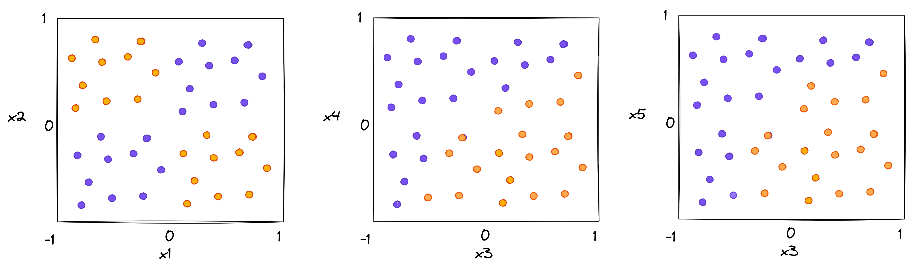
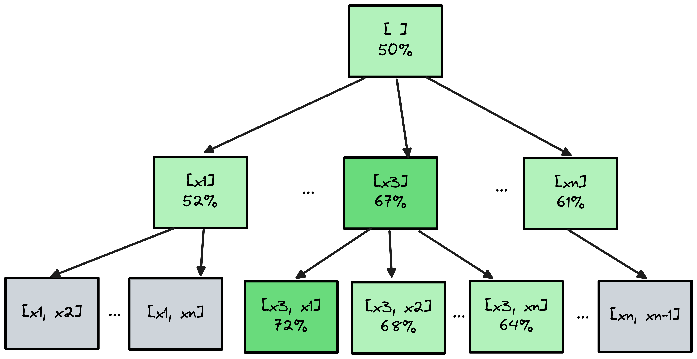
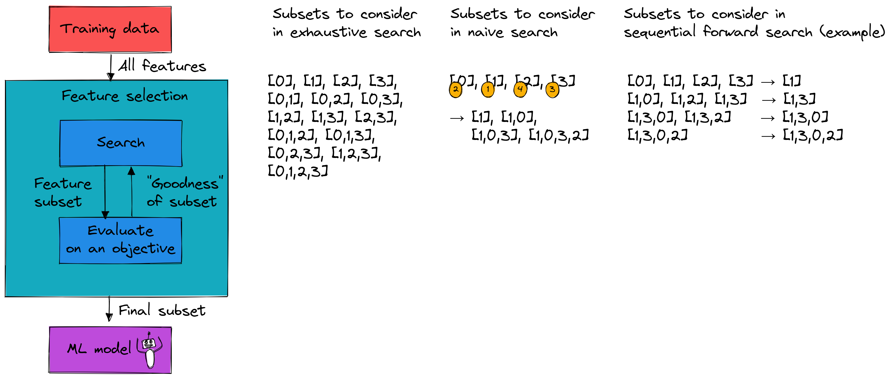
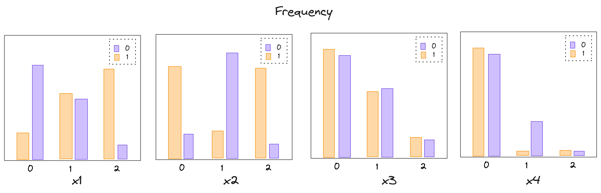
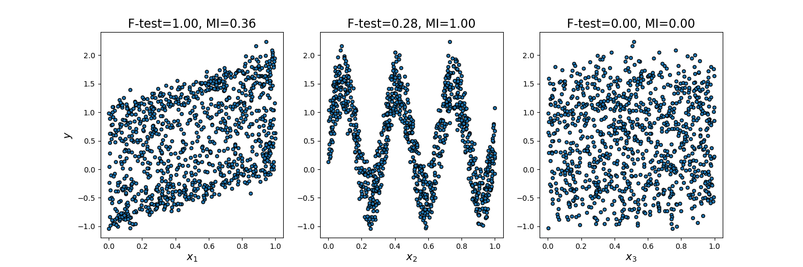
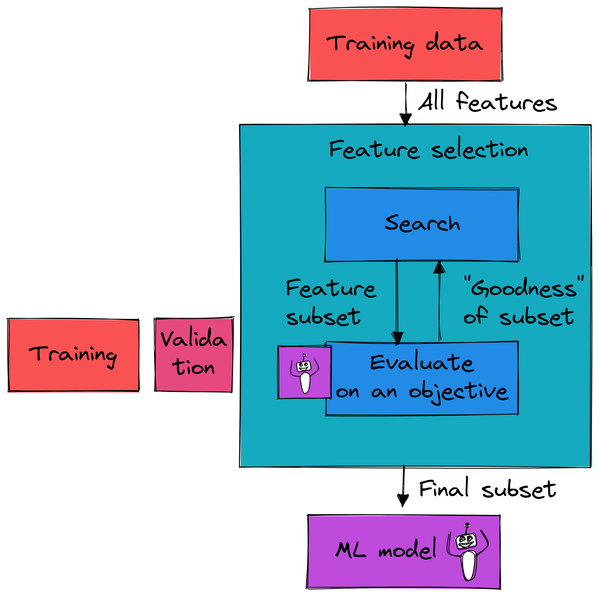

:::notes

**Math prerequisites for this lecture**: None.

:::


## Feature selection and feature weighting


Feature selection is actually two problems:

* best number of features
* best subset of features


:::notes

These problems can be solved separately:

* find best subset of feature of every possible size
* then among those, select the best

or they can be solved together, for example:

* keep adding features until improvement due to another feature is less than some threshold $t$
* keep features whose "score" exceeds some threshold $t$
* etc.

For KNN, feature selection:

* reduces inference time (which scales with $d$)
* addresses the "curse of dimensionality"
* makes the distance measure more useful, by considering only the features that are most relevant

For KNN, we can also do feature weighting (compute a weight for each feature, scale feature by that weight) as an alternative to (or in addition to) feature selection - this helps with the third item.

:::

<!-- 
### Feature selection is not *independent* of model fitting

Example: suppose a "true" function is

$$t(x) = w_0 x_0 + w_1 x_1 + w_2  (x_3 \oplus x_4) $$

What subset of $[x_0, x_1, x_2, x_3, x_4]$ to select?

:::notes

There is no universal "best feature" subset for a dataset! The "best feature" subset depends on the model we are going to train, and whether the selected features have predictive value *for that model*.

* if your model is a linear model?
* if your model can capture non-linear relationships and interaction effects?

:::

-->

### Feature selection is hard!


:::notes

Computationally **hard** - even on small problems. In practice, we won't ever have a guarantee of finding the optimal subset.

:::


### Optimization in two parts

* **Search** the space of possible feature subsets
* **Evaluate** the goodness of a feature subset

:::notes

{ width=30% }

:::


### Search: exhaustive search

**Optimal search**: consider every combination of features

* Given $d$ features, there are $2^d$ possible feature subsets
* Too expensive to try all possibilities!

\newpage

### Search: naive heuristic

* evaluate $d$ features, sort in order of "goodness"
* select top $k$ features from the list (use CV to choose $k$?)


:::notes


**Problem**: this approach considers each feature independently.

* Doesn't consider redundancy: if you have two copies of an informative features, they'll both score high (but you wouldn't necessarily want to include both in your model).
* Doesn't consider interaction: if you are going to use a model that can learn interactions "natively" (which KNN can!), this type of feature selection may exclude features that are not informative themselves, but whose combination is informative.

{ width=70% }

:::

### Search: sequential forward selection

* Let $S^{t-1}$ be the set of selected features at time $t-1$
* Train and evaluate model for all combinations of current set + one more feature
* For the next time step $S^t$, add the feature that gave you the best performance.
* Repeat until termination criterion is satisfied. 


:::notes

This is not necessarily going to find the best feature subset! But, it is a lot faster than the exhaustive search (on order of $d^2$ subsets), and is less likely to include redundant features than naive approach.

:::

### Search: sequential forward selection as a graph

{ width=60% }


\newpage

### Search: sequential backward elimination as a graph

{ width=60% }


:::notes

"Backward" alternative: start with all features, and "prune" one at a time.

Compared to "forward" search, it is more likely to keep features that are useful in combination with another feature.


{ width=90% }

:::

\newpage

### Evaluation of "goodness"


{ width=75% }


:::notes

* When $x_1$ is large, $y$ tends to be $1$; $x_1$ is small, $y$ tends to be $0$ (linear/monotonic relationship)
* When $x_2$ is "medium", $y$ tends to be 0; $x_2$ is small or large, $y$ tends to be 1 (not linear/monotonic)
* Whatever the value of $x_3$, either value of $y$ is equally likely (not useful)
* For most values of $x_4$, it is not useful for predicting $y$, but when $x_4$ is 1, $y$ tends to be 0.

:::

### Evaluation: univariate scoring

Pseudocode:

```python
for j in X.shape[1]:
  score[j] = score_fn(X[:,j], y) 
```

:::notes

Note: You can also use the score for feature weighting (multiply the feature by the "score" so that high-scoring features have larger values): Compared to feature selection, feature weighting does not have the benefit of faster inference time, but it does have the advantage of not throwing out useful information.


:::

### Evaluation: multivariate scoring

Pseudocode:

```python
for j, feat_set in enumerate(feat_sets):
  score[j] = score_fn(X[:,feat_set], y) 
```

### Evaluation: model-in-the-loop scoring

Pseudocode:

```python
for j, feat_set in enumerate(feat_sets):
  score[j] = model.score( X[:,feat_set], y) 
```


### Evaluation: "types" of methods

* **Filter methods**: consider only the statistics of the training data, don't use the model.
* **Wrapper methods**: evaluate subsets of features on a model.


:::notes

Filter methods are usually much faster - but won't necessarily find the features that are optimal *for your particular case*.

:::


### Evaluation: aligning scoring function with prediction task

:::notes

Scoring functions from "least closely aligned with the prediction task" to "most closely aligned with the prediction task".

* using only statistics of `X` (e.g. reject features with very low variance) - doesn't tell you which features are most useful for predicting `y`!
* using statistics of `X, y` (e.g. reject features with small correlation with `y`) - doesn't tell you which features are most useful *for your model* for predicting `y`!
* using the score of the model on a validation set when trained on the feature(s)


When *would* it make sense to reject features with low variance? Consider a text classification task with indicator variables for each word in the vocabulary:

* `the` appears in all documents - not useful. 
* `historiography` appears in a couple of documents - not useful.


:::


### Evaluation: scoring functions for filter methods (1)

* Need to choose "scoring" function that is a good fit for the model

:::notes


**Scoring function**: 

* Scoring function measures the relationship between `X` and `y`.
* For example: correlation coefficient, or F-statistic both of which measures linear relationship between `X` and `y`.

**Problem**: correlation coefficient scoring metric only captures linear relationship.

* If you expect the relationship to be linear, it's fine!
* If you are using a model (e.g. linear regression) that is only capable of learning linear relationships, it's fine! You don't want your feature selection method to give a high score to a column if the model won't be able to learn from it anyway.

:::


###  Evaluation: scoring functions for filter methods (2)

{ width=75% }

\newpage

###  Evaluation: wrapper methods 

* Tuned to specific interaction of dataset + model!
* Usually much more expensive (especially considering model hyperparameter tuning...)

:::notes

{ width=40% }

:::

### An option for some models

* **Embedded methods**: use something built-in to training algorithm (e.g. LASSO regularization). (Not available for KNN!)


### Recap

* **Important**: Don't use the test set for feature selection!
* Feature selection approach should "match" the data, model
* Computation is a concern - it won't be possible to optimize everything

