## In this lecture

* Parametric vs. non-parametric models
* Nearest neighbor
* Model choices
* Bias and variance of KNN
* The Curse of Dimensionality
* Feature selection and feature weighting

\newpage

## Parametric vs. non-parametric models

### So far...

All of our models have looked like

$$\hat{y} = f(x,w) = w_0 + w_1 x_1 + \cdots + w_d x_d$$

A model class is more flexible if $f(x, w)$ can represent more possible functions.

::: notes

* Some possibilities for $f(x, w) = w_0 + w_1 x_1$
* More possibilities for $f(x, w) = w_0 + w_1 x_1 + w_2 x_2$
* Even more possibilities for $f(x, w) = w_0 + w_1 x_1 + w_2 x_2 + w_3 x_3$

But until now, we had to "know" how to add flexibility - for example, by adding interaction terms or other basis functions. 

A way to get more flexible models is with a **non-parametric** approach, where we don't a priori impose the functional form or a fixed number of parameters that the model should learn.

**Note**: "parametric" and "non-parametric" are not precisely defined terms, but this is how they are often understood.

:::

### Parametric models

* A particular model class is assumed (e.g. linear)
* Number of parameters fixed in advance

::: notes

Note: even if you use K-fold CV to try different candidate models with different number of parameters, you are still defining each candidate model in advance.

:::

### Non-parametric models

* Minimal assumptions about model class
* Model structure determined by data

## Nearest neighbor

::: notes

* A kind of non-parametric model.
* Basic idea: Find labeled samples that are "similar" to the new sample, and use their labels to make prediction for the new sample.

We previously spoke about the inductive bias of the linear models - we assumed that the target variable can be modeled as a linear combination of features or transformed versions of features. What is the inductive bias here?

:::

### 1-NN

* Given training data $(\mathbf{x}_{1}, y_{1}), \ldots, (\mathbf{x}_{n}, y_{n})$ 
* And a new sample $\mathbf{x}_{0}$
* Find the sample in the training data $\mathbf{x}_{i'}$ with the least distance to $\mathbf{x}_{0}$. 

$$ i' = \operatorname*{argmin}_{i=1,\ldots,n}  d(\mathbf{x}_i, \mathbf{x}_0)$$

* Let $\hat{y}_0 = y_{i'}$

::: notes

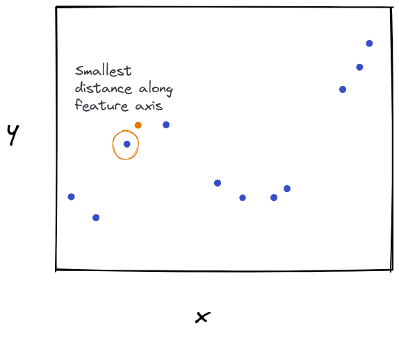{ width=40% }
:::

### 1-NN - runtime

* Training: just store data
* Inference: need to 
  * compute distance to each of $n$ points
  * distance metric typically scales with $d$

::: notes

The runtime for predicting *each* test point is $O(nd)$. How does this compare to linear regression or logistic regression? 

There, the training time could be long, but *inference* was only $O(d)$. We can tolerate a long training time more easily than a long inference time.

:::

### 1NN - decision boundaries

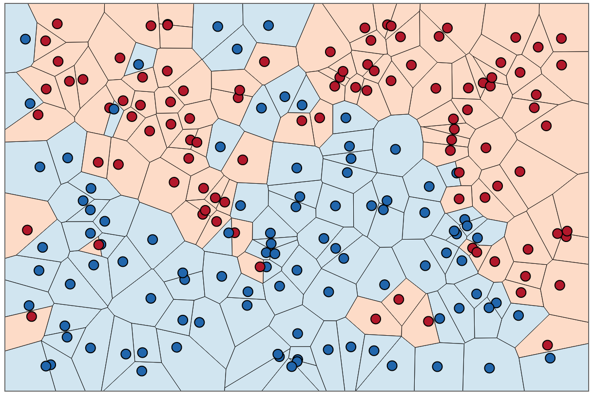{ width=60% }

::: notes

Note that there will be zero error on training set (unless there are training data points that have identical feature values, but different labels).

:::

\newpage

### K nearest neighbors

Instead of 1 closest sample, we find $K$: Let $N_0$ be the set of $K$ training points that are closest to $\mathbf{x}_0$.

How do we use this set for (1) classification? (2) regression?

::: notes

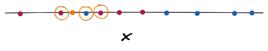{ width=30% }

:::

### KNN for classification

::: notes
Idea: Estimate conditional probability for a class as fraction of points among neighbors with the class label.

Remember: Let $N_0$ be the set of $K$ training points that are closest to $\mathbf{x}_0$.

Then, we can estimate the per-class conditional probability given the sample $x_0$.

:::

For each class $m \in M$:

$$ P(y=m | \mathbf{x_0} ) = \frac{1}{K} \sum_{ (\mathbf{x}_i, y_i) \in N_0} I(y_i = k) $$

where $I(y_i = m)$ is 1 if $(\mathbf{x}_i, y_i) \in N_0$ is a member of class $m$, 0 otherwise. 

::: notes

* We can then select the class with the highest probability.
* Practically: select the most frequent class among the neighbors.

:::

### KNN for regression

Idea: Use the the combined label of the K nearest neighbors. For example, we can take their mean:

$$\hat{y}_{0} = \frac{1}{K} \sum_{ (\mathbf{x}_i, y_i) \in N_0} y_i $$

::: notes

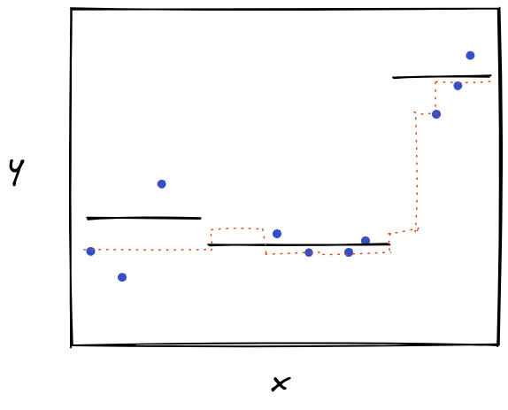{ width=40% }

:::

\newpage

## Model choices

::: notes

We're letting the data dictate the form of the solution, but we still need to make many model choices:

* What value of $K$?
* What distance measure?
* How to combine $K$ labels into prediction?

Question: does larger K mean "more flexible" or "less flexible" model?

:::

### What value of K? Illustration (1NN)

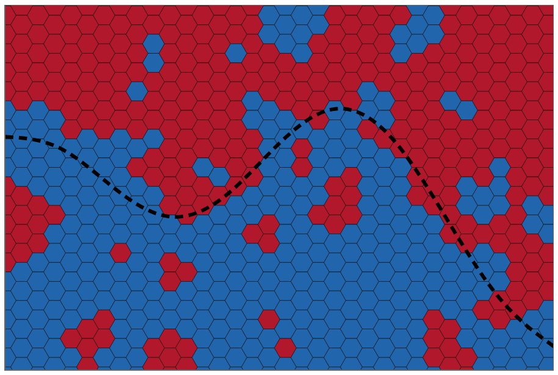{ width=50% }

### What value of K? Illustration (2NN)

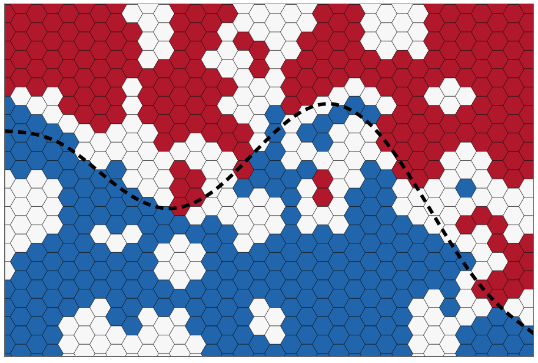{ width=50% }

\newpage

### What value of K? Illustration (3NN)

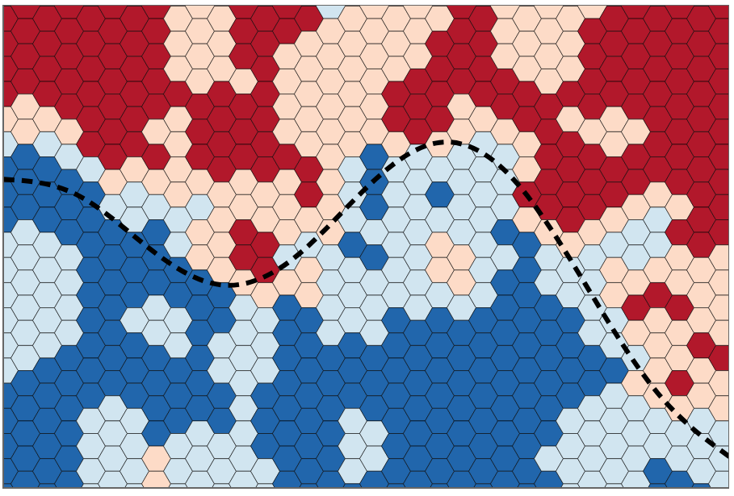{ width=50% }

### What value of K? Illustration (9NN)

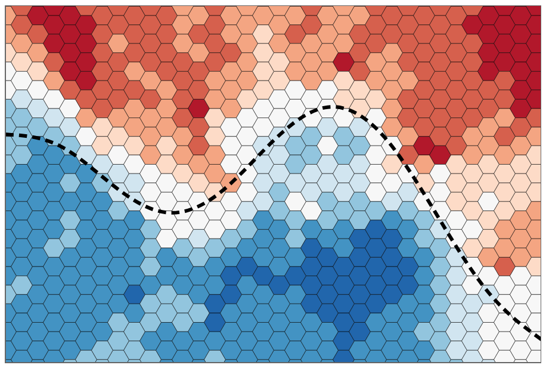{ width=50% }

### What value of K? (1)

* In general: larger K, less complex model
* $K$ can be selected by CV. 
* Often cited "rule of thumb": use $K=\sqrt{N}$

\newpage

### What value of K? (2)

* Alternative to fixed $K$: Radius-based neighbor learning.
* A fixed radius $r$ is specified, can be selected by CV. 
* Number of neighbors depends on local density of points.

::: notes

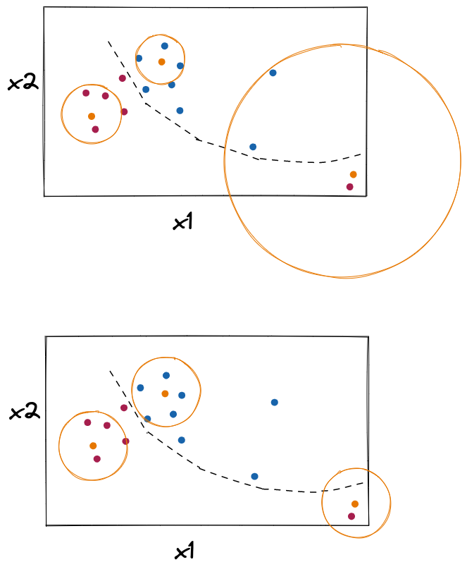{ width=60% }
:::

\newpage

### What distance measure? (1)

Some popular choices: for two vectors $a_i, b_i$,

* Euclidean (L2): $\sqrt{\sum_{i=1}^d(a_i - b_i)^2}$
* Manhattan (L1): $\sum_{i=1}^d |a_i - b_i|$

::: notes

(L2 distance prefers many medium-sized disagreements to one big one.)

There are many more choices - for example, look at the [distance metrics implemented in sklearn](https://scikit-learn.org/stable/modules/generated/sklearn.neighbors.DistanceMetric.html).

Problems with the basic distance metrics: 

* When features have different scale/range, need to standardize
* KNN implicitly weights all features equally: this is a problem if you have features that are not relevant for the target variable!
* For images: pixel-wise distance doesn't necessarily equate to perceptual similarity

:::

### Distance measure - standardization (1)

. The x2 feature dominates the distance measure.](https://i.stack.imgur.com/OCUmI.png){ width=40% }

### Distance measure - standardization (2)

](https://i.stack.imgur.com/J5r01.png){ width=40% }

\newpage

### Distance measure - equal weighted features

::: notes

Suppose you are trying to predict a student's course grade using their previous GPA and how far they live from the NYU campus:

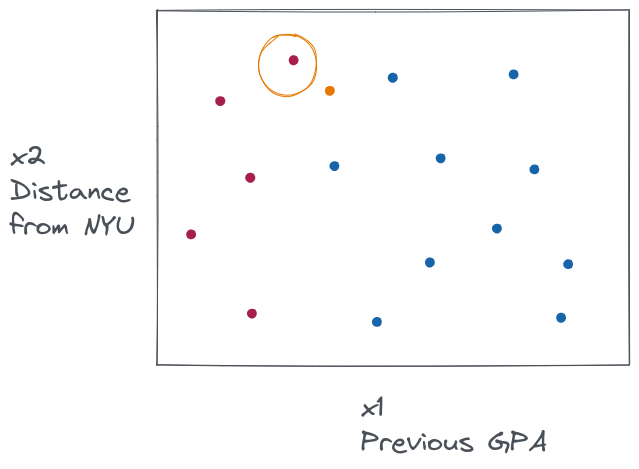{ width=40% }

:::

Alternative to equal weighted features:  assign feature weights

$$d(\mathbf{a, b}) = \left(  \sum_{i=1}^k ( w_i | a_i - b_i | ) ^q \right) ^{\frac{1}{q}}$$

::: notes

But then we need a way to learn feature weights! 

With L1 regularization, we had a data-driven way to do feature selection. The nearest neighbor method doesn't have any "built-in" way to do feature weighting or feature selection as part of the training process, so we need to do it ourselves as part of the pre-processing steps.

We'll go back to this at the end.

:::

### Distance measure - perceptual distance

.](../images/knn-samenorm.png){ width=60% }

::: notes

This is a little more difficult to overcome. In practice, KNN is often just not very useful for image data.

:::

\newpage

### How to combine labels into prediction?

* **Basic voting**: use mode of neighbors for classification, mean or median for regression.
* **Distance-weighted**: weight of vote inversely proportional to distance from the query point. ("More similar" training points count more.)

::: notes

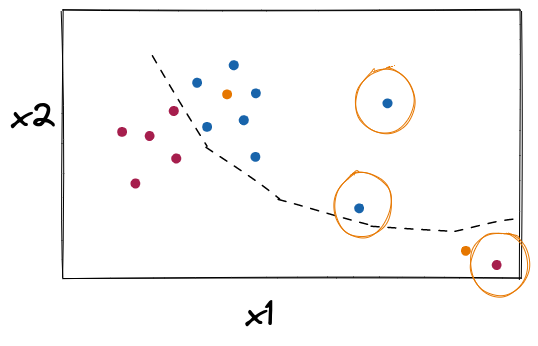{ width=40% }

:::

## Bias and variance of KNN

<!--

See: https://stats.stackexchange.com/questions/189806/derivation-of-bias-variance-decomposition-expression-for-k-nearest-neighbor-regr

-->

### True function

Suppose data has true relation 

$$ y = t(\mathbf{x}) + \epsilon, \quad \epsilon \sim N(0, \sigma_\epsilon^2) $$

and our model predicts $\hat{y} = f(\mathbf{x})$.

### Assumption of fixed training set

For this derivation, we consider the expectation over:

* the test points
* the error $\epsilon$
* the randomness in the $y$ values in the training set! 

We do not consider randomness in the $x$ values - we assume a fixed training set.

::: notes

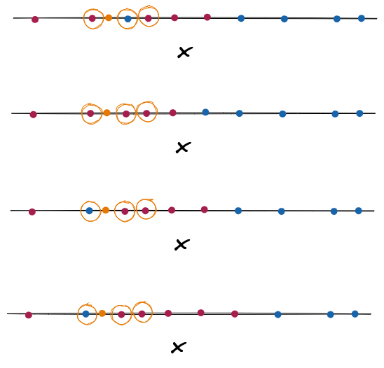{ width=30% }

:::

\newpage

### Expected loss

We will use an L2 loss function, so that the expected error of the prediction $\hat{y}$ for a given test point $\mathbf{x_t}$ is:

$$ \begin{aligned}
MSE(\mathbf{x_t}) :=&  E[(y-\hat{y})^2]  \\
=& \left( t(\mathbf{x_t})- E[f(\mathbf{x_t})] \right) ^2 + \\
 &E[(f(\mathbf{x_t}) - E[f(\mathbf{x_t})])^2] + \\
 &\sigma_\epsilon^2
\end{aligned}$$

i.e. squared bias, variance, and irreducible error.

### KNN output

The output of a KNN regression at the test point is

$$f(\mathbf{x_t}) = \frac{1}{K} \sum_{\ell \in K_x} t(\mathbf{x}_\ell) + \epsilon_\ell $$

where $K_x$ is the set of K nearest neighbors of $\mathbf{x_t}$. (We assume that these neighbors are fixed.)

### Bias of KNN 

When we take expectation of bias over test samples:

$$
\begin{aligned}
Bias^2 &= \left( t(\mathbf{x_t})- E[f(\mathbf{x_t})] \right) ^2 \\
&= \left( t(\mathbf{x_t})   - E \left( \frac{1}{K} \sum_{\ell \in K_x} t(\mathbf{x}_\ell) + \epsilon_\ell \right)\right) ^2 \\
&=\left( t(\mathbf{x_t}) - \frac{1}{K} \sum_{\ell \in K_x} t(\mathbf{x}_\ell)  \right) ^2
\end{aligned}
$$

::: notes

The expectation is over the training sample draw - but note that the $x$ values in the training samples are fixed! So the only randomness is in $\epsilon_\ell$.

Since the $x$ values in the training samples are fixed, the $\frac{1}{K} \sum_{\ell \in K_x} t(\mathbf{x}_\ell)$ can come out of the expectation as a constant. Then $E [\epsilon_\ell] = 0$.

:::

\newpage

### Variance of KNN (1)

$$
\begin{aligned}
Var(\hat{y}) &= E[(f(\mathbf{x_t}) - E[f(\mathbf{x_t})])^2] \\
&= E\left[\left(f(\mathbf{x_t}) - \frac{1}{K} \sum_{\ell \in K_x} t(\mathbf{x}_\ell)  \right)^2\right] \\
&= E\left[\left( \frac{1}{K} \sum_{\ell \in K_x} (t(\mathbf{x}_\ell) + \epsilon_\ell) - \frac{1}{K} \sum_{\ell \in K_x} t(\mathbf{x}_\ell)  \right)^2\right] \\
&= E\left[\left( \frac{1}{K} \sum_{\ell \in K_x}  \epsilon_\ell \right)^2\right]
\end{aligned}
$$

### Variance of KNN (2)
$$
\begin{aligned}
&= E\left[\left( \frac{1}{K} \sum_{\ell \in K_x}  \epsilon_\ell \right)^2\right] = \frac{1}{K^2} E\left[\left(  \sum_{\ell \in K_x}  \epsilon_\ell \right)^2\right] \\
&=\frac{1}{K^2} Var \left(  \sum_{\ell \in K_x}  \epsilon_\ell \right)  = \frac{1}{K^2}   \sum_{\ell \in K_x} Var \left( \epsilon_\ell \right) = \frac{K \sigma^2_\epsilon}{K^2} \\
&= \frac{\sigma^2_\epsilon}{K}
\end{aligned}
$$

::: notes

Note: we use the fact that the $\epsilon$ terms are independent, so the variance of sum is equal to sum of variances.

:::

### Error of KNN

Then the expected error of KNN is

$$ 
\left( t(\mathbf{x_t}) - \frac{1}{K} \sum_{\ell \in K_x} t(\mathbf{x}_\ell)  \right) ^2 + \frac{\sigma^2_\epsilon}{K} + \sigma_\epsilon^2
 $$

where $K_x$ is the set of K nearest neighbors of $\mathbf{x}$.

### Bias variance tradeoff

* Variance decreases with K
* Bias likely to increase with K, if function $t()$ is smooth. 

::: notes

Why does bias increase with $K$? For a smooth function, the few closest neighbors to the test point will have similar values, so average will be close to $t(\mathbf{x})$; as K increases, neighbors are further way, and average of neighbors moves away from $t(\mathbf{x})$.

You can think about the extreme case, where $K=n$ so you use the average of *all* of the training samples. This is equivalent to "prediction by mean".

:::

\newpage

## The Curse of Dimensionality

::: notes

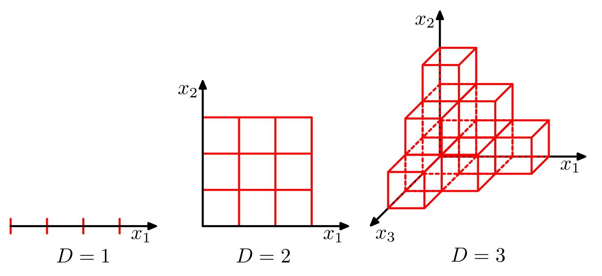{width=55%}

:::

### KNN in 1D

* Consider a dataset $(x_1, y_1), \ldots, (x_N, y_N), N=100$
* $x$ is uniformly distributed in [0,1] 
* On average, one data point is located every 1/100 units along 1D feature axis.
* To find 3NN, would expect to cover 3/100 of the feature axis.

### KNN in 2D

* Now consider the same dataset with two features.
* Each feature is uniformly distributed in [0,1]
* To find 3NN, would expect to cover $0.03^{\frac{1}{2}}$ of the unit rectangle.

::: notes

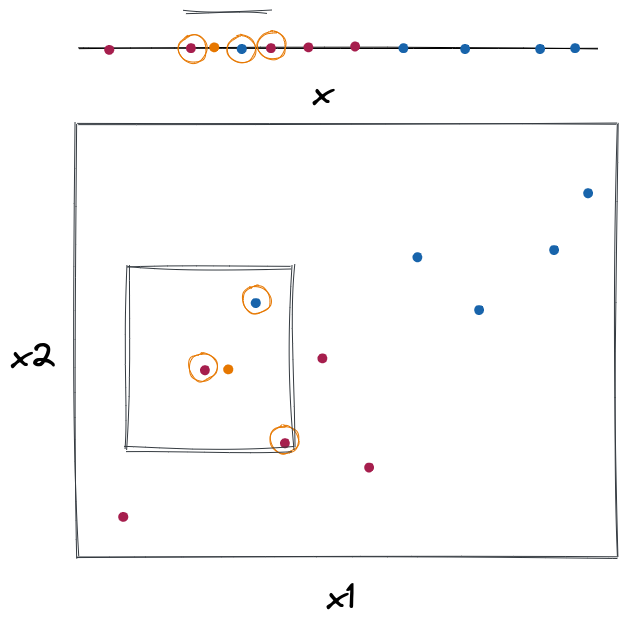{ width=45% }
:::

\newpage

### Density of samples decreases with dimensions

To get 3NN, 

* need to cover 3% of space in 1D
* need to cover 17% of space in 2D
* need to cover 70% of space in 10D. At this point, the nearest neighbors are not much closer than the rest of the dataset.

### Density of samples decreases with dimensions - general

The length of the smallest hyper-cube that contains all K-nearest neighbors of a test point:

$$\left( \frac{K}{N} \right) ^{\frac{1}{d}}$$ 

for $N$ samples with dimensionality $d$.

<!--
What happens to this quantity as $d$ increases?

](../images/curseanimation.gif){ width=60% }

-->

### Solutions to the curse (1)

Add training data? 

$$\left(\frac{K}{N}\right)^{\frac{1}{d}}$$ 

As number of dimensions increases linearly, number of training samples must increase exponentially to counter the "curse".

### Solutions to the curse (2)

Reduce $d$?

* Feature selection
* Dimensionality reduction: a type of unsupervised learning that *transforms* high-d data into lower-d data.

\newpage

## Summary of NN method

### NN learning

Learning: 

* Store training data
* Don't do anything else until you have a new point to classify

::: notes

In practice, we will usually store training data in a data structure that makes it faster to compute nearest neighbors.

:::

### NN prediction

Prediction:

* Find nearest neighbors using distance metric
* Classification: predict most frequently occuring class among nearest neighbors
* Regression: predict mean value of nearest neighbors

### The good and the bad (1)

Good:

* Good interpretability
* Fast "learning" (*memory-based*)
* Works well in low dimensions for complex decision surfaces

### The good and the bad (2)

Neutral: 

* Assumes similar inputs have similar outputs

### The good and the bad (3)

Bad:

* Slow prediction (especially with large N)
* Curse of dimensionality

\newpage

## Feature selection and feature weighting

:::notes

Feature selection is actually two problems:

* best number of features
* best subset of features

For some models, like KNN, we can also do feature weighting as an alternative to (or in addition to) feature selection.

:::

### Feature selection methods

* **Wrapper methods**: use learning model on training data and different subsets of features.
* **Filter methods**: consider only the statistics of the training data, don't actually fit any learning model.
* **Embedded methods**: use something built-in to training algorithm (e.g. LASSO regularization). (Not available for KNN!)

### Feature selection with exhaustive search (1)

* Basic **wrapper** method: train model using every possible feature subset.
* Select model with best CV performance.

### Feature selection with exhaustive search (2)

* Given $d$ features, there are $2^d$ possible feature subsets
* Too expensive to try all possibilities for large $d$!

### Greedy sequential (forward) feature selection

* Let $S^{t-1}$ be the set of selected features at time $t-1$
* Train and evaluate model for all combinations of current set + one more feature
* For the next time step $S^t$, add the feature that gave you the best performance.

:::notes

("Backward" alternative: start with all features, and "prune" one at a time.)

This is not necessarily going to find the best feature subset! But, it is a lot faster than the exhaustive search.

This method available in `sklearn.feature_selection` as `SequentialFeatureSelector`.

:::

\newpage

### Filter feature selection/weighting

* Give each feature a score (ideally, something fast to compute!)
* add/select features based on score (can pick a threshold, or use CV)
* alternative: weight features based on score (works for KNN!)

:::notes

Compared to feature selection, feature weighting does not have the benefit of faster inference time, but it does have the advantage of not throwing out useful information.

:::
### Scoring functions

* Correlation coefficient, F-value (captures linear association between feature and target variable)
* Mutual information (captures non-linear associations, too)

:::notes

In `sklearn.feature_selection`, available scoring functions include: `f_classif`, `f_regression`, `r_regression`, `mutual_info_classif`, `mutual_info_regression`.

If we were using a mode that assumes a linear relationship, it would make sense to use F-value, because we want to select features that will be predictive *for our model*! (MI might recommend features that have a strong non-linear association, but our model wouldn't be able to learn those associations.)

If we were using a model that does not assume a linear relationship (like KNN!) then we would be better off using MI.

:::

### Illustration: scoring functions

{ width=80% }

### Univariate feature selection

* Score each feature $x_i$ 
* Pick $k$ features that have highest score (use CV to choose k?)

:::notes

This method available in `sklearn.feature_selection` as `SelectKBest`.

The problem with univariate feature selection is that some features may carry redundant information. In that case, we don't gain much from having both features in our model, but both will have similar scores.

MI and F-value scores can account for the redundancy in a new feature vs. the ones already in the "set".

:::

### Recursive feature selection

* Let $S^{t-1}$ be the set of selected features at time $t-1$
* Compute score for all combinations of current set + one more feature
* For the next time step $S^t$, add the feature that gave you the best performance.
