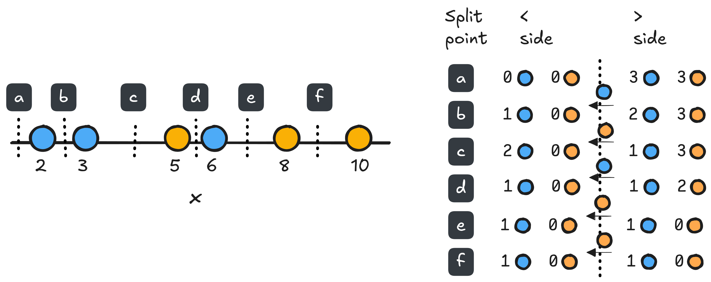

:::notes

**Math prerequisites for this lecture**: None

:::

## In this lecture

* Decision trees
* Training decision trees
* Bias and variance of decision trees

<!--

### Models for regression

::: notes

\def \lintrain {$\hat{w} = (X^T X)^{-1} X^T y$ }
\def \linregress {$\hat{y} = x^T \hat{w}$}
\def \linloss {$(\hat{y}-y)^2$}

\def \knnregress {$\hat{y} = \frac{1}{K} \sum_{ K_x} y_i $}

+-----------+-------------+---------+---------------+----------------+----------------+
| Model     | Fn. shape   | Loss fn.| Training      | Prediction     | ⇩ complexity   |
+===========+=============+=========+===============+================+================+
| Linear    | Linear      | \linloss| \lintrain     | \linregress    | Regularization |
| regression| (or LBF)    |         |               |                |                |
+-----------+-------------+---------+---------------+----------------+----------------+   
| KNN       | Arbitrarily | NA      |Non-parametric,| \knnregress    |Increase K      |
|           | complicated |         |store training |                |                |
|           |             |         |data           |                |                |
+-----------+-------------+---------+---------------+----------------+----------------+

:::

### Models for classification

::: notes

\def \predclass {$P(y=m | x) =$}
\def \logclass {$\frac{e^{z_m}}{\sum_{\ell=1}^M e^{z_\ell}}$}
\def \knnclass {$\frac{1}{K} \sum_{K_x} I(y_i = m)$}
\def \logloss {$-\ln P(y|X)$ }

+----------+------------+-----------+---------------+-------------+---------------+
|Model     | Fn. shape  | Loss fn.  | Training      | \predclass  |⇩ complexity   |
+==========+============+===========+===============+=============+===============+
|Logistic  | Linear     | \logloss  | No closed     | \logclass   |Regularization |
|regression|(or LBF)    |           | form soln.,   |             |               |
|          |            |           | use solver    |             |               |
+----------+------------+-----------+---------------+-------------+---------------+
|KNN       |Arbitrarily | NA        |Non-parametric,| \knnclass   |Increase K     |
|          |complicated |           |store training |             |               |
|          |            |           |data           |             |               |
+----------+------------+-----------+---------------+-------------+----------------+

:::

-->

### Flexible decisions with cheap prediction?

KNN was very flexible, but prediction is **slow**.

Next: flexible decisions, non-parametric approach, fast prediction

::: notes

**Idea**: In KNN, we find the "neighborhood" of a test point and then give it the value of training points in that "neighborhood" - but it takes too long at inference time to define the "neighborhood".

What if we define "neighborhoods" and their values in advance, at training time? Then at inference time, we only need to determine which "neighborhood" a test point belongs in.

However, we run into another **computationally hard** problem! To partition the feature space into *optimal* neighborhoods is too expensive. Instead, we will rely on some heuristics and get a non-optimal, but good enough, partition.

:::

## Decision tree

### Tree terminology

::: notes

{ width=50% }

* size of tree $|T|$ (number of leaf nodes) 
* depth (max length from root node to a leaf node)

:::

### Note on notation

Following notation of ISL, Chapter 8:

* $X_j$ is feature $j$
* $x_i$ is sample $i$

\newpage

### Stratification of feature space (1)

Given set of possible predictors, $X_1, \ldots, X_p$

* Training: Divide predictor space (set of possible values of $X$) into $J$ non-overlapping regions: $R_1, \ldots, R_J$, by splitting sequentially on one feature at a time.

::: notes

{ width=100% }

:::

### Stratification of feature space (2)

Prediction: 

* At node that is not a leaf: test one feature $X_i$
* Branch from node depending on value of $X_i$
* At leaf node: for observation that falls in region $R_j$, predict $\hat{y}_{R_j}$ 

  - mean of labels of training points in $R_j$ (regression)
  - mode of labels of training points in $R_j$ (classification)

### Stratification of feature space - illustration

{ width=50% }

::: notes

The stratification on the top left cannot be produced by a decision tree using recursive binary splitting. The other three subfigures represent a single stratification. Note that the decision tree fits a piecewise step function!

:::

\newpage

### Approximation using steps

::: notes

{ width=100% }

:::

\newpage

## Training a decision tree

### Basic idea 

* Goal: find the high-dimensional rectangles that minimize error
* Practical approach: recursive binary splitting (top-down, greedy approach) 

::: notes

It is too computationally expensive to consider every possible partition. Instead, we'll use a greedy algorithm: at each step, make the best "local" decision at that step, without looking ahead and making a decision that might yield better results at future steps

:::

### Recursive binary splitting steps

Start at root of the tree, considering all training samples.

1. At the current node,
2. Find feature $X_j$ and *cutpoint* $s$ that minimizes some *local* loss function (?)
3. Split training samples at that node into two leaf nodes
4. Stop when no training error (?)
5. Otherwise, repeat at leaf nodes

### Recursive binary splitting

For any feature $j$ and *cutpoint* $s$, define the regions

$$R_1(j, s) = \{X|X_j < s\}, \quad R_2(j, s) = \{X|X_j \geq s\}$$

where $\{X|X_j < s\}$ is the region of predictor space in which $X_j$ takes on a value less than $s$.

### Loss function for regression tree 

For regression: look for feature $j$ and cutpoint $s$ that leads to the greatest possible reduction in squared error, where the "new" squared error is ($\hat{y}_{R_j}$ is the prediction for the samples in $R_j$):

$$\sum_{i: x_i \in R_1(j,s)} (y_i - \hat{y}_{R_1})^2 \quad + \sum_{i: x_i \in R_2(j,s)} (y_i - \hat{y}_{R_2})^2$$ 

::: notes

{ width=70% }

Note: we are *not* computing the average loss of each region, we want the loss to be weighted by the number of samples it applies to!

:::

\newpage

### Loss function for classification tree 

For classification, find a split that minimizes some measure of node *impurity*:

* A node whose samples all belong to the same class - most *pure*
* A node whose samples are evenly distributed among all classes - highly *impure*

### Classification error rate

For classification: one possible way is to split on *0-1 loss* or *misclassification rate*:

$$\sum_{x_i \in  R_m} 1 (y_i \neq \hat{y}_{R_m})$$

::: notes

Not used often ([this is a good explanation re: why](https://sebastianraschka.com/faq/docs/decisiontree-error-vs-entropy.html)), but used for *pruning*. 

:::

### GINI index

The GINI index is:

$$ \sum_{k=1}^K \hat{p}_{mk} (1 - \hat{p}_{mk})$$

where $\hat{p}_{mk}$ is the proportion of training samples in $R_m$ belonging to class $k$.

::: notes

You can see that this is small when all values of $\hat{p}_{mk}$ are around 0 or 1. 

:::

### Entropy 

<!--

Entropy of a random variable $X$ (from information theory):

$$H(X) = - \sum_{i=1}^N P(X=i) \log_2 P(X=i) $$

-->

Entropy as a measure of impurity on subset of samples:

$$ - \sum_{k=1}^K \hat{p}_{mk} \log_2 \hat{p}_{mk}$$

where $\hat{p}_{mk}$ is the proportion of training samples in $R_m$ belonging to class $k$.

### Comparison - measures of node impurity

{ width=40% }

### Conditional entropy

* Splitting on feature $X$ creates subsets $S_1$ and $S_2$ with different entropies
* Conditional entropy:

$$\text{Entropy}(S|X) = \sum_v \frac{|S_v|}{|S|} \text{Entropy}(S_v)$$

### Information gain

* Choose feature to split so as to maximize information gain, the expected reduction in entropy due to splitting on $X$:

$$\text{Gain}(S, X) := \text{Entropy}(S) - \text{Entropy}(S|X)$$

## Example: should I play tennis? (1)

{width=60%}

### Example: should I play tennis? (2)

For top node: $S = \{9+, 5-\}, |S| = 14$

$$\text{Entropy}(S) = -\frac{9}{14}\log_2 \frac{9}{14} - \frac{5}{14}\log_2 \frac{5}{14} = 0.94$$

### Example: should I play tennis? (3)

If we split on Wind:

Considering the Weak branch:

* $S_{\text{weak}} = \{6+, 2-\}, |S_{\text{weak}}| = 8$
* $\text{Entropy}(S_{\text{weak}}) = -\frac{6}{8}\log_2 (\frac{6}{8}) - \frac{2}{8}\log_2 (\frac{2}{8}) = 0.81$

Considering the Strong branch:

* $S_{\text{strong}} = \{3+, 3-\}, |S_{\text{strong}}| = 6$
* $\text{Entropy}(S_{\text{strong}}) = 1$

::: notes

{ width=65% }

:::

### Example: should I play tennis? (4)

$\text{Entropy}(S) = -\frac{9}{14}\log_2 \frac{9}{14} - \frac{5}{14}\log_2 \frac{5}{14} = 0.94$

$\text{Entropy}(S | \text{Wind}) = \frac{8}{14} \text{Entropy}(S_{\text{weak}}) + \frac{6}{14} \text{Entropy}(S_{\text{strong}}) = 0.89$

$\text{Gain}(S, \text{Wind}) = 0.94-0.89 = 0.05$

### Example: should I play tennis? (5)

* $\text{Gain}(S, \text{Outlook}) = 0.246$
* $\text{Gain}(S, \text{Humidity}) = 0.151$
* $\text{Gain}(S, \text{Wind}) = 0.048$
* $\text{Gain}(S, \text{Temperature}) = 0.029$

$\rightarrow$ Split on Outlook!

### Variations

::: notes

In this example, the data had only categorical variables, and no missing values.

What if we had a continuous (not categorical) variable? We would need to also decide how to partition the continous feature into a discrete set of intervals.

There are a few well-known algorithms for fitting decision trees - CART, ID3, C4.5 - that have different capabilities with respect to continuous features, features with missing values, and what measure of node impurity is used.

e.g. C4.5 introduces the idea that if a sample has a missing value for a feature,

* when training, compute information gain using only samples where the feature is defined
* when using, we decide which branch to follow based on which is more probable

:::

\newpage

## Interpretability

## Feature importance

* For each feature $X_j$, find all nodes where the feature was used as the split variable
* Add up information gain due to split (or for GINI index, difference in loss weighted by number of samples.)
* This sum reflects feature importance

::: notes

This feature importance can be used for feature selection or feature weighting!

It tends to do reasonable things both with (1) features that are only useful in combination and (2) features that are highly correlated.

:::

## Bias and variance

### Managing tree depth

* If tree is too deep - likely to overfit (high variance)
* If tree is not deep enough - likely to have high bias

::: notes

{ width=70% }

:::

### Stopping criteria

If we build tree until there is zero error on training set, we have "memorized" training data.

Other stopping criteria:

* Max depth
* Max size (number of leaf nodes)
* Min number of samples to split
* Min number of samples in leaf node
* Min decrease in loss function due to split

(Can select depth, etc. by CV)

### Pruning

* Alternative to stopping criteria: build entire tree, then *prune*

* With greedy algorithm - a very good split may descend from a less-good split

\newpage

### Weakest link pruning (1)

Prune a large tree from leaves to root:

* Start with full tree $T_0$
* Merge two adjacent leaf nodes into their parent to obtain $T_1$ by minimizing:

$$\frac{Err(T_1)-Err(T_0)}{|T_0| - |T_1|}$$

::: notes

{ width=60% }

We usually prune classification trees using classification error rate as loss function, even if tree was built using GINI or entropy.

:::

### Weakest link pruning (2)

* Iterate to produce a sequence of trees $T_0, T_1, \ldots, T_m$ where $T_m$ is a tree of minimum size.
* Select optimal tree by CV

::: notes

{ width=90% }

:::

\newpage

### Cost complexity pruning 

Equivalent to: Minimize

$$ \sum_{m=1}^{|T|} \sum_{x_i \in R_m} (y_i - \hat{y}_{R_m})^2 + \alpha |T|$$

Choose $\alpha$ by CV, 1-SE rule ($\uparrow \alpha, \downarrow |T|$).

## Inference time

$O(d)$ where $d$ is depth of tree

* Worst case: $O(n)$
* Well-balanced: $O( \log  n)$

::: notes

(In a well-balanced tree, we halve the number of samples in each split. )

{ width=60% }

:::

\newpage

## Training time (binary tree)

At a node $i$ with $n_i$ samples,

* consider up to $n_i - 1$ split points
* for $p$ features $\rightarrow O(p n_i)$

Balanced case total: $O(p n \log n)$

::: notes

This assumes feature values are sorted once at the beginning - much faster than naive way! 

Naive way: 

* for each cutpoint, count samples of each class to the left vs right of the split: $O(n_i)$
* do this for $n_i - 1$ split points
* cost per feature, per node is $O(n_i ^2)$

{ width=80% }

With sorted features, using linear scan:

* start with empty $<$ side, $>$ side
* move one node between each cutpoint: $O(1)$

Then, going from node -> tree: 

**Balanced case**: At each depth level of the tree, we handle all $n$ samples, so the total cost is: 

cost per depth level $\times$ number of levels

total: $O(p n \log n)$.

**Worst case** (tree depth $n$):

* cost at level $i$ is $p n_i = p (n - i)$
* sum across levels $p (1 + 2 + \ldots + (n-2) + (n-1) + n)$
* using the rule for sum of integers up to $n$: $p\frac{n (n-1)}{2}$

so total is $O(p n^2)$

:::

\newpage

## Summary - so far

### The good and the bad (1)

Good:

* Flexible with much faster inference time than KNN
* Easy to interpret, close to human decision-making
* Can derive feature importance
* Easily handles mixed types, different ranges

### The good and the bad (2)

Bad:

* Need greedy heuristic to train
* Deep trees have large variance
* Non-robust: Small change in data can cause large change in estimated tree

