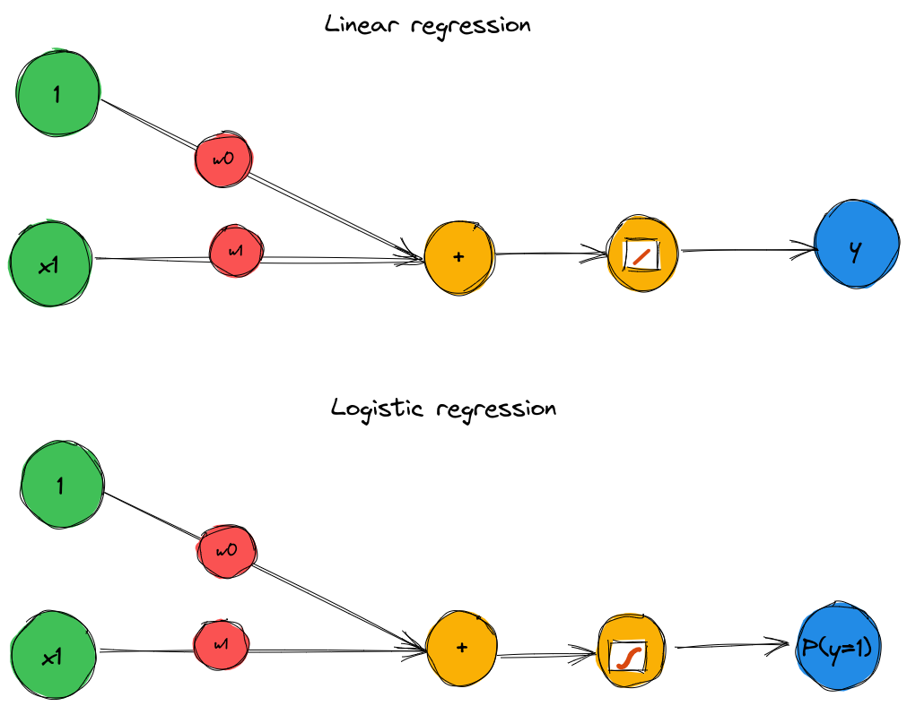
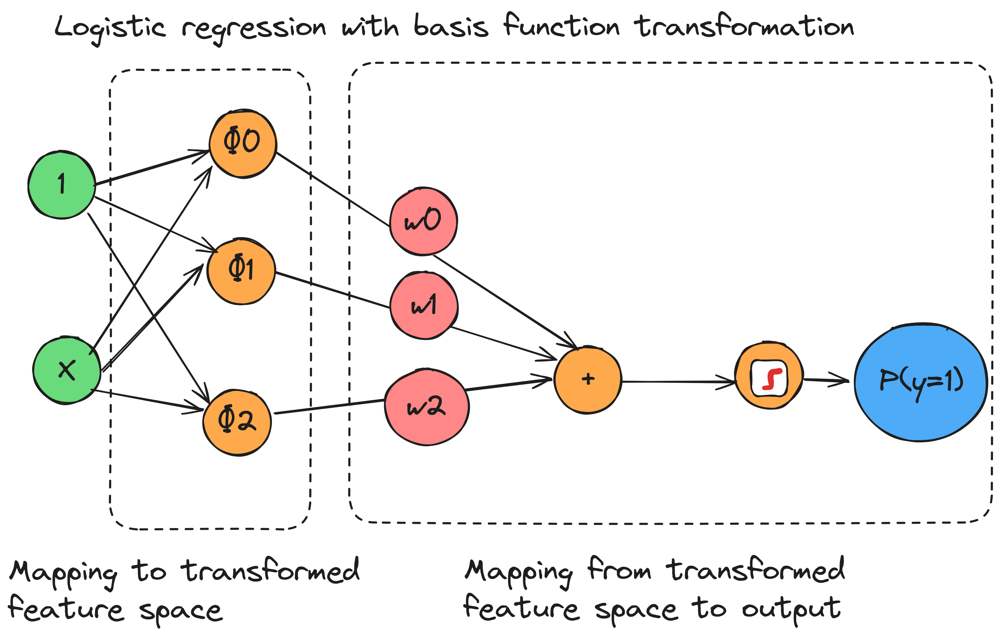
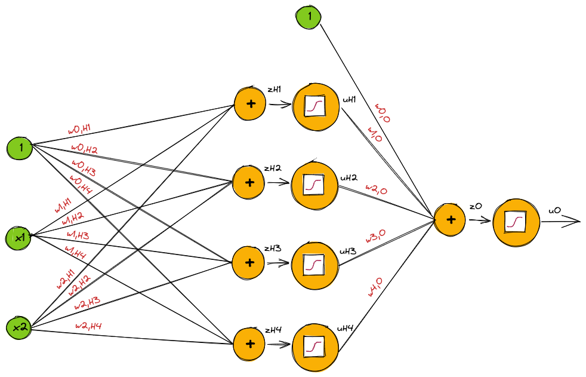
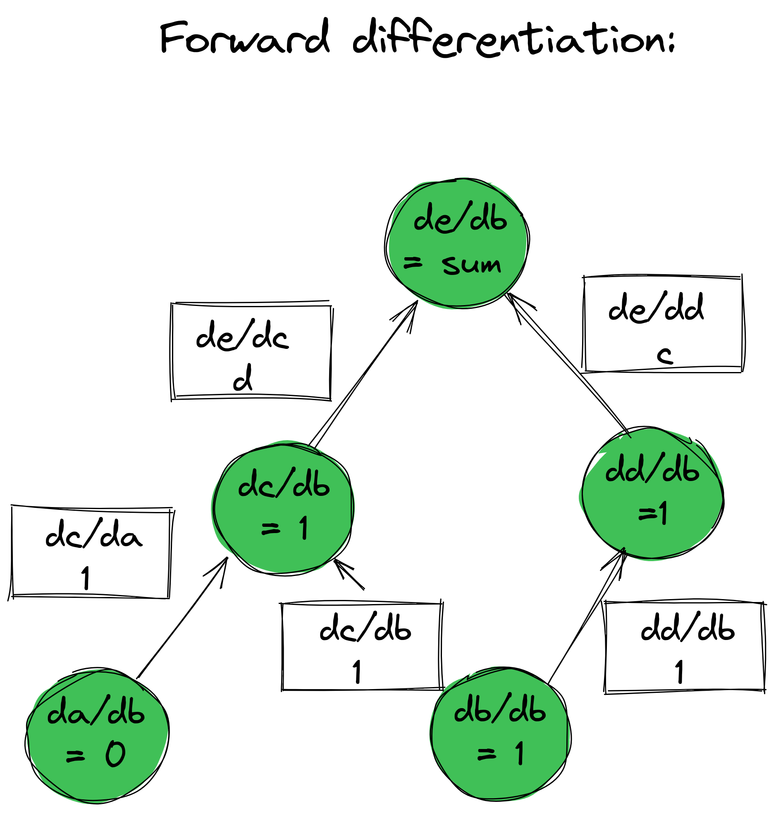

## In this lecture

* Neural network
* Structure of a neural network
* Training a neural network

\newpage

## From linear to non-linear

### Representation as a computational graph

::: notes

Let's represent the linear regression and logistic regression models using a computational graph.

{ width=60% }

Then, let's see what it would look like with a basis function transformation applied to the data first.

{ width=65% }

In those regression and classification models, we use a fixed basis function to transform features. We only learned the weights to map the transformed features to a continuous output (regression) or to a class label (classification).

Would it be possible to instead learn the first part - the mapping of the features to a transformed feature space?

:::

\newpage

### Example: synthetic data

](../images/two-class-nn-synthetic.png){width=30%}

### Model of example two-stage network (1)

First step (*hidden layer*): 

* Take $N_H=4$ "logistic regression" nodes. 
* Use $\mathbf(x)$ as input to each node.
* At each node $m$, first compute: $z_{H,m} = \mathbf{w}_{H,m}^T \mathbf{x}$
* Then, at each node, apply a sigmoid: $u_{H,m} = g_H(z_{H,m}) = \frac{1}{1+e^{-z_{H,m}}}$

::: notes

Note: assume a 1s column was added to the data matrix, so we don't need a separate intercept term.

{ width=30% }

{ width=50% }

At this point, we have some representation of the data in $\mathbb{R}^4$.

:::

\newpage

### Model of example two-stage network (2)

Second step (*output layer*):

* At output node, first compute: $z_O = \mathbf{w}^T_O [1, \mathbf{u}_H]$
* Then, compute: $u_O = g_O(z_O) =  \frac{1}{1+e^{-z_{O}}}$
* (Not in the graph): apply a threshold to get $\hat{y}$

::: notes

Notes: 

* we use the output of the previous layer as input to this layer
* as with the first layer, we add a 1s column to the input, to take care of the intercept term.

{ width=55% }

What does the output look like (over the feature space) at each node?

:::
### Example: output of each hidden node

](../images/two-class-nn-neurons.png){width=60%}

### Example: output of output node

](../images/two-class-nn-avgout.png){width=20%}

\newpage

### Matrix form of two stage network

* Hidden layer: $\mathbf{z}_H = \mathbf{W}_H^T \mathbf{x}, \quad \mathbf{u}_H = g_H(\mathbf{z}_H)$
* Output layer: $z_O = \mathbf{W}_O^T [1, \mathbf{u}_H], \quad u_O = g_O(\mathbf{z}_O)$

### Training the two-stage network for binary classification

* From final stage: $z_o = F(\mathbf{x}, \mathbf{W})$ where parameters $\mathbf{W} = (\mathbf{W}_H, \mathbf{W}_o)$
* Given training data $(\mathbf{x}_i, y_i), i = 1, \ldots, n$ 
* Loss function $L(\mathbf{W}) := -\sum_{i=1}^n \text{ln} P(y_i | \mathbf{x}_i, \mathbf{W})$
* Choose parameters to minimize loss: $\hat{\mathbf{W}} = \operatorname*{argmin}_{\mathbf{W}} L(\mathbf{W})$

::: notes

(We use the negative log likelihood/binary cross-entropy loss function from the logistic regression lesson. )

How do we choose the parameters in the last step? We'll use *gradient descent* on the computational graph. More on that soon...

:::

\newpage

## Neural networks

### Biological inspiration

 ](../images/biological-neuron.png){width=55%}

### Terminology

* **Hidden variables**: the variables $\mathbf{z}_H, \mathbf{u}_H$, which are not directly observed.
* **Hidden units**: the nodes that compute the hidden variables.
* **Activation function**: the function $g(z)$
* **Output units**: the node(s) that compute $z_{O}$.

### Activation function at output layer

What $g_O(z)$ to use for...

* Regression?
* Binary classification?
* Multi-class classification?

::: notes

 
For binary classification, $y \in [0,1]$: 

- $z_O$ is scalar - need one output node
- Soft decision: $P(y=1| x)=\frac{1}{1+e^{-z_O}}$
- Then you can apply threshold to get $\hat{y}$

For multi-class classification, $y=1,\ldots, K$:

- $\mathbf{z}_O = [z_{O,1}, \ldots, z_{O,K}]$ is a vector - need $K$ output nodes
- Soft decision: $P(y=k| x)=\frac{e^{z_{O,k}}}{\sum_\ell e^{-z_\ell}}$ (softmax)
- Then you can select label by $\hat{y} = \operatorname*{argmax}_k z_{O,k}$

For regression, $y \in R^{K}$:

- Can be a vector - need $K$ output nodes
- Linear activation: $\hat{y}=z_O$

:::

\newpage

### Activation functions at hidden layer: identity?

* Suppose we use $g(z) = z$ (identity function) as activation function throughout the network.
* The network can only achieve linear decision boundary!
* To get non-linear decision boundary, need non-linear activation functions.

::: notes

Universal approximation theorem: under certain conditions, with enough (finite)  hidden nodes, can approximate *any* continuous real-valued function, to any degree of precision. But only with non-linear decision boundary!

:::

### Activation functions at hidden layer: binary step

* Not differentiable at $x=0$, has $0$ derivative everywhere else.
* Not useful for gradient-based optimization methods.

### Activation functions at hidden layer: some choices

{width=50%}

::: notes

What do they have in common?

* Differentiable (at least from one side)
* Non-linear (except for the linear one, which is only used as the output function for a regression)

:::
### Dimension (1)

* $N_I$ = input dimension, number of features
* $N_H$ = number of hidden units 
* $N_O$ = output dimension, number of outputs

### Dimension (2)

Parameter               Symbol  Number of parameters
----------------------- ------- ---------------------
Hidden layer: weights   $W_H$   $N_H (N_I + 1)$
Output layer: weights   $W_O$   $N_O (N_H + 1)$
Total                           $N_H(N_I+1)+N_O(N_H+1)$

### Loss function: regression

* $y_i$ is scalar target variable for sample $i$
* $z_{Oi}$ is estimate of $y_i$
* Use L2 loss:

$$L(\mathbf{W}) = \sum_{i=1}^n (y_i - z_{Oi})^2$$

### Loss function: regression with vector output

* For vector $\mathbf{y}_i = (y_{i1}, \ldots, y_{iK})$, use vector L2 loss:

$$L(\mathbf{W}) = \sum_{i=1}^n \sum_{i=1}^K (y_{iK} - z_{OiK})^2$$

### Loss function: binary classification (1)

* $y_i = {0, 1}$ is target variable for sample $i$
* $z_{Oi}$ is scalar, called "logit score"
* Negative log likelihood loss:

$$L(\mathbf{W}) = -\sum_{i=1}^n \text{ln} P(y_i | \mathbf{x}_i, \mathbf{W}), \quad P(y_i=1|\mathbf{x}_i, \mathbf{W}) = \frac{1}{1+e^{-z_{Oi}}}$$

### Loss function: binary classification (2)

Loss (binary cross entropy):

$$L(\mathbf{W}) = \sum_{i=1}^n -y_i z_{Oi} + \text{ln}(1+e^{y_i z_Oi})$$

### Loss function: multi-class classification (1)

* $y_i = {1, \ldots, K}$ is target variable for sample $i$
* $\mathbf{z}_{Oi} = (z_{Oi1}, \ldots, z_{OiK})$ is vector with one entry per class
* Likelihood given by softmax function, class with highest score has highest probability:

$$P(y_i  = k | \mathbf{x}_i, \mathbf{W}) = g_k(\mathbf{z}_{Oi}), \quad g_k(\mathbf{z}_{Oi}) = \frac{e^{z_{OiK}}}{\sum_\ell e^{z_{Oi\ell}}}$$

\newpage

### Loss function: multi-class classification (2)

Define "one-hot" vector - for a sample from class $k$, all entries in the vector are $0$ except for the $k$th entry which is $1$:

$$r_{ik} = 
\begin{cases}
1 \quad y_i = k \\
0 \quad y_i \neq k
\end{cases}
$$

### Loss function: multi-class classification (3)

Negative log likelihood 

$$\text{ln} P(y_i = k | \mathbf{x}_i, \mathbf{W}) = \sum_{k=1}^K \text{ln} P(y_i = k | \mathbf{x}_i, \mathbf{W})$$

### Loss function: multi-class classification (4)

Loss (categorical cross entropy):

$$L(\mathbf{W}) = \sum_{i=1}^n \left[ \ln \left(\sum_k e^{z_{Oik}}\right) - \sum_k  r_{ik} z_{Oik}\right]$$

## Neural network - summary

### Things that are "given"

For a particular problem, these are "given":

* the number of inputs
* the number of outputs
* the activation function to use at the output
* the loss function

### Things that we decide

We still need to decide:

* the number of hidden units
* the activation function to use at hidden units

### Training the network

* Still need to find the $\mathbf{W}$ that minimizes $L(\mathbf{W})$.
* How?

\newpage

## Backpropagation

### How to compute gradients?

* Gradient descent requires computation of the gradient $\nabla L(\mathbf{W})$
* Backpropagation is key to efficient computation of gradients

### Composite functions and computation graphs

Suppose we have a composite function $f(g(h(x)))$

We can represent it as a computational graph, where each connection is an input and each node performs a function or operation:

\begin{tikzpicture}
  \node[circle] (n1) at (1,1) {$x$};
  \node[circle,fill=blue!20] (n2) at (4,1)  {$v=h(x)$};
  \node[circle,fill=blue!20] (n3) at (8,1)  {$u=g(v)$};
  \node[circle,fill=blue!20] (n4) at (11,1) {$f(u)$};
  \draw [->] (n1) -- (n2) node[midway, above] {};
  \draw [->] (n2) -- (n3) node[midway, above] {};
  \draw [->] (n3) -- (n4) node[midway, above] {};
\end{tikzpicture}

### Forward pass on computational graph

To compute the output $f(g(h(x)))$, we do a *forward pass* on the computational graph:

* Compute $v=h(x)$
* Compute $u=g(v)$
* Compute $f(u)$

### Derivative of composite function

* Suppose need to compute the derivative of the composite function $f(g(h(x)))$ with respect to $x$  

* We will use the chain rule.

### Backward pass on computational graph

We can compute this chain rule derivative by doing a *backward pass* on the computational graph:

We just need to get the derivative of each node with respect to its inputs: 

$$\frac{df}{dx} = \frac{df}{du} \frac{dg}{dv} \frac{dh}{dx}$$

\begin{tikzpicture}
  \node[circle] (n1) at (1,1) {$x$};
  \node[circle,fill=blue!20] (n2) at (4,1)  {$v=h(x)$};
  \node[circle,fill=blue!20] (n3) at (8,1)  {$u=g(v)$};
  \node[circle,fill=blue!20] (n4) at (11,1) {$f(u)$};
  \draw [<-] (n1) -- (n2) node[midway, above] {$\frac{dh}{dx}$};
  \draw [<-] (n2) -- (n3) node[midway, above] {$\frac{dg}{dv}$};
  \draw [<-] (n3) -- (n4) node[midway, above] {$\frac{df}{du}$};
\end{tikzpicture}

### Neural network computation graph

\begin{tikzpicture}
  \node[circle, fill=green!20] (n1) at (1,1) {$x_i$};
  \node[circle,fill=purple!20] (n2) at (3,1)  {$z_{H,i}$};
  \node[circle,fill=purple!20] (n3) at (5,1)  {$u_{H,i}$};
  \node[circle,fill=purple!20] (n4) at (7,1) {$z_{O,i}$};
  \node[circle,fill=purple!20] (n5) at (9,1) {$u_{O,i}$};
  \node[circle,fill=orange!20] (n6) at (12,1) {$L(y_i, u_{O,i})$};
  \node[circle,fill=blue!20] (n7) at (1,4) {$W_H$};
  \node[circle,fill=blue!20] (n8) at (5,4) {$W_O$};

  \draw [->] (n1) -- (n2) node[midway, above] {};
  \draw [->] (n2) -- (n3) node[midway, above] {};
  \draw [->] (n3) -- (n4) node[midway, above] {};
  \draw [->] (n4) -- (n5) node[midway, above] {};
  \draw [->] (n5) -- (n6) node[midway, above] {};
  \draw [->] (n7) -- (n2) node[midway, above] {};
  \draw [->] (n8) -- (n4) node[midway, above] {};

\end{tikzpicture}

### Backpropagation error: definition

Denote the backpropagation error of node $j$ as 

$$\delta_j = \frac{\partial L}{\partial z_j}$$

the derivative of the loss function, with respect to the input to the activation function at that node.

### Backpropagation error: output unit

For output unit in *regression* network, where $u_{O} = z_{O}$,

$$L =  \frac{1}{2}\sum_n (y_n - z_{O,n})^2$$

Then $\delta_O =  \frac{\partial L}{\partial z_O} = -  (y - z_{O})$

::: notes

Note: this is the error of the model, the difference between true value and network output!

More generally, if not using the identity activation function at the output, you compute $\delta_O =  \frac{\partial L}{\partial u_O}\frac{\partial u_O}{\partial z_O}$.

:::

### Backpropagation error: unit with inputs illustration

\begin{tikzpicture}
  \node[circle, fill=purple!20,minimum size=1cm] (n1) at (1,1) {};
  \node[circle,fill=purple!20,minimum size=1cm] (n2) at (1,5)  {};
  \node[label=$j$,circle,fill=purple!20,minimum size=1cm] (n3) at (5,3)  {};

  \draw [->] (n1) -- (n3) node[midway, above] {};
  \draw [->] (n2) -- (n3) node[midway, above] {$ u_i w_{j,i}$};
\end{tikzpicture}

At a node $j$, $z_j = \sum_i w_{j,i} u_{i}$

### Backpropagation error: unit with inputs

* Backpropagation error of node $j$ is $\delta_j = \frac{\partial L}{\partial z_j}$

* Chain rule: $\frac{\partial L}{\partial w_{j,i}} = \frac{\partial L}{\partial z_{j}} \frac{\partial z_{j}}{\partial w_{j,i}}$

* Since $z_j = \sum_i w_{j,i} u_{i}$, $\frac{\partial z_j}{\partial w_{j,i}} = u_i$

* Then $\frac{\partial L}{\partial w_{j,i}} = \delta_j u_i$

### Backpropagation error: unit with inputs and outputs illustration

\begin{tikzpicture}
  \node[circle, fill=purple!20,minimum size=1cm] (n1) at (1,1) {};
  \node[label=$i$,circle,fill=purple!20,minimum size=1cm] (n2) at (1,5)  {};
  \node[label=$j$,circle,fill=purple!20,minimum size=1cm] (n3) at (5,3)  {};
  \node[circle,fill=purple!20,minimum size=1cm] (n4) at (9,1)  {};
  \node[label=$k$,circle,fill=purple!20,minimum size=1cm] (n5) at (9,5)  {};

  \draw [->] (n1) -- (n3) node[midway, above] {};
  \draw [->] (n2) -- (n3) node[midway, above] {$ u_i w_{j,i}$};
  \draw [->] (n3) -- (n4) node[midway, above] {};
  \draw [->] (n3) -- (n5) node[midway, above] {$ u_j w_{k,j}$};
\end{tikzpicture}

### Backpropagation error: unit with inputs and outputs (1)

For a hidden unit,

$$\delta_j = \frac{\partial L}{\partial z_j} = \sum_k \frac{\partial L}{\partial z_k}\frac{\partial z_k}{\partial z_j}$$

$$\delta_j = \sum_k \delta_k \frac{\partial z_k}{\partial z_j} =  \sum_k \delta_k w_{k,j} g'(z_j) = g'(z_j) \sum_k \delta_k w_{k,j} $$

using $\delta_k = \frac{\partial L}{\partial z_k}$. 

### Backpropagation error: unit with inputs and outputs (2)

And because $z_k = \sum_l w_{k,l} u_l = \sum_l w_{k,l} g(z_l)$, 

$\frac{\partial z_k}{\partial z_j}  = w_{k,j}g'(z_j)$.

\newpage

### Backpropagation + gradient descent algorithm (1)

1. Start with random (small) weights. Apply input $x_n$ to network and propagate values forward using $z_j = \sum_i w_{j,i} u_i$ and $u_j = g(z_j)$. (Sum is over all inputs to node $j$.)
2. Evaluate $\delta_k$ for all output units.

### Backpropagation + gradient descent algorithm (2)

3. Backpropagate the $\delta$s to get $\delta_j$ for each hidden unit. (Sum is over all outputs of node $j$.)

$$\delta_j = g'(z_j) \sum_k w_{k,j} \delta_k$$

### Backpropagation + gradient descent algorithm (3)

4. Use $\frac{\partial L_n}{\partial w_{j,i}} = \delta_j u_i$ to evaluate derivatives.
5. Update weights using gradient descent.

### Derivatives for common loss functions

Squared/L2 loss: 

$$L = \sum_i (y_i - z_{O,i})^2, \quad \frac{\partial L}{\partial z_{O,i}} = \sum_i -(y_i - z_{O,i})$$

Binary cross entropy loss: 

$$L = \sum_i -y_i z_{O,i} + \text{ln} (1 + e^{y_i z_{O,i}}), \quad \frac{\partial L}{\partial z_{O,i}} = y_i - \frac{ e^{y_i z_{O,i}} }{1 + e^{y_i z_{O,i}} }$$

### Derivatives for common activation functions

* Sigmoid activation: $g'(x) = \sigma(x) (1-\sigma(x))$
* Tanh activation: $g'(x) = \frac{1}{\text{cosh}^2(x)}$

\newpage

## Why is it so important?

### Forward-mode differentiation

{width=60%}

::: notes

Image via [https://colah.github.io/posts/2015-08-Backprop/](https://colah.github.io/posts/2015-08-Backprop).

:::

### Reverse-mode differentiation

{width=60%}

::: notes

Image via [https://colah.github.io/posts/2015-08-Backprop/](https://colah.github.io/posts/2015-08-Backprop).

:::

\newpage
