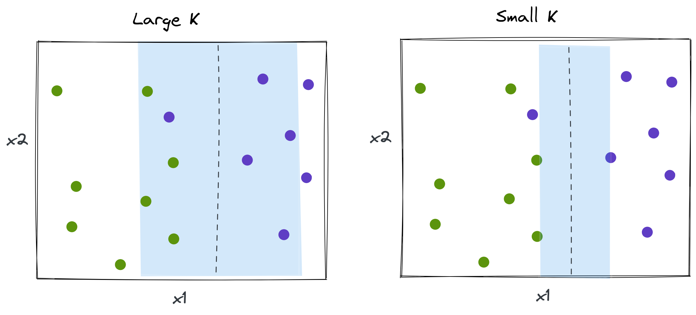

:::notes

**Math prerequisites for this lecture**: Constrained optimization (Appendix C in in Boyd and Vandenberghe).

:::

<!--

## In this lecture

* Maximal margin classifier
* Support vector classifier
* Solving constrained optimization to find coefficients

-->

## Maximal margin classifier

### Binary classification problem 

* $n$ training samples, each with $p$ features $\mathbf{x}_1, \ldots, \mathbf{x}_n \in \mathbb{R}^p$
* Class labels $y_1, \ldots, y_n \in \{-1, 1\}$

### Linear separability

The problem is **perfectly linearly separable** if there exists a **separating hyperplane** $H_i$ such that 

* all $\mathbf{x} \in C_i$ lie on its positive side, and 
* all $\mathbf{x} \in C_j, j \neq i$ lie on its negative side.

### Separating hyperplane (1)

The separating hyperplane has the property that for all $i=1,\ldots,n$, 

$$w_0 + \sum_{j=1}^p w_j x_{ij} > 0 \text{ if } y_i = 1$$

$$w_0 + \sum_{j=1}^p w_j x_{ij} < 0 \text{ if } y_i = -1$$

### Separating hyperplane (2)

Equivalently:

\begin{equation}
y_i \left(w_0 + \sum_{j=1}^p w_j x_{ij} \right) > 0
\label{eq:sep-no-margin}
\end{equation}

### Using the hyperplane to classify

Then, we can classify a new sample $\mathbf{x}$ using the sign of 

$$z = w_0 + \sum_{j=1}^p w_j x_{ij}$$

and we can use the magnitude of $z$ to determine how confident we are about our classification. (Larger $z$ = farther from hyperplane = more confident about classification.)

\newpage

### Which separating hyperplane is best? 

{ width=25% }

::: notes

Previously, with the logistic regression classifier, we found the maximum likelihood classifier: the hyperplane that maximizes the probability of these particular observations.

:::

### Margin

For any "candidate" hyperplane, 

* Compute perpendicular distance from each sample to separating hyperplane.
* Smallest distance among all samples is called the **margin**. 

::: notes

{ width=25% }

:::

### Maximal margin classifier

* Choose the line that maximizes the margin!
* Find the widest "slab" we can fit between the two classes.
* Choose the midline of this "slab" as the decision boundary.

::: notes

{ width=25% }

:::

\newpage

### Support vectors

* Points that lie on the border of maximal margin hyperplane are **support vectors**
* They "support" the maximal margin hyperplane: if these points move, then the maximal margin hyperplane moves
* Maximal margin hyperplane is not affected by movement of any other point, as long as it doesn't cross borders!

::: notes

{ width=80% }

:::

### Constructing the maximal margin classifier

To construct this classifier, we will set up a *constrained optimization* problem with:

* an objective 
* one or more constraints to satisfy

What should the objective/constraints be in this scenario?

\newpage

### Constructing the maximal margin classifier (1)

\begin{equation}
\operatorname*{maximize}_{\mathbf{w}, \gamma} \gamma
\end{equation}

\begin{equation}
\text{subject to: }\sum_{j=1}^{p} w_j^2 = 1 
\end{equation}

\begin{equation}
\text{and } y_i \left(w_0 + \sum_{j=1}^{p} w_j x_{ij} \right) \geq \gamma, \forall i
\end{equation}

::: notes

---

The constraint 

$$y_i \left(w_0 + \sum_{j=1}^{p} w_j x_{ij} \right) \geq \gamma, \forall i $$

guarantees that each observation is on the correct side of the hyperplane *and* on the correct side of the margin, if margin $\gamma$ is positive. (This is analogous to Equation \ref{eq:sep-no-margin}, but we have added a margin.)

The constraint 

$$\text{and } \sum_{j=1}^{p} w_j^2 = 1$$

is not really a constraint: if a separating hyperplane is defined by $w_0 + \sum_{j=1}^{p} w_j x_{ij} = 0$, then for any $k \neq 0$, $k\left( w_0 + \sum_{j=1}^{p} w_j x_{ij}\right) = 0$ is also a separating hyperplane.

This "constraint" just scales weights so that distance from $i$th sample to the hyperplane is given by $y_i \left(w_0 + \sum_{j=1}^{p} w_j x_{ij} \right)$. This is what make the previous constraint meaningful!

{ width=30% }

:::

\newpage

### Constructing the maximal margin classifier (2)

The constraints ensure that

* Each observation is on the correct side of the hyperplane, and
* at least $\gamma$ away from the hyperplane

and $\gamma$ is maximized.

### Problems with MM classifier (1)

{ width=25% }

### Problems with MM classifier (2)

{ width=60% }

\newpage 

## Support vector classifier

### Basic idea

* Generalization of MM classifier to non-separable case
* Use a hyperplane that *almost* separates the data
* "Soft margin"

### Constructing the support vector classifier 

\begin{equation}
\operatorname*{maximize}_{\mathbf{w}, \mathbf{\epsilon}, \gamma} \gamma
\end{equation}

\begin{equation}
\text{subject to: } \sum_{j=1}^{p} w_j^2 = 1
\end{equation}

\begin{equation}
y_i \left(w_0 + \sum_{j=1}^{p} w_j x_{ij} \right) \geq \gamma(1-\epsilon_i), \forall i
\end{equation}

\begin{equation}
\epsilon_i \geq 0 \forall i, \quad \sum_{i=1}^n \epsilon_i \leq K
\end{equation}

::: notes

{ width=40% }

$K$ is a non-negative tuning parameter.

**Slack variable** $\epsilon_i$ determines where a point lies:

* If $\epsilon_i = 0$, point is on the correct side of margin
* If $\epsilon_i > 0$, point has *violated* the margin (wrong side of margin)
* If $\epsilon_i > 1$, point is on wrong side of hyperplane and is misclassified

$K$ is the **budget** that determines the number and severity of margin violations we will tolerate.

* $K=0 \rightarrow$ same as MM classifier
* $K > 0$, no more than $K$ observations may be on wrong side of hyperplane
* As $K$ increases, margin widens; as $K$ decreases, margin narrows.

:::

\newpage

### Support vector

For a support vector classifier, the only points that affect the classifier are:

* Points that lie on the margin boundary 
* Points that violate margin

These are the *support vectors*.

### Illustration of effect of $K$

{ width=45% }

<!--
{ width=50% }
-->

### $K$ controls bias-variance tradeoff

* When $K$ is large: many support vectors, variance is low, but bias may be high.
* When $K$ is small: few support vectors, high variance, but low bias.

::: notes

**Terminology note**: In ISLR and in the first part of these notes, meaning of constant is opposite its meaning in Python `sklearn`:

* ISLR and these notes: Large $K$, wide margin.
* Python `sklearn`: Large $C$, small margin.

:::

### Loss function

This problem is equivalent to minimizing hinge loss: 

$$\operatorname*{minimize}_{\mathbf{w}} \left( \sum_{i=1}^n \text{max} [0, 1-y_i ( w_0 + \sum_{j=1}^p w_j x_{ij})] + \lambda \sum_{j=1}^p w_j^2 \right)$$

where $\lambda$ is non-negative tuning parameter.

::: notes

Zero loss for observations where

$$y_i \left(w_0 + \sum_{j=1}^p w_j x_{ij} \right) \geq 1$$

and width of margin depends on $\sum w_j^2$.

:::

### Compared to logistic regression

* **Hinge loss**: zero for points on correct side of margin.
* **Logistic regression loss**: small for points that are far from decision boundary.

<!--
### Hinge loss vs. logistic regression

{ width=50% }
-->

\newpage

## Solution

### Problem formulation - original

$$
\begin{aligned}
\operatorname*{maximize}_{\mathbf{w}, \mathbf{\epsilon}, \gamma} \quad &  \gamma \\
\text{subject to} \quad &\sum_{j=1}^{p} w_j^2 = 1 \\
& y_i \left(w_0 + \sum_{j=1}^{p} w_j x_{ij} \right) \geq \gamma(1-\epsilon_i), \forall i \\
&  \epsilon_i \geq 0, \quad \forall i \\
& \sum_{i=1}^n \epsilon_i \leq K 
\end{aligned}
$$

### Problem formulation - equivalent

::: notes

Remember that any scaled version of the hyperplane is the same line. So let's make $||w||$ inversely proportional to $\gamma$. Then we can formulate the equivalent problem:

:::

$$
\begin{aligned}
\operatorname*{minimize}_{\mathbf{w}, \mathbf{\epsilon}} \quad & \sum_{j=1}^{p} w_j^2 \\
\text{subject to} \quad & y_i \left(w_0 + \sum_{j=1}^{p} w_j x_{ij} \right) \geq 1-\epsilon_i, \forall i \\
& \epsilon_i \geq 0, \quad \forall i \\
& \sum_{i=1}^n \epsilon_i \leq K \\
\end{aligned}
$$

### Problem formulation - equivalent (2)

::: notes

Or, move the "budget" into the objective function:

:::

$$
\begin{aligned}
\operatorname*{minimize}_{\mathbf{w}, \mathbf{\epsilon}} \quad & \frac{1}{2} \sum_{j=1}^p w_j^2  + C \sum_{i=1}^n \epsilon_i  \\
\text{subject to} \quad & y_i(w_0 + \sum_{j=1}^p w_j x_{ij}) \geq 1-\epsilon_i, \quad \forall i \\
& \epsilon_i \geq 0, \quad \forall i
\end{aligned}
$$

\newpage

### Background: constrained optimization

Basic formulation of contrained optimization problem:

* **Objective**: Minimize $f(x)$
* **Constraint(s)**: subject to $g(x)\leq 0$

::: notes

Find ${x}^{*}$ that satisfies $g({x}^{*}) \leq 0$ and, for any other $x$ that satisfies $g(x) \leq 0$, $f(x) \geq f({x}^{*})$.

:::

### Background: Illustration

{ width=80% }

### Background: Solving with Lagrangian (1)

To solve, we form the Lagrangian: 

$$
L(x, \lambda) = f(x) + \lambda_1 g_1(x) + \dots + \lambda_m g_m(x) 
$$

where each $\lambda \geq 0$ is a *Lagrange multiplier*.

::: notes
 
The $\lambda g(x)$ terms "pull" solution toward feasible set, away from non-feasible set.

::: 

### Background: Solving with Lagrangian (2)

Then, to solve, we use joint optimization over $x$ and $\lambda$:

$$\operatorname*{minimize}_{x} \operatorname*{maximize}_{\lambda \geq 0 } f(x) + \lambda g(x)$$

over $x$ and $\lambda$.

:::notes

("Solve" in the usual way if the function is convex: by taking partial derivative of $L(x,\lambda)$ with respect to each argument, and setting it to zero. The solution to the original function will be a saddle point in the Lagrangian.)

:::

### Background: Solving with Lagrangian (3)

$$\operatorname*{minimize}_{x} \operatorname*{maximize}_{\lambda \geq 0 } f(x) + \lambda g(x)$$

Suppose that for the $x$ that minimizes $f(x)$, $g(x) \leq 0$

(i.e. **$x$ is in the feasible set**.) 

If $g(x) < 0$ (constraint is not active), 

* to maximize: we want $\lambda = 0$
* to minimize: we'll minimize $f(x)$, $\lambda g(x) = 0$ 

### Background: Solving with Lagrangian (4)

$$\operatorname*{minimize}_{x} \operatorname*{maximize}_{\lambda \geq 0 } f(x) + \lambda g(x)$$

Suppose that for the $x$ that minimizes $f(x)$, $g(x) > 0$

(**$x$ is not in the feasible set.**)

  * to maximize: we want $\lambda > 0$
  * to minimize: we want small $g(x)$ and $f(x)$.

::: notes

In this case, the "pull" between 

* the $x$ that minimizes $f(x)$ 
* and the $\lambda g(x)$ which pulls toward the feasible set, 

ends up making the constraint "tight". We will use the $x$ on the edge of the feasible set ($g(x) = 0$, constraint is active) for which $f(x)$ is smallest.

This is called the KKT complementary slackness condition: for every constraint, $\lambda g(x) = 0$, either because $\lambda = 0$ (inactive constraint) or $g(x) = 0$ (active constraint).

:::

### Background: Active/inactive constraint

{ width=80% }

### Background: Primal and dual formulation

Under the right conditions, the solution to the *primal* problem:

$$\operatorname*{minimize}_{x} \operatorname*{maximize}_{\lambda \geq 0 } L(x, \lambda) $$

is the same as the solution to the *dual* problem:

$$\operatorname*{maximize}_{\lambda \geq 0 } \operatorname*{minimize}_{x} L(x, \lambda) $$

### Problem formulation - Lagrangian primal

::: notes

Back to our SVC problem - let's form the Lagrangian and optimize:

:::

$$
\begin{aligned}
\operatorname*{minimize}_{\mathbf{w}, \mathbf{\epsilon}} \operatorname*{maximize}_{\alpha_i \geq 0, \mu_i \geq 0, \forall i } \quad & \frac{1}{2} \sum_{j=1}^p w_j^2   \\
& + C \sum_{i=1}^n \epsilon_i \\
& - \sum_{i=1}^n  \alpha_i \left[ y_i(w_0 + \sum_{j=1}^p w_j x_{ij}) - (1-\epsilon_i) \right]  \\
& - \sum_{i=1}^n \mu_i \epsilon_i
\end{aligned}
$$

::: notes

This is the *primal* problem. 

:::

### Problem formulation - Lagrangian dual

::: notes

The equivalent *dual* problem:

:::

$$
\begin{aligned}
\operatorname*{maximize}_{\alpha_i \geq 0, \mu_i \geq 0, \forall i } \operatorname*{minimize}_{\mathbf{w}, \mathbf{\epsilon}}  \quad & \frac{1}{2} \sum_{j=1}^p w_j^2   \\
& + C \sum_{i=1}^n \epsilon_i \\
& - \sum_{i=1}^n  \alpha_i \left[ y_i(w_0 + \sum_{j=1}^p w_j x_{ij}) - (1-\epsilon_i) \right]  \\
& - \sum_{i=1}^n \mu_i \epsilon_i
\end{aligned}
$$

::: notes

We solve this by taking the derivatives with respect to $\mathbf{w}, \mathbf{\epsilon}$ and setting them to zero. Then, we plug those values back into the dual equation...

:::

### Problem formulation - Lagrangian dual (2)

$$
\begin{aligned}
\operatorname*{maximize}_{\alpha_i \geq 0, \forall i }  \quad &  \sum_{i=1}^n \alpha_i  - \frac{1}{2} \sum_{i=1}^n \sum_{j=1}^n \alpha_i \alpha_j y_i y_j \mathbf{x}_i^T \mathbf{x}_j \\
\text{subject to} \quad & \sum_{i=1}^n \alpha_i y_i  = 0 \\
& 0 \leq \alpha_i \leq C, \quad \forall i
\end{aligned}
$$

::: notes

This turns out to be not too terrible to solve. $\alpha$ is non-zero only when the constraint is active - only for support vectors.

:::

### Solution (1)

Optimal coefficients for $j=1,\ldots,p$ are:

$$\mathbf{w}^* = \sum_{i=1}^n {\alpha_i^*} y_i \mathbf{x}_{i}$$

where ${\alpha_i^*}$ come from the solution to the dual problem.

### Solution (2)

* ${\alpha_i^*} > 0$ only when $x_i$ is a support vector (active constraint).
* Otherwise, ${\alpha_i^*} = 0$ (inactive constraint).

### Solution (3)

That leaves $w_0^*$ - we can solve

$$w_0^* = y_i - \sum_{j=1}^p w_j \mathbf{x}_{i}$$

using any sample $i$ where $\alpha_i^* > 0$, i.e. any support vector.

### Why solve dual problem?

For high-dimension problems (many features), dual problem can be much faster to solve than primal problem: 

* Primal problem: optimize over $p+1$ coefficients.
* Dual problem: optimize over $n$ dual variables, but there are only as many non-zero ones as there are support vectors.

Also: the kernel trick, which we'll discuss next...

### Correlation interpretation (1)

Given a new sample $\mathbf{x}$ to classify, compute

$$\hat{z}(\mathbf{x}) = w_0 + \sum_{j=1}^p w_j x_{j} = w_0 + \sum_{i=1}^n \alpha_i y_i \sum_{j=1}^p  x_{ij} x_{j}$$

Measures inner product (a kind of "correlation") between new sample and each support vector.

### Correlation interpretation (2)

Classifier output (assuming -1,1 labels):

$$\hat{y}(\mathbf{x}) = \text{sign} (\hat{z}(\mathbf{x}))$$

Predicted label is weighted average of labels for support vectors, with weights proportional to "correlation" of test sample and support vector.

### Relationship between SVM and other models

* Like a logistic regression - linear classifier, separating hyperplane is $w_0 + \sum_{j=1}^p w_j x_{ij} = 0$
* Like a weighted KNN - predicted label is weighted average of labels for support vectors, with weights proportional to "similarity" of test sample and support vector.