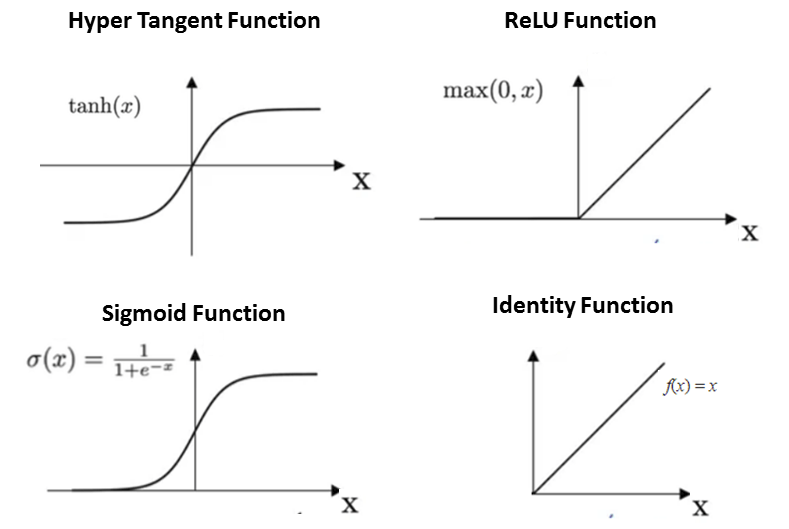
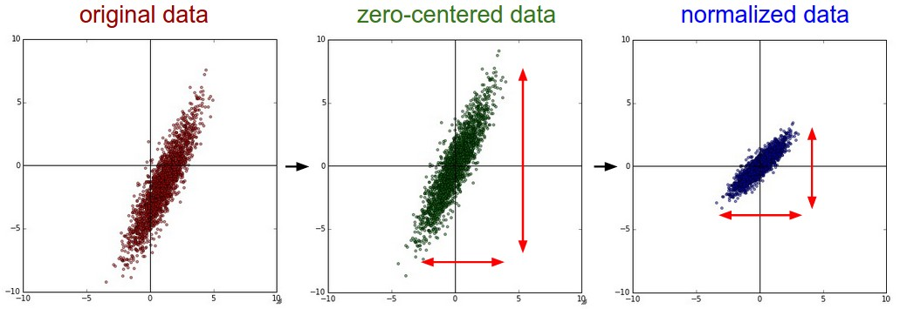
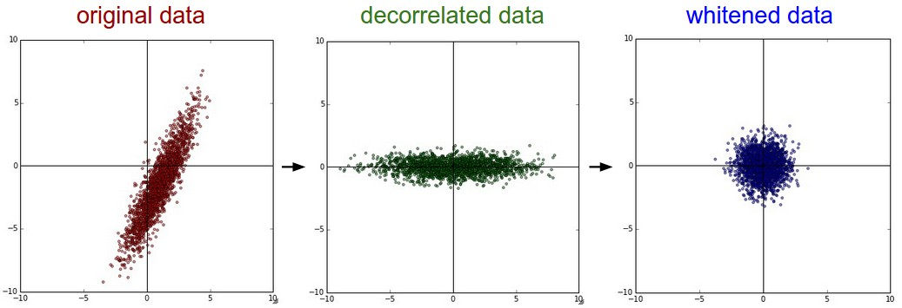
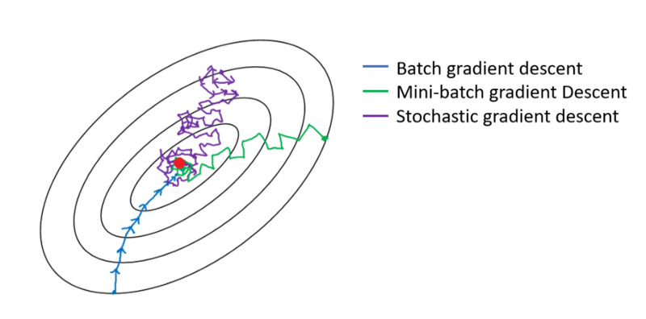
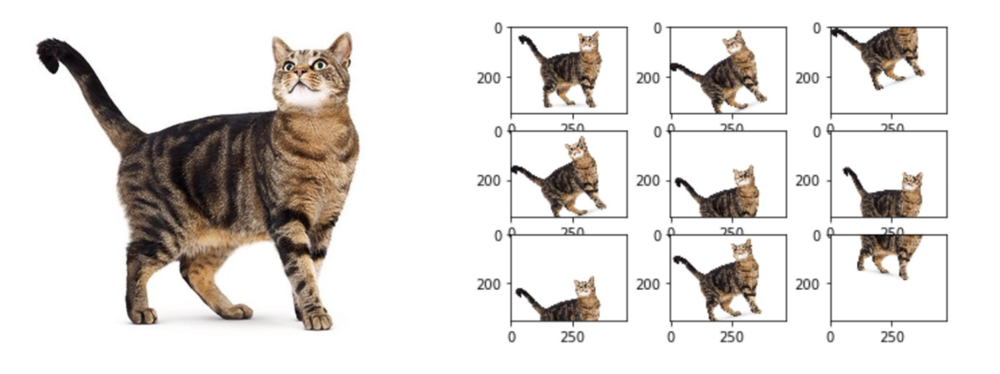

\newpage

## Recap

Last week: neural networks with one hidden layer

* Hidden layer learns feature representation
* Output layer learns classification/regression tasks

::: notes

With the neural network, the "transformed" feature representation is *learned* instead of specified 
by the designer.

{ width=100% }

:::

## Deep neural networks

::: notes

{ width=60% }

Some comments:

* each layer is fully connected to the next layer
* each unit still works the same way: take the weighted sum of inputs, apply an activation function, and that's the unit output
* still trained by backpropagation

We call the number of layers the "depth" of the network and the number of hidden units in a layer its "width."

:::

<!--

Universal approximation theorem: https://cedar.buffalo.edu/~srihari/CSE676/6.4%20ArchitectureDesign.pdf

-->

### Challenges with deep neural networks

* Optimization
* Generalization

## Optimizing deep neural networks

### Loss landscape

{ width=40% }

::: notes

Image source: Hao Li, Zheng Xu, Gavin Taylor, Christoph Studer and Tom Goldstein. Visualizing the Loss Landscape of Neural Nets. NIPS, 2018.

Neural networks are optimized using backpropagation over the computational graph, where the loss is a very challenging function of *all* the weights. (Not convex!)

:::

### Effective training depends on

* Activation function
* Pre-processing data
* Initial weights
* Optimizer

### Recall: activation functions

{ width=40% }

<!--
### Zero-centered outputs

Remember that at each hidden unit, we compute

$\frac{\partial L_n}{\partial w_{j,i}} = \delta_j u_i$ 

where $\delta_j$ is the backpropagation error from the "upstream" nodes.

What happens if the $u_i$ terms are always positive?

::: notes

* To compute the derivative with respect to the weights at the input to a neuron, we compute the "local derivative" and then multiply by the "upstream" "backpropagation error" (scalar).

* The scalar multiplier may be positive or negative.

:::

-->

### Vanishing/exploding gradient

::: notes

What happens when you are in the far left or far right part of the sigmoid?

* Gradient is close to zero
* Weight updates are also close to zero
* The "downstream" gradients will also be values close to zero! (Because of backpropagation.)
* And, when you multiply quantities close to zero - they get even smaller.

When the sigmoid "saturates", it "kills" the neuron!

(Same issue with tanh.)

(There is also an analagous "exploding gradient" problem when large gradients are propagated back through the network.)

:::

### Dead ReLU

ReLU is a much better non-linear function:

* does not saturate in positive region
* very very fast to compute
* often converges faster than sigmoid/tanh

But, can "die" in the negative region.

::: notes

When input is less than 0, the ReLU (and downstream units) is *completely* dead (not only very small!)

Alternative: **leaky ReLU** has small (non-zero) gradient in the negative region - won't die. 

$$f(x) = \text{max}(\alpha x, x)$$

($\alpha$ is a hyperparameter.)

Also other variations on this...

:::

### Skip connections

* Direct connection between some higher layers and lower layers
* A "highway" for gradient info to go directly back to lower layers

\newpage

### Data pre-processing

You can make the loss surface much "nicer" by pre-processing:

* Remove mean (zero center)
* Normalize (divide by standard deviation)
* OR decorrelation (whitening/rotation)

::: notes

There are several reasons why this helps. We already discussed the "ravine" in the loss function that is created by correlated features. 

What about zero-centering and normalization? Think about a binary classification problem of a data cloud that is far from the origin, vs. one close to the origin. In which case will the loss function react more (be more sensitive) to a small change in weights?

{ width=30% }

Note: Whitening/decorrelation is not applied to image data. For image data, we sometimes subtract the "mean image" or the per-color mean.

:::

### Data preprocessing (1)

{ width=50% }

### Data preprocessing (2)

{ width=50% }

### Weight initialization

What if we initialize weights to:

* zero?
* a constant (non-zero)?
* a normal random value with large $\sigma$?
* a normal random value with small $\sigma$?

::: notes

Some comments:

* If weights are all initialized to zero, all the outputs are zero (for any input) - the network won't learn.
* If weights are all initialized to the same constant, we are more prone to "herding" - hidden units all move in the same direction at once, instead of "specializing".
* Large normal random values are bad - you want to be near the non-linear part of the activation function, and avoid exploding gradients.
* Small normal random values work well for "shallow" networks, but not for deep networks - it makes the activation function outputs "collapse" toward zero.

:::

### Desirable properties for initial weights

* The mean of the intial weights should be right in the middle 
* The variance of the activations should stay the same across every layer ([derivation](https://www.deeplearning.ai/ai-notes/initialization/index.html))

Xavier initialization for tanh, He initialization for ReLU.

::: notes

Xavier scales variance by $\frac{1}{N_{in}}$, He by $\frac{2}{N_{in}}$ where $N_{in}$ is the number of inputs to the layer.

:::

### Desirable properties - illustration (1)

{ width=60% }

### Desirable properties - illustration (2)

{ width=60% }

\newpage

## Optimizers

### Standard ("batch") gradient descent

For each step $t$ along the error curve:

$$W^{t+1} = W^t - \alpha \nabla L(W^t) = W^t - \frac{\alpha}{N} \sum_{i=1}^N \nabla L_i(W^t, \mathbf{x}_i, y_i)$$

Repeat until stopping criterion is met.

### Stochastic gradient descent 

Idea: at each step, compute estimate of gradient using only one randomly selected sample, and move in the direction it indicates.

Many of the steps will be in the wrong direction, but progress towards minimum occurs *on average*, as long as the steps are small.

Bonus: helps escape local minima. 

### Mini-batch (also "stochastic") gradient descent

Idea: In each step, select a small subset of training data ("mini-batch"), and evaluate gradient on that mini-batch. Then move in the direction it indicates.

For each step $t$ along the error curve: 

* Select random mini-batch $I_t\subset{1,\ldots,N}$
* Compute gradient approximation: $g^t = \frac{1}{|I_t|} \sum_{i\in I_t} \nabla L(\mathbf{x}_i, y_i, W)$
* Update parameters: $W^{t+1} = W^t - \alpha^t g^t$

### Comparison: batch size

{ width=50% }

<!--

### Why does mini-batch gradient help? (Intuition)

* Standard error of mean over $m$ samples is $\frac{\sigma}{\sqrt{m}}$, where $\sigma$ is standard deviation.
* The benefit of more examples in reducing error is less than linear!
* Example: gradient based on 10,000 samples requires 100x more computation than one based on 100 samples, but reduces SE only 10x.
* Also: memory required scales with mini-batch size.
* Also: there is often redundancy in training set.

-->

### Gradient descent terminology

* Mini-batch size is $B$, training size is $N$
* A training *epoch* is the sequence of updates over which we see all non-overlapping mini-batches
* There are $\frac{N}{B}$ steps per training epoch
* Data shuffling: at the beginning of each epoch, randomly shuffle training samples. Then, select mini-batches in order from shuffled samples.

\newpage

### Selecting the learning rate

{ width=55%}

### Annealing the learning rate

One approach: decay learning rate slowly over time, such as 

* Exponential decay: $\alpha_t = \alpha_0 e^{-k t}$
* 1/t decay: $\alpha_t = \alpha_0 / (1 + k t )$ 

(where $k$ is tuning parameter).

### Gradient descent in a ravine (1)

{width=40%}

### Gradient descent in a ravine (2)

{width=40%}

\newpage

### Momentum (1)

* Idea:  Update includes a *velocity* vector $v$, that accumulates gradient of past steps. 
* Each update is a linear combination of the gradient and the previous updates. 
* (Go faster if gradient keeps pointing in the same direction!)

### Momentum (2)

Classical momentum: for some $0 \leq \gamma_t < 1$,

$$v_{t+1} = \gamma_t v_t - \alpha_t \nabla L\left(W_t\right)$$

so

$$W_{t+1} = W_t + v_{t+1} = W_t  - \alpha_t \nabla L\left(W_t\right) + \gamma_t v_t$$

($\gamma_t$ is often around 0.9, or starts at 0.5 and anneals to 0.99 over many epochs.)

### Momentum: illustrated

{width=50%}

### RMSProp

Idea: Track *per-parameter* EWMA of *square* of gradient, and use it to adapt learning rate. 

$$W_{t+1,i} = W_{t,i} -\frac{\alpha}
{\sqrt {\epsilon + E[g^2]_t }} \nabla L(W_{t,i})$$

where 

$$E[g^2]_t=(1-\gamma)g^2 + \gamma E[g^2]_{t-1}, \quad g = \nabla J(W_{t,i})$$

::: notes

Weights with recent gradients of large magnitude have smaller learning rate, weights with small recent gradients have larger learning rates.

:::

\newpage

### RMSProp: illustrated (Beale's function)

.](../images/beale-gradient.gif){width=40%}

::: notes

Due to the large initial gradient, velocity based techniques shoot off and bounce around, RMSProps proceed more like faster SGD.

:::

### RMSProp: illustrated (Long valley)

. ](../images/long-valley-gradient.gif){width=40%}

::: notes

SGD stalls and momentum has oscillations until it builds up velocity in optimization direction. Algorithms that scale step size quickly break symmetry and descend in optimization direction.

:::

### Adam: Adaptive moments estimation (2014)
 
Idea: Track the EWMA of *both* first and second moments of the gradient, $\{m_t, v_t\}$ at each time $t$. 

If $L_t(W)$ is evaluation of loss function on a mini-batch of data at time $t$, 

$$
\begin{aligned}
\{m_t, v_t\}, \mathbb{E}[m_t] \, \, &\approx \, \, \mathbb{E}[\,\nabla \, L_t(W)\,], \mathbb{E}[v_t] \,  \\
                                  \, &\approx \, \, \mathbb{E}\big[\,(\nabla \, L_t(W))^2\,\big]
 \end{aligned}
 $$

Scale $\alpha$ by $\frac{m_t}{\sqrt{v_t}}$ at each step.

\newpage

## Generalization

::: notes

Why don't deep neural networks overfit?

:::

### Double descent curve

{ width=100% }

::: notes

Interpolation threshold: where the model is just big enough to fit the training data exactly.

:::

### Double descent: animation

.](../images/8-polynomial-animation.gif){ width=40% }

::: notes

Explanation (via [Boaz Barak](https://windowsontheory.org/2021/01/31/a-blitz-through-classical-statistical-learning-theory/)):

> When $d$ of the model is less than $d_t$ of the polynomial, we are "under-fitting" and will not get good performance. As $d$ increases between $d_t$ and $n$, we fit more and more of the noise, until for $d=n$ we have a perfect interpolating polynomial that will have perfect training but very poor test performance. When $d$ grows beyond $n$, more than one polynomial can fit the data, and (under certain conditions) SGD will select the minimal norm one, which will make the interpolation smoother and smoother and actually result in better performance.

What this means: in practice, we let the network get big (have capacity to learn complicated data representations!) and use other methods to help select a "good" set of weights from all these candidates.

:::

\newpage

### Regularization

As with other models, we can add a penalty on the norm of the weights:

* L1 penalty
* L2 penalty
* Combination (ElasticNet)

### Early stopping 

* Compute validation loss each performance
* Stop training when validation loss hasn't improved in a while
* Risk of stopping *too* early

::: notes

Why does it work? Some ideas:

* The network is effectively "smaller" when we stop training early, because many units still in linear region of activation.
* Earlier layers (which learn simpler features) and late layers (near the output - used for response mapping) converge to their final weights first. See [Boaz Barak](https://windowsontheory.org/2021/02/17/what-do-deep-networks-learn-and-when-do-they-learn-it/).
:::

<!-- See "Why early stopping works" https://www.cs.toronto.edu/~guerzhoy/411/lec/W05/overfitting_prevent.pdf -->

<!-- See https://windowsontheory.org/2021/02/17/what-do-deep-networks-learn-and-when-do-they-learn-it/ -->

### Dropout 

{ width=40% }

::: notes

* During each training step: some portion of neurons are randomly "dropped".
* During each test step: don't "drop" any neurons, but we need to scale activations by dropout probability

Why does it work? Some ideas:

* Forces some redundancy, makes neurons learn robust representation
* Effectively training an ensemble of networks (with shared weights)

Alternative: DropConnect zeros weights, instead of neurons.

Note: when you use Dropout layers, you may notice that the validation/test loss seems better than the training loss! Why?

:::

### Batch normalization

* Re-center and re-scale between layers
* Training: Mean and standard deviation per training mini-batch
* Test: Using fixed statistics

<!--
::: notes

Why does it work? Some ideas:

* It introduces some randomness during training?

:::

-->

\newpage

### Data augmentation

{ width=80% }

::: notes

It doesn't restrict network capacity - but it helps generalization by increasing the size of your training set! 

Apply rotation, crops, scales, change contrast, brightness, color... etc. during training.

:::

<!--

Neural networks of all types: https://www.asimovinstitute.org/neural-network-zoo/

-->
