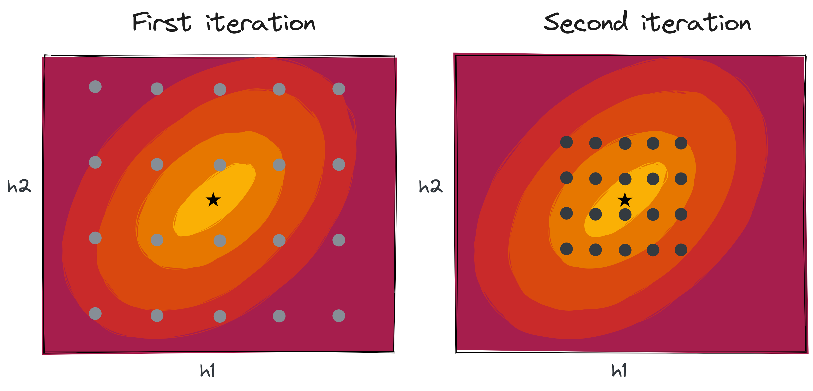
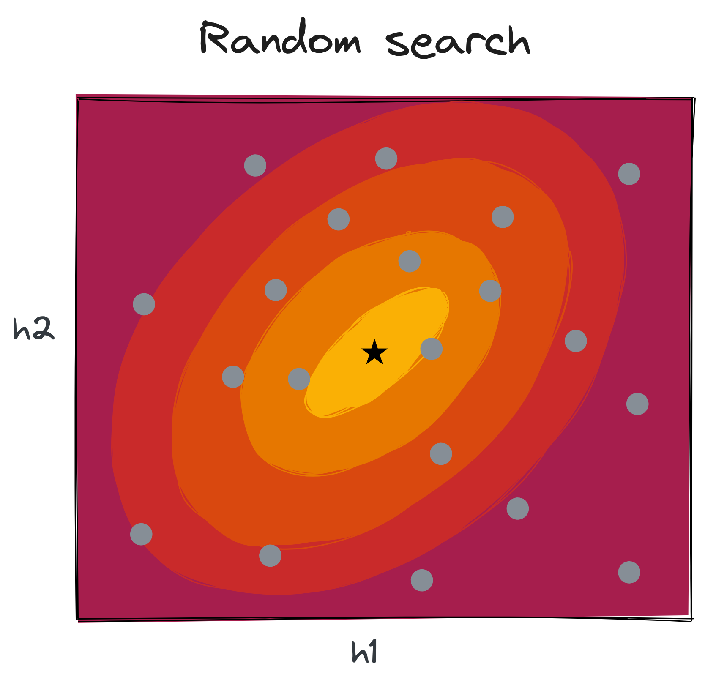

:::notes

**Math prerequisites for this lecture**: None.

:::

<!-- This is about model hyperparameters, also choice of model. AutoML https://people.orie.cornell.edu/mru8/doc/wids2021-udell-automl-slides.pdf -->

## Recall: Supervised learning recipe

1. Get **data**: $(\mathbf{x_i}, y_i), i=1,2,\cdots,n$ 
2. Choose a **model**: $\hat{y_i} = f(\mathbf{w}, \mathbf{x_i})$
3. Choose a **loss function**
4. Find model **parameters** that minimize loss

:::notes

* **Parameters** are learned by the training algorithm in step 4.
* **Hyperparameters** are *not* learned by the training algorithm
  * some affect the shape of the model $f()$ in step 2, e.g. SVM kernel hyperparameters
  * some affect the training process in step 4, e.g. learning rate and batch size in gradient descent

We know how to find parameters - how do we find hyperparameters?

:::

## Hyperparameter optimization

{ width=30% }

:::notes

The validation MSE of the trained model depends on the hyperparameters.
Goal of hyperparameter optimization: find the set of hyperparameters for which the validation MSE is minimized.

:::

### Grid search 

{ width=30% }

:::notes

Grid search is the extension of cross validation to higher dimensions.
Note: you need to know which part of the hyperparameter space to search in the first place!

Depending on the initial results, you may consider extending the grid in another iteration:

{ width=60% }

Or increasing the resolution of the grid in another iteration:

{ width=60% }

One nice thing about grid search: if you have multiple cores available, you can train these models in parallel.

:::

\newpage

### Random search

{ width=30% }

:::notes

Points in the hyperparameter space are sampled from some pre-specified distribution - 

* distribution does not need to be uniform!
* you can specify the number of points to sample, to control the search
* can often find good hyperparameters more quickly than grid search (sample fewer points)

:::

### Successive halving

{ width=100% }

:::notes

Works with either grid or random search - 

* **Iteration 1**: train $n$ models on a small subset of training data - say, $m$ samples
* **Iteration 2**: train the $\frac{n}{2}$ *best* models from the previous iteration on $2m$ samples
* **Iteration 3**: train the $\frac{n}{4}$ *best* models from the previous iteration on $4m$ samples
* ... and so on

Idea: spend a little bit of compute resources to explore a lot of the hyperparameter space, then spend more compute resources to focus on the most promising parts of the hyperparameter space.

:::

\newpage

### Adaptive search (Bayes search)

{ width=30% }

::: notes

Finally, we can consider a more advanced search technique, in which we use the information we have already gathered about the hyperparameter surface in order to decide which points to visit next.

We will choose the next sample in order to balance exploration of the hyperparameter space, versus focus on the areas where we believe (based on what we have seen so far) that the best model is likely to be.

:::
<!-- https://www.cs.cornell.edu/courses/cs4787/2019sp/notes/lecture14.pdf on hyperparameter search -->

<!-- https://www.cs.cornell.edu/courses/cs4787/2019sp/notes/lecture16.pdf on GPR and Bayes -->
