## In this lecture

* Neural network
* Structure of a neural network
* Training a neural network

::: notes

**Math prerequisites for this lecture**: You should know about:

* derivatives and especially the chain rule (Appendix C in Boyd and Vandenberghe)

:::

\newpage

## From linear to non-linear

### Representation as a computational graph

::: notes

Let's represent the linear regression and logistic regression models using a computational graph.

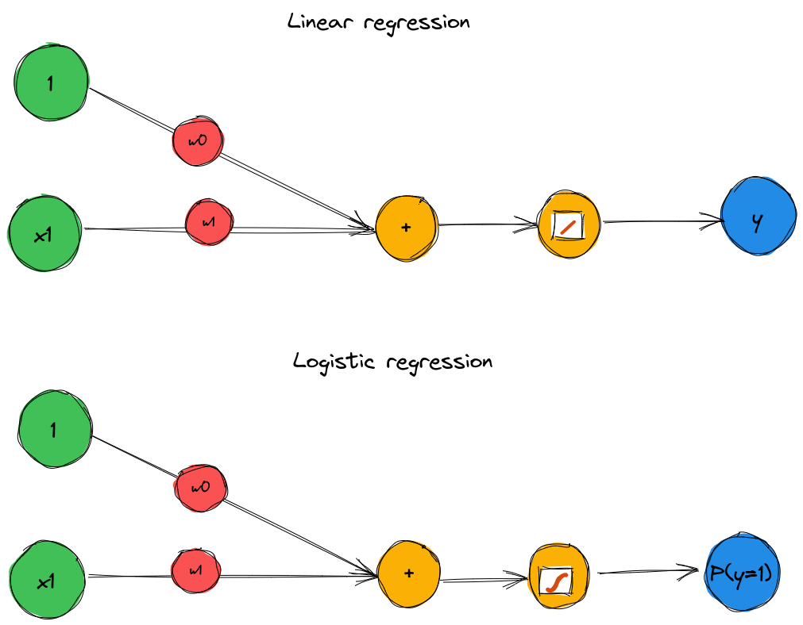{ width=60% }

We can use also do a linear regression or logistic regression with a basis function transformation applied to the data first. Here, we have one "transformation" node for each basis function, and then the output of those "transformation" nodes become the input to the logistic regression (or linear regression).

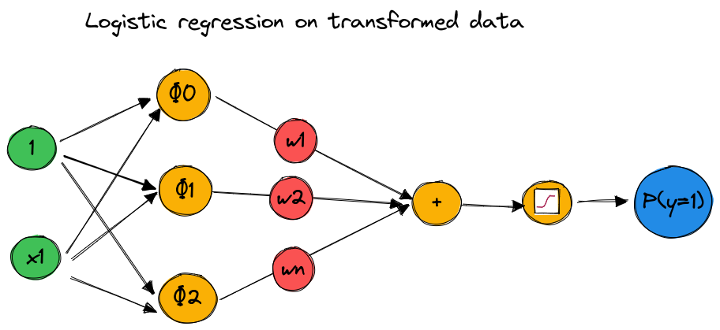{ width=65% }

\newpage

We can also represent the SVM with a linear or non-linear kernel using a computational graph. 

Here, we have one "transformation node" for each training sample! (The "transformation" is the kernel function, which is computed over the input sample and the training sample). 

Then the weighted sum of those nodes (weighted by $\alpha_i$, which is learned by the SVM, and which is zero for every non-support vector training sample and non-zero for every support vector training sample) is used to compute the class label.

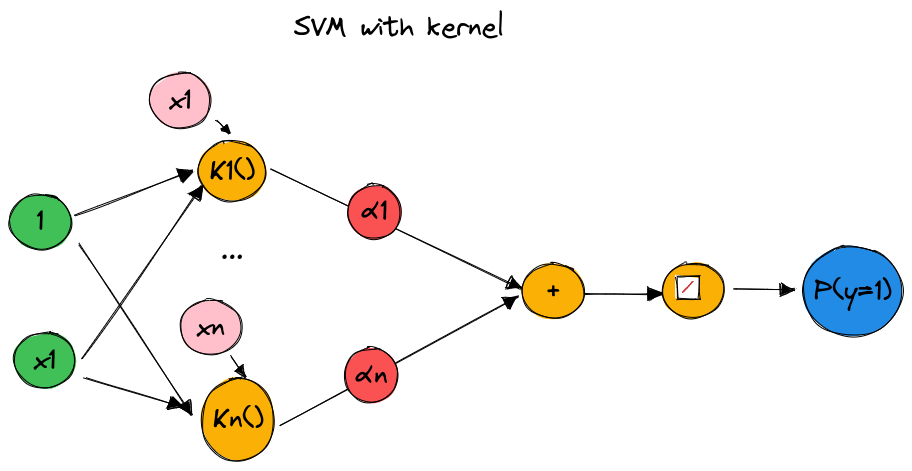{ width=65% }

In those regression and classification models, we use a fixed basis function to transform features. We only learned the weights to map the transformed features to a continuous output (regression) or to a class label (classification).

Would it be possible to also learn the first part - the mapping of the features to a transformed feature space?

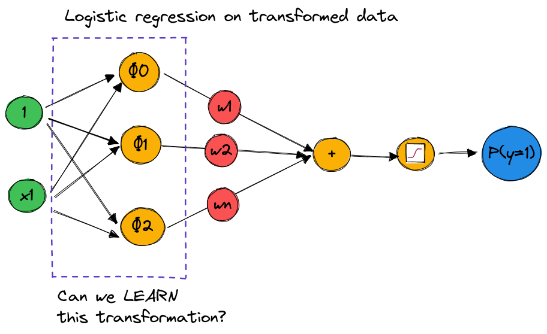{ width=65% }

:::

\newpage

### Example: synthetic data

](../images/two-class-nn-synthetic.png){width=30%}

### Model of example two-stage network (1)

First step (*hidden layer*): 

* Take $N_H=4$ "logistic regression" nodes. 
* Use $\mathbf{x}$ as input to each node.
* At each node $m$, first compute: $z_{H,m} = \mathbf{w}_{H,m}^T \mathbf{x}$
* Then, at each node, apply a sigmoid: $u_{H,m} = g_H(z_{H,m}) = \frac{1}{1+e^{-z_{H,m}}}$

::: notes

Note: assume a 1s column was added to the data matrix, so we don't need a separate intercept term.

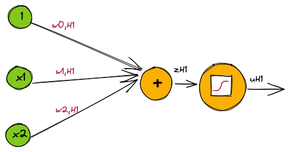{ width=30% }

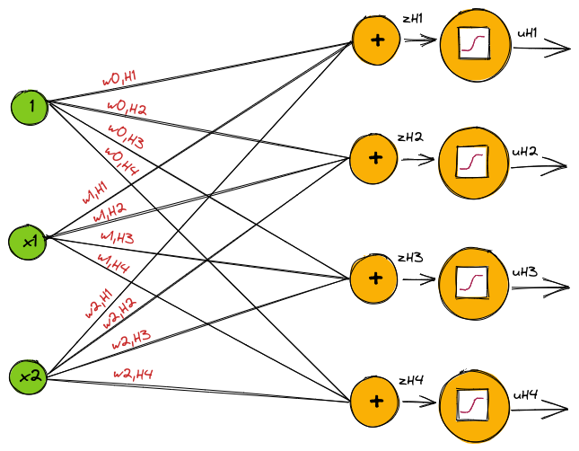{ width=50% }

At this point, we have some representation of the data in $\mathbb{R}^4$.

:::

\newpage

### Model of example two-stage network (2)

Second step (*output layer*):

* At output node, first compute: $z_O = \mathbf{w}^T_O [1, \mathbf{u}_H]$
* Then, compute: $u_O = g_O(z_O) =  \frac{1}{1+e^{-z_{O}}}$
* (Not in the graph): apply a threshold to get $\hat{y}$

::: notes

Notes: 

* we use the output of the previous layer as input to this layer
* as with the first layer, we add a 1s column to the input, to take care of the intercept term.

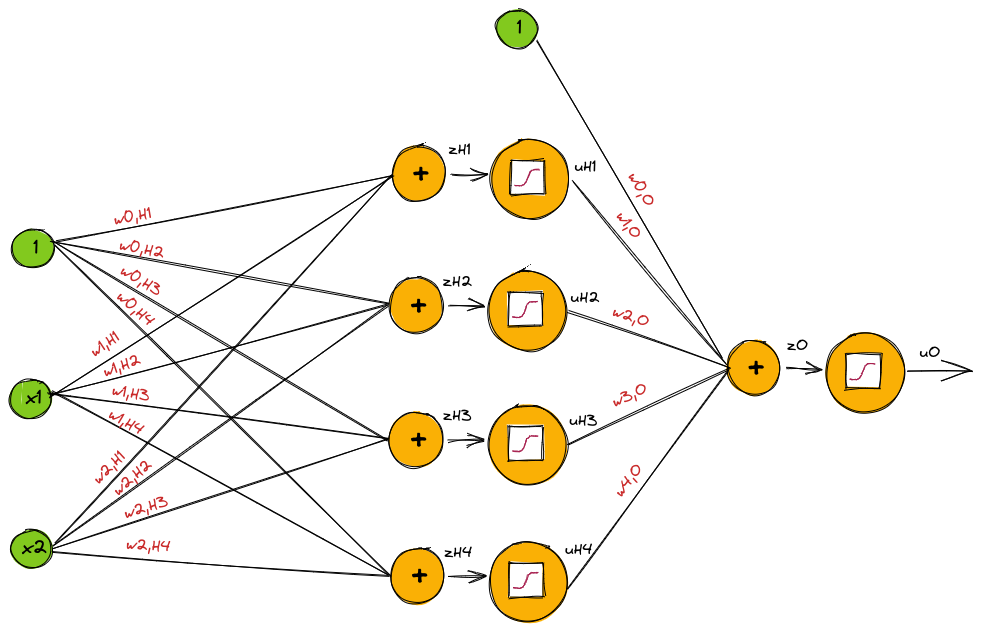{ width=55% }

What does the output look like (over the feature space) at each node?

:::
### Example: output of each hidden node

](../images/two-class-nn-neurons.png){width=60%}

### Example: output of output node

](../images/two-class-nn-avgout.png){width=20%}

\newpage

### Matrix form of two stage network

* Hidden layer: $\mathbf{z}_H = \mathbf{W}_H^T \mathbf{x}, \quad \mathbf{u}_H = g_H(\mathbf{z}_H)$
* Output layer: $z_O = \mathbf{W}_O^T [1, \mathbf{u}_H], \quad u_O = g_O(\mathbf{z}_O)$

## Neural networks

<!-- 
### Biological inspiration

 ](../images/biological-neuron.png){width=55%}

-->

### Terminology

* **Hidden variables**: the variables $\mathbf{z}_H, \mathbf{u}_H$, which are not directly observed.
* **Hidden units**: the nodes that compute the hidden variables.
* **Activation function**: the function $g(z)$
* **Output units**: the node(s) that compute $z_{O}$.

### Setting up a neural network - givens

For a particular problem, these are "given":

* the number of inputs
* the number of outputs
* the activation function to use at the output
* the loss function

::: notes

The number of inputs comes from the data - what is the size of each training sample?

The number of outputs is dictated by the type of problem - 

* binary classification: we need to predict $P(y=1)$ which is a single quantity, so we have one output unit.
* multi-class classification: we will predict $P(y=k)$ for each class $k$, so we need an output unit for each class.
* regression: if we need to predict a single target, we will have one output unit. If we need to predict multiple values in the same problem (vector output), we will have as many output units as there are values in the output.

Similarly, the activation function at the output unit and the loss function are dictated by the problem!

:::

### Binary classification...

For binary classification, $y \in [0,1]$: 

- Use sigmoid activation $g_O$, output will be: $u_O = P(y=1| x)=\frac{1}{1+e^{-z_O}}$
- $u_O$ is scalar - need one output node
- Use binary cross entropy loss:

$$L(\mathbf{W}) = \sum_{i=1}^n -y_i z_{Oi} + \text{ln}(1+e^{z_{Oi}})$$

:::notes

Then you select the predicted label by applying a threshold to the output $u_O$.

The mapping from transformed feature space to output is just like a logistic regression - we haven't changed *that* part!

:::

\newpage
### Multi-class classification...

For multi-class classification, $y=1,\ldots, K$:

- Use softmax activation $g_O$, output will be: $u_{O, k} = P(y=k| x)=\frac{e^{z_{O,k}}}{\sum_{\ell=1}^K  e^{z_\ell}}$
- $u_O$ is vector $[u_0, \ldots, u_K]$ - need $K$ output nodes
- Use categorical cross entropy loss:

$$L(\mathbf{W}) = \sum_{i=1}^n \left[ \ln \left(\sum_k e^{z_{Oik}}\right) - \sum_k  r_{ik} z_{Oik}\right]$$

::: notes

Then you can select predicted label by $\hat{y} = \operatorname*{argmax}_k u_{O,k}$

:::
### Regression with one output...

For regression, $y \in R^{1}$:

- Use linear activation $g_O$, output will be: $u_O = z_O$
- $u_O$ is scalar - need one output node
- Use L2 loss:

$$L(\mathbf{W}) = \sum_{i=1}^n (y_i - z_{Oi})^2$$

### Regression with multiple outputs...

For regression, $y \in R^{K}$:

- Use linear activation $g_O$, output will be: $u_{O,k} = z_{O,k}$
- $u_O$ is vector $[u_0, \ldots, u_K]$ - need $K$ output nodes
- Use vector L2 loss:

$$L(\mathbf{W}) = \sum_{i=1}^n \sum_{k=1}^K (y_{ik} - z_{Oik})^2$$

### Setting up a neural network - decisions

We still need to decide:

* the number of hidden units
* the activation function to use at hidden units

### Dimension (1)

* $N_I$ = input dimension, number of features
* $N_H$ = number of hidden units, you decide!
* $N_O$ = output dimension, number of outputs

\newpage
### Dimension (2)

Parameter               Symbol  Number of parameters
----------------------- ------- ---------------------
Hidden layer: weights   $W_H$   $N_H (N_I + 1)$
Output layer: weights   $W_O$   $N_O (N_H + 1)$
Total                           $N_H(N_I+1)+N_O(N_H+1)$

### Activation functions at hidden layer: identity?

* Suppose we use $g(z) = z$ (identity function) as activation function throughout the network.
* The network can only achieve linear decision boundary/ output!
* To get non-linear decision boundary/output, need non-linear activation functions.

::: notes

Universal approximation theorem: under certain conditions, with enough (finite)  hidden nodes, can approximate *any* continuous real-valued function, to any degree of precision. But only with non-linear activation! (See [this post](http://neuralnetworksanddeeplearning.com/chap4.html) for a convincing demonstration.)

(The more hidden units we have, the more complex a function we can represent.)

By scaling, shifting, and adding a bunch of "step" or "step-like" functions, you can approximate a complicated function. What step-like function can you use?

:::

### Activation functions at hidden layer: binary step

* Not differentiable at $x=0$, has $0$ derivative everywhere else.
* Not useful for gradient-based optimization methods.

### Activation functions at hidden layer: some choices

{width=50%}

::: notes

What do they have in common?

* Differentiable (at least from one side)
* Non-linear (except for the linear one, which is only used as the output function for a regression)

:::

\newpage

## Neural network - summary

### Things that are "given"

For a particular problem, these are "given":

* the number of inputs
* the number of outputs
* the activation function to use at the output
* the loss function

### Things that we decide

We still need to decide:

* the number of hidden units
* the activation function to use at hidden units

### Training the network

* Still need to find the $\mathbf{W}$ that minimizes $L(\mathbf{W})$.
* How?

\newpage

## Backpropagation

<!-- 

### Training the two-stage network for binary classification

* From final stage: $z_o = F(\mathbf{x}, \mathbf{W})$ where parameters $\mathbf{W} = (\mathbf{W}_H, \mathbf{W}_o)$
* Given training data $(\mathbf{x}_i, y_i), i = 1, \ldots, n$ 
* Loss function $L(\mathbf{W}) := -\sum_{i=1}^n \text{ln} P(y_i | \mathbf{x}_i, \mathbf{W})$
* Choose parameters to minimize loss: $\hat{\mathbf{W}} = \operatorname*{argmin}_{\mathbf{W}} L(\mathbf{W})$

::: notes

(Using negative log likelihood/binary cross-entropy loss function from the logistic regression lesson. )

How do we choose the parameters in the last step? We'll use *gradient descent* on the computational graph.

:::

-->

### How to compute gradients?

* Gradient descent requires computation of the gradient $\nabla L(\mathbf{W})$
* Backpropagation is key to efficient computation of gradients

:::notes

We need to compute the gradient of the loss function with respect to *every* weight, and there are $N_H(N_I+1)+N_O(N_H+1)$ weights!

Two perspectives on backpropagation:

* It's just the chain rule
* It's not just the chain rule 

Re: "it's not just the chain rule", the key to efficient computation will be:

* saving all the intermediate (hidden) variables on the forward pass, to reuse in the computation of gradients
* computing the gradients in a *backwards* pass - going from output to input, and accumulating local derivatives along the path (you'll see!)

:::
### Composite functions and computational graphs

Suppose we have a composite function $f(g(h(x)))$

We can represent it as a computational graph, where each connection is an input and each node performs a function or operation:

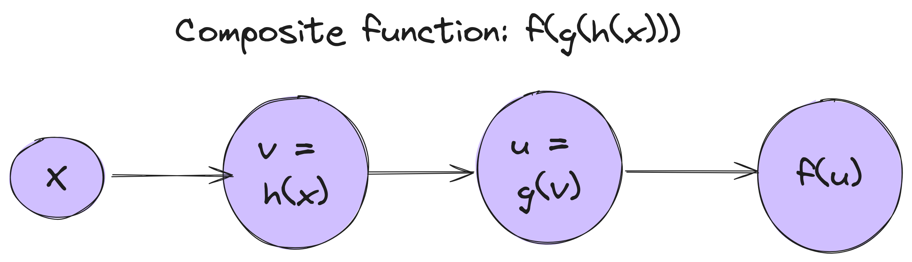{width=50%}

<!-- 
\begin{tikzpicture}
  \node[circle] (n1) at (1,1) {$x$};
  \node[circle,fill=blue!20] (n2) at (4,1)  {$v=h(x)$};
  \node[circle,fill=blue!20] (n3) at (8,1)  {$u=g(v)$};
  \node[circle,fill=blue!20] (n4) at (11,1) {$f(u)$};
  \draw [->] (n1) -- (n2) node[midway, above] {};
  \draw [->] (n2) -- (n3) node[midway, above] {};
  \draw [->] (n3) -- (n4) node[midway, above] {};
\end{tikzpicture}
-->

### Forward pass on computational graph

To compute the output $f(g(h(x)))$, we do a *forward pass* on the computational graph:

* Compute $v=h(x)$
* Compute $u=g(v)$
* Compute $f(u)$

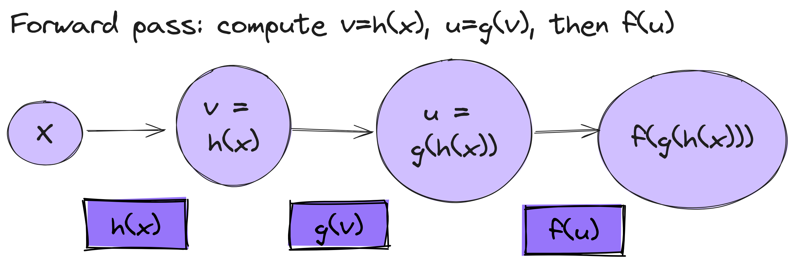{width=50%}

:::notes

Note that we *accumulate* results in the forward direction - at each node, we use the output of the previous node, which depends on the output of *all* the previous nodes. But, we don't need to repeat the steps of *all* the previous nodes each time, since the output is "accumulated" forward.

:::

### Derivative of composite function

Suppose we need to compute the derivative of the composite function $f(g(h(x)))$ with respect to $x$.

We will use the chain rule:

$$\frac{df}{dx} = \frac{df}{du} \frac{dg}{dv} \frac{dh}{dx}$$

### Backward pass on computational graph

We can compute this chain rule derivative by doing a *backward pass* on the computational graph:

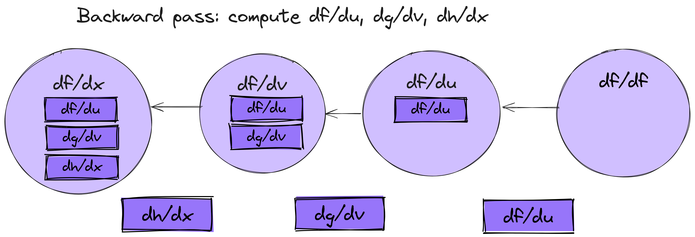{width=55%}

:::notes

As in the forward pass, in the backward pass, we do a "local" operation at each node: the "local" derivative of each node with respect to its inputs (shown in rectangles on each edge).

As in the forward pass, we *accumulate* results, but now in the backward direction. At each node, the derivative of the output with respect to the value computed at that node is:

* The product of all the "local" derivatives along the path between the node and the output.
* or equivalently, the product of the derivative at the previous node in the backward pass, and the "local" derivative along the path from that node.

For example: when we compute $\frac{df}{dx}$ at the last "stop" along the backwards pass, we don't need to compute all the parts of $\frac{df}{du}\frac{dg}{dv}\frac{du}{dx}$ *again*. We just need:

* compute "local" gradient $\frac{dh}{dx}$
* and multiply it by the "accumulated" gradient computed at the previous node, $\frac{df}{dv}$

This seems obvious... but when we apply it to a neural network, we will see why it is so important.

:::

<!-- 

\begin{tikzpicture}
  \node[circle] (n1) at (1,1) {$x$};
  \node[circle,fill=blue!20] (n2) at (4,1)  {$v=h(x)$};
  \node[circle,fill=blue!20] (n3) at (8,1)  {$u=g(v)$};
  \node[circle,fill=blue!20] (n4) at (11,1) {$f(u)$};
  \draw [<-] (n1) -- (n2) node[midway, above] {$\frac{dh}{dx}$};
  \draw [<-] (n2) -- (n3) node[midway, above] {$\frac{dg}{dv}$};
  \draw [<-] (n3) -- (n4) node[midway, above] {$\frac{df}{du}$};
\end{tikzpicture}

-->
### Neural network computational graph

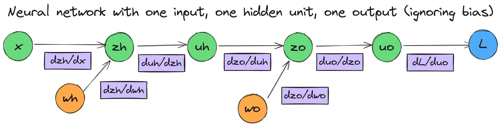{width=60%}

:::notes

What about when we have multiple inputs, multiple hidden units?

:::

<!-- 
\begin{tikzpicture}
  \node[circle, fill=green!20] (n1) at (1,1) {$x_i$};
  \node[circle,fill=purple!20] (n2) at (3,1)  {$z_{H,i}$};
  \node[circle,fill=purple!20] (n3) at (5,1)  {$u_{H,i}$};
  \node[circle,fill=purple!20] (n4) at (7,1) {$z_{O,i}$};
  \node[circle,fill=purple!20] (n5) at (9,1) {$u_{O,i}$};
  \node[circle,fill=orange!20] (n6) at (12,1) {$L(y_i, u_{O,i})$};
  \node[circle,fill=blue!20] (n7) at (1,4) {$W_H$};
  \node[circle,fill=blue!20] (n8) at (5,4) {$W_O$};

  \draw [->] (n1) -- (n2) node[midway, above] {};
  \draw [->] (n2) -- (n3) node[midway, above] {};
  \draw [->] (n3) -- (n4) node[midway, above] {};
  \draw [->] (n4) -- (n5) node[midway, above] {};
  \draw [->] (n5) -- (n6) node[midway, above] {};
  \draw [->] (n7) -- (n2) node[midway, above] {};
  \draw [->] (n8) -- (n4) node[midway, above] {};

\end{tikzpicture}
-->

\newpage

### Backpropagation error: definition

Denote the backpropagation error of node $j$ as 

$$\delta_j = \frac{\partial L}{\partial z_j}$$

the derivative of the loss function, with respect to the input to the activation function at that node.

:::notes

Spoiler: this $\delta_j$ is going to be the "accumulated" part of the derivative.

:::

### Output unit: backpropagation error (accumulated)

Generally, for output unit $j$:

$$\delta_j = \frac{\partial L}{\partial z_j} = \frac{\partial L}{\partial u_j}\frac{\partial u_j}{\partial z_j}$$

::: notes

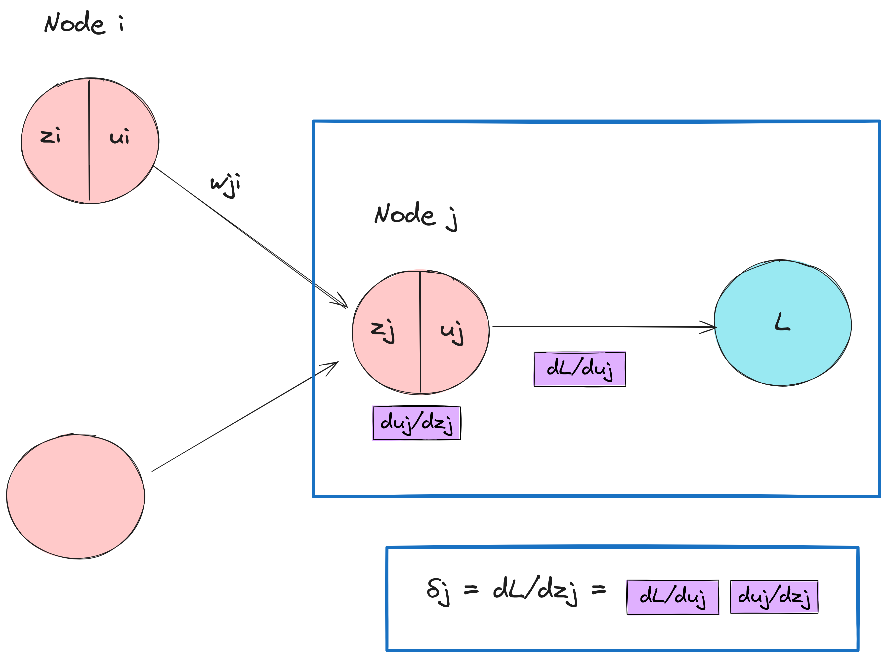{width=50%}

For example, in a regression network, $z_O = u_O$, then:

$$L =  \frac{1}{2}\sum_n (y_n - z_{O,n})^2$$

Then $\delta_O = \frac{\partial L}{\partial z_O} = -  (y - z_{O})$.

:::

<!-- 
\begin{tikzpicture}
  \node[circle, fill=purple!20,minimum size=1cm] (n1) at (1,1) {};
  \node[circle,fill=purple!20,minimum size=1cm] (n2) at (1,5)  {};
  \node[label=$j$,circle,fill=purple!20,minimum size=1cm] (n3) at (5,3)  {};

  \draw [->] (n1) -- (n3) node[midway, above] {};
  \draw [->] (n2) -- (n3) node[midway, above] {$ u_i w_{j,i}$};
\end{tikzpicture}

-->

\newpage

### Output unit: derivative vs input weights (local)

- At a node $j$, $z_j = \sum_i w_{j,i} u_{i} = w_{j,i} u_i + \ldots$ (sum over inputs to the node)
- When taking $\frac{\partial z_j}{\partial w_{j,i}}$ the only term that matters is $w_{j,i} u_i$
- So $\frac{\partial z_j}{\partial w_{j,i} } = u_i$

:::notes

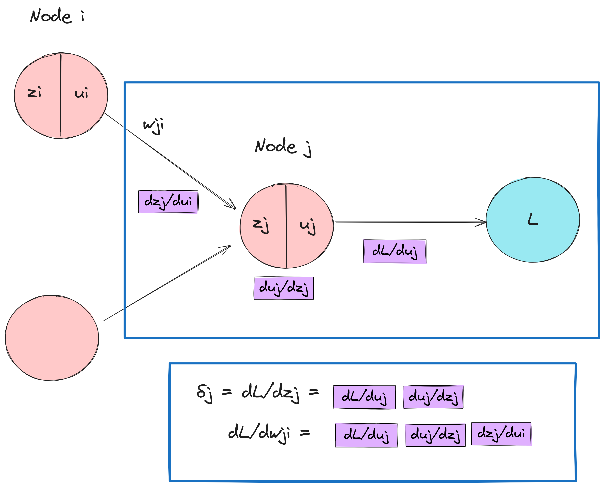{width=55%}

The derivative of the loss with respect to a weight $w_{j,i}$ input to the node, $\frac{\partial L}{\partial w_{j,i}}$, is the product of:

* $\frac{\partial L}{\partial z_j} = \delta_j$ (the "accumulated" part)
* $\frac{\partial z_j}{\partial w_{j,i}} = u_i$ (the "local" part)

so finally, $\frac{\partial L}{\partial w_{j,i}} = \delta_j u_i$.

Note:

* we only need to compute $\delta_j$ once per node $j$, then we re-use that value when we compute (one per weight input to node $j$) $\frac{\partial L}{\partial w_{j,i}}$ 
* we save the computations of all the $u_i$ values from the forward pass, so that we can reuse them here without having to compute them again.

:::

\newpage

### Hidden unit: backpropagation error (accumulated)

Sum the accumulated gradient along output paths:

$$
\begin{aligned}
\delta_j \quad &  =   \frac{\partial L}{\partial z_j} \\
         \quad &  =  \sum_k \frac{\partial L}{\partial z_k}\frac{\partial z_k}{\partial z_j} \\
         \quad &  =  \sum_k \delta_k \frac{\partial z_k}{\partial z_j} \\
         \quad &  =  \sum_k \delta_k w_{k,j}g_j'(z_j)
 \end{aligned}
 $$

:::notes

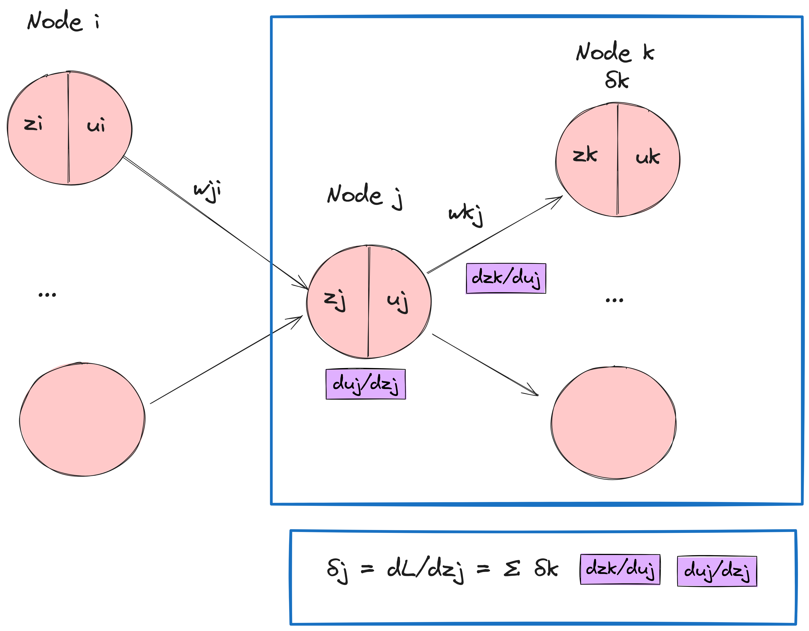{width=60%}

Note: since we move from the output end of the network toward its input, we have already accumulated $\delta_k$ when we "visited" node $k$. So we the "new" computation is just $\frac{\partial z_k}{\partial z_j}$.

We compute the next "accumulated" gradient using the previous "accumulated" gradient and a "local" derivative.

Since

$$z_k = \sum_l w_{k,l} u_l$$

(sum over inputs to node $k$), but for the derivative with respect to $z_j$ only the $w_{k,j} u_j$ term matters. So,

$$
\begin{aligned}
\frac{\partial z_k}{\partial z_j} \quad &  =  \frac{\partial}{\partial z_j} w_{k,j} u_j \\
                                  \quad & = \frac{\partial}{\partial z_j} w_{k,j} g_j(z_j) \\
                                  \quad &  =  w_{k,j}g_j'(z_j)
 \end{aligned}
 $$

where $g_j'()$ is the derivative of the activation function. (We save $z_j$ from the forward pass, so we can reuse it here to compute $g_j'(z_j)$.)

:::

### Hidden unit: derivative vs input weights (local)

Same as output unit - $\frac{\partial z_j}{\partial w_{j,i} } = u_i$

:::notes

{width=65%}

As at output unit, the derivative of the loss with respect to a weight $w_{j,i}$ input to the node, $\frac{\partial L}{\partial w_{j,i}}$, is the product of:

* $\frac{\partial L}{\partial z_j} = \delta_j$ (the "accumulated" part)
* $\frac{\partial z_j}{\partial w_{j,i}} = u_i$ (the "local" part)

so for a hidden unit, too, $\frac{\partial L}{\partial w_{j,i}} = \delta_j u_i$

:::

<!-- 
### Backpropagation error: unit with inputs and outputs illustration

\begin{tikzpicture}
  \node[circle, fill=purple!20,minimum size=1cm] (n1) at (1,1) {};
  \node[label=$i$,circle,fill=purple!20,minimum size=1cm] (n2) at (1,5)  {};
  \node[label=$j$,circle,fill=purple!20,minimum size=1cm] (n3) at (5,3)  {};
  \node[circle,fill=purple!20,minimum size=1cm] (n4) at (9,1)  {};
  \node[label=$k$,circle,fill=purple!20,minimum size=1cm] (n5) at (9,5)  {};

  \draw [->] (n1) -- (n3) node[midway, above] {};
  \draw [->] (n2) -- (n3) node[midway, above] {$ u_i w_{j,i}$};
  \draw [->] (n3) -- (n4) node[midway, above] {};
  \draw [->] (n3) -- (n5) node[midway, above] {$ u_j w_{k,j}$};
\end{tikzpicture}

-->

\newpage

### Backpropagation + gradient descent algorithm (1)

Start with random (small) weights.

1. Apply input $x_n$ to network and propagate values forward using $z_j = \sum_i w_{j,i} u_i$ and $u_j = g(z_j)$. (Sum is over all inputs to node $j$.)
2. Evaluate $\delta_j$ for all output units.

### Backpropagation + gradient descent algorithm (2)

3. Backpropagate the $\delta$s to get $\delta_j$ for each hidden unit. (Sum is over all outputs of node $j$.)

$$\delta_j = g'(z_j) \sum_k w_{k,j} \delta_k$$

### Backpropagation + gradient descent algorithm (3)

4. Use $\frac{\partial L_n}{\partial w_{j,i}} = \delta_j u_i$ to evaluate derivatives.
5. Update weights using gradient descent.

<!-- 

### Derivatives for common loss functions

Squared/L2 loss: 

$$L = \sum_i (y_i - z_{O,i})^2, \quad \frac{\partial L}{\partial z_{O,i}} = \sum_i -(y_i - z_{O,i})$$

Binary cross entropy loss: 

$$L = \sum_i -y_i z_{O,i} + \text{ln} (1 + e^{y_i z_{O,i}}), \quad \frac{\partial L}{\partial z_{O,i}} = y_i - \frac{ e^{y_i z_{O,i}} }{1 + e^{y_i z_{O,i}} }$$

### Derivatives for common activation functions

* Sigmoid activation: $g'(x) = \sigma(x) (1-\sigma(x))$
* Tanh activation: $g'(x) = \frac{1}{\text{cosh}^2(x)}$

-->

\newpage

## Why is backpropagation so important?

Example: $e = (a + b) \times (b+1)$

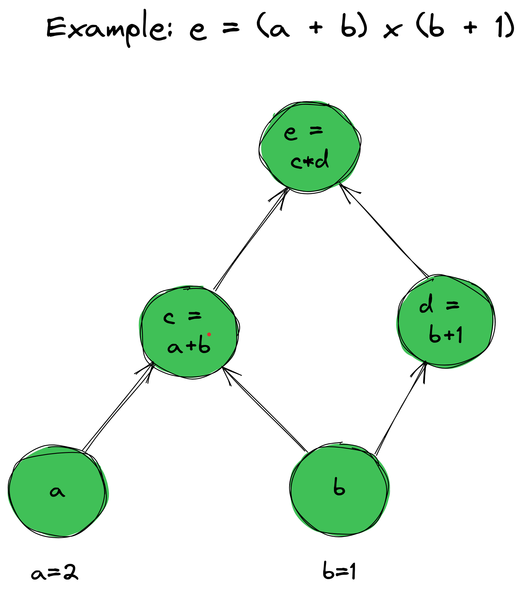{width=40%}

::: notes

Example via [https://colah.github.io/posts/2015-08-Backprop/](https://colah.github.io/posts/2015-08-Backprop).

:::
### Forward-mode differentiation

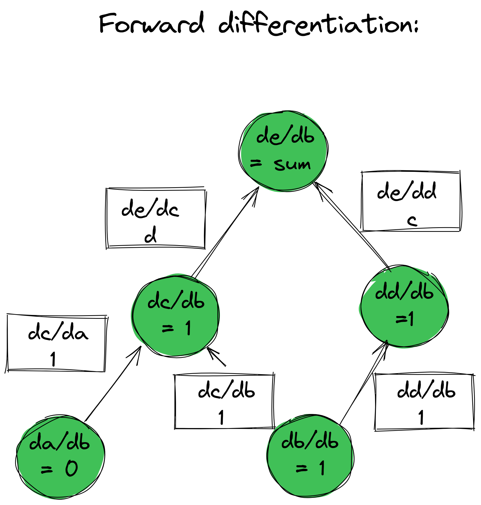{width=40%}

::: notes

With forward-mode differentiation, we take the derivative of the outupt with respect to one input (e.g. $\frac{de}{db}$), by starting at the *input* and "accumulating" the gradients toward the output.

However, if we want to take derivatives with respect to a *different* input (e.g. input $a$), these accumulated gradients don't help - we need to compute all of the derivatives again.

:::

\newpage

### Reverse-mode differentiation

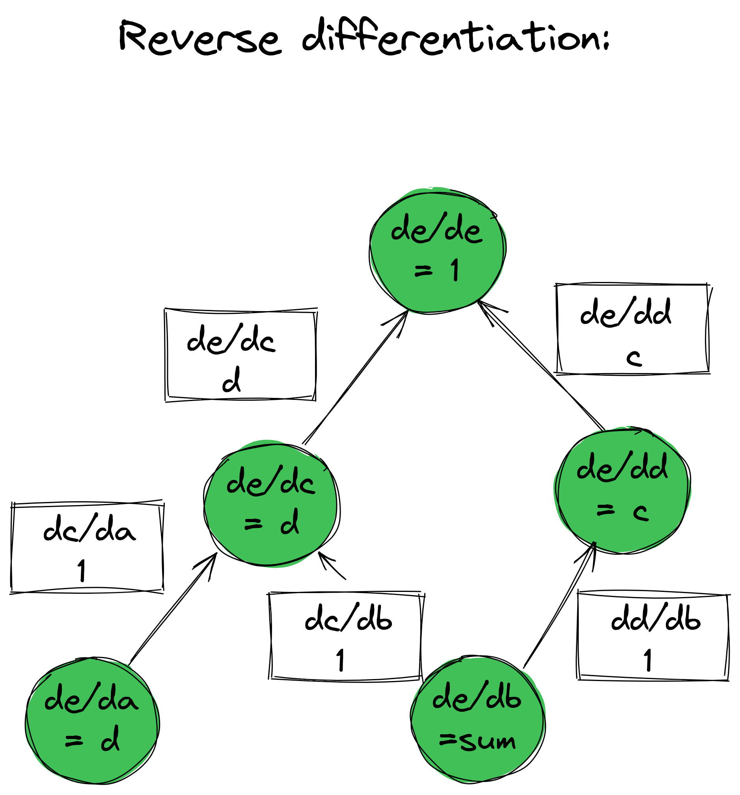{width=40%}

::: notes

With reverse mode differentiation, we take the derivative of the outupt with respect to one input (e.g. $\frac{de}{db}$), by starting at the *output* and "accumulating" the gradients toward the input.

If we want to take derivatives with respect to a *different* input (e.g. input $a$), we already have most of the accumulated gradients - we would just need to compute one more local derivative near that input ($\frac{dc}{da}$).

For a problem where you need derivative of one output (loss) with respect to many inputs (many weights), reverse mode differentiation is very efficient because the accumulated gradients ($\delta$ values) are computed once and then reused many times.

So, **it's not just the chain rule**:

* Forward-mode differentiation: complexity scales roughly with the size of the *input*.
* Reverse-mode differentiation: complexity scales roughly with the size of the *output*.

:::

