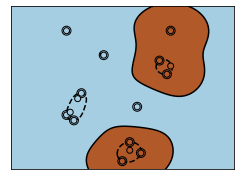

\newpage

## Kernel SVMs

### Review: Solution to SVM dual problem

Given a set of support vectors $S$ and associated $\alpha$ for each, 

$$z =   w_0 + \sum_{i \in S} \alpha_i y_i \langle \mathbf{x}_i, \mathbf{x}_{t} \rangle  $$
$$\hat{y} = \text{sign}(z)$$

Measures inner product (a kind of "correlation") between new sample and each support vector.

::: notes

For the geometric intuition/why inner product measures the similarity between two vectors, watch: 
[3Blue1Brown series  S1 E9: Dot products and duality](https://www.youtube.com/watch?v=LyGKycYT2v0).

This SVM assumes a linear decision boundary. (The expression for $z$ gives the equation of the hyperplane that separates the classes.)

:::

### Extension to non-linear decision boundary

* For logistic regression: we used basis functions of $\mathbf{x}$ to transform the feature space and classify data with non-linear decision boundary.
* Could use similar approach here?

### SVM with basis function transformation

Given a set of support vectors $S$ and associated $\alpha$ for each, 

$$z =   w_0 + \sum_{i \in S} \alpha_i y_i \langle \mathbf{\phi}(\mathbf{x}_i), \mathbf{\phi}(\mathbf{x}_{t})  \rangle  $$
$$\hat{y} = \text{sign}(z)$$

::: notes

Note: the output of $\mathbf{\phi}(\mathbf{x})$ is a vector that may or may not have the same dimensions as $\mathbf{x}$. 

:::

### Example (from SVM HW) (1)

Suppose we are given a dataset of feature-label pairs in $\mathbb{R}^1$:

$$(-1, -1), (0, -1), (1, -1), (-3, +1), (-2, +1), (3, +1)$$

This data is not linearly separable.

### Example (from SVM HW) (2)

Now suppose we map from $\mathbb{R}^1$ to $\mathbb{R}^2$ using $\mathbf{\phi}(x)=(x,x^2)$:

$$((-1, 1) -1), ((0, 0), -1), ((1, 1), -1), $$
$$((-3, 9) +1), ((-2, 4) +1), ((3, 9) +1)$$

This data *is* linearly separable in $\mathbb{R}^2$.

### Example (from SVM HW) (3)

Suppose we compute $\langle \mathbf{\phi}({x}_i), \mathbf{\phi}({x}_{t}) \rangle$ directly:

* compute $\mathbf{\phi}(x_i)$
* compute $\mathbf{\phi}(x_t)$
* take inner product

How many operations (exponentiation, multiplication, division, addition, subtraction) are needed?

::: notes

For each computation of $\langle \mathbf{\phi}({x}_i), \mathbf{\phi}({x}_{t})  \rangle$, we need five operations:

* (one square) find $\phi(x_i) = (x_i, x_i^2)$
* (one square) find $\phi(x_t) = (x_t, x_t^2)$
* (two multiplications, one sum) find $\langle \phi(x_i), \phi(x_t) \rangle = x_i x_t + x_i^2 x_t^2)$

:::

### Example (from SVM HW) (4)

What if we express $\langle \mathbf{\phi}({x}_i), \mathbf{\phi}({x}_{t}) \rangle$ as 

$$K(x_i, x_t) = x_i x_t (1+ x_i x_t)$$

How many operations (exponentiation, multiplication, division, addition, subtraction) are needed to compute this equivalent expression?

::: notes

Each computation of $K(x_i, x_t)$ requires three operations: 

* (one multiplication) compute $x_i x_t$)
* (one sum) compute $1+x_i x_t$
* (one multiplication) compute $x_i x_t (1+x_i x_t)$

:::

### Kernel trick

* Suppose kernel $K(\mathbf{x}_i, \mathbf{x}_t)$ computes inner product in transformed feature space $\langle \mathbf{\phi}(\mathbf{x}_i), \mathbf{\phi}(\mathbf{x}_{t}) \rangle$

* For the SVM:

$$z =   w_0 + \sum_{i \in S} \alpha_i y_i K(\mathbf{x}_i, \mathbf{x}_t) $$

* We don't need to explicitly compute $\mathbf{\phi}(\mathbf{x})$ if computing $K(\mathbf{x}_i, \mathbf{x}_t)$ is more efficient

::: notes

Note that the expression we use to find the $\alpha_i$ values also only depends on the inner product, so the kernel works there as well.

:::
<!--

### Kernel trick example 

Kernel can be inexpensive to compute, even if basis function itself is expensive. For example, consider:

$$\mathbf{x} =
\begin{bmatrix}
x_1 \\
x_2
\end{bmatrix}, 
\phi(\mathbf{x}) = 
\begin{bmatrix}
x_1^2 \\
x_2^2 \\
\sqrt{2}x_1 x_2
\end{bmatrix}
$$

### Kernel trick example - direct computation

Direct computation of $\phi(\mathbf{x}_n) \phi(\mathbf{x}_m)$: square or multiply 3 components of two vectors (6 operations), then compute inner product in $\mathbb{R}^3$ (3 multiplications, 1 sum). 

\begin{align*}
\phi(\mathbf{x}_n)^{\top} \phi(\mathbf{x}_m)
&= \begin{bmatrix} x_{n,1}^2 & x_{n,2}^2 & \sqrt{2} x_{n,1} x_{n,2} \end{bmatrix} \cdot \begin{bmatrix} x_{m,1}^2 \\ x_{m,2}^2 \\ \sqrt{2} x_{m,1} x_{m,2} \end{bmatrix}
\\
&= x_{n,1}^2 x_{m,1}^2 +  x_{n,2}^2 x_{m,2}^2 + 2 x_{n,1} x_{n,2} x_{m,1} x_{m,2}.
\end{align*}

### Kernel trick example - computation using kernel

Using kernel $K(x_n, x_m) = (x_n^T x_m)^2$: compute inner product in $\mathbb{R}^2$ (2 multiplications, 1 sum) and then square of scalar (1 square).

\begin{align*}
(\mathbf{x}_m^{\top} \mathbf{x}_m)^2
&= \Big( \begin{bmatrix} x_{n,1} & x_{n,2} \end{bmatrix} \cdot \begin{bmatrix} x_{m,1} \\ x_{m,2} \end{bmatrix} \Big)^2
\\
&= (x_{n,1} x_{m,1} + x_{n,2} x_{m,2})^2
\\
&= (x_{n,1} x_{m,1})^2 + (x_{n,2} x_{m,2})^2 + 2(x_{n,1} x_{m,1})(x_{n,2} x_{m,2})
\\
&= \phi(\mathbf{x}_n)^{\top} \phi(\mathbf{x}_m).
\end{align*}

-->

### Kernel as a similarity measure

* $K(\mathbf{x}_i, \mathbf{x}_t)$ measures "similarity" between training sample $\mathbf{x}_i$ and new sample $\mathbf{x}_t$
* Large $K$, more similarity; $K$ close to zero, not much similarity
* $z = w_0 + \sum_{i=1}^N \alpha_i y_i K(\mathbf{x}_i, \mathbf{x}_t)$ gives more weight to support vectors that are similar to new sample - those support vectors' labels "count" more toward the label of the new sample.

\newpage

### Linear kernel

{ width=40% }

### Polynomial kernel

{ width=40% }

\newpage

## Using infinite-dimension feature space

### Radial basis function kernel

{ width=40% }

### Infinite-dimensional feature space 

With kernel method, can operate in infinite-dimensional feature space! Take for example the RBF kernel:

$$K_{\texttt{RBF}}(\mathbf{x}_i, \mathbf{x}_t) = \exp\Big(-\gamma\lVert\mathbf{x}_i-\mathbf{x}_t\rVert^2\Big)$$

Let $\gamma=\frac{1}{2}$ and let $K_{\texttt{poly}(r)}$ be the polynomial kernel of degree $r$. Then

### Infinite-dimensional feature space (extra steps not shown in class)

\begin{align*}
K_{\texttt{RBF}}(\mathbf{x}_i, \mathbf{x}_t)
&= \exp\Big(-\frac{1}{2} \lVert\mathbf{x}_i-\mathbf{x}_t\rVert^2\Big)
\\
&= \exp\Big(-\frac{1}{2} \langle \mathbf{x}_i-\mathbf{x}_t, \mathbf{x}_i-\mathbf{x}_t \rangle \Big)
\\
&\stackrel{\star}{=} \exp\Big(-\frac{1}{2}( \langle \mathbf{x}_i, \mathbf{x}_i-\mathbf{x}_t \rangle - \langle \mathbf{x}_t, \mathbf{x}_i-\mathbf{x}_t \rangle ) \Big)
\\
&\stackrel{\star}{=} \exp\Big(-\frac{1}{2} (\langle \mathbf{x}_i, \mathbf{x}_i \rangle - \langle \mathbf{x}_i, \mathbf{x}_t \rangle - \big[ \langle \mathbf{x}_t, \mathbf{x}_i \rangle - \langle \mathbf{x}_t, \mathbf{x}_t \rangle \big] \rangle )\Big)
\\
&= \exp\Big(-\frac{1}{2} (\langle \mathbf{x}_i, \mathbf{x}_i \rangle + \langle \mathbf{x}_t, \mathbf{x}_t \rangle - 2 \langle \mathbf{x}_i, \mathbf{x}_t \rangle ) \Big)
\\
&= \exp\Big(-\frac{1}{2} \rVert \mathbf{x}_i \lVert^2 \Big) \exp\Big(-\frac{1}{2} \rVert \mathbf{x}_t \lVert^2 \Big) \exp\Big( \langle \mathbf{x}_i, \mathbf{x}_t \rangle \Big)
\end{align*}

where the steps marked with a star use the fact that for inner products, $\langle \mathbf{u} + \mathbf{v}, \mathbf{w} \rangle = \langle \mathbf{u}, \mathbf{w} \rangle + \langle \mathbf{v}, \mathbf{w} \rangle$.

Also recall that $\langle x, x \rangle = \rVert x \lVert ^2$.

\newpage

### Infinite-dimensional feature space (2)

Eventually, $K_{\texttt{RBF}}(\mathbf{x}_i, \mathbf{x}_t) = e^{-\frac{1}{2} \rVert \mathbf{x}_i \lVert^2 } e^{-\frac{1}{2} \rVert \mathbf{x}_t \lVert^2 } e^{\langle \mathbf{x}_i, \mathbf{x}_t \rangle }$

Let $C \equiv \exp\Big(-\frac{1}{2} \rVert \mathbf{x}_i \lVert^2 \Big) \exp\Big(-\frac{1}{2} \rVert \mathbf{x}_t \lVert^2 \Big)$

And note that the Taylor expansion of $e^{f(x)}$ is: 

$$e^{f(x)} = \sum_{r=0}^{\infty} \frac{[f(x)]^r}{r!}$$

::: notes

$C$ is a constant - it can be computed in advance for every $x$ individually.

:::

### Infinite-dimensional feature space (3)

Finally, the RBF kernel can be viewed as an infinite sum over polynomial kernels:

\begin{align*}
K_{\texttt{RBF}}(\mathbf{x}_i, \mathbf{x}_t)
&= C e^{ \langle \mathbf{x}_i, \mathbf{x}_t \rangle}
\\
&= C \sum_{r=0}^{\infty} \frac{ \langle \mathbf{x}_i, \mathbf{x}_t \rangle^r}{r!}
\\
&= C \sum_{r}^{\infty} \frac{K_{\texttt{poly(r)}}(\mathbf{x}_i, \mathbf{x}_t)}{r!}
\end{align*} 

<!-- http://pages.cs.wisc.edu/~matthewb/pages/notes/pdf/svms/RBFKernel.pdf -->

## Summary: SVM

### Key expression

Decision boundary can be computed using an inexpensive kernel function on a small number of support vectors: 

$$z = w_0 + \sum_{i \in S} \alpha_i y_i 
K(\mathbf{x}_i, \mathbf{x}_t)$$

($i\in S$ are the subset of training samples that are support vectors)

### Key ideas

* Boundary with max separation between classes
* Tuning hyperparameters controls complexity 
  * $C$ for width of margin/number of support vectors
  * also kernel-specific hyperparameters
* Kernel trick allows efficient extension to higher-dimension space: non-linear decision boundary through transformation of features, but without explicitly computing high-dimensional features.

