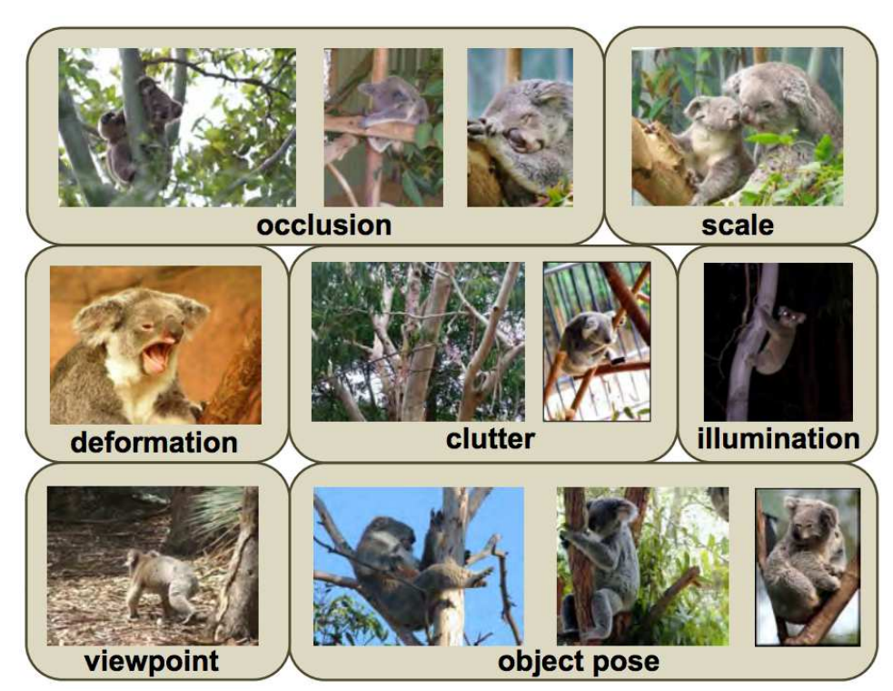
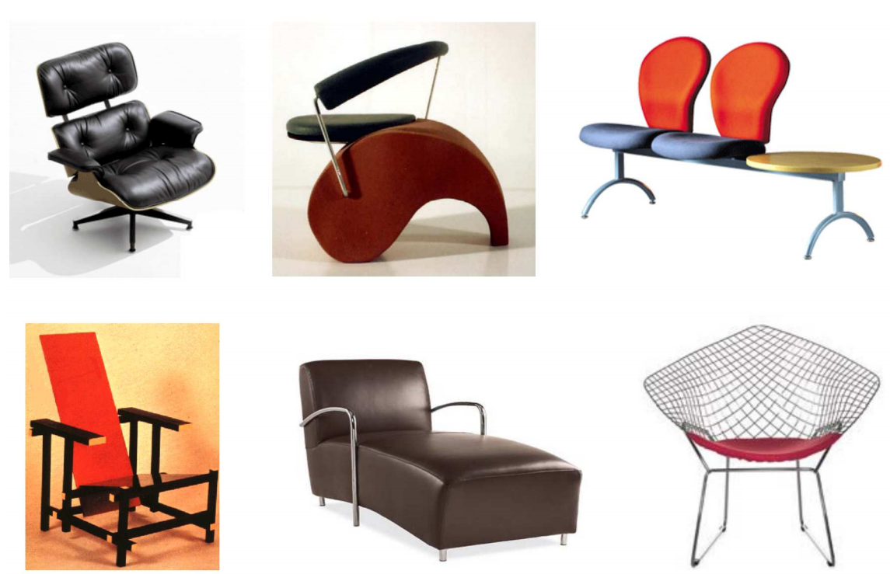
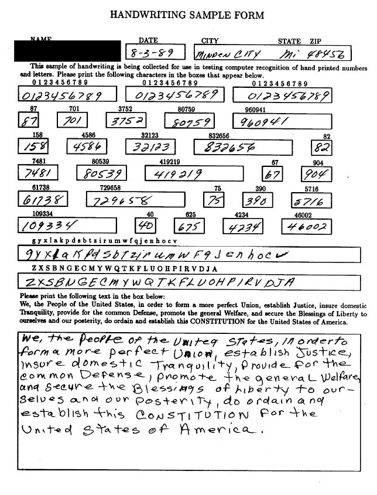
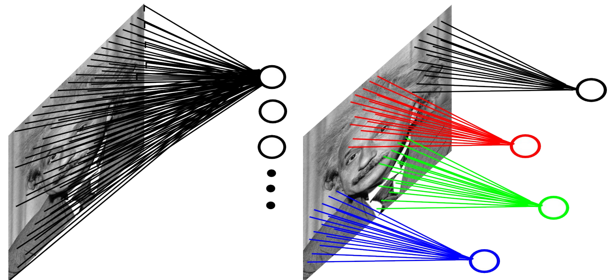
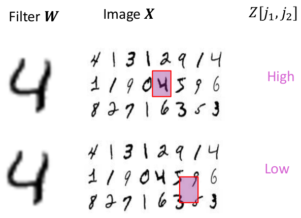
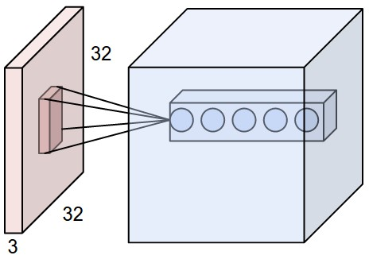

\newpage

## Motivation

::: notes

People are good at recognizing objects in images.

Computers are bad at it! Why?

:::

### Scene conditions

{ width=50% }

### Similarity and variability

{ width=50% }

### Dimension

* Huge number of classes
* Images can have millions of pixels

For example, CIFAR-10: tiny images of size 32x32x3. One *fully-connected* neuron in a first hidden layer of a regular NN would have 3072 weights!

\newpage

### Object can be anywhere within image

{width=70%}

\newpage

## Convolutional neural networks

### Key idea

* Neuron is connected to a small part of image at a time (_locally connected_)
* By having multiple locally connected neurons covering the entire image, we effectively "scan" the image

### Locally connected neurons: illustration

{ width=60%}

### Spatial arrangement: conventional networks

{ width=50% }

### Spatial arrangement: convolutional networks

{ width=50% }

\newpage

## Layers in CNN

### Different layer types

* Convolutional Layer
* Pooling Layer
* Fully-Connected Layer

Each layer accepts an input 3D volume, transforms it to an output 3D volume.

### Convolutional layer

* Layer has a set of learnable "filters"
* Each filter has small width and height, but full depth
* During forward pass, filter "slides" across width and height of input, and computes dot product
* Effectively performs "convolution"

### Convolution example

](../images/convolution-example.png){ width=60%}

### Feature localization via "convolution"

 
* Given large image $X$ with dimensions $N_1 \times N_2$,
* small filter $W$ with dimensions $K_1 \times K_2$

At each offset $(j_1, j_2)$ we compute

$$Z[j_1, j_2] = \sum_{k_1=0}^{K_1-1} \sum_{k_2=0}^{K_2-1} W[k_1, k_2]X[j_1 + k_1, j_2 + k_2]$$

which is large if "matching" feature is present.

### Feature localization via convolution (illustration)

{width=60%}

### Local connectivity

* Each filter is fully connected along depth axis, but only locally connected along width and height.

* Example: For CIFAR-10 (32x32x3), a 5x5 filter will have weights to a (5x5x3) region in input volume.

* Parameter dimensions: 75 weights and 1 bias. (much smaller!)

### Size of output volume

Size of output volume is determined by

* Input volume size $W$
* depth 
* filter field size $F$
* stride $S$
* zero padding $P$

### Size of output volume: depth

Output depth is a hyperparameter: corresponds to number of filters that should "look" at the same region of input at a time.

{width=20%}

### Size of output volume: stride

How many pixels do we slide the filter each time? This is called the *stride*.

{ width=50%}

### Size of output volume: zero-padding

Use zero padding on border-

* Without padding, size would shrink in each layer.
* Without padding, neurons "touch" the edges less often than the middle

To have output width and height the same as input, use $P=\frac{F-1}{2}$.

### Summary of convolutional layer

* Accepts input volume $W_1 \times H_1 \times D_1$
* Four hyperparameters: number of filters $K$, filter size $F$, stride $S$, amount of zero padding $P$
* Produces volume of size 

$$W_2 = \frac{W_1 - F + 2P}{S} + 1 , H_2 =  \frac{H_1 - F + 2P}{S} + 1 $$
$$D_2 = K $$

* With parameter sharing: $F \cdot F \cdot D_1$ weights per filter, for $F \cdot F \cdot D_1 \cdot K$ weights and $K$ biases

::: notes

* Common setting: $F=3, S=1, P=1$.

:::

### Parameter sharing

Basic insight:

* A particular filter with a set of weights represents a feature to look for
* If it is useful to look for a feature at position $x,y$, it is probably useful to look for the same feature at $x',y'$
* "Depth slice" = all the shifted versions of a filter. All neurons within a depth slice can share the same weights.

::: notes

Greatly reduces number of parameters.

:::

\newpage

### Example: AlexNet filters

{ width=40% }

### ReLU activation

* Convolutional typically followed by ReLU activation function

### Pooling layer

* Reduces spatial size of image (reduce computation, prevent overfitting)
* Typical example: 2x2 filter size, stride of 2, downsamples by a factor of 2 along width and height
* Works independently on each depth slice
* Typically uses MAX operation

### Pooling: illustration

{ width=30% }

### Pooling: illustration of max operation

{ width=30% }

\newpage

### Summary of pooling layer

* Accepts input volume $W_1 \times H_1 \times D_1$
* Two hyperparameters: filter size $F$, stride $S$
* Produces volume of size 

$$W_2 = \frac{W_1 - F}{S} + 1 , H_2 =  \frac{H_1 - F}{S} + 1 , D_2 = D_1 $$

* No parameters

### Fully connected layer

* Reshape into matrix
* Output with matrix multiplication

$$Z[i,k] = \sum_j W[j,k]U[i,j] + b[k], \quad k=0,\ldots,N_O$$

### Typical architecture

* Input
* Some number of convolutional + ReLU layers
* Occasional pooling layers
* Some number of fully connected + ReLU layers
* Fully connected output layer

### Example

](../images/convnet.jpeg){width=80%}

### Reference

Source of most images here, and excellent set of notes on convolutional neural networks:

[https://cs231n.github.io/convolutional-networks/](https://cs231n.github.io/convolutional-networks/)

<!--

More stuff:

https://colab.research.google.com/gist/artificialsoph/b71c1c25b5ea86cb7ad3ab38afcbfb55/conv-data-generator.ipynb
https://soph.info/slash-data

-->